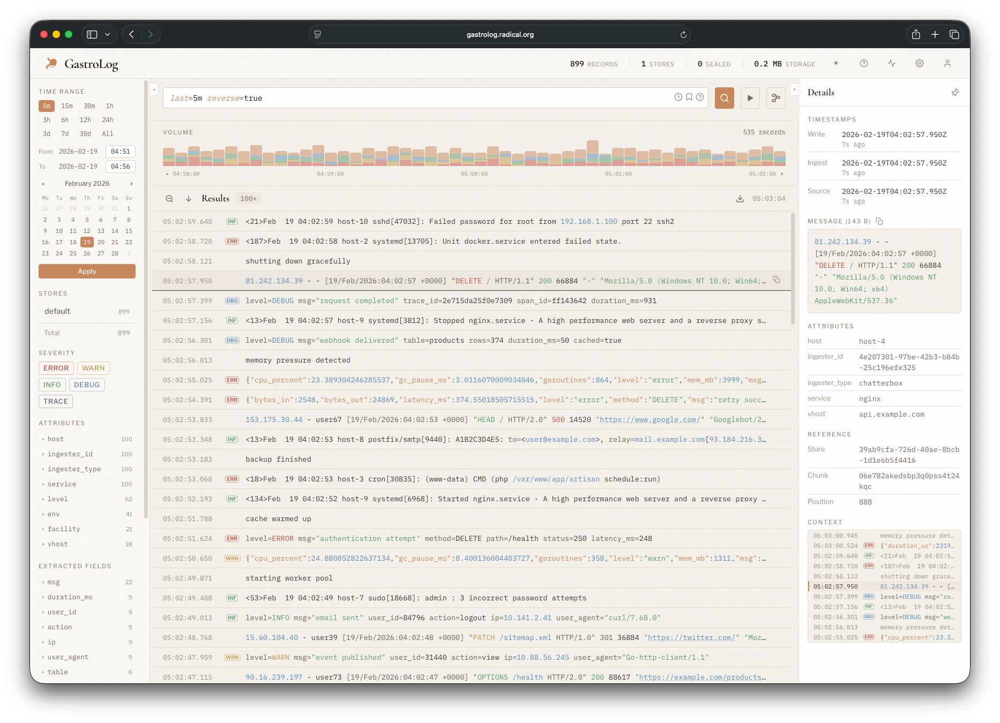

# GastroLog

## Generalized Automatic System for Temporal Record Organization and Logging

GastroLog is a log aggregation and search service. It collects logs from various sources, stores them in time-ordered chunks, and builds indexes for fast full-text search.



## Features

- **Multiple ingesters** — Syslog (UDP/TCP), HTTP (Loki-compatible), RELP, file tail, Docker container logs
- **Chunk-based storage** — Append-only segments that seal automatically and trigger index builds
- **Full-text search** — Token, attribute, and key-value indexes with a purpose-built query language
- **Multi-store routing** — Route messages to different stores based on filter expressions
- **Rotation and retention policies** — Per-store control over chunk size and data lifecycle
- **Embedded web UI** — Single binary serves both the API and the frontend
- **Built-in authentication** — JWT-based with user management

## Quick Start

### From a release binary

```sh
# Download from GitHub Releases
gastrolog server --bootstrap
```

The `--bootstrap` flag starts with a default in-memory store and a chatterbox test ingester so you can explore the UI immediately. Open http://localhost:4564 in your browser.

### With Docker

```sh
docker run -p 4564:4564 ghcr.io/kluzzebass/gastrolog:latest server
```

Example `compose.yml` with persistent volumes and all service ports:

```yaml
services:
  gastrolog:
    container_name: gastrolog
    image: ghcr.io/kluzzebass/gastrolog:latest
    ports:
      - "4564:4564"   # HTTP  (API + web UI)
      - "4565:4565"   # HTTPS (when TLS enabled)
      - "514:514/udp" # Syslog (UDP)
      - "514:514/tcp" # Syslog (TCP)
      - "3100:3100"   # HTTP (Loki-compatible)
      - "2514:2514"   # RELP
    volumes:
      - config:/config                              # Configuration database
      - stores:/stores                              # Log store data
      - /var/log:/logs:ro                           # Host logs (for tail ingester)
      - /var/run/docker.sock:/var/run/docker.sock:ro # Docker (for container log ingester)

volumes:
  config:
  stores:
```

### With Homebrew

```sh
brew install kluzzebass/tap/gastrolog
gastrolog server
```

## Usage

```
gastrolog server [flags]    Start the service
gastrolog version           Print version
```

**Global flags:**

| Flag | Description | Default |
|------|-------------|---------|
| `--home` | Home directory | Platform config dir |
| `--config-type` | Config store: `sqlite`, `json`, `memory` | `sqlite` |
| `--pprof` | pprof HTTP address (e.g. `localhost:6060`) | disabled |

**Server flags:**

| Flag | Description | Default |
|------|-------------|---------|
| `--addr` | Listen address (host:port) | `:4564` |
| `--bootstrap` | Bootstrap with default config | `false` |

## Building from Source

Requires [Go](https://go.dev/) 1.26+, [Bun](https://bun.sh/), and [just](https://github.com/casey/just).

```sh
# Build single binary with embedded frontend
just build

# Cross-compile for all platforms (linux/darwin, amd64/arm64)
just build-all

# Build Docker image
just docker
```

## Development

```sh
# Start the backend
just backend run-bootstrap

# Start the frontend dev server (separate terminal)
just frontend dev
```

The frontend dev server runs on http://localhost:3000 and proxies API requests to the backend on :4564.

## Architecture

```
frontend/     React 19 + Vite + TypeScript + Tailwind v4
backend/      Go, Connect RPC server
  cmd/        CLI entry point
  api/        Protobuf definitions and generated code
  internal/   Core packages (chunk, index, query, ingester, server, config)
```

See the `CLAUDE.md` files in each directory for detailed guidance.

## License

MIT License — Copyright (c) 2026 Jan Fredrik Leversund

See [LICENSE](LICENSE) for the full text.

The stomach icon used as favicon is by [Delapouite](https://delapouite.com/) from [Game-icons.net](https://game-icons.net/1x1/delapouite/stomach.html), licensed under [CC BY 3.0](https://creativecommons.org/licenses/by/3.0/).
