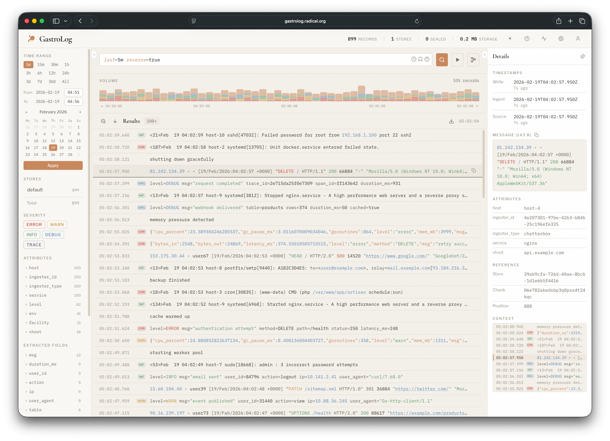

# GastroLog

> **This project is under heavy development.** File formats, wire protocols, configuration schemas, and storage layouts are **not stable** and may change without notice. Until version 1.0, expect breaking changes between releases. Do not rely on any internal format for long-term data retention.

GastroLog is a log aggregation and search service. It collects logs from various sources, stores them in time-ordered chunks, and builds indexes for fast full-text search and interactive analytics.



## Features

- **Multiple ingesters** — Syslog (UDP/TCP), HTTP (Loki-compatible), RELP, OTLP (gRPC/HTTP), Fluent Forward, Kafka, MQTT (v3.1.1/v5), file tail, Docker container logs, self-monitoring, internal metrics, and built-in test generators (chatterbox, scatterbox)
- **Tiered storage** — Vaults hold append-only chunks that seal automatically, trigger index builds, and flow through configurable tiers: memory (fast ingest), local disk (persistent), and cloud (S3/Azure/GCS with seekable zstd for random-access range reads). Rotation and retention policies control when chunks seal, migrate between tiers, and expire
- **Full-text search** — Token, attribute, and key-value indexes with a purpose-built query language supporting boolean logic, comparisons, regex, and globs
- **Pipeline analytics** — Pipe-based query transformations (`| stats`, `| timechart`, `| eval`, `| sort`, `| head`, `| tail`, `| slice`, `| where`, `| rename`, `| fields`, `| dedup`, `| lookup`, `| export`, `| raw`) with 10 aggregation functions, 28 scalar functions, time bucketing, and arithmetic expressions
- **Field enrichment** — Built-in `rdns` (reverse DNS) and `useragent` (user-agent parser) lookup tables, plus configurable MMDB (GeoIP/ASN with auto-download), CSV, JSON (with jq transform), HTTP, and static lookup tables
- **Visualizations** — Line charts, bar charts, donut charts, heatmaps, scatter plots, world maps (choropleth and point), single-value displays, and sortable tables with CSV/JSON export — auto-detected or explicitly selected via `| linechart`, `| barchart`, `| donut`, `| heatmap`, `| scatter`, `| map`
- **Multi-store routing** — Route messages to different stores based on filter expressions
- **Rotation and retention policies** — Per-store control over chunk size, data lifecycle, and migration between stores
- **Embedded web UI** — Single binary serves both the API and the frontend
- **Clustering** — Multi-node Raft consensus for config replication, transparent write forwarding to the leader, automatic cross-node query fan-out with merged results, record forwarding between ingest and storage nodes, non-voter read replicas, and auto-generated mTLS for all inter-node communication
- **Authentication** — JWT-based with configurable password policies and user management

## Quick Start

### From a release binary

```sh
# Download from GitHub Releases
gastrolog server
```

On first start, GastroLog auto-bootstraps as a single-node Raft cluster with a default configuration. Open http://localhost:4564 in your browser to access the web UI and configure ingesters, vaults, and routes.

### With Docker

```sh
docker run -p 4564:4564 ghcr.io/kluzzebass/gastrolog:latest server
```

Example `compose.yml` with persistent volumes and all service ports:

```yaml
services:
  gastrolog:
    container_name: gastrolog
    image: ghcr.io/kluzzebass/gastrolog:latest
    ports:
      - "4564:4564"   # HTTP  (API + web UI)
      - "4566:4566"   # Cluster gRPC (inter-node communication)
      - "514:514/udp" # Syslog (UDP)
      - "514:514/tcp" # Syslog (TCP)
      - "3100:3100"   # HTTP (Loki-compatible)
      - "2514:2514"   # RELP
      - "4317:4317"   # OTLP (gRPC)
      - "4318:4318"   # OTLP (HTTP)
      - "24224:24224"  # Fluent Forward
    volumes:
      - config:/config                              # Configuration database
      - stores:/stores                              # Log store data
      - /var/log:/logs:ro                           # Host logs (for tail ingester)
      - /var/run/docker.sock:/var/run/docker.sock:ro # Docker (for container log ingester)

volumes:
  config:
  stores:
```

### With Homebrew

```sh
brew install kluzzebass/tap/gastrolog
gastrolog server
```

## Usage

```
gastrolog server [flags]          Start the service
gastrolog query <expression>      Search logs (streams results to stdout)
gastrolog config <entity>         Manage vaults, ingesters, routes, filters, policies, settings
gastrolog cluster <action>        Cluster lifecycle (status, health, join, shutdown, promote/demote)
gastrolog user <action>           Manage users (list, create, delete, reset-password)
gastrolog login                   Get a JWT token (for scripting remote access)
gastrolog register                Bootstrap the first admin user
gastrolog inspect <vault|chunk>   Inspect vault tiers, chunks, and their status
gastrolog seal <vault>            Seal the active chunk and start a new one
gastrolog reindex <vault>         Rebuild all indexes for sealed chunks
gastrolog pause <vault>           Pause ingestion for a vault
gastrolog resume <vault>          Resume ingestion for a vault
gastrolog migrate <vault>         Migrate a vault to a new destination
gastrolog archive <chunk-id>      Archive a cloud-backed chunk to offline storage
gastrolog restore <chunk-id>      Restore an archived chunk to readable storage
gastrolog job <action>            Monitor async jobs
gastrolog prime                   Print AI agent primer
gastrolog version                 Print version
```

**Global flags:**

| Flag | Description | Default |
|------|-------------|---------|
| `--home` | Home directory (config database, user credentials) | `~/.config/gastrolog` (Linux), `~/Library/Application Support/gastrolog` (macOS) |
| `--addr` | Server address for CLI commands (`http://host:port` or `unix:///path`) | `http://localhost:4564` |
| `--token` | Authentication token (or `GASTROLOG_TOKEN` env) | *(none)* |
| `-o, --output` | Output format: `table` or `json` | `table` |
| `--config-type` | Config store: `raft`, `memory` | `raft` |
| `--pprof` | pprof HTTP address (e.g. `localhost:6060`) | disabled |

**Server flags:**

| Flag | Description | Default |
|------|-------------|---------|
| `--listen` | Listen address (host:port) | `:4564` |
| `--vaults` | Vault storage directory | `<home>/vaults` |
| `--no-auth` | Disable authentication (all requests treated as admin) | `false` |
| `--cluster-addr` | Cluster gRPC listen address | `:4566` |
| `--join-addr` | Leader's cluster address to join an existing cluster | *(none)* |
| `--join-token` | Join token from the leader node | *(none)* |
| `--name` | Node name | random petname |

## AI Agent Integration

If you're using an AI coding agent (Claude Code, Cursor, Copilot, etc.) to build an application that sends logs to GastroLog, run:

```sh
gastrolog prime
```

This prints a structured guide covering ingester types, log format best practices, query language syntax, and step-by-step setup — designed to be piped directly into your agent's context. No need to read the docs; the agent gets everything it needs from `prime`.

## Query Language

GastroLog's query language combines a filter phase with an optional pipeline of transformation operators.

```
# Boolean search with attribute filters
level=error service=api status>=500

# Aggregation with time bucketing (renders as a time series chart)
level=error | stats count by bin(5m)

# Top 10 hosts by error count
level=error | stats count by host | sort -count | head 10

# Computed fields and filtering
* | eval duration_s = duration / 1000 | where duration_s > 5

# Multi-series breakdown
* | stats avg(duration) by bin(1m), method

# GeoIP enrichment and world map
* | lookup geoip client_ip | stats count by client_ip_country | map choropleth client_ip_country
```

The built-in help system documents the full query language, all operators, and scalar functions.

## Clustering

Every GastroLog node auto-bootstraps as a single-node Raft cluster on first start, with auto-generated mTLS for inter-node communication. To form a multi-node cluster, join additional nodes to an existing one.

> **Note:** When a node joins a cluster, its local configuration is replaced by the cluster's replicated state. Any ingesters, vaults, filters, or users configured on the joining node before it joins will be lost.

### Joining via CLI

The first node prints a join token on startup:

```
cluster join token (use --join-token to join)  token=<TOKEN>
```

Start additional nodes with `--join-addr` and `--join-token`:

```sh
# Node 2
gastrolog server --listen :4574 --cluster-addr :4575 \
  --join-addr localhost:4566 --join-token <TOKEN>

# Node 3
gastrolog server --listen :4584 --cluster-addr :4585 \
  --join-addr localhost:4566 --join-token <TOKEN>
```

Voter/non-voter status is managed automatically based on group size, or manually via `gastrolog cluster promote/demote`.

### Joining via UI

A single-node cluster can also add nodes from **Settings > Nodes > Join Cluster** in the web UI.

### Multi-node Docker Compose

A 3-node cluster tolerates 1 node failure while maintaining quorum (2-node clusters provide **no** fault tolerance — see the [clustering docs](frontend/src/help/clustering.md#two-node-warning) for details).

```yaml
services:
  node1:
    image: ghcr.io/kluzzebass/gastrolog:latest
    command: server --listen :4564 --cluster-addr :4566
    ports: ["4564:4564", "4566:4566"]
    volumes: [node1:/config]

  node2:
    image: ghcr.io/kluzzebass/gastrolog:latest
    command: server --listen :4564 --cluster-addr :4566
      --join-addr node1:4566 --join-token ${JOIN_TOKEN}
    ports: ["4574:4564"]
    volumes: [node2:/config]
    depends_on: [node1]

  node3:
    image: ghcr.io/kluzzebass/gastrolog:latest
    command: server --listen :4564 --cluster-addr :4566
      --join-addr node1:4566 --join-token ${JOIN_TOKEN}
    ports: ["4584:4564"]
    volumes: [node3:/config]
    depends_on: [node1]

volumes:
  node1:
  node2:
  node3:
```

### How it works

- **Configuration** (ingesters, vaults, filters, users) is replicated across all nodes via Raft consensus
- **Log data** is stored locally on the node that owns each vault and is **not replicated**
- **Searches** automatically fan out to vaults on all nodes and merge results
- Non-voters participate in search but don't vote in leader elections — useful for scaling read capacity (demote via `gastrolog cluster demote <node>`)

## Building from Source

Requires [Go](https://go.dev/) 1.26+, [Bun](https://bun.sh/), and [just](https://github.com/casey/just).

```sh
# Build single binary with embedded frontend
just build

# Cross-compile for all platforms (linux/darwin, amd64/arm64)
just build-all

# Build Docker image
just docker
```

## Development

```sh
# Start the backend (Raft config, persistent data in ./data)
just backend run

# Start the frontend dev server (separate terminal)
just frontend dev
```

The frontend dev server runs on http://localhost:3001 and proxies API requests to the backend on :4564. Additional proxy ports (:3002-:3004) are available for multi-node cluster development.

## Architecture

```
frontend/     React 19 + Vite 7 + TypeScript + Tailwind v4
backend/      Go, Connect RPC server
  cmd/        CLI entry point (Cobra)
  api/        Protobuf definitions and generated code
  internal/   Core packages (chunk, index, query, querylang, ingester, server, config, cluster)
```

See the `CLAUDE.md` files in each directory for detailed guidance.

## License

MIT License — Copyright (c) 2026 Jan Fredrik Leversund

See [LICENSE](LICENSE) for the full text.

The stomach icon used as favicon is by [Delapouite](https://delapouite.com/) from [Game-icons.net](https://game-icons.net/1x1/delapouite/stomach.html), licensed under [CC BY 3.0](https://creativecommons.org/licenses/by/3.0/).
