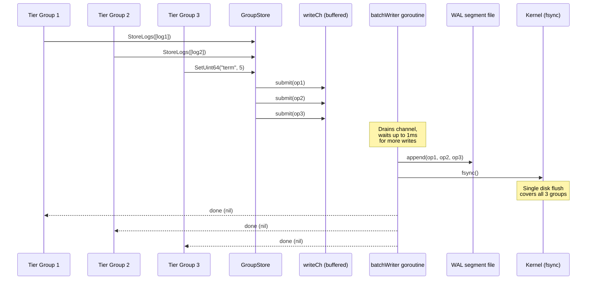
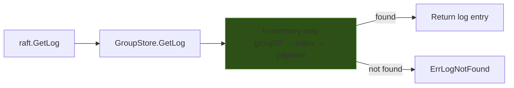
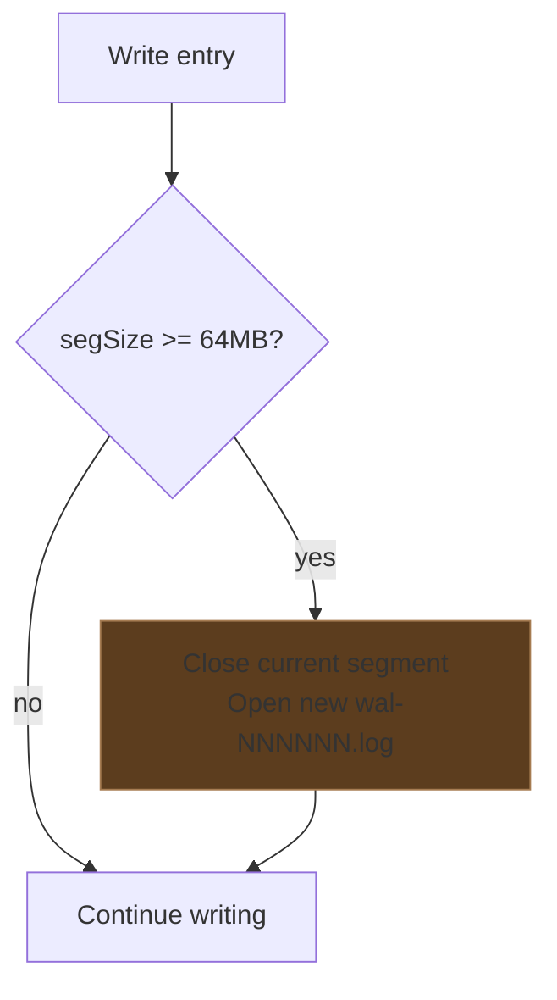
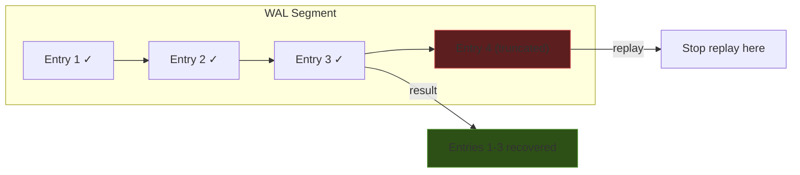
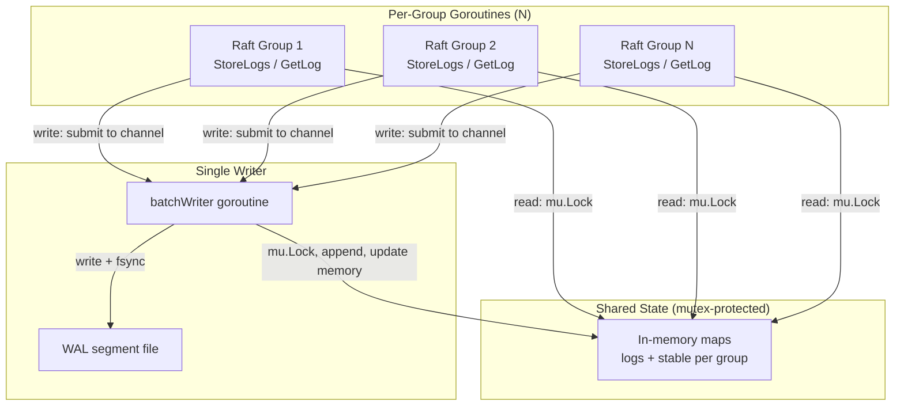

# raftwal — Shared Write-Ahead Log for Multi-Raft Groups

## Overview

`raftwal` replaces per-group boltdb storage with a single shared WAL (write-ahead log) for all Raft groups on a node. Instead of N independent fsyncs for N groups, all writes are batched into a single fsync per batch window.

### Performance

| Groups | WAL (ns/op) | BoltDB (ns/op) | Speedup |
|--------|------------|----------------|---------|
| 1      | 5.4M       | 8.3M           | 1.6x    |
| 4      | 5.3M       | 18.5M          | 3.5x    |
| 16     | 5.4M       | 49.7M          | 9.2x    |
| 64     | 5.8M       | 169.6M         | **29x** |

WAL throughput is nearly constant regardless of group count. BoltDB scales linearly (each group fsyncs independently).

---

## API

```go
// Open or create a WAL in a directory.
wal, err := raftwal.Open("/data/node1/raft/wal")

// Get a per-group handle (implements raft.LogStore + raft.StableStore).
gs := wal.GroupStore("my-group")

// Use with hashicorp/raft.
r, _ := hraft.NewRaft(conf, fsm, gs, gs, snapStore, transport)

// Shutdown: close all Raft groups first, then close the WAL.
groupManager.Shutdown()
wal.Close()
```

`GroupStore` is safe for concurrent use by multiple goroutines. The WAL handles all synchronization internally.

---

## Architecture

### Write Path



**Key property**: `StoreLogs` blocks until the batch containing its entry is fsynced. The caller gets the same durability guarantee as boltdb — when `StoreLogs` returns nil, the data is on disk.

### Read Path



All reads are served from memory. The in-memory map is populated during WAL replay on startup and updated on every write. No disk I/O on reads.

**Memory bound**: Raft calls `DeleteRange` after each snapshot to trim old log entries. With `TrailingLogs=64` (the default), at most ~64 entries per group are kept in memory. For 100 groups × 64 entries × ~1KB = ~6.4MB. Bounded by Raft's snapshot policy, not by the WAL.

### On-Disk Format

```
┌─────────────────────────────────────────────────────────────┐
│ WAL Segment File (append-only)                              │
├─────────┬──────────┬────────────┬─────────┬─────────────────┤
│ groupID │ entryType│ payloadLen │  CRC32  │    payload      │
│ 4 bytes │ 1 byte   │ 4 bytes    │ 4 bytes │ N bytes         │
├─────────┴──────────┴────────────┴─────────┴─────────────────┤
│ groupID │ entryType│ payloadLen │  CRC32  │    payload      │
├─────────┴──────────┴────────────┴─────────┴─────────────────┤
│ ...                                                         │
└─────────────────────────────────────────────────────────────┘
```

**Entry types**:

| Type | Value | Payload |
|------|-------|---------|
| `entryLog` | 1 | Serialized `raft.Log` (index, term, type, data, extensions) |
| `entryStableSet` | 2 | Key-length prefixed key + value bytes |
| `entryStableUint64` | 3 | Key-length prefixed key + uint64 (little-endian) |
| `entryDeleteRange` | 4 | min (uint64) + max (uint64) |
| `entryGroupReg` | 5 | Group name (UTF-8 string) |

**CRC32**: Castagnoli (SSE4.2 hardware-accelerated on x86/ARM). Covers only the payload, not the header — the header's integrity is implied by the CRC matching the payload length.

### Segment Rotation



Segments are numbered sequentially (`wal-000001.log`, `wal-000002.log`, ...). The target size is 64MB. When there are at least two segment files and a `DeleteRange` write is fsynced, the WAL may run automatic compaction: it appends a compacted snapshot of registrations, stable keys, delete horizons, and surviving log entries to new segments, fsyncs, then removes older `wal-*.log` files. Tune with `Config.CompactionMinSegments` (default 2). Stats from the last run are available via `WAL.LastCompactionStats()`.

### Group Registration

```mermaid
flowchart LR
    GS[GroupStore name] --> |first call| REG[Allocate numeric ID<br/>Write entryGroupReg to WAL]
    GS --> |subsequent calls| LOOKUP[Return existing ID]
    REG --> WAL[WAL persists name→ID mapping]

    style REG fill:#1e3a5c,stroke:#4a8cc8
```



Each group name is assigned a compact numeric ID (4 bytes) on first use. The mapping is persisted as a WAL entry so it survives restart. On replay, the mapping is restored before any log entries are processed.

---

## Failure Modes

### Crash During Write (Torn Entry)



If the process crashes mid-write, the last entry may be incomplete (header written, payload truncated) or corrupt (partial payload). On replay:

- **Truncated header** (< 13 bytes remaining): replay stops cleanly.
- **Truncated payload** (header valid but not enough bytes follow): replay stops.
- **Bad CRC** (header + payload present but CRC doesn't match): replay stops.

In all cases, entries before the corruption point are fully recovered. The incomplete entry is discarded. Raft handles the gap — the leader will replicate the missing entries.

### Crash After fsync, Before Caller Notified

The batch was fsynced (durable) but the goroutine crashed before sending on `done` channels. On restart, replay recovers all fsynced entries. The Raft instances will see the entries in their log and resume normally.

### Crash Before fsync

Entries in the batch are lost. The in-memory state was updated but the disk doesn't have them. On restart, those entries are absent. Raft treats this as a follower that's behind — the leader replicates the missing entries.

### WAL Close With Pending Writes

When `Close()` is called:
1. The `done` channel is closed, signaling the batchWriter to exit.
2. The batchWriter flushes any in-progress batch before returning.
3. Any ops still in `writeCh` (submitted after the last batch) are drained and returned with `"wal closed"` error.
4. The segment file is closed.

### Disk Full

`appendEntry` returns an error from `os.File.Write`. The batchWriter propagates this to all callers in the batch. Raft's `StoreLogs` returns the error, which causes Raft to step down as leader (it can't persist state). The cluster continues with a leader on a node that has disk space.

### Corrupted Segment in the Middle

If a segment file is corrupted in the middle (e.g., disk sector error), replay stops at the first bad entry. All entries after the corruption point in that segment are lost, even if they were valid. Entries in subsequent segments are also lost because they may reference state from the corrupted segment.

**Mitigation**: Raft snapshots. The snapshot captures the full FSM state. After restore, only entries after the snapshot index are needed. Regular snapshots (every 4 entries by default) limit the blast radius.

---

## Concurrency Model



- **Reads** (`GetLog`, `Get`, `GetUint64`, `FirstIndex`, `LastIndex`): Acquire `mu.Lock`, read from in-memory map, release. No disk I/O.
- **Writes** (`StoreLogs`, `Set`, `SetUint64`, `DeleteRange`): Submit to `writeCh` (non-blocking if channel has space), block on `done` channel until batch is fsynced.
- **batchWriter**: Single goroutine. Acquires `mu.Lock` for each batch to update in-memory state. Writes to segment file and fsyncs under the lock.

No lock contention between reads and the batch writer — reads finish quickly (map lookup), and the batch writer holds the lock only for the duration of memory updates + disk write.

---

## Limitations

- **In-memory index**: All log entries between `firstIndex` and `lastIndex` for each group are kept in memory. This is bounded by Raft's `TrailingLogs` config (default 64) but requires Raft to take snapshots regularly.
- **Segment compaction**: Triggered after successful `DeleteRange` batches when multiple segments exist; failures are best-effort ignored so `DeleteRange` success is never masked. There is no separate manual “prune WAL” API yet.
- **Single writer**: All writes go through one goroutine. This is intentional (serializes fsync) but means write throughput is bounded by single-core speed + disk fsync latency. In practice, the 1ms batch window means this is not a bottleneck — multiple groups' writes are coalesced.
- **No checksumming of headers**: The CRC covers only the payload. A corrupted header (wrong groupID or length) would cause replay to misparse subsequent entries. Mitigation: the CRC of the next entry would fail, stopping replay.

---

## Test Coverage

- Unit tests covering happy path, edge cases, isolation, crash recovery, concurrency, and segment compaction after `DeleteRange`
- 5 fuzz targets for encode/decode round-trips and corrupt segment replay
- 2 hashicorp/raft integration tests (election + apply, snapshot + restore)
- 2 benchmarks (WAL vs boltdb at 1/4/16/64 concurrent groups)
- All tests pass with Go race detector enabled
