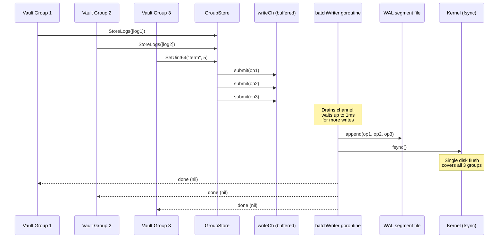
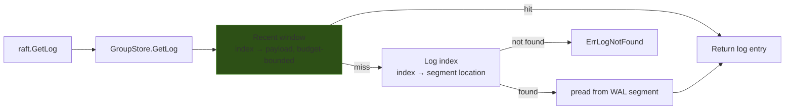
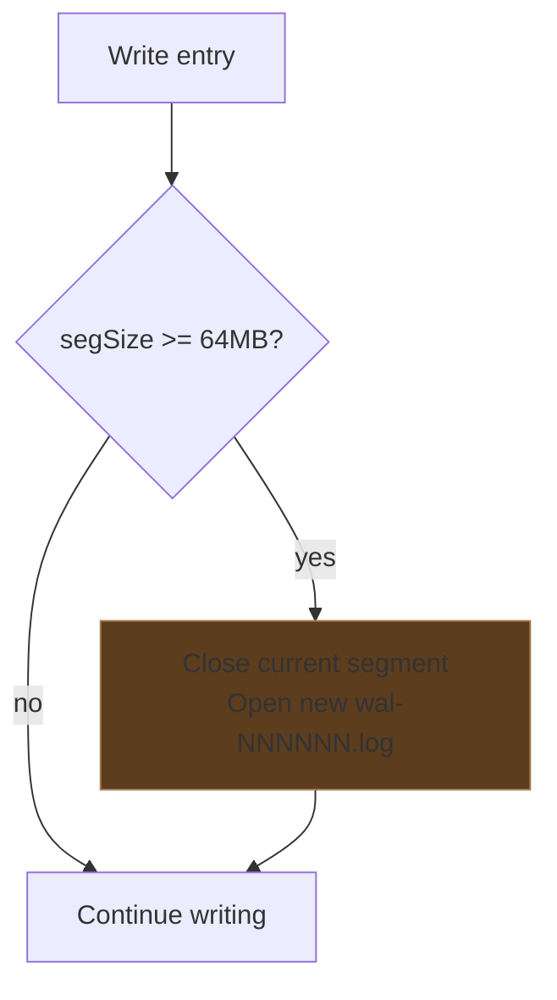
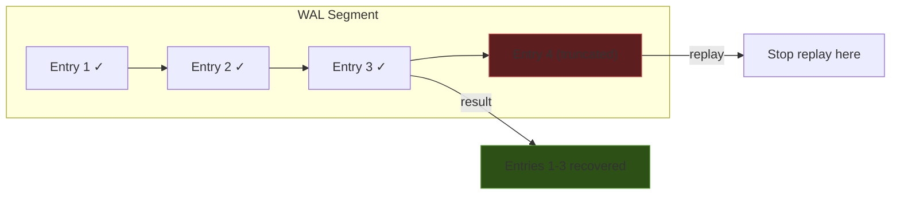
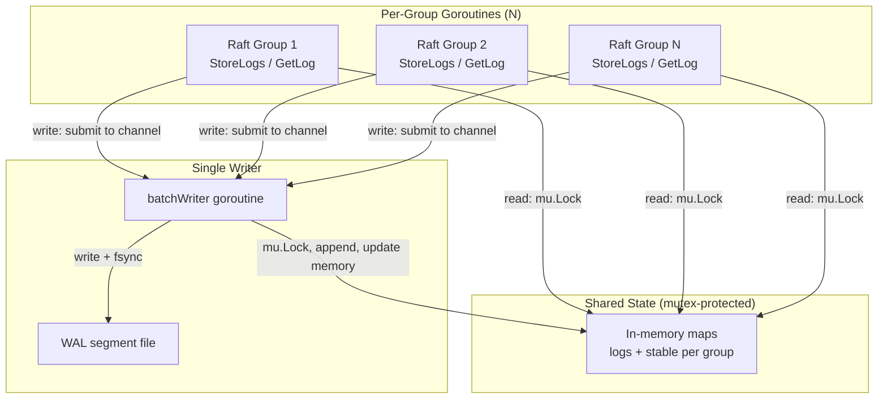

# raftwal — Shared Write-Ahead Log for Multi-Raft Groups

## Overview

`raftwal` replaces per-group boltdb storage with a single shared WAL (write-ahead log) for all Raft groups on a node. Instead of N independent fsyncs for N groups, all writes are batched into a single fsync per batch window.

### Performance

| Groups | WAL (ns/op) | BoltDB (ns/op) | Speedup |
|--------|------------|----------------|---------|
| 1      | 5.4M       | 8.3M           | 1.6x    |
| 4      | 5.3M       | 18.5M          | 3.5x    |
| 16     | 5.4M       | 49.7M          | 9.2x    |
| 64     | 5.8M       | 169.6M         | **29x** |

WAL throughput is nearly constant regardless of group count. BoltDB scales linearly (each group fsyncs independently).

---

## API

```go
// Open or create a WAL in a directory.
wal, err := raftwal.Open("/data/node1/raft/wal")

// Get a per-group handle (implements raft.LogStore + raft.StableStore).
gs := wal.GroupStore("my-group")

// Use with hashicorp/raft.
r, _ := hraft.NewRaft(conf, fsm, gs, gs, snapStore, transport)

// Shutdown: close all Raft groups first, then close the WAL.
groupManager.Shutdown()
wal.Close()
```

`GroupStore` is safe for concurrent use by multiple goroutines. The WAL handles all synchronization internally.

---

## Architecture

### Write Path


```mermaid
sequenceDiagram
    participant G1 as Vault Group 1
    participant G2 as Vault Group 2
    participant G3 as Vault Group 3
    participant GS as GroupStore
    participant CH as writeCh (buffered)
    participant BW as batchWriter goroutine
    participant WAL as WAL segment file
    participant OS as Kernel (fsync)

    G1->>GS: StoreLogs([log1])
    G2->>GS: StoreLogs([log2])
    G3->>GS: SetUint64("term", 5)

    GS->>CH: submit(op1)
    GS->>CH: submit(op2)
    GS->>CH: submit(op3)

    Note over BW: Drains channel,<br/>waits up to 1ms<br/>for more writes

    BW->>WAL: append(op1, op2, op3)
    BW->>OS: fsync()

    Note over OS: Single disk flush<br/>covers all 3 groups

    BW-->>G1: done (nil)
    BW-->>G2: done (nil)
    BW-->>G3: done (nil)
```

**Key property**: `StoreLogs` blocks until the batch containing its entry is fsynced. The caller gets the same durability guarantee as boltdb — when `StoreLogs` returns nil, the data is on disk.

**Batched `StoreLogs`**: a multi-entry `StoreLogs` call is ONE submit through the batch writer and ONE WAL record (`entryLogBatch`), not N round-trips. The record's single CRC covers the whole batch, so replay applies it all-or-nothing — a torn write can never surface a half-applied batch. Single-entry calls use the plain `entryLog` record.

### Read Path


```mermaid
flowchart LR
    R[raft.GetLog] --> GS[GroupStore.GetLog]
    GS --> WIN[Recent window<br/>index → payload, budget-bounded]
    WIN --> |hit| RET[Return log entry]
    WIN --> |miss| IDX[Log index<br/>index → segment location]
    IDX --> |found| PREAD[pread from WAL segment]
    PREAD --> RET
    IDX --> |not found| ERR[ErrLogNotFound]

    style WIN fill:#2d5016,stroke:#4a8c28
```

The log **index** (index → segment/offset/length) is kept in memory for every live entry and rebuilt during WAL replay. **Payloads** are held in memory only inside the per-group recent window, bounded by `Config.LogCacheBudgetBytes` (default 1MiB); older entries are read back from the segment files with `ReadAt`. Memory over throughput: reads beyond the window cost a disk read, but heap is bounded by the budget rather than by log length — even when Raft snapshots lag and the live log grows.

**Memory bound**: per group, `LogCacheBudgetBytes` of payloads plus the index (a few dozen bytes per live entry). Raft's `DeleteRange` after each snapshot trims the index; the payload heap is bounded by the budget regardless.

### On-Disk Format

```
┌─────────────────────────────────────────────────────────────┐
│ WAL Segment File (append-only)                              │
├─────────┬──────────┬────────────┬─────────┬─────────────────┤
│ groupID │ entryType│ payloadLen │  CRC32  │    payload      │
│ 4 bytes │ 1 byte   │ 4 bytes    │ 4 bytes │ N bytes         │
├─────────┴──────────┴────────────┴─────────┴─────────────────┤
│ groupID │ entryType│ payloadLen │  CRC32  │    payload      │
├─────────┴──────────┴────────────┴─────────┴─────────────────┤
│ ...                                                         │
└─────────────────────────────────────────────────────────────┘
```

**Entry types**:

| Type | Value | Payload |
|------|-------|---------|
| `entryLog` | 1 | Serialized `raft.Log` (index, term, type, data, extensions) |
| `entryStableSet` | 2 | Key-length prefixed key + value bytes |
| `entryStableUint64` | 3 | Key-length prefixed key + uint64 (little-endian) |
| `entryDeleteRange` | 4 | min (uint64) + max (uint64) |
| `entryGroupReg` | 5 | Group name (UTF-8 string) |
| `entryLogBatch` | 6 | `[count:4]` then per entry `[len:4][serialized raft.Log]` — one atomic `StoreLogs` batch |

**CRC32**: Castagnoli (SSE4.2 hardware-accelerated on x86/ARM). Covers only the payload, not the header — the header's integrity is implied by the CRC matching the payload length.

### Segment Rotation


```mermaid
flowchart TD
    W[Write entry] --> SZ{segSize >= 64MB?}
    SZ -->|no| DONE[Continue writing]
    SZ -->|yes| ROT[Close current segment<br/>Open new wal-NNNNNN.log]
    ROT --> DONE

    style ROT fill:#5c3d1e,stroke:#a67c52
```

Segments are numbered sequentially (`wal-000001.log`, `wal-000002.log`, ...). The target size is 64MB. When there are at least two segment files and a `DeleteRange` write is fsynced, the WAL may run automatic compaction: it appends a compacted snapshot of registrations, stable keys, and surviving log entries to new segments, fsyncs, then removes older `wal-*.log` files. Tune with `Config.CompactionMinSegments` (default 2). Stats from the last run are available via `WAL.LastCompactionStats()`.

### Group Registration


```mermaid
flowchart LR
    GS[GroupStore name] --> |first call| REG[Allocate numeric ID<br/>Write entryGroupReg to WAL]
    GS --> |subsequent calls| LOOKUP[Return existing ID]
    REG --> WAL[WAL persists name→ID mapping]

    style REG fill:#1e3a5c,stroke:#4a8cc8
```

Each group name is assigned a compact numeric ID (4 bytes) on first use. The mapping is persisted as a WAL entry so it survives restart. On replay, the mapping is restored before any log entries are processed.

---

## Failure Modes

### Crash During Write (Torn Entry)


```mermaid
flowchart LR
    subgraph WAL Segment
        E1[Entry 1 ✓] --> E2[Entry 2 ✓] --> E3[Entry 3 ✓] --> TORN["Entry 4 (truncated)"]
    end

    TORN --> |replay| STOP[Stop replay here]
    E3 --> |result| OK[Entries 1-3 recovered]

    style TORN fill:#5c1e1e,stroke:#c84a4a
    style OK fill:#2d5016,stroke:#4a8c28
```

If the process crashes mid-write, the last entry may be incomplete (header written, payload truncated) or corrupt (partial payload). On replay:

- **Truncated header** (< 13 bytes remaining): replay stops cleanly.
- **Truncated payload** (header valid but not enough bytes follow): replay stops — before allocating, if the claimed length runs past EOF.
- **Bad CRC** (header + payload present but CRC doesn't match): replay stops.

In all cases, entries before the corruption point are fully recovered. The incomplete entry is discarded. Because a `StoreLogs` batch is a single record under one CRC, a torn batch is discarded **whole** — replay never surfaces a half-applied batch. Raft handles the gap — the leader will replicate the missing entries.

### Crash After fsync, Before Caller Notified

The batch was fsynced (durable) but the goroutine crashed before sending on `done` channels. On restart, replay recovers all fsynced entries. The Raft instances will see the entries in their log and resume normally.

### Crash Before fsync

Entries in the batch are lost. The in-memory state was updated but the disk doesn't have them. On restart, those entries are absent. Raft treats this as a follower that's behind — the leader replicates the missing entries.

### WAL Close With Pending Writes

When `Close()` is called:
1. The `done` channel is closed, signaling the batchWriter to exit.
2. The batchWriter flushes any in-progress batch before returning.
3. Any ops still in `writeCh` (submitted after the last batch) are drained and returned with `"wal closed"` error.
4. The segment file is closed.

### Disk Full

`appendEntry` returns an error from `os.File.Write`. The batchWriter propagates this to all callers in the batch. Raft's `StoreLogs` returns the error, which causes Raft to step down as leader (it can't persist state). The cluster continues with a leader on a node that has disk space.

### Corrupted Segment in the Middle

If a segment file is corrupted in the middle (e.g., disk sector error), replay stops at the first bad entry. All entries after the corruption point in that segment are lost, even if they were valid. Entries in subsequent segments are also lost because they may reference state from the corrupted segment.

**Mitigation**: Raft snapshots. The snapshot captures the full FSM state. After restore, only entries after the snapshot index are needed. Regular snapshots (every 4 entries by default) limit the blast radius.

---

## Concurrency Model


```mermaid
flowchart TD
    subgraph "Per-Group Goroutines (N)"
        R1[Raft Group 1<br/>StoreLogs / GetLog]
        R2[Raft Group 2<br/>StoreLogs / GetLog]
        RN[Raft Group N<br/>StoreLogs / GetLog]
    end

    subgraph "Shared State (mutex-protected)"
        MEM[In-memory maps<br/>logs + stable per group]
    end

    subgraph "Single Writer"
        BW[batchWriter goroutine]
        SEG[WAL segment file]
    end

    R1 -->|read: mu.Lock| MEM
    R2 -->|read: mu.Lock| MEM
    RN -->|read: mu.Lock| MEM

    R1 -->|write: submit to channel| BW
    R2 -->|write: submit to channel| BW
    RN -->|write: submit to channel| BW

    BW -->|mu.Lock, append, update memory| MEM
    BW -->|write + fsync| SEG
```

- **Reads** (`GetLog`, `Get`, `GetUint64`, `FirstIndex`, `LastIndex`): Acquire `stateMu.RLock`. Recent-window hits are a map lookup; older log entries `ReadAt` their payload from the segment file under the read lock (compaction closes superseded read handles only under `stateMu.Lock`, so a handle is never closed mid-read).
- **Writes** (`StoreLogs`, `Set`, `SetUint64`, `DeleteRange`): Submit ONE op to `writeCh` (a multi-entry `StoreLogs` is one op), block on `done` channel until the batch is fsynced.
- **batchWriter**: Single goroutine. Writes to the segment file, briefly takes `stateMu.Lock` to update in-memory state, then fsyncs without the lock.

Reads never wait on fsync; the batch writer holds the write lock only for the in-memory index updates.

---

## Limitations

- **In-memory index**: The log index (index → segment location) covers every live entry per group, so index memory grows with live-log length until Raft's post-snapshot `DeleteRange` trims it. Payload heap does NOT grow with log length — it is bounded by `LogCacheBudgetBytes` per group.
- **No per-read CRC**: payloads read back from segments were CRC-verified at write/replay time; `GetLog` does not re-verify (batch sub-entries share one record CRC and cannot be verified individually).
- **Segment compaction**: Triggered after successful `DeleteRange` batches when multiple segments exist; failures are best-effort ignored so `DeleteRange` success is never masked. There is no separate manual “prune WAL” API yet.
- **Single writer**: All writes go through one goroutine. This is intentional (serializes fsync) but means write throughput is bounded by single-core speed + disk fsync latency. In practice, the 1ms batch window means this is not a bottleneck — multiple groups' writes are coalesced.
- **No checksumming of headers**: The CRC covers only the payload. A corrupted header (wrong groupID or length) would cause replay to misparse subsequent entries. Mitigation: the CRC of the next entry would fail, stopping replay.

---

## Test Coverage

- Unit tests covering happy path, edge cases, isolation, crash recovery, concurrency, segment compaction after `DeleteRange`, batched `StoreLogs` atomicity (torn/corrupt batch replay), and recent-window retention (eviction, disk-served reads, budget accounting)
- 6 fuzz targets for encode/decode round-trips (including `entryLogBatch`) and corrupt segment replay
- 2 hashicorp/raft integration tests (election + apply, snapshot + restore)
- 2 benchmarks (WAL vs boltdb at 1/4/16/64 concurrent groups)
- All tests pass with Go race detector enabled
