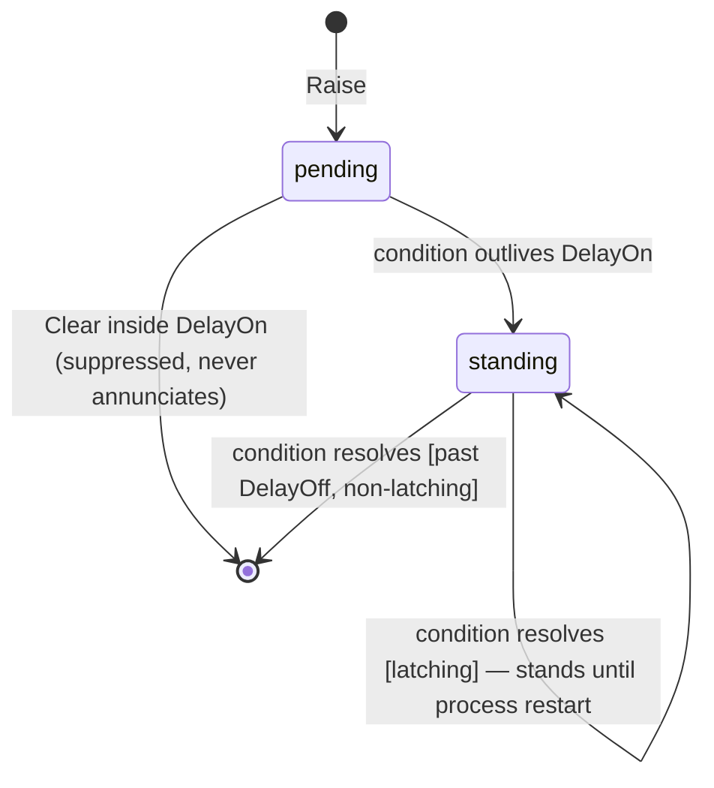

# Alarm Management Design

Redesign of the alert system around EEMUA 191 / ISA-18.2 / IEC 62682
principles. This document is the decision record for the implementation;
the catalog table below is the source of truth for per-alarm behavior.

## The governing test

> The most important thing about any kind of alarm is to ask: **does the
> operator need to do something?** If no, then it's not an alarm, and it
> just goes in the log.

This test gates everything else. It is applied **before** rate limits,
priorities, or lifecycle mechanics, to every existing and future
`alerts.Set()` site. A condition with no operator action is an **event**
(a log message) or a **metric** (health surface), never an alarm.

## Vocabulary

Three distinct concepts, currently conflated in one collector. These terms
go into `docs/ubiquitous_language.md` with the implementing change:

| Term | Meaning | Surface |
|------|---------|---------|
| **Alarm** | A condition requiring operator action, with documented cause and response. An alarm is standing or it is not — there are no per-alarm operator states. | Alarm list (System Alerts panel, renamed) |
| **Event** | A record of something that happened; no action required. | The log stream (slog lines, captured by the self ingester, searchable like any other logs) |
| **Metric** | A measured quantity trending over time. | Health/stats surfaces |

## Standards principles adopted

1. **Actionability** — every alarm requires a response (the governing test).
2. **Rate** — steady-state target ~1 alarm per operator per 10 minutes.
   Satisfied by having FEW alarms — the razor and chattering suppression —
   not by measuring and managing a rate. (A rate self-monitor with a flood
   meta-alarm was built and removed on operator verdict; see "The operator
   verdict" below.)
3. **Chattering suppression** — delay-on / delay-off timers and latching
   instead of raw Set/Clear flapping.
4. **Consequence-based priority** — severity derives from a documented
   consequence × urgency assessment, not ad-hoc choice at the call site.
5. **Standing-alarm management** — the list reflects live, unhandled
   conditions. Satisfied by the razor keeping the list short and by
   release-on-resolve keeping it live — deliberately WITHOUT an
   acknowledgment state machine or shelving; see "State model" below for
   the recorded deviations from ISA-18.2's full model.
6. **State model** — alarms are state with suppression: an alarm is
   standing or it is not. Not a bare Set/Clear bit, not an acknowledgment
   lifecycle, and not an operator-suppression (shelve) layer.
7. **Response guidance** — each alarm type carries documented cause +
   operator action, surfaced in the UI.
8. **Separation** — alarms vs events vs metrics (vocabulary above).

## The operator verdict: strip management, keep prevention

**Recorded operator decision (gastrolog-29380r).** The epic exists for one
reason: **to get rid of excessive alarms and warnings.** Its purpose was
alarm REDUCTION. On review of the built system the operator's verdict was
that shelving and rate self-monitoring are management machinery — they
presume a rich alarm ecosystem worth managing, which is the opposite of
the goal. If the razor works, there are a handful of standing alarms and
none of that apparatus earns its keep.

What was removed on that verdict (each had been fully built):

- **Shelving** — the shelve/unshelve RPCs and their cross-node fan-out,
  the SHELVED state and mandatory expiry, `NeverShelveable` refusal, the
  shelve controls in the UI and CLI, and the per-alarm `state` on the
  wire. With only one state left, per-alarm state is meaningless — every
  standing alarm is active, so the field itself came out.
- **Rate self-monitoring** — the `RateMonitor`, the `alarm-flood`
  meta-alarm and its catalog row, the activation hook in the collector,
  the `alarm_rate_10m` gauge, the operator-adjustable flood threshold
  setting, and the UI flood banner + same-type collapse.

What stays is prevention: the razor (most alarms never exist), the static
catalog (priority is never chosen at a call site), chattering suppression
(flapping conditions never annunciate), and latching for the software-fault
tripwire. The alarm surface is a short, flat, honest list of standing
conditions with cause and response.

## Alarm catalog

Priority derivation: **consequence** (what is at risk if unhandled) ×
**urgency** (how fast the risk compounds). `Critical` = data loss in
progress or imminent; `High` = durability/availability degraded, will
compound; `Low` = needs attention on a human timescale.

### Software faults are not process alarms

One row below is a **software fault**, not an alarm on this scale:
`orchestrator-lock-leak`. The distinction is the standard's own — EEMUA 191
and ISA-18.2 treat instrument and system faults as a class apart from
process alarms, because a broken instrument is not a process condition and
does not belong on a consequence × urgency scale. A software defect is the
same shape.

The test that separates them: **an alarm's response fixes the condition; a
software fault's response is to report it.** Restarting a wedged node
recovers service — it does not address why the lock leaked. Nothing an
operator can do at 3am fixes a lock-discipline bug.

Consequences for the model:

- **No rubric priority.** "The software is broken" is not consequence ×
  urgency. Rating it Critical would claim data is at risk (it is not —
  ingest is ack-after-fsync, so accepted records are already durable and
  in-flight ones were never acked); rating it High would file it beside
  routine degradation.
- **Latched** for the reason the code already gives: a leaked hold cannot be
  released by anything short of a restart, so the condition can never
  self-clear. The alarm stands until the process restarts — there is no
  release path, and that is intentional: the response to a software fault
  is report + restart.

`orchestrator-lock-leak` exists because of gastrolog-1ug3rq, a P0 where a
node zombified silently and no goroutine dump could name the leaker (the
holder had already returned). That root cause — a recursive `o.mu` read
acquisition in `schedulePipelineCloudUpload` — was found and fixed; the
tripwire stays armed for the defect class, not for that bug. It firing again
means a new one.

**Multi-setpoint conditions are separate alarms, not one alarm that changes
colour.** Where the code today raises one ID at Warning while approaching a
bound and Error at the bound, the catalog splits it in two. This is the
standard's own shape (the HI / HIHI pattern): two setpoints on one
measurement are two alarms, each with its own priority and its own response.
It is also what keeps `Priority` a static property of the type. See
[gastrolog-1cruar].

Every row below is grounded in a real `Set` call site as of the phase 1
demotions; the ID column is the **real** ID in code, not an abbreviation.

Verdicts under the governing test:

| ID (pattern) | Source | Condition | Verdict | Priority | Operator action (response text) |
|---|---|---|---|---|---|
| `segmentation-writer:<vault>` | segmentation | Durable segment commit failed; working segment abandoned for crash recovery — **accepted records at risk** | **Alarm** | Critical | Free disk space or replace the volume on the named node; ingest acks are failing until resolved |
| `chunking-unplannable-segment:<vault>` | chunking | Segment on-disk indexes unreadable; records stay unchunked and head copies cannot be purged | **Alarm** | Critical | Investigate segment file corruption on the named node. If the vault has a delete-disposition TTL these records are released **unchunked** at expiry — the loss is scheduled, not hypothetical |
| `chunking-retention-giveup:<vault>` | chunking | Vault keeps releasing **never-chunked** segments at its retention give-up TTL — records age out of the registry before chunking references them, dropped without reaching a chunk while the planner runs (a lone island give-up is suppressed by the DelayOn; the STANDING flood is the alarm) | **Alarm** (DelayOn 2m) | Critical | The pipeline is not chunking this vault within the TTL. The planner needs min(2, placement) holders; check that collection is delivering copies to the vault's homes and replication is progressing. On a cloud-backed vault the dropped records never reach cloud. Clears once the vault seals a chunk again |
| `wal-reserve:<wal>` | storage | Raft WAL space reserve lost | **Alarm** | Critical | Free disk space now — without the reserve, a full volume crashes consensus on this node |
| `orchestrator-lock-leak` | orchestrator | Orchestrator lock held or write-stuck past 1min | **Software fault** (latched) | — (see below) | **This should never fire.** If it does, it is a lock-discipline defect, not an operating condition: capture the acquisition stack from this node's log and file it. Restarting the node is a workaround to recover service, not the response |
| `chunking-build-blocked:<vault>` | chunking | Head-of-queue chunk blocked >2min on segments no local holder can supply, or a manifest referenced a released segment | **Alarm** | High | Restore a node holding the named segments, or accept the gap |
| `chunking-underreplicated:<vault>` | chunking | Segments below the replication minimum ≥2min; planning gated | **Alarm** | High | Check that all placement nodes are up and replication is progressing. If the origin node is permanently lost, the affected records exist only there |
| `chunking-glcb-corrupt:<vault>` | chunking | Sealed-chunk GLCB unreadable; quarantined with a `.corrupt` suffix | **Alarm** (DelayOn) | High | Heals on its own — rebuilt from source segments or re-pulled from a peer home. **Only actionable if it persists**, which is what the delay-on is for: then investigate disk health here and replica health on the vault's other homes |
| `chunk-unreadable:<chunk>` | retention | Chunk unreadable during retention; backoff retry scheduled | **Alarm** (DelayOn) | High | Retries automatically. Only actionable once retries stop resolving it: investigate disk health on this node |
| `chunk-suspect:<chunk>` | cloud-reconcile | Cloud-backed chunk 404s in the blob store; removed from the index after the grace period | **Alarm** | High | Check the blob store for the named chunk. After grace it leaves the index — restore it from a peer or accept the loss |
| `unknown-orphan:<vault>:<chunk>` | vault | Chunk on disk with records but not recognized by the FSM; preserved | **Alarm** | High | Decide restore vs delete for the named chunk. Do **not** delete manually without review — the cluster has no other copy |
| `cloud-store:<vault>` | cloud | Cloud store unreachable; uploads stopped | **Alarm** | High | Check cloud credentials/endpoint/network; sealed chunks accumulate locally until restored |
| `cloud-backfill-stuck:<chunk>` | cloud-health | Cloud-backfill upload for a sealed chunk keeps failing after a chunk-manager registration repair was attempted; not converging to cloud-backed on its own | **Alarm** (DelayOn 10m, same backoff schedule as `chunk-unreadable`) | High | Read the alarm detail for the last upload error. If the chunk's GLCB is missing on disk, restore it from a peer holder or accept the gap; otherwise check cloud store credentials/connectivity and disk health on the named node |
| `vault-leaderless:<vault>` | placement | Placements resolve to no leader ≥60s (beyond self-healing) | **Alarm** (DelayOn 60s) | High | Fix vault placements / node storage configs; retention, rotation, target refresh stopped |
| `vault-underreplicated:<vault>` | placement | Placed replicas below desired RF (insufficient eligible storages) | **Alarm** | High | Restore nodes or reduce RF; durability target unmet |
| `vault-storage-class-missing:<vault>` *(split from `vault-unplaced`)* | placement | Selected node has no storage of the vault's required class; leader placement refused | **Alarm** | High | Add storage of the required class on the named node, or change the vault's storage class |
| `vault-no-eligible-node:<vault>` *(split from `vault-unplaced`)* | placement | No currently-eligible node; existing placements retained | **Alarm** | High | Restore an eligible node, or relax the vault's storage requirements |
| `vault-soft-offline-leader:<vault>` | placement | Leader heartbeat lost while node still Live, or leader on an Unreachable/Maintenance node; rotation gated | **Alarm** | High | Investigate the named leader node |
| `node-unreachable:<node>` | node-lifecycle | Peer node Unreachable past grace | **Alarm** | High | Investigate or restart the node |
| `vault-init:<vault>` | orchestrator (factory, reconfig) | Vault instance failed to construct from config | **Alarm** | High | Fix the named config error; the vault is not serving |
| `config-side-effect-failed:<entity>` | config-dispatch | A committed config mutation could not be applied to this node's orchestrator; this node's running state diverges from replicated config. Per-entity, node-scoped — retries on the next dispatch touching the entity and on startup reconcile | **Alarm** | High | Read the detail for the failing entity, operation and error. Resolve the named error on this node (disk, storage config, construction error); clears on the next successful apply |
| `pipeline-backlog-capped:<vault>` *(split)* | storage | Backlog **at** budget — new records for this vault are REFUSED | **Alarm** | High | Check chunking throughput, raise the budget, or reduce the ingest rate. This vault is refusing records now; others are unaffected |
| `vault-max-size-capped:<vault>` *(split)* | storage | Vault **at** its max-size bound — new records REFUSED | **Alarm** | High | Raise the bound (set a larger max size on an attached retention policy) or shorten retention. This vault is refusing records now; others are unaffected |
| `vault-bound-capped:<vault>/age` \| `<vault>/count` | retention | A retention policy's max-age or max-chunks bound is still violated after retention swept and attempted to clear it — new records REFUSED. Only when the stating policy has `refuse` enabled explicitly (default off); a plain drain-only policy never refuses (gastrolog-5yfaqj) | **Alarm** | High | Read the detail for which bound and vault. If `retention-deferred` is also standing, that names why the sweep isn't clearing it; otherwise raise the bound, shorten it enough that draining keeps up, or leave/turn the policy's `refuse` flag off to accept drain-only |
| `retention-deferred:<vault>` | retention | Configured non-delete disposition (route fan-out or transfer) deferred ≥3 consecutive sweeps (the count at the call site is the condition definition) | **Alarm** | High | See detail for the cause and disposition: free space on the starved volume, drain/grow the destination or target vault, or — last resort, discards the records — set the vault's retention disposition to delete |
| `retention-unenforceable:<vault>` | retention | Vault has retention_rules configured, but every referenced retention policy resolves with no trigger (no maxAge, maxSize, or maxChunks set) — the vault's only drain never runs. The refuse-only creation-default floor still bounds the vault (data accumulates only up to that floor, then admission refuses), but there is no drain to keep the vault small or recover space | **Alarm** | High | Read the alarm detail for which policies resolved with no trigger. Add a maxAge, maxSize, or maxChunks to at least one referenced policy — maxSize alone is enough to both bound and drain the vault regardless of `refuse` (which defaults off); add `refuse=true` to also refuse admission while over it. Do **not** remove the vault's retention_rules to silence this — detaching every policy also detaches any maxSize they carried, collapsing the vault to the untyped creation-default floor instead of the operator's intended bound |
| `disk-space-exhausted:<storage>` *(split, gastrolog-9akebz: keyed by storage, was vault)* | storage | Storage out of space — admission for every vault placed on it SUSPENDED | **Alarm** | High | Free space, add capacity, raise the storage's threshold, or shorten retention for the vaults placed on it |
| `node-disk-space-exhausted` *(node, split)* | storage | Node volume out of space — ingest admission SUSPENDED on this node | **Alarm** | High | Free space, add capacity, or shorten retention. Retention and deletes keep running |
| `ingester-not-running` | ingestion | Ingesters that should run on this node are not running | **Log** (demoted) | — | Demoted on the operator razor: the convergence sweep re-dispatches every tick and failed runs retry with backoff — the system is already doing everything an operator could ask, and the actionable detail (build/start errors) is already in the log. An alarm whose response is "check the log" is a log. The sweep logs divergence once per state change (never per tick), captured by the self-ingester |
| `pipeline-backlog-approaching:<vault>` *(split)* | storage | Backlog approaching budget; chunking not keeping pace | **Alarm** | Low | Check chunking throughput, raise the budget, or reduce the ingest rate — before records start being refused |
| `vault-max-size-approaching:<vault>` *(split)* | storage | Vault approaching its max-size bound | **Alarm** | Low | Raise the bound (set a larger max size on an attached retention policy) or shorten retention — before records start being refused |
| `disk-space-low:<storage>` *(split, gastrolog-9akebz: keyed by storage, was vault)* | storage | Storage below its free-space warn band | **Alarm** | Low | Free space, add capacity, raise the storage's threshold, or shorten retention for the vaults placed on it |
| `node-disk-space-low` *(node, split)* | storage | Node volume below its free-space warn band | **Alarm** | Low | Free space, add capacity, or shorten retention |
| `retention-rate:<vault>` | retention | Retention delete rate sustained above 10/s over a 30s window (product constants; the rate window at the call site is the condition definition and its hysteresis) | **Alarm** | Low | Review the vault's rotation and retention policy; a configuration this aggressive degrades throughput until corrected |
| *(alarm-flood — row retired)* | alarm-system | Node alarm rate over a threshold | **Removed on operator verdict** | — | The rate self-monitor and its meta-alarm were built and removed (see "The operator verdict" above): the flood apparatus presumes the alarm volume the epic exists to eliminate |
| **`vault-home-cannot-store:<vault>`** | placement | A vault home node is disk-protected; collection and builds paused there | **NEEDS VERDICT** (interim: Alarm) | Low (interim) | Razor is unclear. When healthy replicas ≥ RF the text itself says replicas are "backfilled automatically" — handled, nothing waits on an operator. When healthy < RF, the action is "free space", which is already `disk-space-*`'s action on that node. What it uniquely adds is *which vault* is affected. Demote to a metric, or keep as the vault-scoped view of a node condition? Until the verdict lands, the phase 2 registry keeps it as a Low alarm (the code still raises it; a raised type must be cataloged) |
| *(retention unrouted destroy — row retired)* | retention | Chunk destroyed with zero records routed | **Not an alarm — prevented** | — | Resolved in [gastrolog-65riw5]: the condition no longer occurs, so there is nothing to alarm on. An unreadable cursor now flags the chunk for backoff retry and raises `chunk-unreadable:<chunk>` (which has its own row); a missing vault instance retains the chunk. No alarm was invented — the existing one covers it. **Partial** fan-out remains a deliberate tolerance and is reported with a dropped-record count, not an alarm; see the note below |
| chanwatch saturation | chanwatch | Internal channel saturated past watermark | **Event** (demoted ✓) | — | Landed: transition-edge logs |
| ingest-pressure | orchestrator | Ingest pipeline pressure elevated/critical; ingesters throttling | **Event** (demoted ✓) | — | Landed: `NodeStats.ingest_pressure_level`. If ingestion is throttled the matter is already handled — the throttle *is* the response, so nothing waits on an operator. The gate's `OnChange` hook logs one line per level transition (hysteresis-bounded, gastrolog-1m3e0d); sustained pressure is never logged per tick — the self-ingester captures slog, so continuous logging would feed the pressure |
| `self-ingester-drops` | ingester/self | Capture channel overflowing; diagnostic records discarded | **Event** (demoted ✓) | — | Landed: `NodeStats.self_ingester_drops_total`. Capacity tuning, not operator action. Never logged: a line about dropped logs feeds the channel dropping them |
| `raft-wal-latency` | statscollector | WAL append max over threshold | **Event** (demoted ✓) | — | Landed: transition-edge logs + stats (`RaftWalAppendMaxMs`) |
| scheduler-stall | schedwatch | Runtime stalled past leader lease | **Event** (demoted ✓) | — | Landed: log + counters |
| election-storm | statscollector | Elections/min over threshold | **Event** (demoted ✓) | — | Landed: transition-edge logs + stats |

Rows marked ✓ already landed; phase 1 is complete. Every surviving alarm
gets a catalog entry in code (see below) carrying its response text — the UI
shows it; no tracker IDs, no internal jargon.

One row is **not** settled and must not be implemented from this table as
written: `vault-home-cannot-store` needs a razor verdict.

**The best answer to "what priority should this alarm be?" is sometimes
"make the condition impossible."** The retention unrouted-destroy row was
Critical and unraised — an alarm the design wanted and the code never built.
Working out its response text (gastrolog-65riw5) showed the condition was a
bug, not a state: retention was destroying chunks with zero records routed
on an unreadable cursor. Fixing that removed the row instead of filling it
in. Reach for that before writing a catalog entry: a row that says "tell the
operator we lost their data" is a row that should have said "don't."

Partial fan-out — individual records failing to submit for non-terminal
reasons, dropped when the chunk is destroyed — is a **deliberate tolerance**
and stays one: one bad record must not strand a chunk forever. It is
reported with a count on a single line rather than a warn per record, and
whether a nonzero count deserves an alarm of its own is open.

Rows removed from this table as fiction — they described conditions no code
raises:

- *under-replicated (reconciler)* — no reconciler raises an under-replication
  alarm. The real ones are `vault-underreplicated:<vault>` (placement, RF) and
  `chunking-underreplicated:<vault>` (chunking, segments). The row conflated
  them with `unknown-orphan`, which is a different condition entirely and now
  has its own row.
- *ingester failure (`ingester:*`, source ingester/self)* — no `ingester:*`
  alarm exists. The real condition is ingester divergence, reported by the
  ingester reconciler in `internal/app` — node-scoped rather than
  per-ingester, and since demoted from an alarm to a once-per-transition log
  (see the catalog table).
- *archival sweep failures ("archive writes failing")* — the archival sweep
  raises `chunk-suspect:<chunk>`, which is a cloud-reconcile 404, not an
  archive write failure.

## Alarm-type catalog in code

A static registry, one entry per alarm type:

```go
type AlarmType struct {
    IDPrefix      string         // "vault-leaderless", "cloud-store", ... (full ID = IDPrefix[:instanceKey])
    Priority      alert.Priority // Critical | High | Low (replaces Severity at Set sites)
    Source        string
    Cause         string        // one-paragraph cause description
    Response      string        // what the operator should do
    DelayOn       time.Duration // suppression: condition must persist this long
    DelayOff      time.Duration // condition must stay clear this long before auto-clear
    Latching      bool          // sticky: stands after the condition clears, until process restart
    SoftwareFault bool          // defect tripwire: outside the priority scale
}
```

*(Landed with phase 2 — `internal/alert/registry.go`. DelayOn/DelayOff/
Latching are enforced by the collector since phase 3.)*

### Suppression semantics (phase 3, landed)

DelayOn/DelayOff/Latching are enforced in the collector, driven by the
catalog entry — call sites raise and clear the raw condition and carry no
alarm timers of their own. Decisions of record:

- **Lazy evaluation.** Suppression windows advance on every Raise/Clear
  touching an alarm and on every read (`Standing()`/`Count()`), against the
  collector's injectable clock. A condition raised once and never re-raised
  still activates when its DelayOn elapses — the next read surfaces it.
  (Sweep-style raisers that re-raise every tick also work; lazy evaluation
  just doesn't require it.)
- **FirstSeen is condition start**, not activation time: the delay-on
  window suppresses annunciation, not the condition's history. An alarm
  annunciating after a 60s DelayOn appears with 60s of age.
- **DelayOff continuity.** A condition that clears and returns inside the
  delay-off window is the same occurrence: the alarm stays active
  continuously, FirstSeen preserved, no phantom re-occurrence.
- **Condition-definition durations are not suppression.** A duration that
  is part of the condition itself and measured from durable state stays at
  the call site: `chunking-underreplicated` ("below the minimum ≥2min") is
  a predicate over each gated segment's FSM `PublishedAt` — moving it onto
  DelayOn would false-alarm under sustained ingest, where *some* fresh
  segment is always briefly inside its replication window even though no
  individual segment is stuck. `node-unreachable`'s grace measures the
  FSM-replicated `StateSince` the same way.
- **Latching is plain sticky.** A latched alarm whose condition clears
  remains standing until process restart — there is no release path. (The
  acknowledgment phase briefly made latched alarms clearable via ack; with
  acknowledgment removed on operator verdict, latching reverts to the
  phase-3 shape, now intentional: the one latching type is a software-fault
  tripwire, and the response to a software fault is report + restart.)
- Suppression state is **per-node** (each node's collector), like the
  alarms themselves; the aggregation layer sees only annunciated alarms,
  so a condition flapping on one node cannot chatter cluster-wide.

`alerts.Set(id, severity, source, msg)` became
`alerts.Raise(typeID, instanceKey, detail)` — the collector looks up the
type and stamps priority/cause/response (suppression follows in phase 3);
`Clear(typeID, instanceKey)` is addressed the same way. Call sites
stopped choosing severities ad hoc; the three structurally identical sink
interfaces (orchestrator `AlertCollector`, segmentation and chunking
`AlertSink`) collapsed into the single `alert.Sink`. A `Raise` for an
unregistered type is loud, never silent: it logs the defect and surfaces
a software-fault alarm carrying the raiser's detail. `alert.Info` never
existed — informational conditions are events by definition.

**Recorded decision — the operator-defined category was removed**
(gastrolog-1cruar). The sink briefly carried a second, catalog-bypassing
entrance for "operator-defined" alarms, whose priority would come from
an operator-configured rule rather than the catalog. A code audit
disproved the premise: the only rate rule in the system is the
retention-rate alerter constructed in `orchestrator.go` with hardcoded
constants (>10 deletes/sec over a 30s window) — no config field, proto
field, CLI flag, or UI setting feeds those thresholds, so no operator has
ever authored a rate rule. `retention-rate` is now an ordinary catalog
row, and the catalog principle holds with zero exceptions: every alarm
enters through `Raise`, and priority is never chosen at a call site. An
operator-defined category gets designed if and when operator-authored
rules become a real feature — not before.

## State model

**Recorded operator decisions.** An alarm is **standing or it is not** —
there are no per-alarm operator states. Two layers were built on top of
the suppression substrate and removed on operator verdict:

- An **acknowledgment layer** — the acked and retained-after-clear states,
  the ack RPC with its cross-node fan-out, and an on-disk lifecycle
  journal — was built (gastrolog-1z5gg4) and removed ("lose the ACK
  crap"; the journal earlier: "no. lose it."). Awareness bookkeeping is
  ceremony: acknowledgment records that an operator *knows* about a
  condition; it changes nothing about the condition. An alarm list that
  reflects live conditions IS the awareness surface.
- **Shelving** — bounded operator suppression with mandatory expiry, the
  shelve/unshelve RPCs and their cross-node fan-out, and the SHELVED
  state — was built (the remainder of gastrolog-1z5gg4) and removed on
  the epic verdict ("strip management, keep prevention"): shelving is
  management machinery for an alarm volume the razor exists to prevent.
  With a short list, an operator who has judged a Low alarm tolerable
  simply reads past it; a suppression subsystem is not worth its state,
  its RPC fan-out, or its UI surface.

The remaining reasoning of record:

- **Alarms are state.** They stand while the condition holds and clear
  when it resolves. Retaining a cleared alarm ("it fired while you were
  away") reintroduced event-ness into a state surface; the log stream is
  the event record (see "Events are log messages").
- **Restart resets everything.** Nothing persists across restart — no
  journal, no file I/O in the alert package. After a restart a re-detected
  condition is simply a standing alarm again. **Loud is safe**: the
  failure mode of forgetting operator state is an alarm that is *too
  visible*.

State machine (all that remains is the suppression substrate):



Decisions of record:

- **Release is unconditional.** A non-latching alarm whose condition
  resolves (past DelayOff, immediately for zero) releases, full stop.
  There is no retained cleared state.
- **Latched alarms stand until process restart.** There is no release
  path, and that is intentional: the one latching type
  (`orchestrator-lock-leak`) is a software-fault tripwire, and the
  response to a software fault is report + restart — the restart is what
  clears it. Its raiser never calls Clear (a leaked hold cannot be
  observed releasing), so its whole lifecycle is standing → restart →
  gone.
- **EEMUA principles 5 & 6 are satisfied by having FEW alarms**, not by
  managing many. The razor keeps the list short; release-on-resolve keeps
  it live; suppression keeps it quiet. This deviates from ISA-18.2's full
  model (acknowledge, shelve, return-to-normal-unacknowledged, and the
  associated re-annunciation states) as a considered product decision,
  not an omission: those states exist to manage operator attention in a
  control room drowning in annunciators; here the attention surface is
  the list itself, and the event history lives in the logs.

### Proto / API

`SystemAlert` carries exactly the alarm: `id`, `priority`, `source`,
`detail`, `first_seen`, `last_seen`, `cause`, `response`,
`software_fault`. `first_seen` (the condition start of the current
occurrence) IS the `first_raised` this section once sketched — no
duplicate field was added. There are no alarm lifecycle RPCs: nothing an
operator does mutates an alarm. Remove-and-renumber applies; no reserved
fields — the ack fields, the `state` enum, `shelved_until`, `shelveable`,
`type_id` (its only consumer was the removed flood collapse; the CLI
derives the type from the ID string) and the shelve/unshelve RPCs were
deleted and the remaining tags renumbered.

### Cross-node semantics

Alarms are raised per-node and aggregated for the UI via the existing
PeerState broadcast (`Standing()` → `NodeStats.alerts`), so the full
attributed list is readable from any node — `GetClusterStatus` serves the
CLI and the inspector panel identically. There are no cross-node alarm
mutations: with ack and shelve gone, the fan-out machinery
(raiser resolution + `local_only` ForwardRPC legs) had no remaining
caller and was deleted with them.

## Events are log messages

**Recorded operator decision (gastrolog-1m3e0d).** GastroLog is a log
system that ingests its own logs: every lifecycle transition and demoted
diagnostic is a structured slog line, the self ingester captures those
lines into a vault, and the full query engine searches them there. The
log pipeline **is** the event record. A phase-5 implementation of a
parallel surface — a per-node in-memory ring with its own RPC, inspector
page, and CLI command — was built and then removed on operator verdict:
it was a second, worse log pipeline bolted onto a log pipeline. EEMUA
191's separation (principle 8) is satisfied without it: alarms live in
the collector, events live in the logs, metrics live in NodeStats.

What that means concretely:

- **Every transition edge logs exactly one slog line from the collector**
  — annunciation (including zero-delay raises) and resolution (released
  or latched-standing; the message says which). A condition that dies
  inside its delay-on window logs **nothing** — logging it would
  reintroduce the chattering the window suppresses. A slog-capture test
  pins one line per edge.
- **Demoted diagnostics keep their transition-edge logs**: the stats
  collector's election-storm and WAL-latency hysteresis edges, the
  chanwatch cross/resolve pair, and the ingest pipeline pressure gate's
  `OnChange` hook (one line per level change, hysteresis-bounded). The
  pressure **level** itself and self-ingester-drops stay **metrics** —
  sustained pressure must never generate sustained logging on the very
  path that is under pressure.
- **Durability is the log pipeline's**: events land in whatever vault the
  self ingester routes to and live under its retention — no second
  retention story, no in-memory ring that silently forgets on restart.

## Rate self-monitoring — built, then removed

A full rate self-monitor was built (a per-node rolling activation window
feeding an `alarm-flood` meta-alarm through the collector's activation
hook, an operator-adjustable threshold in the Raft-replicated settings, a
`NodeStats` rate gauge, and UI flood collapse) and **removed on the epic
verdict** (see "The operator verdict" above). The recorded reasoning: the
epic's purpose was alarm reduction, and a flood detector presumes the
flood the razor exists to prevent. If the standing list ever outruns an
operator again, the fix is more razor — demote or prevent the offending
conditions — not machinery that measures the overflow. EEMUA 191's rate
principle is satisfied by the target (few alarms), not by the meter.

## UI

- The alarm list is flat: every standing alarm in the cluster, sorted
  priority then age, attributed to the raising node.
- Each alarm row expands to cause + response text from the catalog.
- Event history is not a page: events are log messages, searched like any
  other logs (see "Events are log messages" above).
- CLI surface: `gastrolog alerts` (per-node attribution, `--node` filter,
  `-o json`) and a standing-alarm table in `cluster status` render the
  same per-node NodeStats aggregation the panel reads, over the local
  Unix socket with no auth — alarms stay readable from a bare shell when
  a suspended system writes no logs. The CLI's priority→display mapping
  is a single function (`alarmPriorityStr`); software faults render as
  FAULT, outranking Critical.

## Implementation phases

1. **Razor demotions** ✓ — scheduler-stall, election-storm, chanwatch
   saturation and raft-wal-latency demoted to transition-edge logs;
   ingest-pressure and self-ingester-drops demoted to NodeStats metrics.
   Note the two demotion targets are not interchangeable: anything the
   self-ingester would capture must become a **metric**, never a log, or
   reporting the pressure adds to it.
2. **Catalog + priorities** — the AlarmType registry; every Set site
   migrates to Raise; severity → priority; response text written per type
   (operator-reviewed).
3. **Suppression** ✓ — DelayOn/DelayOff/Latching enforced in the
   collector on an injectable clock; vault-leaderless and
   chunking-build-blocked migrated off their hand-rolled delay-on timers;
   chunking-glcb-corrupt and chunk-unreadable gained their catalog
   DelayOn. See "Suppression semantics" above for the decisions of
   record, including the interim latching behavior until phase 4.
4. **Lifecycle + proto + RPCs** — built (ack/shelve state machine,
   cross-node fan-out, ack persistence journal), then **removed on
   operator verdict** in two steps: the acknowledgment layer and journal
   first ("lose the ACK crap"), then shelving and the whole fan-out with
   the epic verdict ("strip management, keep prevention"). See "State
   model" above for the recorded decisions.
5. **Event journal** — built (ring buffer, RPC, UI page), then
   **removed on operator verdict**: events are log messages and the log
   pipeline already records, stores, and searches them (see "Events are
   log messages" above). The lifecycle transitions stay as collector slog
   lines.
6. **Self-monitoring** — built (rate gauge, flood meta-alarm, flood
   collapse), then **removed on the epic verdict**: management machinery
   presumes the alarm volume the epic exists to eliminate (see "Rate
   self-monitoring — built, then removed" above).
7. **Vocabulary** — ubiquitous_language.md entries land with phase 2;
   Shelve/Unshelve and alarm-flood retired with the strip.

Each phase is independently shippable; phases 2–4 touch every alert call
site and the proto and should land on one stack.
