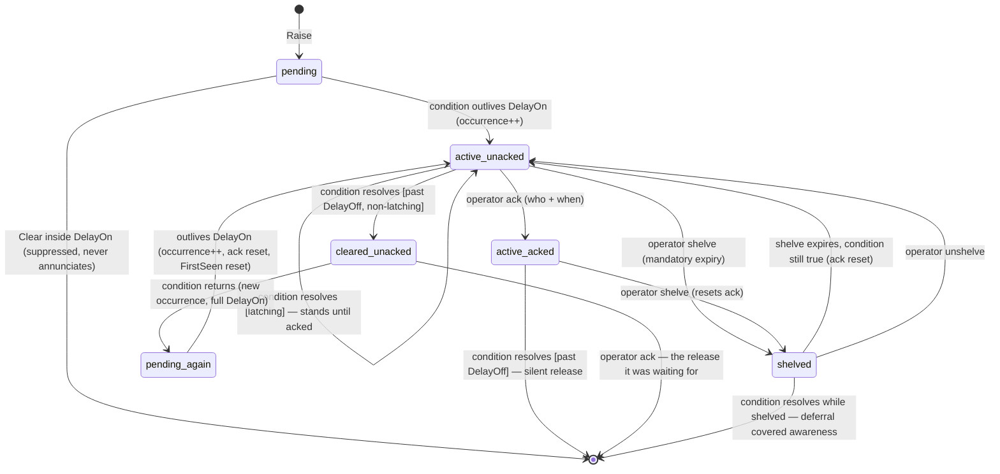

# Alarm Management Design

Redesign of the alert system around EEMUA 191 / ISA-18.2 / IEC 62682
principles. This document is the decision record for the implementation;
the catalog table below is the source of truth for per-alarm behavior.

## The governing test

> The most important thing about any kind of alarm is to ask: **does the
> operator need to do something?** If no, then it's not an alarm, and it
> just goes in the log.

This test gates everything else. It is applied **before** rate limits,
priorities, or lifecycle mechanics, to every existing and future
`alerts.Set()` site. A condition with no operator action is an **event**
(journal) or a **metric** (health surface), never an alarm.

## Vocabulary

Three distinct concepts, currently conflated in one collector. These terms
go into `docs/ubiquitous_language.md` with the implementing change:

| Term | Meaning | Surface |
|------|---------|---------|
| **Alarm** | A condition requiring operator action, with documented cause and response. Has lifecycle state. | Alarm list (System Alerts panel, renamed) |
| **Event** | A record of something that happened; no action required. | Event journal (inspector Events page, `gastrolog events`) |
| **Metric** | A measured quantity trending over time. | Health/stats surfaces |

## Standards principles adopted

1. **Actionability** — every alarm requires a response (the governing test).
2. **Rate** — steady-state target ~1 alarm per operator per 10 minutes;
   flood recognition during upsets.
3. **Chattering suppression** — delay-on / delay-off timers and latching
   instead of raw Set/Clear flapping.
4. **Consequence-based priority** — severity derives from a documented
   consequence × urgency assessment, not ad-hoc choice at the call site.
5. **Standing-alarm management** — acknowledgment and shelving so the list
   reflects live, unhandled conditions.
6. **Lifecycle state model** — not a bare Set/Clear bit.
7. **Response guidance** — each alarm type carries documented cause +
   operator action, surfaced in the UI.
8. **Separation** — alarms vs events vs metrics (vocabulary above).
9. **Self-monitoring** — the alarm system measures its own rate and
   surfaces flood conditions.

## Alarm catalog

Priority derivation: **consequence** (what is at risk if unhandled) ×
**urgency** (how fast the risk compounds). `Critical` = data loss in
progress or imminent; `High` = durability/availability degraded, will
compound; `Low` = needs attention on a human timescale.

### Software faults are not process alarms

One row below is a **software fault**, not an alarm on this scale:
`orchestrator-lock-leak`. The distinction is the standard's own — EEMUA 191
and ISA-18.2 treat instrument and system faults as a class apart from
process alarms, because a broken instrument is not a process condition and
does not belong on a consequence × urgency scale. A software defect is the
same shape.

The test that separates them: **an alarm's response fixes the condition; a
software fault's response is to report it.** Restarting a wedged node
recovers service — it does not address why the lock leaked. Nothing an
operator can do at 3am fixes a lock-discipline bug.

Consequences for the model:

- **No rubric priority.** "The software is broken" is not consequence ×
  urgency. Rating it Critical would claim data is at risk (it is not —
  ingest is ack-after-fsync, so accepted records are already durable and
  in-flight ones were never acked); rating it High would file it beside
  routine degradation.
- **Never shelveable.** Shelving suppresses a condition for a while on the
  operator's judgement. A defect does not resolve itself and cannot be
  deferred — a shelved wedge is a lie. Phase 4 landed the refusal
  (`AlarmType.NeverShelveable`); this is the case that required it.
- **Latched** for the reason the code already gives: a leaked hold cannot be
  released by anything short of a restart, so the condition can never
  self-clear. Only an operator acknowledging it can.

`orchestrator-lock-leak` exists because of gastrolog-1ug3rq, a P0 where a
node zombified silently and no goroutine dump could name the leaker (the
holder had already returned). That root cause — a recursive `o.mu` read
acquisition in `schedulePipelineCloudUpload` — was found and fixed; the
tripwire stays armed for the defect class, not for that bug. It firing again
means a new one.

**Multi-setpoint conditions are separate alarms, not one alarm that changes
colour.** Where the code today raises one ID at Warning while approaching a
bound and Error at the bound, the catalog splits it in two. This is the
standard's own shape (the HI / HIHI pattern): two setpoints on one
measurement are two alarms, each with its own priority and its own response.
It is also what keeps `Priority` a static property of the type. See
[gastrolog-1cruar].

Every row below is grounded in a real `Set` call site as of the phase 1
demotions; the ID column is the **real** ID in code, not an abbreviation.

Verdicts under the governing test:

| ID (pattern) | Source | Condition | Verdict | Priority | Operator action (response text) |
|---|---|---|---|---|---|
| `segmentation-writer:<vault>` | segmentation | Durable segment commit failed; working segment abandoned for crash recovery — **accepted records at risk** | **Alarm** | Critical | Free disk space or replace the volume on the named node; ingest acks are failing until resolved |
| `chunking-unplannable-segment:<vault>` | chunking | Segment on-disk indexes unreadable; records stay unchunked and head copies cannot be purged | **Alarm** | Critical | Investigate segment file corruption on the named node. If the vault has a delete-disposition TTL these records are released **unchunked** at expiry — the loss is scheduled, not hypothetical |
| `wal-reserve:<wal>` | storage | Raft WAL space reserve lost | **Alarm** | Critical | Free disk space now — without the reserve, a full volume crashes consensus on this node |
| `orchestrator-lock-leak` | orchestrator | Orchestrator lock held or write-stuck past 1min | **Software fault** (latched, never shelveable) | — (see below) | **This should never fire.** If it does, it is a lock-discipline defect, not an operating condition: capture the acquisition stack from this node's log and file it. Restarting the node is a workaround to recover service, not the response |
| `chunking-build-blocked:<vault>` | chunking | Head-of-queue chunk blocked >2min on segments no local holder can supply, or a manifest referenced a released segment | **Alarm** | High | Restore a node holding the named segments, or accept the gap |
| `chunking-underreplicated:<vault>` | chunking | Segments below the replication minimum ≥2min; planning gated | **Alarm** | High | Check that all placement nodes are up and replication is progressing. If the origin node is permanently lost, the affected records exist only there |
| `chunking-glcb-corrupt:<vault>` | chunking | Sealed-chunk GLCB unreadable; quarantined with a `.corrupt` suffix | **Alarm** (DelayOn) | High | Heals on its own — rebuilt from source segments or re-pulled from a peer home. **Only actionable if it persists**, which is what the delay-on is for: then investigate disk health here and replica health on the vault's other homes |
| `chunk-unreadable:<chunk>` | retention | Chunk unreadable during retention; backoff retry scheduled | **Alarm** (DelayOn) | High | Retries automatically. Only actionable once retries stop resolving it: investigate disk health on this node |
| `chunk-suspect:<chunk>` | cloud-reconcile | Cloud-backed chunk 404s in the blob store; removed from the index after the grace period | **Alarm** | High | Check the blob store for the named chunk. After grace it leaves the index — restore it from a peer or accept the loss |
| `unknown-orphan:<vault>:<chunk>` | vault | Chunk on disk with records but not recognized by the FSM; preserved | **Alarm** | High | Decide restore vs delete for the named chunk. Do **not** delete manually without review — the cluster has no other copy |
| `cloud-store:<vault>` | cloud | Cloud store unreachable; uploads stopped | **Alarm** | High | Check cloud credentials/endpoint/network; sealed chunks accumulate locally until restored |
| `vault-leaderless:<vault>` | placement | Placements resolve to no leader ≥60s (beyond self-healing) | **Alarm** (DelayOn 60s) | High | Fix vault placements / node storage configs; retention, rotation, target refresh stopped |
| `vault-underreplicated:<vault>` | placement | Placed replicas below desired RF (insufficient eligible storages) | **Alarm** | High | Restore nodes or reduce RF; durability target unmet |
| `vault-storage-class-missing:<vault>` *(split from `vault-unplaced`)* | placement | Selected node has no storage of the vault's required class; leader placement refused | **Alarm** | High | Add storage of the required class on the named node, or change the vault's storage class |
| `vault-no-eligible-node:<vault>` *(split from `vault-unplaced`)* | placement | No currently-eligible node; existing placements retained | **Alarm** | High | Restore an eligible node, or relax the vault's storage requirements |
| `vault-soft-offline-leader:<vault>` | placement | Leader heartbeat lost while node still Live, or leader on an Unreachable/Maintenance node; rotation gated | **Alarm** | High | Investigate the named leader node |
| `node-unreachable:<node>` | node-lifecycle | Peer node Unreachable past grace | **Alarm** | High | Investigate or restart the node. Removal is operator-initiated, never automatic |
| `vault-init:<vault>` | orchestrator (factory, reconfig) | Vault instance failed to construct from config | **Alarm** | High | Fix the named config error; the vault is not serving |
| `pipeline-backlog-capped:<vault>` *(split)* | storage | Backlog **at** budget — new records for this vault are REFUSED | **Alarm** | High | Check chunking throughput, raise the budget, or reduce the ingest rate. This vault is refusing records now; others are unaffected |
| `vault-max-size-capped:<vault>` *(split)* | storage | Vault **at** its size budget — new records REFUSED | **Alarm** | High | Raise the budget or shorten retention. This vault is refusing records now; others are unaffected |
| `disk-space-exhausted:<vault>` *(split)* | storage | Vault volume out of space — admission for this vault SUSPENDED | **Alarm** | High | Free space, add capacity, raise the vault's threshold, or shorten its retention |
| `node-disk-space-exhausted` *(node, split)* | storage | Node volume out of space — ingest admission SUSPENDED on this node | **Alarm** | High | Free space, add capacity, or shorten retention. Retention and deletes keep running |
| `ingester-not-running` | ingestion | Ingesters that should run on this node are not running | **Alarm** | Low | Check the log for build/start errors; fix the ingester config or disable it |
| `pipeline-backlog-approaching:<vault>` *(split)* | storage | Backlog approaching budget; chunking not keeping pace | **Alarm** | Low | Check chunking throughput, raise the budget, or reduce the ingest rate — before records start being refused |
| `vault-max-size-approaching:<vault>` *(split)* | storage | Vault approaching its size budget | **Alarm** | Low | Raise the budget or shorten retention — before records start being refused |
| `disk-space-low:<vault>` *(split)* | storage | Vault volume below its free-space warn band | **Alarm** | Low | Free space, add capacity, raise the vault's threshold, or shorten its retention |
| `node-disk-space-low` *(node, split)* | storage | Node volume below its free-space warn band | **Alarm** | Low | Free space, add capacity, or shorten retention |
| `<kind>-rate:<vault>` (prod: `retention-rate:<vault>`) | ratealerter | Operator-configured rate threshold crossed | **Alarm** (operator-defined) | from the rule (lower threshold → Low, escalation threshold → High) | The operator defined the threshold; the response text comes from the rule. Not a catalog alarm — enters via `RaiseOperator`, beside the catalog. See [gastrolog-1cruar] |
| `alarm-flood` | alarm-system | This node's alarm activations exceeded the flood threshold (default 10 per rolling 10 minutes) — the alarm system reporting itself degraded (EEMUA 191 rate principle) | **Alarm** | High | The alarm system on this node is degraded by volume: triage by priority — Critical first — and expect suppressed detail (same-type alarms collapse in the panel). Clears on its own after a full under-threshold 10-minute window; threshold adjustable in cluster settings. Exactly one per node regardless of overshoot; never counts toward its own rate |
| **`vault-home-cannot-store:<vault>`** | placement | A vault home node is disk-protected; collection and builds paused there | **NEEDS VERDICT** (interim: Alarm) | Low (interim) | Razor is unclear. When healthy replicas ≥ RF the text itself says replicas are "backfilled automatically" — handled, nothing waits on an operator. When healthy < RF, the action is "free space", which is already `disk-space-*`'s action on that node. What it uniquely adds is *which vault* is affected. Demote to a metric, or keep as the vault-scoped view of a node condition? Until the verdict lands, the phase 2 registry keeps it as a Low alarm (the code still raises it; a raised type must be cataloged) |
| *(retention unrouted destroy — row retired)* | retention | Chunk destroyed with zero records routed | **Not an alarm — prevented** | — | Resolved in [gastrolog-65riw5]: the condition no longer occurs, so there is nothing to alarm on. An unreadable cursor now flags the chunk for backoff retry and raises `chunk-unreadable:<chunk>` (which has its own row); a missing vault instance retains the chunk. No alarm was invented — the existing one covers it. **Partial** fan-out remains a deliberate tolerance and is reported with a dropped-record count, not an alarm; see the note below |
| chanwatch saturation | chanwatch | Internal channel saturated past watermark | **Event** (demoted ✓) | — | Landed: transition-edge logs. Journal surface lands with phase 5 |
| ingest-pressure | orchestrator | Ingest pipeline pressure elevated/critical; ingesters throttling | **Event** (demoted ✓) | — | Landed: `NodeStats.ingest_pressure_level`. If ingestion is throttled the matter is already handled — the throttle *is* the response, so nothing waits on an operator. Never logged: the self-ingester captures slog, so logging throttle transitions feeds the pressure |
| `self-ingester-drops` | ingester/self | Capture channel overflowing; diagnostic records discarded | **Event** (demoted ✓) | — | Landed: `NodeStats.self_ingester_drops_total`. Capacity tuning, not operator action. Never logged: a line about dropped logs feeds the channel dropping them |
| `raft-wal-latency` | statscollector | WAL append max over threshold | **Event** (demoted ✓) | — | Landed: transition-edge logs + stats (`RaftWalAppendMaxMs`) |
| scheduler-stall | schedwatch | Runtime stalled past leader lease | **Event** (demoted ✓) | — | Landed: log + counters |
| election-storm | statscollector | Elections/min over threshold | **Event** (demoted ✓) | — | Landed: transition-edge logs + stats |

Rows marked ✓ already landed; phase 1 is complete. Every surviving alarm
gets a catalog entry in code (see below) carrying its response text — the UI
shows it; no tracker IDs, no internal jargon.

One row is **not** settled and must not be implemented from this table as
written: `vault-home-cannot-store` needs a razor verdict.

**The best answer to "what priority should this alarm be?" is sometimes
"make the condition impossible."** The retention unrouted-destroy row was
Critical and unraised — an alarm the design wanted and the code never built.
Working out its response text (gastrolog-65riw5) showed the condition was a
bug, not a state: retention was destroying chunks with zero records routed
on an unreadable cursor. Fixing that removed the row instead of filling it
in. Reach for that before writing a catalog entry: a row that says "tell the
operator we lost their data" is a row that should have said "don't."

Partial fan-out — individual records failing to submit for non-terminal
reasons, dropped when the chunk is destroyed — is a **deliberate tolerance**
and stays one: one bad record must not strand a chunk forever. It is
reported with a count on a single line rather than a warn per record, and
whether a nonzero count deserves an alarm of its own is open.

Rows removed from this table as fiction — they described conditions no code
raises:

- *under-replicated (reconciler)* — no reconciler raises an under-replication
  alarm. The real ones are `vault-underreplicated:<vault>` (placement, RF) and
  `chunking-underreplicated:<vault>` (chunking, segments). The row conflated
  them with `unknown-orphan`, which is a different condition entirely and now
  has its own row.
- *ingester failure (`ingester:*`, source ingester/self)* — no `ingester:*`
  alarm exists. The real one is `ingester-not-running`, raised by the ingester
  reconciler in `internal/app` with source `ingestion`, and it is node-scoped
  rather than per-ingester.
- *archival sweep failures ("archive writes failing")* — the archival sweep
  raises `chunk-suspect:<chunk>`, which is a cloud-reconcile 404, not an
  archive write failure.

## Alarm-type catalog in code

A static registry, one entry per alarm type:

```go
type AlarmType struct {
    IDPrefix      string         // "vault-leaderless", "cloud-store", ... (full ID = IDPrefix[:instanceKey])
    Priority      alert.Priority // Critical | High | Low (replaces Severity at Set sites)
    Source        string
    Cause         string        // one-paragraph cause description
    Response      string        // what the operator should do
    DelayOn       time.Duration // suppression: condition must persist this long
    DelayOff      time.Duration // condition must stay clear this long before auto-clear
    Latching      bool          // stays active until acked even after condition clears
    SoftwareFault bool          // defect tripwire: outside the priority scale, never shelveable
}
```

*(Landed with phase 2 — `internal/alert/registry.go`. DelayOn/DelayOff/
Latching are enforced by the collector since phase 3.)*

### Suppression semantics (phase 3, landed)

DelayOn/DelayOff/Latching are enforced in the collector, driven by the
catalog entry — call sites raise and clear the raw condition and carry no
alarm timers of their own. Decisions of record:

- **Lazy evaluation.** Suppression windows advance on every Raise/Clear
  touching an alarm and on every read (`Active()`/`Count()`), against the
  collector's injectable clock. A condition raised once and never re-raised
  still activates when its DelayOn elapses — the next read surfaces it.
  (Sweep-style raisers that re-raise every tick also work; lazy evaluation
  just doesn't require it.)
- **FirstSeen is condition start**, not activation time: the delay-on
  window suppresses annunciation, not the condition's history. An alarm
  annunciating after a 60s DelayOn appears with 60s of age.
- **DelayOff continuity.** A condition that clears and returns inside the
  delay-off window is the same occurrence: the alarm stays active
  continuously, FirstSeen preserved, no phantom re-occurrence.
- **Condition-definition durations are not suppression.** A duration that
  is part of the condition itself and measured from durable state stays at
  the call site: `chunking-underreplicated` ("below the minimum ≥2min") is
  a predicate over each gated segment's FSM `PublishedAt` — moving it onto
  DelayOn would false-alarm under sustained ingest, where *some* fresh
  segment is always briefly inside its replication window even though no
  individual segment is stuck. `node-unreachable`'s grace measures the
  FSM-replicated `StateSince` the same way.
- **Latching + ack.** A latched alarm whose condition clears remains
  standing until acknowledged; the lifecycle phase (gastrolog-1z5gg4,
  landed) made latched alarms clearable via ack — the latch releases when
  BOTH the condition has resolved AND an operator has acked, in either
  order. (This replaced the phase-3 interim where a latched alarm had no
  way to clear.)
- Suppression state is **per-node** (each node's collector), like the
  alarms themselves; the aggregation layer sees only annunciated alarms,
  so a condition flapping on one node cannot chatter cluster-wide.

`alerts.Set(id, severity, source, msg)` became
`alerts.Raise(typeID, instanceKey, detail)` — the collector looks up the
type and stamps priority/cause/response (suppression follows in phase 3);
`Clear(typeID, instanceKey)` is addressed the same way. Call sites
stopped choosing severities ad hoc; the three structurally identical sink
interfaces (orchestrator `AlertCollector`, segmentation and chunking
`AlertSink`) collapsed into the single `alert.Sink`. Operator-defined
alarms enter through `RaiseOperator(OperatorAlarm)`. A `Raise` for an
unregistered type is loud, never silent: it logs the defect and surfaces
a software-fault alarm carrying the raiser's detail. `alert.Info` never
existed — informational conditions are events by definition.

## Lifecycle state model

*(Landed with phase 4 — gastrolog-1z5gg4. `internal/alert/collector.go`
lifecycle layer + journal.go; RPCs in `internal/server/lifecycle_alarms.go`.)*

The lifecycle is LAYERED on the suppression entry, not a parallel machine:
the entry's substrate (`conditionUp`, `active`, `latching`, the delay
windows) says what the condition is doing; the lifecycle fields (`acked`,
`shelvedUntil`, `cleared`) say what the operator has done about it. The
visible state is derived from the combination on every read.

Combined machine (suppression states in brackets on the transitions):



Decisions of record:

- **Ack** records operator awareness (who + when) on the current
  occurrence. Acked alarms stay in the active list while the condition
  stands and release silently when it resolves — acked means the operator
  knows, so there is nothing left to tell them (ISA-18.2's return-to-normal
  from the acked state). Idempotent: re-acking refreshes who/when.
- **Latched alarms release when (condition resolved) AND (acked), in
  either order.** `orchestrator-lock-leak`'s raiser never calls Clear (a
  leaked hold cannot be observed releasing), so its whole lifecycle is
  active-unacked → active-acked → restart → gone; it never reaches
  cleared-unacked.
- **Cleared-unacked** keeps "it fired while you were away" visible without
  blocking the active list (excluded from `Active()`/`Count()`, present in
  `Standing()` and on the wire). The condition returning on a retained
  entry is a NEW occurrence: the delay-on window runs again (the retention
  keeps showing cleared-unacked meanwhile), the occurrence count
  increments, FirstSeen resets to the new condition start, and no prior
  ack carries over.
- **Shelve** suppresses one alarm instance for a duration with a MANDATORY
  expiry (zero/negative rejected at every boundary — no permanent
  shelves). Shelving resets any acknowledgment: when the shelve lapses
  with the condition still true, the alarm returns to **active-unacked**
  and demands fresh attention. A condition that resolves while shelved
  releases entirely — the operator's deferral covered the awareness
  function of ack. Expiry is settled lazily against the collector clock,
  like every suppression window; the delay-off resolution verdict is taken
  at the instant the window closed, never at the read instant.
- **Shelve refusal.** `AlarmType.NeverShelveable` (read via
  `Shelveable()`) marks types where deferral is meaningless. Sweep
  verdict: the software-fault class (`orchestrator-lock-leak`, the
  unregistered-type fallback — nothing improves during the window; the
  response is to report) and `alarm-flood` (it self-clears within its own
  window, and hiding the degradation indicator defeats self-monitoring).
  Every process alarm remains shelveable — deferring a condition the
  operator judges tolerable is exactly what EEMUA 191 shelving is for.
  `Shelveable` travels on the wire so the UI renders no control at all for
  refusing types; `ShelveAlarm` also rejects with the reason.
- **Occurrences** counts annunciated condition occurrences in the
  suppression sense — episodes separated by more than the delay-off window
  — since the alarm ID became standing. A clear-and-return inside
  delay-off is the same occurrence (no increment, no activation edge); a
  return after cleared-unacked is a new one (increments, fires the
  activation hook, counts toward the flood rate).

### Proto / API

`SystemAlert` gained `state` (AlarmState enum), `acked_by`, `acked_at`,
`shelved_until`, `occurrences`, `shelveable`. `first_seen` (already
present: the condition start of the current occurrence) IS the
`first_raised` this section once sketched — no duplicate field was added.
New LifecycleService RPCs: `AckAlarm(alarm_id)`, `ShelveAlarm(alarm_id,
duration_seconds)`, `UnshelveAlarm(alarm_id)`, each with an internal
`local_only` flag marking the fan-out leg. Remove-and-renumber applies; no
reserved fields.

### Cross-node semantics

Alarms are raised per-node and aggregated for the UI via the existing
PeerState broadcast — which now carries alarms in EVERY lifecycle state
(`Standing()`, not just active), so any node can resolve raisers for any
alarm. Ack/shelve are cluster-visible operations servable from any node:
the serving node resolves every raiser of the alarm ID (its own collector
plus each peer whose broadcast NodeStats carries the ID) and fans a
`local_only` leg out to each via ForwardRPC. A cluster-wide condition
raised by multiple nodes (vault-leaderless) therefore acks everywhere in
one call and cannot reappear unacked on the next aggregation. An
unreachable raiser surfaces as an error naming the node — partial
application is reported, never hidden; the operations are idempotent, so
the operator retries.

Ack/shelve state survives node restart via a small append-only JSON-Lines
journal under the node home (`alarm-journal.jsonl`; not config, not Raft —
an ack is operator telemetry, and consensus would make acking a cluster
write). Records are `ack | shelve | unshelve | resolve`; later records per
ID supersede earlier ones. At startup the file folds into pending state
(expired shelves prune immediately), compacts, and applies lazily to the
FIRST annunciation of each matching alarm ID — standing conditions are
re-detected by their raisers after boot, so the match happens naturally.
When an alarm fully releases, a `resolve` record prunes its journal state,
so yesterday's ack can never mark a future occurrence as handled.

## Event journal

*(Landed with phase 5 — `internal/alert/events.go`, gastrolog-1m3e0d.)*

The collector's event-shaped traffic (demoted diagnostics, occurrence
records, state transitions) moves to a per-node ring-buffer journal
(`alert.EventJournal`, bounded at 10k entries, oldest dropped first) with
a `ListEvents` RPC and a UI page next to the alarm list. Alarm lifecycle
transitions are themselves journaled — the audit trail the alarm list
itself must not carry.

Decisions:

- **Exactly one entry per lifecycle transition edge**, emitted by the
  collector at the edge (collected under the lock, delivered after unlock
  — the activation-hook pattern). The set: `alarm-raised` (annunciation,
  including a new occurrence on a retained cleared-unacked entry),
  `alarm-cleared` (condition resolution — released, latched-standing, or
  retained; the detail says which; for delay-off types this is the
  window-close edge), `alarm-acked`, `alarm-shelved`, `alarm-unshelved`
  (operator actions, with identity), `alarm-shelve-expired` (system
  transition, no identity). A condition that dies inside its delay-on
  window journals **nothing** — journaling it would reintroduce the
  chattering the window suppresses. Lifecycle-journal replay that
  re-applies a pre-restart ack/shelve to the first annunciation after
  boot journals one entry saying so.
- **Demoted diagnostics journal only where a choke point already
  exists**: the stats collector's election-storm and WAL-latency
  hysteresis edges (`election-storm`, `raft-wal-latency`) and the ingest
  pipeline pressure gate's `OnChange` hook (`channel-pressure`).
  Scheduler-stall stays slog-only (the watchdog has no hook and journals
  would need new plumbing); ingest-pressure and self-ingester-drops stay
  **metrics** per the phase-1 demotion — they are continuous quantities,
  not events.
- **The ring does NOT survive restart** — it is a ring of recent
  occurrences, not durable history (ack/shelve state has its own durable
  journal; diagnostics have the log stream). The choice is visible, not
  implicit: every journal seeds itself with a `node-started` event at
  construction (boot), the UI page and CLI state the semantics, and
  `ListEvents` names nodes it could not collect from
  (`unreachable_nodes`) so a missing journal never reads as quiet
  history. Per-node `seq` keeps counting across ring drops, so a first
  visible seq > 1 means history aged out.
- **Cluster-first**: `ListEvents` is servable from any node — local ring
  plus a `local_only` ForwardRPC leg to every peer (the ack/shelve
  fan-out shape), merged chronologically, limit keeping the newest.
  Filters (type, source, time range) evaluate identically on every leg.
- **The page is deliberately quieter than the alarm list**: no ack/shelve
  controls, no severity coloring — three text levels only. CLI parity:
  `gastrolog events` with the same filters.

## Rate self-monitoring

*(Landed with phase 6 — `internal/alert/ratemonitor.go`.)*

The alarm system measures its own annunciation rate (EEMUA 191 principle
2: steady-state target ~1 alarm per operator per 10 minutes, explicit
flood handling for upsets). A `RateMonitor` beside the collector counts
alarm **activations** — transitions inactive → active via the collector's
activation hook; refreshes of an already-active alarm never count — over a
rolling 10-minute window. Over threshold it raises exactly one meta-alarm,
`alarm-flood`, which passes the razor: the operator's action is "the alarm
system is degraded; triage by priority, expect suppressed detail." The
flood alarm never counts toward its own rate — a flood cannot produce a
flood of floods. It clears once the rate has stayed under the threshold
for a full window (the clear instant is computed from activation expiries,
not from tick timing). The monitor's clock is injectable; every rate test
advances it deterministically.

Decisions:

- **Flood scope is per-node.** The collector is per-node, so the rate is a
  fact about one node's alarm system; each node's monitor raises its own
  `alarm-flood`, and the aggregated UI names the flooding node. There is
  no cluster-aggregate flood — summing rates across nodes would blur which
  alarm system is degraded and would misfire on large healthy clusters.
  The gauge travels as `NodeStats.alarm_rate_10m`, per-node truth that is
  never summed.
- **Collapse happens on the aggregation side (UI), not in the collector.**
  Flood mode folds same-type alarms of the flooding node into one row with
  a count, expandable to the instances on interaction
  (`collapseFloodAlerts` in `useAlerts.ts`). Collapsing in the collector
  would destroy per-node, per-instance truth on the wire; the display is
  the right layer for a display concern, and the collapse is reversible
  per interaction. `SystemAlert` carries `type_id` explicitly so grouping
  never re-derives the type from the ID format. A non-flooding node's
  alarms stay itemized even while another node floods.
- **The threshold is a named, operator-adjustable cluster setting**
  (`ClusterConfig.AlarmFloodThreshold`, default
  `alert.DefaultFloodThreshold` = 10; stored 0 = default). It lives in the
  Raft-replicated server settings, so a change saved on any node reaches
  every node; each node's `alarm-rate-monitor` scheduler job converges the
  threshold on its next tick (the discovery-based shape used by the disk
  guard's backlog budget) and advances the flood state machine so a flood
  clears even when no new alarms arrive. The window itself (10 minutes) is
  fixed by the standard, not a setting.

## UI

- Alarm list defaults to active + unacked, sorted priority then age.
- Each alarm row expands to cause + response text from the catalog.
- Ack / shelve controls per row; shelved and cleared-unacked sections
  collapsed below.
- Rate/flood indicator in the panel header: quiet until needed — nothing
  at normal rates; during a flood the header pill reads "Alarm Flood" and
  the panel shows a per-node banner naming the flooding node and its
  10-minute rate. Flood mode collapses that node's same-type alarms into
  one row with a count, expandable to the instances.
- Event journal is a separate page: filterable, no controls, no color
  escalation — it is a record, not a call to action.
- CLI surface: `gastrolog alerts` (per-node attribution, `--node` filter,
  `-o json`) and a standing-alarm table in `cluster status` render the
  same per-node NodeStats aggregation the panel reads, over the local
  Unix socket with no auth — alarms stay readable from a bare shell when
  a suspended system writes no logs. The CLI's severity→display mapping
  is a single function (`alertSeverityStr`), so the phase-2 severity →
  priority change is a one-place edit there.

## Implementation phases

1. **Razor demotions** ✓ — scheduler-stall, election-storm, chanwatch
   saturation and raft-wal-latency demoted to transition-edge logs;
   ingest-pressure and self-ingester-drops demoted to NodeStats metrics.
   Note the two demotion targets are not interchangeable: anything the
   self-ingester would capture must become a **metric**, never a log, or
   reporting the pressure adds to it.
2. **Catalog + priorities** — the AlarmType registry; every Set site
   migrates to Raise; severity → priority; response text written per type
   (operator-reviewed).
3. **Suppression** ✓ — DelayOn/DelayOff/Latching enforced in the
   collector on an injectable clock; vault-leaderless and
   chunking-build-blocked migrated off their hand-rolled delay-on timers;
   chunking-glcb-corrupt and chunk-unreadable gained their catalog
   DelayOn. See "Suppression semantics" above for the decisions of
   record, including the interim latching behavior until phase 4.
4. **Lifecycle + proto + RPCs** ✓ — state model, ack/shelve, cross-node
   ack fan-out, ack persistence (see "Lifecycle state model" above for the
   landed shape and decisions).
5. **Event journal** ✓ — ring buffer, RPC, UI page; lifecycle
   transitions and hook-reachable demoted diagnostics journaled (see
   "Event journal" above for the landed shape and decisions).
6. **Self-monitoring** ✓ — rate gauge, flood meta-alarm, flood collapse
   (see Rate self-monitoring above for the landed shape and decisions).
7. **Vocabulary** — ubiquitous_language.md entries land with phase 2.

Each phase is independently shippable; phases 2–4 touch every alert call
site and the proto and should land on one stack.
