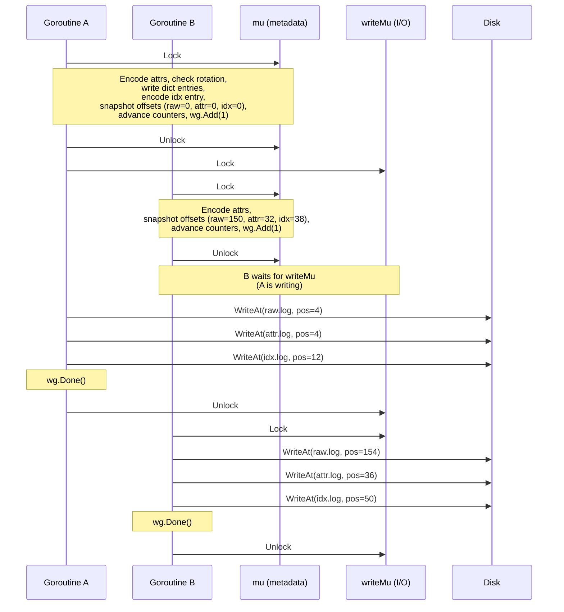

# Chunk Append Pipeline

The chunk manager's `doAppend` method uses a two-phase pipeline to minimize
lock contention during concurrent ingestion. The metadata mutex (`mu`) is
held only for encoding and offset reservation. Disk I/O runs outside `mu`,
serialized by a separate write mutex (`writeMu`) that preserves crash-safety
ordering.

## Overview

```
┌─────────────────────────────────────┐     ┌──────────────────────────────┐
│         Phase 1 (mu held)           │     │   Phase 2 (writeMu held)     │
│                                     │     │                              │
│  1. Check closed / ensure active    │     │  5. WriteAt(raw.log, pos)    │
│  2. EncodeWithDict (attr encoding)  │────▶│  6. WriteAt(attr.log, pos)   │
│  3. Rotation check                  │     │  7. WriteAt(idx.log, pos)    │
│  4. Reserve space (advance offsets) │     │                              │
└─────────────────────────────────────┘     └──────────────────────────────┘
```

Phase 1 is serialized by `mu`. Phase 2 is serialized by `writeMu` (per-chunk)
so that records land on disk in reservation order. The throughput gain comes
from **pipelining**: the next goroutine's Phase 1 (encoding) overlaps with the
current goroutine's Phase 2 (I/O).

## Detailed Flow



The file positions include their respective header sizes:
- `raw.log` and `attr.log`: 4-byte common header
- `idx.log`: 12-byte header (4-byte common + 8-byte createdAt timestamp)

## Offset Reservation

During Phase 1, each writer reads the current offsets, encodes its idx
entry using those values, then advances the counters:

```
Before record 1:  rawOffset=0     attrOffset=0     recordCount=0
After record 1:   rawOffset=150   attrOffset=32    recordCount=1
After record 2:   rawOffset=280   attrOffset=58    recordCount=2
```

The idx entry for each record is fully determined at reservation time — it
encodes the raw and attr offsets where the data will land. The actual
disk write just materializes what was already decided.

## Crash Safety

Phase 2 writes are serialized by `writeMu`, so records always land on disk
in the same order they were reserved. This preserves the original invariant:

> **idx.log is a reliable indicator of the last fully-written record.**

On crash recovery, `openActiveChunk` reads the idx.log file size to compute
the record count, then truncates raw.log and attr.log to match the last idx
entry's offsets. Because writes land in order, there are no gaps — at most
the single in-flight record is lost.

## Seal Safety

Sealing (rotation or explicit `Seal()`) closes the chunk's file handles.
If in-flight Phase 2 writes were still running, those handles would become
invalid. The `chunkState` carries a `sync.WaitGroup` to prevent this:

```mermaid
sequenceDiagram
    participant W as Writer (Phase 2)
    participant S as Seal caller
    participant mu as mu

    Note over W: WriteAt in progress<br/>(holding writeMu)

    S->>mu: Lock
    Note over S,mu: inflight.Wait()<br/>(blocks until Phase 2 completes;<br/>safe because Phase 2 does not hold mu)
    W-->>S: wg.Done()
    Note over S,mu: Set sealed flag in headers,<br/>close files, compute sizes
    S->>mu: Unlock
```

No new Phase 1 can start while seal holds `mu`, so `Wait()` is
guaranteed to complete — the in-flight count can only decrease.

## File Open Modes

The three data files (`raw.log`, `attr.log`, `idx.log`) are opened
**without** `O_APPEND`. This is required because Linux's `pwrite(2)`
ignores the offset when `O_APPEND` is set, despite POSIX requiring
otherwise.

The dict file (`attr_dict.log`) retains `O_APPEND` since its writes
remain sequential under `mu`.

| File          | Create mode        | Reopen mode         | Write method |
|---------------|--------------------|---------------------|--------------|
| raw.log       | `O_CREATE\|O_RDWR` | `O_RDWR`            | `WriteAt`    |
| attr.log      | `O_CREATE\|O_RDWR` | `O_RDWR`            | `WriteAt`    |
| idx.log       | `O_CREATE\|O_RDWR` | `O_RDWR`            | `WriteAt`    |
| attr_dict.log | `O_CREATE\|O_RDWR` | `O_RDWR\|O_APPEND`  | `Write`      |

## Lock Summary

| Lock       | Lives on     | Protects                                          |
|------------|--------------|---------------------------------------------------|
| `mu`       | `Manager`    | Metadata: active state, metas map, dict, offsets   |
| `writeMu`  | `chunkState` | Disk write ordering within a single active chunk   |
| `inflight` | `chunkState` | WaitGroup for seal/close to drain pending writers  |

## What This Does Not Do

This optimization pipelines writes within a single active chunk. For
parallel writes across _multiple_ active chunks (sharded by ingester),
see [gastrolog-268c].
