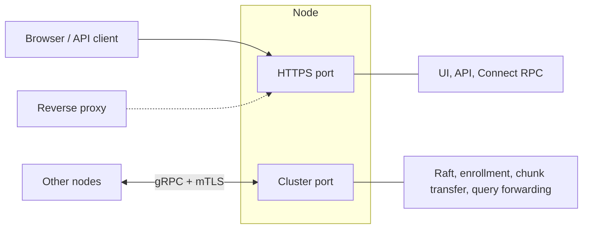
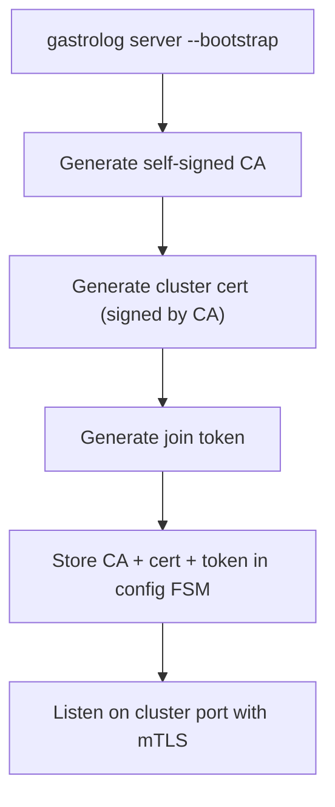
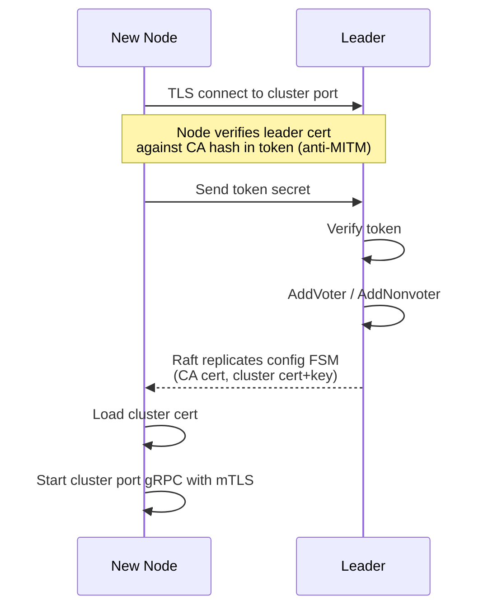
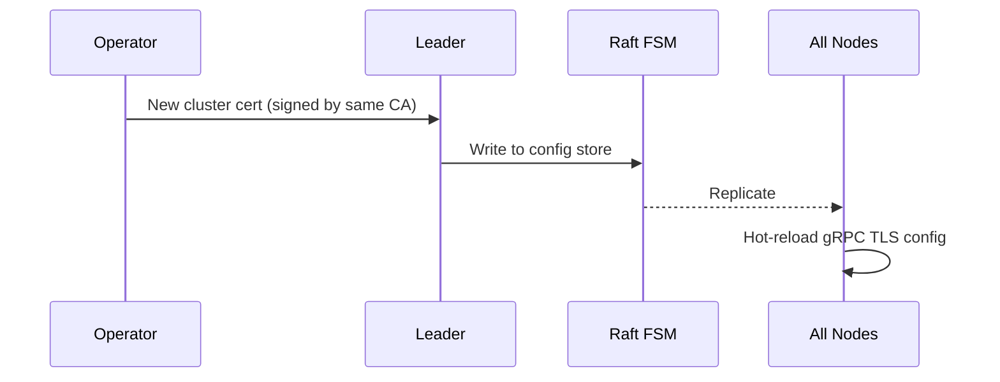
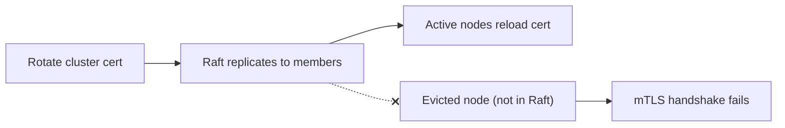

# Cluster Node Enrollment and Certificate Exchange

## Overview

Nodes join a cluster using a one-time token exchange over a dedicated
cluster port. After enrollment, all nodes share the same TLS certificate
for mutual authentication. The certificate is replicated via the Raft
config FSM.

Prior art: K3s bootstrap model.

## Network Architecture

Two ports per node:

| Port | Protocol | Auth | Proxyable |
|------|----------|------|-----------|
| HTTPS | HTTP/2 + TLS | JWT / no-auth | Yes |
| Cluster | gRPC + mTLS | Shared cluster cert | No (end-to-end TLS required) |

The cluster port runs a gRPC server with mTLS. Raft transport uses
Jille/raft-grpc-transport (Raft RPCs as gRPC services). Additional
gRPC services on the same port handle inter-node operations such as
chunk transfer, federated query forwarding, and health checks.

## Cluster Bootstrap (First Node)

First node starts with `--bootstrap`. Generates:

1. **Cluster CA** — self-signed X.509 CA key pair
2. **Cluster cert** — signed by the CA, ExtKeyUsage: ServerAuth + ClientAuth
3. **Join token** — random secret, format: `<secret>:<sha256 of CA cert>`

The CA cert, cluster cert+key, and join token are stored in the
config FSM. The node begins listening on the cluster port with
the cluster cert.

## Node Enrollment

New node starts with `--join-token` and `--join-addr`:

Enrollment is always node → leader. The new node has nothing
to listen with before it receives the cluster cert.

## Join Token Lifecycle

- One reusable cluster token generated at bootstrap
- Optional short-lived tokens via API (single-use or TTL-limited)
- Token is only used during enrollment — the shared cert is the
  ongoing credential

## Certificate Properties

All nodes share the same certificate from the config store.

| Property | Value |
|----------|-------|
| Issuer | Cluster CA (self-signed) |
| Subject | Cluster-specific CN |
| ExtKeyUsage | ServerAuth, ClientAuth |
| Validity | Long-lived (e.g. 10 years), rotatable |

No per-node certificates. No CA signing/issuance capability
beyond the initial bootstrap.

## Certificate Rotation

CA rotation requires a two-phase rollout: distribute the new CA cert
first (so all nodes trust it), then rotate the cluster cert to one
signed by the new CA.

## Node Revocation

Rotate the cluster cert. The evicted node does not receive the
config update (it has been removed from Raft membership) and
can no longer authenticate.

## Constraints and Trade-offs

- **Shared cert** means a compromised node leaks the credential for
  the whole cluster. Acceptable for small clusters. Mitigated by
  cert rotation on eviction.

- **No leader → node enrollment.** The leader cannot initiate a
  connection to a node that has no cert yet.

- **Cluster port must be directly reachable** between nodes. Cannot
  sit behind a TLS-terminating reverse proxy (mTLS requires
  end-to-end TLS).

- The **HTTPS port remains independently configurable** and proxyable.
