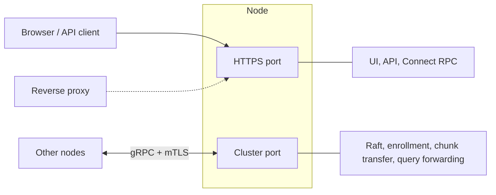
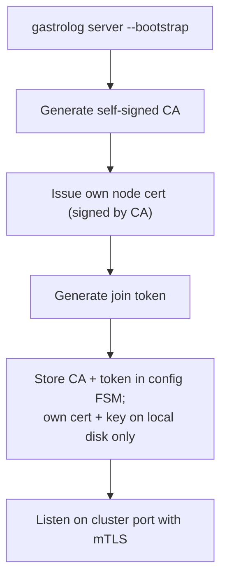
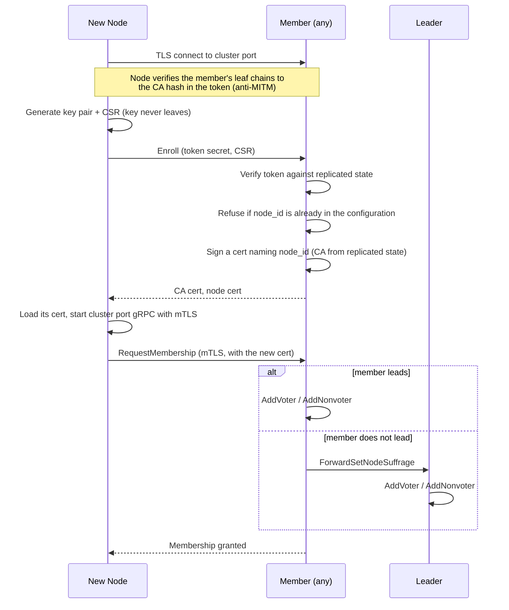
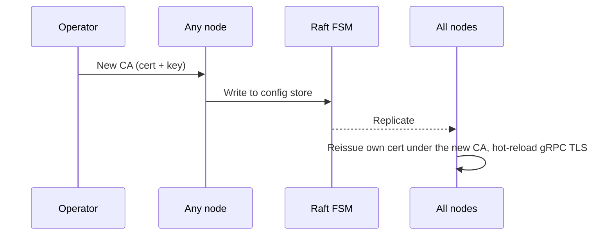
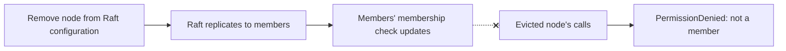

# Cluster Node Enrollment and Certificate Exchange

## Overview

Nodes join a cluster using a one-time token exchange over a dedicated
cluster port. After enrollment, all nodes share the same TLS certificate
for mutual authentication. The certificate is replicated via the Raft
config FSM.

Prior art: K3s bootstrap model.

## Network Architecture

Two ports per node:

```mermaid
flowchart LR
    subgraph Node
        HTTPS["HTTPS port"]
        Cluster["Cluster port"]
    end

    Browser["Browser / API client"] --> HTTPS
    Proxy["Reverse proxy"] -.-> HTTPS
    OtherNode["Other nodes"] <-->|"gRPC + mTLS"| Cluster

    HTTPS --- ui["UI, API, Connect RPC"]
    Cluster --- raft["Raft, enrollment, chunk transfer, query forwarding"]
```

| Port | Protocol | Auth | Proxyable |
|------|----------|------|-----------|
| HTTPS | HTTP/2 + TLS | JWT / no-auth | Yes |
| Cluster | gRPC + mTLS | Per-node cert + membership | No (end-to-end TLS required) |

The cluster port runs a gRPC server with mTLS. Raft transport uses
Jille/raft-grpc-transport (Raft RPCs as gRPC services). Additional
gRPC services on the same port handle inter-node operations such as
chunk transfer, federated query forwarding, and health checks.

## Cluster Bootstrap (First Node)

First node starts with `--bootstrap`. Generates:

1. **Cluster CA** — self-signed X.509 CA key pair
2. **Its own node cert** — signed by that CA, subject CN = its node ID,
   ExtKeyUsage: ServerAuth + ClientAuth
3. **Join token** — random secret, format: `<secret>:<sha256 of CA cert>`

```mermaid
flowchart TD
    Start["gastrolog server --bootstrap"] --> GenCA["Generate self-signed CA"]
    GenCA --> GenCert["Issue own node cert (signed by CA)"]
    GenCert --> GenToken["Generate join token"]
    GenToken --> Store["Store CA + token in config FSM;<br>own cert + key on local disk only"]
    Store --> Listen["Listen on cluster port with mTLS"]
```

The CA (cert and key) and the join token are stored in the config FSM and
replicated to every node, so any member can enrol a joiner and no single node
has to be up for one to join. Node certificates are not replicated: each node
keeps its own key on its own disk.

The node begins listening on the cluster port with the certificate it just
issued itself.

## Node Enrollment

New node starts with `--join-token` and `--join-addr`. The address is any
member's cluster address, not the leader's:

```mermaid
sequenceDiagram
    participant N as New Node
    participant M as Member (any)
    participant L as Leader

    N->>M: TLS connect to cluster port
    Note over N,M: Node verifies the member's leaf chains to<br>the CA hash in the token (anti-MITM)
    N->>N: Generate key pair + CSR (key never leaves)
    N->>M: Enroll (token secret, CSR)
    M->>M: Verify token against replicated state
    M->>M: Refuse if node_id is already in the configuration
    M->>M: Sign a cert naming node_id (CA from replicated state)
    M-->>N: CA cert, node cert
    N->>N: Load its cert, start cluster port gRPC with mTLS
    N->>M: RequestMembership (mTLS, with the new cert)
    alt member leads
        M->>M: AddVoter / AddNonvoter
    else member does not lead
        M->>L: ForwardSetNodeSuffrage
        L->>L: AddVoter / AddNonvoter
    end
    M-->>N: Membership granted
```

Enrollment is always node → member: the new node has nothing to listen with
before it receives its certificate, so the cluster cannot initiate.

Which member is irrelevant. Enrolment answers out of replicated state, which
every node holds, and the membership change is routed to the leader by the
member rather than by the joiner — the same forwarding every other
configuration change already uses. A joiner therefore never discovers, follows,
or is told about leadership, and no single node is the one that has to be up
for a join to succeed.

The two calls are deliberately separate. `Enroll` is authenticated by the token
alone, because the caller has no certificate yet. `RequestMembership` is
authenticated by mTLS with the certificate just issued, so reaching the
configuration takes more than a copy of the token.

The node ID on the request is a request. The member decides what the
certificate says, and refuses to name a node the configuration already has —
otherwise a token holder could be issued the identity of a current member. A
node that genuinely lost its disk is removed and re-added rather than silently
re-issued.

## Join Token Lifecycle

- One reusable cluster token generated at bootstrap
- Optional short-lived tokens via API (single-use or TTL-limited)
- Token is only used during enrollment — the node's own certificate,
  together with its membership, is the ongoing credential

## Certificate Properties

Each node holds its own certificate and its own private key. The key is
generated by the node that uses it and never leaves it.

| Property | Value |
|----------|-------|
| Issuer | Cluster CA (self-signed) |
| Subject | CN = the node's ID |
| ExtKeyUsage | ServerAuth, ClientAuth |
| Validity | Long-lived (e.g. 10 years), rotatable |

## What a Certificate Authorises

A valid signature is necessary and not sufficient. Every call on the cluster
port except `Enroll` requires a certificate, and every call except `Enroll`
and `RequestMembership` additionally requires that the node the certificate
names is in the Raft configuration this node holds.

`RequestMembership` is the single call made with a certificate from outside
the configuration, because it is the call that asks to be put in it.

A node whose local configuration is empty admits any valid certificate. An
empty configuration means the membership is unknown rather than empty — a
node that has just started, or a joiner that has not replicated yet and whose
peers must be able to reach it to deliver the configuration at all.

## Certificate Rotation

What rotates is the CA. A node answers a new CA by issuing itself a
certificate under it: a certificate signed by the previous CA would no longer
chain for peers that have already moved.

```mermaid
sequenceDiagram
    participant Op as Operator
    participant Any as Any node
    participant Raft as Raft FSM
    participant Nodes as All nodes

    Op->>Any: New CA (cert + key)
    Any->>Raft: Write to config store
    Raft-->>Nodes: Replicate
    Nodes->>Nodes: Reissue own cert under the new CA, hot-reload gRPC TLS
```

This is a single-phase swap and therefore disruptive: a node that reloads
before its peers presents a certificate they do not yet trust. A non-disruptive
CA rotation needs a two-phase rollout — distribute the new CA cert so every
node trusts both, then move issuance to it — which is not built.

## Node Revocation

Remove the node from the cluster. Its certificate stays cryptographically
valid and stops being accepted: peers check the node it names against their
own configuration, which no longer lists it.

```mermaid
flowchart LR
    Remove["Remove node from Raft configuration"] --> Replicate["Raft replicates to members"]
    Replicate --> Members["Members' membership check updates"]
    Members -.-x Evicted["Evicted node's calls"]
    Evicted --> Rejected["PermissionDenied: not a member"]
```

No certificate rotation, no CRL, no reissue of the rest of the cluster.

## Constraints and Trade-offs

- **The CA private key is on every node.** It has to be: enrolment is served
  by whichever member a joiner reaches, so every member must be able to issue.
  The consequence is explicit — this PKI cannot contain a compromised node,
  because a compromised node can mint any identity. What it does give is
  attribution (a certificate names one node), revocation (removal takes
  effect immediately, cluster-wide, with nothing to reissue), and a join
  token that buys one identity rather than the cluster's private key.

- **No cluster → node enrollment.** No member can initiate a connection to a
  node that has no cert yet, so enrolment is always joiner-initiated.

- **Cluster port must be directly reachable** between nodes. Cannot
  sit behind a TLS-terminating reverse proxy (mTLS requires
  end-to-end TLS).

- The **HTTPS port remains independently configurable** and proxyable.
