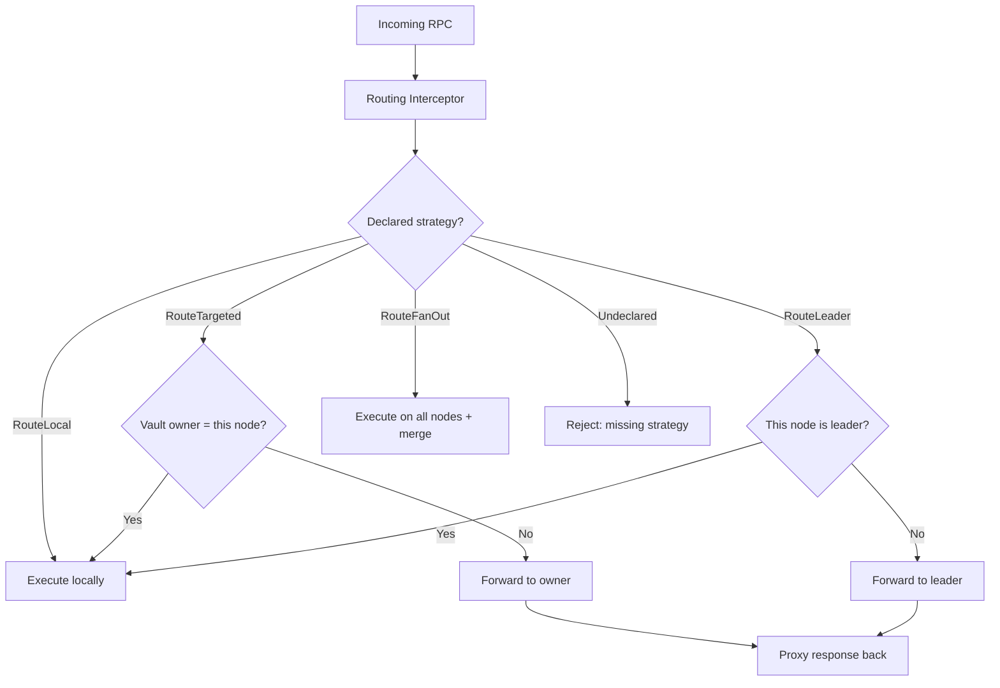
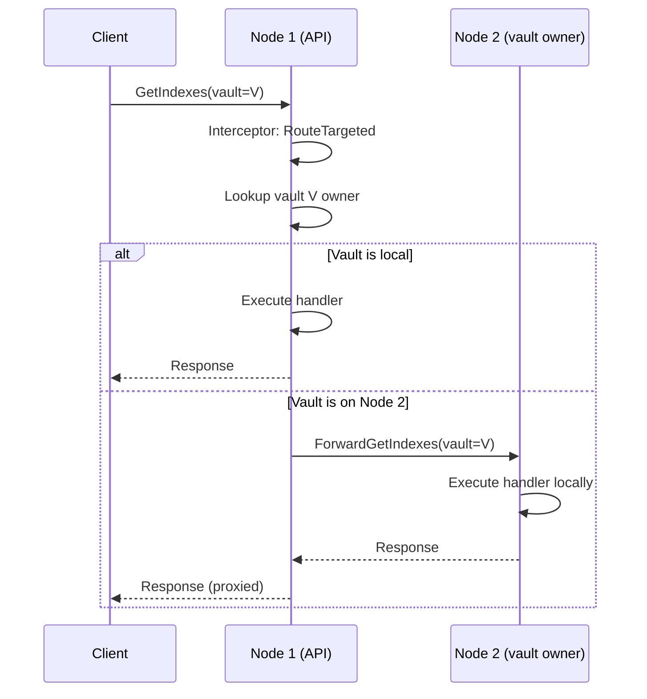
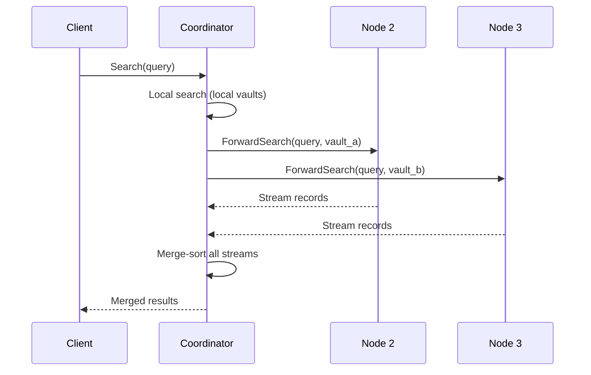
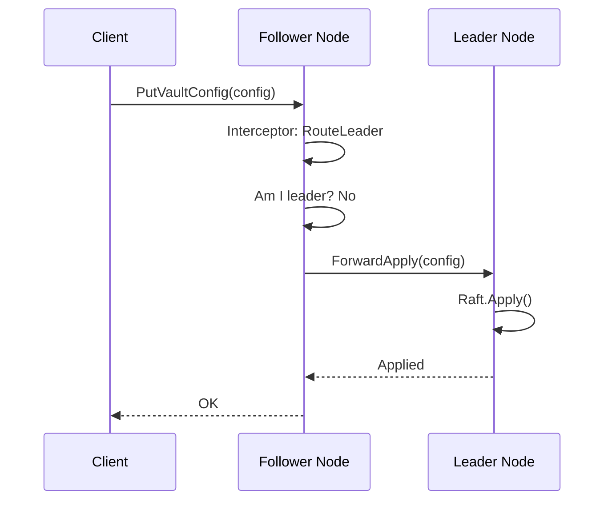
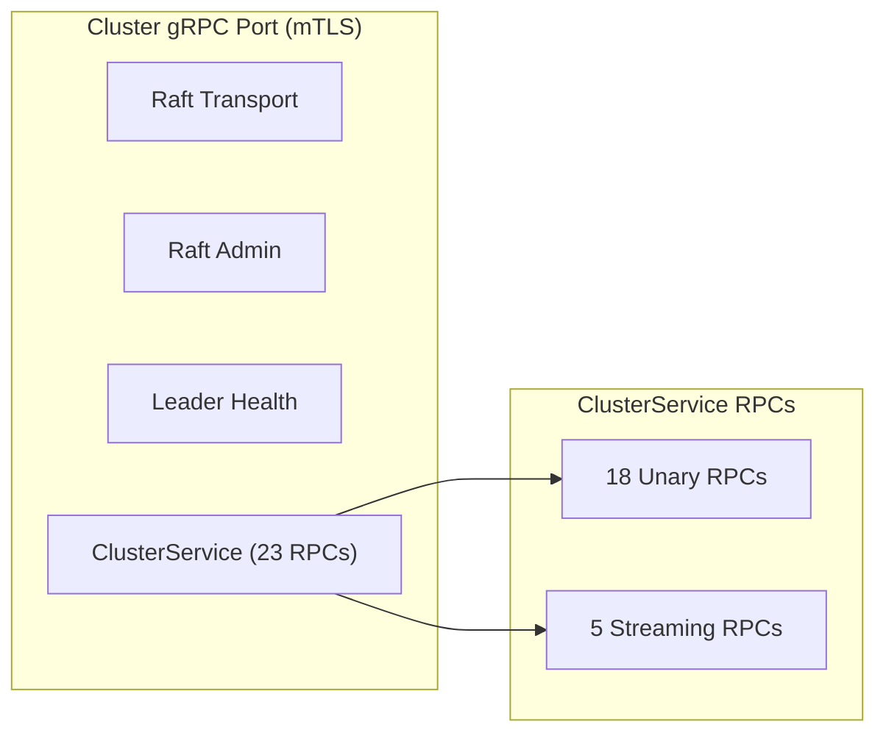
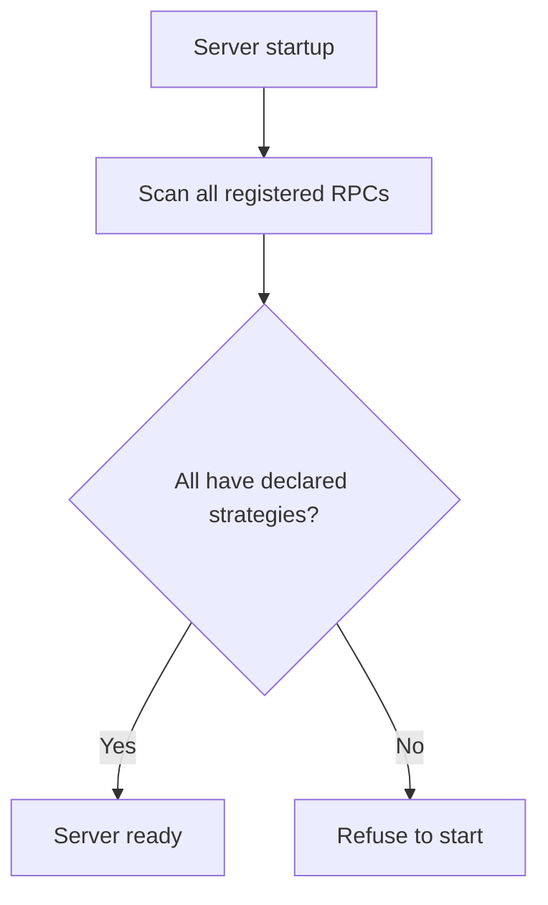

# Cluster Request Routing

How requests are routed between nodes in a GastroLog cluster. Every node
can serve any request. The routing layer determines which node should
handle it and forwards transparently.

## Routing Strategies

Every RPC handler declares one of four routing strategies:

| Strategy | When to use | Example RPCs |
|----------|------------|-------------|
| **RouteLocal** | Any node can serve from local state (Raft-replicated config, peer broadcasts) | Health, WatchConfig, ListVaults, GetClusterStatus |
| **RouteTargeted** | Request is about a specific vault owned by one node | GetIndexes, ListChunks, SealVault, GetContext |
| **RouteFanOut** | Needs data from all nodes, merged at the coordinator | Search, GetFields, ComputeHistogram |
| **RouteLeader** | Must be applied through Raft consensus | PutVaultConfig, PutIngesterConfig, ForwardApply |

## Request Flow

### RouteTargeted (most common)

The client always talks to one node. Forwarding is invisible.

### RouteFanOut

Fan-out RPCs are always streaming. The coordinator merges results from
all nodes before sending to the client. The merge logic is
handler-specific (timestamp-ordered for search, union for fields).

### RouteLeader

Config mutations must go through Raft. If the receiving node is not the
leader, the interceptor forwards to the current leader automatically.

## Cluster Communication Channels

All inter-node communication runs over a single gRPC server per node
(cluster port, mTLS):

### Unary RPCs (request-response)

| Category | RPCs |
|----------|------|
| Config | ForwardApply |
| Enrollment | Enroll (mTLS-exempt) |
| Stats | Broadcast |
| Ingestion | ForwardRecords |
| Inspector | ForwardListChunks, ForwardGetIndexes, ForwardGetChunk, ForwardAnalyzeChunk, ForwardValidateVault |
| Operations | ForwardSealVault, ForwardReindexVault, ForwardExportToVault |
| Context | ForwardGetContext |
| Membership | NotifyEviction, ForwardRemoveNode, ForwardSetNodeSuffrage |
| Files | ListPeerManagedFiles |

### Streaming RPCs

| RPC | Pattern | Purpose |
|-----|---------|---------|
| ForwardSearch | server-streaming | Search results from remote vaults |
| ForwardFollow | server-streaming | Live tail from remote vaults |
| ForwardImportRecords | client-streaming | Sealed chunk transfer |
| StreamForwardRecords | client-streaming | Bulk record ingestion (128 MB max) |
| PullManagedFile | server-streaming | File transfer between peers |

Streaming RPCs cannot be routed through a generic envelope because
their data flow is fundamentally different from request-response.

## Interceptor Enforcement

The routing interceptor provides two guarantees:

1. **Every RPC must declare a strategy.** Undeclared RPCs are rejected
   at startup. This prevents the "forgot to add routing" class of bugs.

2. **Targeted RPCs always reach the correct node.** The handler code
   never checks vault ownership — the interceptor handles it. If the
   vault is local, the handler runs. If remote, the request is
   forwarded and the response proxied back. The handler doesn't know
   the difference.

## What This Does Not Cover

- **Client-side routing optimization.** The infrastructure routes
  correctly regardless of which node the client connects to. If the
  client happens to connect to the wrong node, there is one extra hop.
  Optimizing client-to-node affinity is a separate concern.

- **Load balancing.** For RouteLocal RPCs, the interceptor could route
  to the least loaded node using PeerState broadcast stats. This is a
  future optimization, not a correctness requirement.
