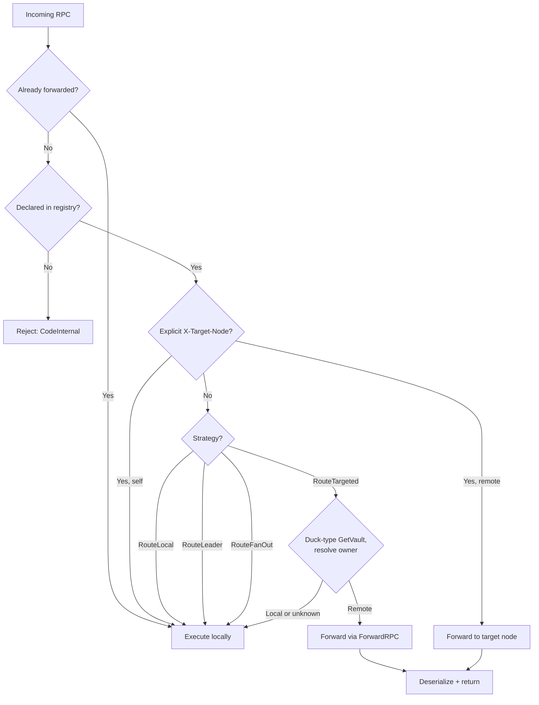
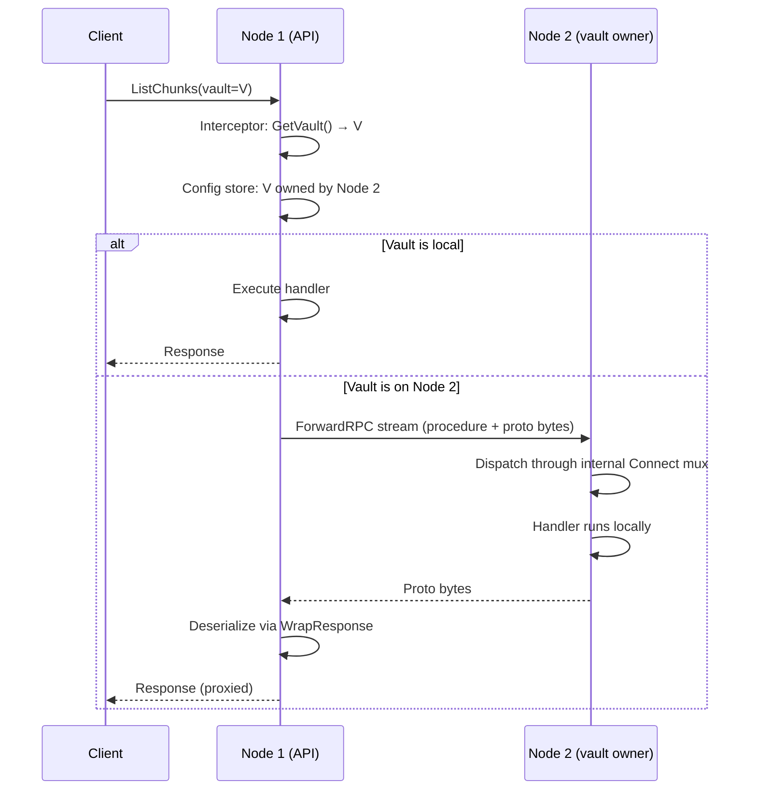
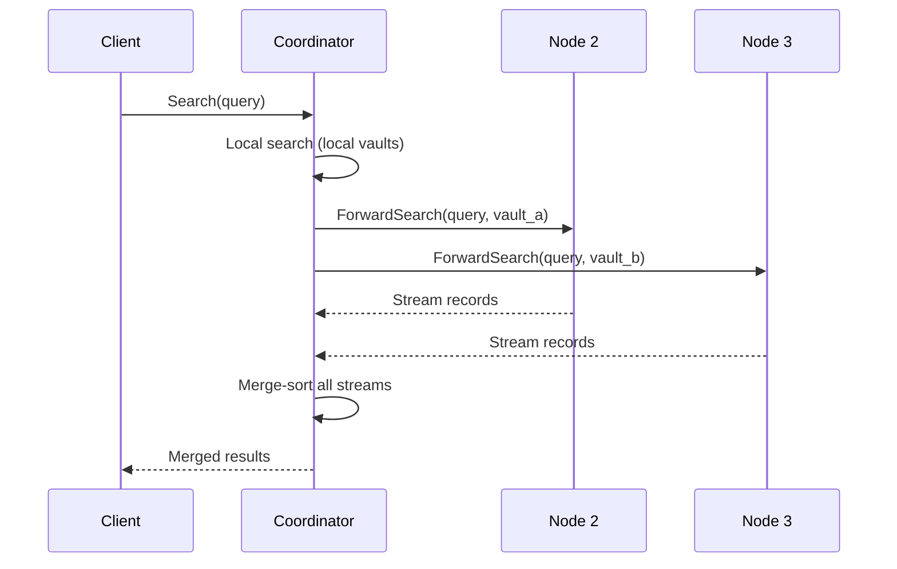

# Cluster Request Routing

How requests are routed between nodes in a GastroLog cluster. Every node
can serve any request. The routing layer determines which node should
handle it and forwards transparently.

## Routing Strategies

Every RPC is classified in `routing/routes.go` with one of four strategies.
The coverage test (`TestAllProceduresDeclared`) parses the generated
`*.connect.go` files and verifies every procedure constant appears in the
registry — adding a new RPC without classifying it fails the test.



| Strategy | Count | Interceptor action | Example RPCs |
|----------|------:|-------------------|-------------|
| **RouteLocal** | 39 | Pass through | Health, GetConfig, ListVaults, GetStats, WatchConfig |
| **RouteLeader** | 30 | Pass through (Raft Apply handles leader-forwarding) | PutVault, PutIngester, PutSettings, DeleteVault |
| **RouteTargeted** | 11 | Auto-forward to vault owner via ForwardRPC | ListChunks, GetIndexes, SealVault, ValidateVault |
| **RouteFanOut** | 6 | Pass through (handler fans out) | Search, Follow, Explain, GetContext, GetFields |

## How Forwarding Works

### RouteTargeted — interceptor auto-routing

The interceptor duck-types `GetVault()` on the request proto to extract
the vault ID, then looks up the owning node from the config store. If the
vault is on another node, it serializes the request, sends it via the
generic `ForwardRPC` gRPC stream, and deserializes the response.



The client always talks to one node. Forwarding is invisible.

### ForwardRPC — the generic dispatch mechanism

`ForwardRPC` is a single bidirectional gRPC stream on the cluster port
that replaces per-RPC `Forward*` handlers for unary RPCs. One
`ForwardRPCFrame` message carries any procedure:

```
ForwardRPCFrame {
  procedure: "/gastrolog.v1.VaultService/ListChunks"
  payload:   <serialized ListChunksRequest>
}
```

On the receiving node, the handler dispatches through the **internal
Connect mux** — the same mux used by the unix socket, with
`NoAuthInterceptor` (mTLS already verified the peer) and no routing
interceptor (prevents forwarding loops).

The dispatch is an in-process HTTP call:
1. Build `http.Request` with procedure as URL path, raw proto as body
2. Set `Content-Type: application/proto` and `Connect-Protocol-Version: 1`
3. Call `internalHandler.ServeHTTP(recorder, request)`
4. Read the raw proto response body, send back as `ForwardRPCFrame`

The response flows back through the interceptor, which deserializes it
using a type-safe `WrapResponse` function (generic over the response
proto type via `NewRespWrapper[T]`).

### RouteFanOut — handler-managed



Fan-out RPCs use dedicated streaming `Forward*` handlers (not
ForwardRPC) because their data flow is fundamentally different — the
handler manages parallel streams, merge logic, and backpressure.

### RouteLeader — Raft handles it

The interceptor passes RouteLeader RPCs through without action. The
handler calls `cfgStore.Apply()` which internally forwards to the Raft
leader via `ForwardApply` if the current node isn't the leader.

## Two Muxes

```
Client-facing mux:  auth interceptor → routing interceptor → handler
Internal mux:       NoAuthInterceptor → handler  (no routing interceptor)
```

The internal mux is used by:
- **ForwardRPC** handler (cluster gRPC port) — dispatches forwarded requests
- **Unix socket** listener — local CLI access without auth

The routing interceptor is only on the client-facing mux. This prevents
forwarding loops: a ForwardRPC dispatch on the receiving node goes
through the internal mux, which has no routing interceptor, so the
handler always executes locally.

## Cluster Communication Channels

All inter-node communication runs over a single gRPC server per node
(cluster port, mTLS):

### Legacy per-RPC handlers (cluster/forward.go)

| Category | RPCs |
|----------|------|
| Config | ForwardApply |
| Enrollment | Enroll (mTLS-exempt) |
| Stats | Broadcast |
| Ingestion | ForwardRecords |
| Inspector | ForwardListChunks, ForwardGetIndexes, ForwardGetChunk, ForwardAnalyzeChunk, ForwardValidateVault |
| Operations | ForwardSealVault, ForwardReindexVault, ForwardExportToVault |
| Context | ForwardGetContext, ForwardExplain |
| Membership | NotifyEviction, ForwardRemoveNode, ForwardSetNodeSuffrage |
| Files | ListPeerManagedFiles |
| Streaming | ForwardSearch, ForwardFollow, ForwardImportRecords, StreamForwardRecords, PullManagedFile |

### Generic handler (cluster/forward_rpc.go)

| RPC | Pattern | Purpose |
|-----|---------|---------|
| ForwardRPC | bidirectional | Forward any unary RPC to any node |

ForwardRPC coexists with the legacy per-RPC handlers. RouteTargeted
unary RPCs are routed via the interceptor → ForwardRPC. Streaming RPCs
and RouteFanOut still use the dedicated per-RPC handlers.

## Context Helpers

Routing intent is transport-agnostic, carried in `context.Context`:

```go
ctx = routing.WithTargetNode(ctx, "data-1")   // explicit targeting
ctx = routing.WithForwarded(ctx)               // mark as forwarded (loop prevention)
```

The interceptor also reads `X-Target-Node` from HTTP request headers,
so any transport (browser, CLI, unix socket) can target a specific node.

## What This Does Not Cover

- **Client-side routing optimization.** The infrastructure routes
  correctly regardless of which node the client connects to. If the
  client happens to connect to the wrong node, there is one extra hop.

- **Load balancing.** For RouteLocal RPCs, the interceptor could route
  to the least loaded node. This is a future optimization.

- **Streaming RouteTargeted.** ExportVault is the only streaming
  RouteTargeted RPC. It uses handler-level routing because the
  interceptor can't generically receive typed messages from
  `StreamingHandlerConn`.
