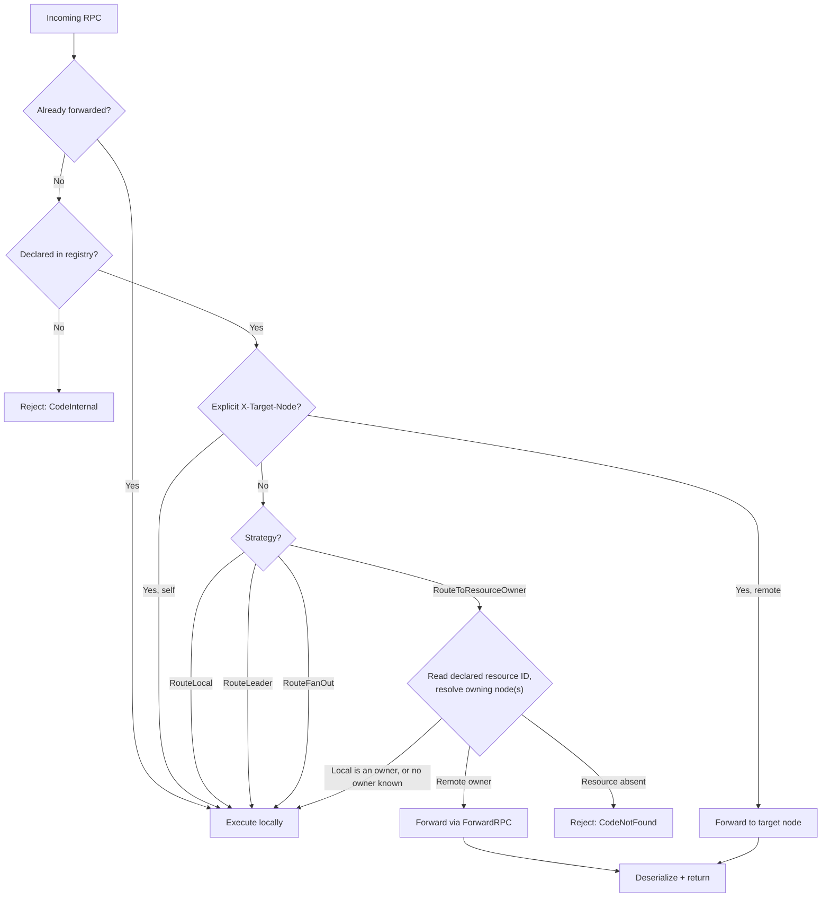
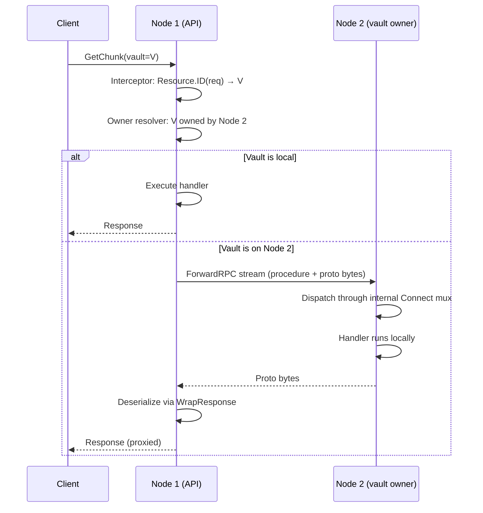
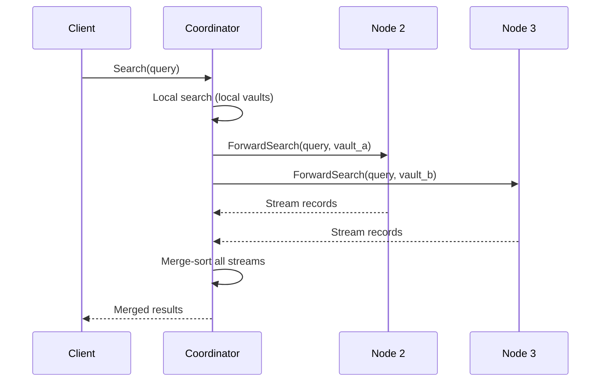

# Cluster Request Routing

How requests are routed between nodes in a GastroLog cluster. Every node
can serve any request. The routing layer determines which node should
handle it and forwards transparently.

## Routing Strategies

Every RPC is classified in `routing/routes.go` with one of four strategies.
The coverage test (`TestAllProceduresDeclared`) parses the generated
`*.connect.go` files and verifies every procedure constant appears in the
registry — adding a new RPC without classifying it fails the test.


```mermaid
flowchart TD
    Request["Incoming RPC"] --> Forwarded{"Already forwarded?"}
    Forwarded -->|Yes| Local["Execute locally"]
    Forwarded -->|No| Declared{"Declared in registry?"}

    Declared -->|No| Reject["Reject: CodeInternal"]
    Declared -->|Yes| Target{"Explicit X-Target-Node?"}

    Target -->|Yes, remote| ForwardExplicit["Forward to target node"]
    Target -->|Yes, self| Local
    Target -->|No| CheckStrategy{"Strategy?"}

    CheckStrategy -->|RouteLocal| Local
    CheckStrategy -->|RouteLeader| Local
    CheckStrategy -->|RouteFanOut| Local
    CheckStrategy -->|RouteToResourceOwner| FindOwner{"Read declared resource ID,<br/>resolve owning node(s)"}

    FindOwner -->|"Resource absent"| NotFound["Reject: CodeNotFound"]
    FindOwner -->|"Local is an owner, or no owner known"| Local
    FindOwner -->|Remote owner| Forward["Forward via ForwardRPC"]
    Forward --> ProxyBack["Deserialize + return"]
    ForwardExplicit --> ProxyBack
```

| Strategy | Interceptor action | Example RPCs |
|----------|-------------------|-------------|
| **RouteLocal** | Pass through | Health, GetSystem, ListVaults, GetStats, WatchSystem, ValidateExpression |
| **RouteLeader** | Pass through (Raft Apply handles leader-forwarding) | PutVault, PutIngester, PutRoute, PutServiceSettings, PutLookupSettings, DeleteVault |
| **RouteToResourceOwner** | Resolve the resource's owning node(s), auto-forward via ForwardRPC | SealVault, ReindexVault, ValidateVault, GetChunk, TriggerIngester |
| **RouteFanOut** | Pass through (handler fans out) | Search, Follow, Explain, GetContext, GetFields |

`TestStrategyDistribution` pins the per-strategy counts, so adding an RPC
forces an explicit classification decision rather than a silent default.

## How Forwarding Works

### RouteToResourceOwner — interceptor auto-routing

This is the strategy for **imperative actions on a specific resource**:
seal a vault, reindex it, trigger an ingester. They are not config
mutations, so they must NOT be tunnelled through `RouteLeader` and a Raft
round-trip just to reach the right node — the interceptor delivers them
directly (gastrolog-51ge9).

Each such procedure declares, in `routing/routes.go`, **which resource it
targets** and **how to read that resource's ID out of its request**:

```go
gastrologv1connect.VaultServiceSealVaultProcedure: {
    Strategy:     RouteToResourceOwner,
    Resource:     OwnerOf(ResourceVault, (*apiv1.SealVaultRequest).GetVault),
    WrapResponse: NewRespWrapper[apiv1.SealVaultResponse](),
},
```

The declaration is per-procedure and compile-checked (`OwnerOf` is generic
over the request type) rather than duck-typed at runtime: proto messages
carry many differently-scoped `id` fields, and guessing between them
silently misroutes requests.

Each `ResourceKind` has one registered `OwnerResolver`
(`server.ownerResolvers`), which answers from **replicated cluster state**
only — never node-local knowledge, so every node gives the same answer:

| Resource kind | Owner is | Read from |
|---------------|----------|-----------|
| `ResourceVault` | the vault leader | `VaultConfig.Placements` + node storage configs |
| `ResourceIngester` | every node running the ingester | the Raft-replicated ingester alive map |

`ResolveOwners` returns a **set** of nodes in deterministic order —
ownership is genuinely plural (a parallel ingester runs on every eligible
node; ingester HA extends this), and resolvers that can only produce one
owner return a one-element slice. The interceptor prefers the local node
when it is an owner (no hop), otherwise takes the first, so every node
picks the same target.

Resolver outcomes:

- **owners returned** — forward to one of them (or run locally).
- **`ErrResourceNotFound`** — the resource positively does not exist;
  the caller gets `CodeNotFound` from the receiving node instead of an
  arbitrary node running the handler and reporting a locally-flavored
  error. Any other resolver error becomes `CodeFailedPrecondition`.
- **no owner, no error** — no routing decision available (unparseable ID,
  ownership not yet reported). The request executes locally and the
  handler produces its own domain error.

Adding a new resource kind is one resolver plus one `OwnerResolvers`
entry; the interceptor does not change.


```mermaid
sequenceDiagram
    participant Client
    participant Node1 as Node 1 (API)
    participant Node2 as Node 2 (vault owner)

    Client->>Node1: GetChunk(vault=V)
    Node1->>Node1: Interceptor: Resource.ID(req) → V
    Node1->>Node1: Owner resolver: V owned by Node 2
    alt Vault is local
        Node1->>Node1: Execute handler
        Node1-->>Client: Response
    else Vault is on Node 2
        Node1->>Node2: ForwardRPC stream (procedure + proto bytes)
        Node2->>Node2: Dispatch through internal Connect mux
        Node2->>Node2: Handler runs locally
        Node2-->>Node1: Proto bytes
        Node1->>Node1: Deserialize via WrapResponse
        Node1-->>Client: Response (proxied)
    end
```

The client always talks to one node. Forwarding is invisible.

### ForwardRPC — the generic dispatch mechanism

`ForwardRPC` is a single bidirectional gRPC stream on the cluster port
that replaces per-RPC `Forward*` handlers for unary RPCs. One
`ForwardRPCFrame` message carries any procedure:

```
ForwardRPCFrame {
  procedure: "/gastrolog.v1.VaultService/GetChunk"
  payload:   <serialized GetChunkRequest>
}
```

On the receiving node, the handler dispatches through the **internal
Connect mux** — the same mux used by the unix socket, with
`NoAuthInterceptor` (mTLS already verified the peer) and no routing
interceptor (prevents forwarding loops).

The dispatch is an in-process HTTP call:
1. Build `http.Request` with procedure as URL path, raw proto as body
2. Set `Content-Type: application/proto` and `Connect-Protocol-Version: 1`
3. Call `internalHandler.ServeHTTP(recorder, request)`
4. Read the raw proto response body, send back as `ForwardRPCFrame`

The response flows back through the interceptor, which deserializes it
using a type-safe `WrapResponse` function (generic over the response
proto type via `NewRespWrapper[T]`).

### RouteFanOut — handler-managed


```mermaid
sequenceDiagram
    participant Client
    participant Coord as Coordinator
    participant N2 as Node 2
    participant N3 as Node 3

    Client->>Coord: Search(query)
    Coord->>Coord: Local search (local vaults)
    Coord->>N2: ForwardSearch(query, vault_a)
    Coord->>N3: ForwardSearch(query, vault_b)
    N2-->>Coord: Stream records
    N3-->>Coord: Stream records
    Coord->>Coord: Merge-sort all streams
    Coord-->>Client: Merged results
```

Fan-out RPCs use dedicated streaming `Forward*` handlers (not
ForwardRPC) because their data flow is fundamentally different — the
handler manages parallel streams, merge logic, and backpressure.

### RouteLeader — Raft handles it

The interceptor passes RouteLeader RPCs through without action. The
handler calls `cfgStore.Apply()` which internally forwards to the Raft
leader via `ForwardApply` if the current node isn't the leader.

## Two Muxes

```
Client-facing mux:  auth interceptor → routing interceptor → handler
Internal mux:       NoAuthInterceptor → handler  (no routing interceptor)
```

The internal mux is used by:
- **ForwardRPC** handler (cluster gRPC port) — dispatches forwarded requests
- **Unix socket** listener — local CLI access without auth

The routing interceptor is only on the client-facing mux. This prevents
forwarding loops: a ForwardRPC dispatch on the receiving node goes
through the internal mux, which has no routing interceptor, so the
handler always executes locally.

## Cluster Communication Channels

All inter-node communication runs over a single gRPC server per node
(cluster port, mTLS):

### Legacy per-RPC handlers (cluster/forward.go)

| Category | RPCs |
|----------|------|
| Config | ForwardApply |
| Enrollment | Enroll (mTLS-exempt) |
| Stats | Broadcast |
| Ingestion | ForwardRecords |
| Inspector | ForwardListChunks, ForwardGetIndexes, ForwardGetChunk, ForwardAnalyzeChunk, ForwardValidateVault |
| Operations | ForwardSealVault, ForwardReindexVault, ForwardExportToVault |
| Context | ForwardGetContext, ForwardExplain |
| Membership | NotifyEviction, ForwardRemoveNode, ForwardSetNodeSuffrage |
| Files | ListPeerManagedFiles |
| Streaming | ForwardSearch, ForwardFollow, ForwardImportRecords, StreamForwardRecords, PullManagedFile |

### Generic handler (cluster/forward_rpc.go)

| RPC | Pattern | Purpose |
|-----|---------|---------|
| ForwardRPC | bidirectional | Forward any unary RPC to any node |

ForwardRPC coexists with the legacy per-RPC handlers.
RouteToResourceOwner unary RPCs are routed via the interceptor →
ForwardRPC. Streaming RPCs and RouteFanOut still use the dedicated
per-RPC handlers.

## Context Helpers

Routing intent is transport-agnostic, carried in `context.Context`:

```go
ctx = routing.WithTargetNode(ctx, "data-1")   // explicit targeting
ctx = routing.WithForwarded(ctx)               // mark as forwarded (loop prevention)
```

The interceptor also reads `X-Target-Node` from HTTP request headers,
so any transport (browser, CLI, unix socket) can target a specific node.
This is an operator/debug escape hatch, not the normal path: clients do
NOT resolve ownership. The UI sends no `X-Target-Node` — the backend
answers "which node owns this" from replicated state.

## What This Does Not Cover

- **Client-side routing optimization.** The infrastructure routes
  correctly regardless of which node the client connects to. If the
  client happens to connect to the wrong node, there is one extra hop.

- **Load balancing.** For RouteLocal RPCs, the interceptor could route
  to the least loaded node. This is a future optimization.

- **Streaming RouteToResourceOwner.** ExportVault is the only streaming
  owner-routed RPC. It uses handler-level routing because the
  interceptor can't generically receive typed messages from
  `StreamingHandlerConn`.

- **Multi-owner fan-out.** When a resource has several owners the
  interceptor picks one. An action that must reach *all* owners is a
  RouteFanOut concern (it needs per-RPC merge semantics); no such RPC
  exists yet.
