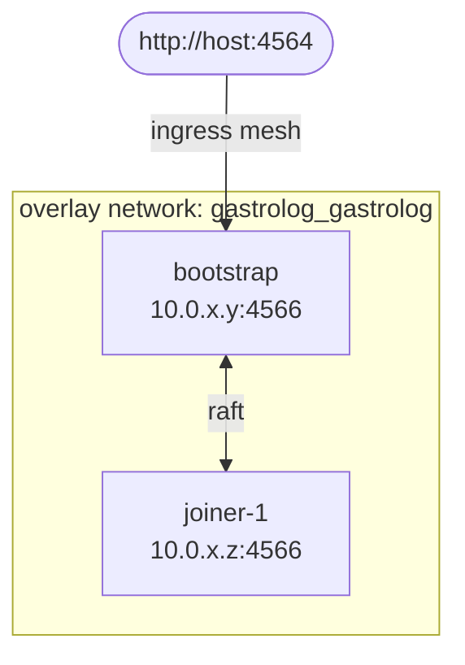

# Docker Swarm

Run GastroLog across a Docker Swarm cluster. The Swarm path is
sometimes the right answer for operators who want orchestration
features (overlay networks, first-class secrets, replicated
services, rolling updates) without the operational overhead of
Kubernetes.

## Prerequisites

- A Docker Swarm. For local testing, `docker swarm init` on a
  single host is fine. For production, a Swarm with at least 3
  manager nodes is recommended for HA.
- The `gastrolog` image available on every node in the Swarm —
  either by pulling from a registry or by tagging locally on each
  node.

## Quick start (single-node Swarm)

```sh
docker swarm init   # if not already in a Swarm

# Create the admin credentials secret (replace with your password):
echo '{"username": "admin", "password": "change-me-please"}' \
  | docker secret create gastrolog_admin_creds -

cd deploy
docker stack deploy -c stack.yml gastrolog
open http://localhost:4564             # admin / change-me-please
```

To tear down:

```sh
docker stack rm gastrolog
docker secret rm gastrolog_admin_creds   # optional — keep if you want to reuse
docker volume ls -q | grep ^gastrolog_ | xargs docker volume rm
```

## What's in the recipe

The stack file
([`deploy/stack.yml`](../../deploy/stack.yml)) defines two
services — `bootstrap` and `joiner-1` — plus an overlay network
and named volumes. Both services share a single Swarm `secret`
for admin credentials, mounted at `/run/secrets/admin_creds`.

### Architecture



The bootstrap service is `replicas: 1`. Joiners are separate
service blocks (`joiner-1`, copy-paste for `joiner-2`, etc.) —
not `replicas: N` on a single service, because Swarm's default
node-local volumes mean replicas of one service that schedule on
the same node share `/config` and `/vaults`, which is fatal for
Raft. (See "Scaling" below.)

### How the cluster forms

1. Bootstrap starts. Its entrypoint sees `GASTROLOG_CLUSTER_ADDR=auto`
   and resolves the container's own hostname (`hostname -i`) to
   its overlay IP (e.g. `10.0.1.6`). Binds the cluster gRPC server
   to that IP on port 4566 and advertises the same address.
2. Bootstrap generates the cluster TLS material and a join token,
   writes the token to `/shared/token` (the `cluster-token`
   volume) with mode 0600, and reads
   `/run/secrets/admin_creds` to provision the initial admin user.
3. Joiner-1 starts. Auto-resolves its own overlay IP for
   `GASTROLOG_CLUSTER_ADDR`. Polls `/shared/token` (same volume
   on the same node) until the file appears.
4. Joiner-1 enrolls with bootstrap via
   `GASTROLOG_JOIN_ADDR=tasks.gastrolog_bootstrap:4566`. The
   `tasks.<service>` DNS resolves on the overlay network to the
   bootstrap's task IP — works because by the time the joiner
   reaches this step, the bootstrap is healthy and registered.
5. Joiner-1 receives TLS material via the enroll RPC, joins the
   Raft cluster, settles as `FOLLOWER` / `VOTER`.

### Why `auto` instead of an explicit address?

In Docker Swarm overlay networking, three name forms exist for a
service:

- **`<service>`** (e.g. `gastrolog_bootstrap`) — VIP for the routing
  mesh. Reachable from peers, but **no container can bind to
  it** (the VIP isn't an interface address on any container).
- **`tasks.<service>`** — round-robin DNS of all task IPs. Bindable
  + reachable, but only registers in the overlay's DNS once at
  least one task is healthy. The bootstrap can't bind to a name
  that doesn't yet resolve.
- **The container's overlay IP directly** — bindable locally and
  routable from peers without any DNS. This is what `auto`
  resolves to via `hostname -i`.

So `auto` is the right primitive on Swarm. Setting an explicit
service-name address would either fail at bind time (VIP) or
race with DNS registration (`tasks.<service>`).

For `--join-addr` (which the joiner only consults *after* the
bootstrap is up), `tasks.gastrolog_bootstrap` does work — by
the time the joiner gets there, the bootstrap has been healthy
long enough for DNS to register.

### Why a Swarm secret instead of an env var?

`GASTROLOG_INITIAL_ADMIN_PASSWORD` would also work and is simpler,
but env vars are visible to anyone with `docker service inspect`
permission. A Swarm `secret` is mounted as a file at
`/run/secrets/<name>` with mode 0400, owned by root, and isn't
exposed via `inspect`. The image's entrypoint accepts both —
this recipe uses the secret because it's the right Swarm idiom.

## Scaling

### Single-node Swarm

Duplicate the `joiner-1` service block to add `joiner-2`,
`joiner-3`, etc. Each needs its own `*-config` and `*-vaults`
volumes. Make sure each gets a distinct hostname (or rely on
Swarm's auto-generated `<stack>_<service>.<slot>` names).

### Multi-node Swarm

The cleanest pattern is one `replicas: N` joiner service spread
across nodes, with a node-label-based placement:

```yaml
services:
  joiner:
    deploy:
      replicas: 3
      placement:
        constraints:
          - node.labels.gastrolog == joiner
        preferences:
          - spread: node.id
```

Then label nodes with `docker node update --label-add gastrolog=joiner <node>`.
Each replica lands on a different node and gets a node-local
volume by default — no volume sharing between Raft instances.

For multi-node Swarm, also set
`placement.constraints: [node.role == manager]` on the bootstrap
service so it stays on a stable manager and doesn't migrate
across hosts (which would lose its volume).

## Verify

```sh
# Service status:
docker stack services gastrolog
# NAME                  REPLICAS   IMAGE            PORTS
# gastrolog_bootstrap   1/1        gastrolog:test   *:4564->4564/tcp
# gastrolog_joiner-1    1/1        gastrolog:test

# /readyz:
curl -s -o /dev/null -w "%{http_code}\n" http://localhost:4564/readyz   # → 200

# Cluster topology:
B=$(docker ps --filter label=com.docker.swarm.service.name=gastrolog_bootstrap --format '{{.ID}}' | head -1)
docker exec "$B" /gastrolog --home /config cluster status

# Login:
curl -s -X POST -H "Content-Type: application/json" \
  http://localhost:4564/gastrolog.v1.AuthService/Login \
  -d '{"username":"admin","password":"change-me-please"}'
```

## Production caveats

- **Admin secret**: rotate after first use. Pipe the new value
  into `docker secret create`, redeploy the stack, the entrypoint
  re-reads the secret. (Note: Gastrolog's idempotency means the
  rotated secret is a no-op for the existing admin user — change
  the password through the UI/API instead. The secret only seeds
  the *initial* user.)
- **TLS termination**: this stack publishes 4564 in plaintext.
  For external access, put a TLS-terminating reverse proxy in
  front (Traefik integrates cleanly with Swarm via the `traefik`
  Docker provider).
- **Backups**: Swarm volumes follow the manager node where the
  bootstrap service runs. Snapshot the underlying host volume,
  or use `docker run --rm -v gastrolog_bootstrap-config:/data
  alpine tar -cz -f - /data` style backups.
- **Image updates**: `docker stack deploy` performs rolling updates
  per the `update_config` block. The bootstrap service has
  `order: start-first` so a new task is healthy before the old
  one is killed; joiners use the default which is fine because
  they can survive bootstrap downtime via Raft.

## Troubleshooting

### Bootstrap stuck in "still waiting for cluster quorum"

This usually means stale Raft state in the `bootstrap-config`
volume from a previous broken run that registered phantom
voters. Hard reset:

```sh
docker stack rm gastrolog
# Wait for containers to fully terminate (a few seconds):
docker ps -a --filter label=com.docker.stack.namespace=gastrolog
docker volume ls -q | grep ^gastrolog_ | xargs docker volume rm
docker stack deploy -c stack.yml gastrolog
```

### Joiner fails with "name resolver error: produced zero addresses"

The joiner is trying to enroll with bootstrap before the
bootstrap's task DNS is registered on the overlay. The recipe's
`depends_on: bootstrap` should usually prevent this; if it
happens anyway, restart the joiner service:

```sh
docker service update --force gastrolog_joiner-1
```

### `gastrolog_admin_creds` already exists

Swarm secrets are immutable. To rotate, remove and recreate:

```sh
docker secret rm gastrolog_admin_creds
echo '{"username":"admin","password":"new-password"}' \
  | docker secret create gastrolog_admin_creds -
docker service update --force --secret-rm gastrolog_admin_creds \
  --secret-add source=gastrolog_admin_creds,target=admin_creds \
  gastrolog_bootstrap gastrolog_joiner-1
```
