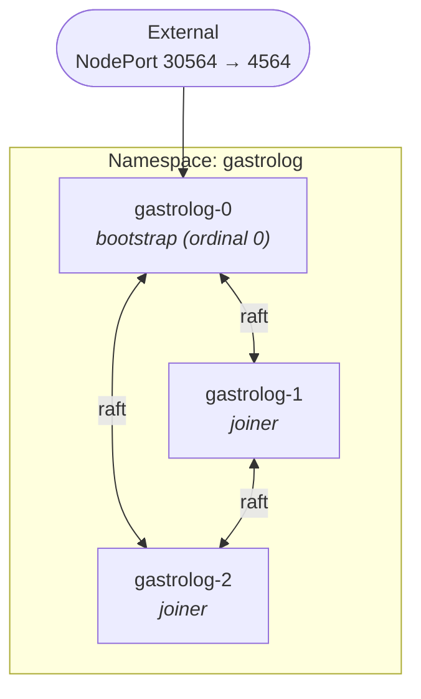

# Kubernetes

Deploy GastroLog as a StatefulSet on Kubernetes (production K8s,
OrbStack, kind, minikube, EKS, GKE, AKS — anywhere).

## Prerequisites

- A Kubernetes cluster you can `kubectl apply` to.
- The `gastrolog` image available to the cluster — either pulled
  from a registry or loaded into the cluster's image cache.
  - **OrbStack**: `docker build -t gastrolog:test .` makes the image
    visible to OrbStack's K8s automatically.
  - **kind**: `kind load docker-image gastrolog:test`.
  - **minikube**: `minikube image load gastrolog:test`.

## Quick start

```sh
kubectl apply -f deploy/k8s.yml
kubectl -n gastrolog get pods -w
# wait for gastrolog-0, gastrolog-1, gastrolog-2 all Running

# OrbStack/kind: NodePort exposes 4564 on localhost:30564
open http://localhost:30564          # admin / change-me

# Or port-forward:
kubectl -n gastrolog port-forward svc/gastrolog 4564:4564
```

To tear down:

```sh
kubectl delete -f deploy/k8s.yml
# PVCs are not auto-deleted; remove them explicitly if you want to wipe data:
kubectl -n gastrolog delete pvc --all
```

## What's in the recipe

The manifest ([`deploy/k8s.yml`](../../deploy/k8s.yml)) defines:

- **Namespace** `gastrolog` — keeps everything scoped.
- **Headless Service** `gastrolog-headless` — `clusterIP: None` so
  per-pod DNS records resolve to actual pod IPs (required for
  Raft).
- **NodePort Service** `gastrolog` — external ingress on port
  30564 → 4564.
- **ConfigMap** `gastrolog-config` — non-secret env (listen
  address, cluster-addr=`auto`).
- **Secret** `gastrolog-secrets` — initial admin credentials and
  the bootstrap-token shared secret.
- **StatefulSet** `gastrolog` — `replicas: 3` by default. Pod 0
  (`gastrolog-0`) is the bootstrap; pods 1..N-1 are joiners. The
  container's startup wrapper branches on the pod's ordinal to
  set bootstrap-vs-joiner env vars at run time.

### Architecture



Each pod has stable DNS via the headless service, e.g.
`gastrolog-0.gastrolog-headless.gastrolog.svc.cluster.local`. Pod
name = hostname = `GASTROLOG_NAME`, so what you see in `kubectl get
pods` matches what's in the gastrolog UI.

### Role detection

Pod ordinal 0 is the bootstrap; pods 1..N-1 are joiners. The
container's `command:` field carries a 6-line shell prelude that
reads `${HOSTNAME##*-}` to get the ordinal and exports the right
`GASTROLOG_*` env vars before exec'ing the entrypoint:

```sh
ord=${HOSTNAME##*-}
if [ "$ord" = "0" ]; then
  export GASTROLOG_BOOTSTRAP_TOKEN_SERVE_SECRET=$BOOTSTRAP_TOKEN_SHARED_SECRET
else
  export GASTROLOG_JOIN_ADDR=gastrolog-0.gastrolog-headless...:4566
  export GASTROLOG_BOOTSTRAP_TOKEN_URL=http://gastrolog-0...:4564/cluster/bootstrap-token
  export GASTROLOG_BOOTSTRAP_TOKEN_SECRET=$BOOTSTRAP_TOKEN_SHARED_SECRET
fi
exec /docker-entrypoint.sh server
```

This keeps pod-name = hostname = `GASTROLOG_NAME` consistent across
`kubectl get pods`, the gastrolog UI, and CLI operations like
`cluster remove-node gastrolog-3`.

### Why HTTP token delivery instead of file-based?

K8s pods don't natively share volumes between replicas. The
file-based path (works in Compose and Swarm via shared named
volumes) requires a `ReadWriteMany` storage class — uncommon, not
portable to all K8s distros.

The HTTP endpoint path (`gastrolog-o9z6o`) is the natural K8s fit:
`gastrolog-0` serves the token at a known URL, joiners poll with
backoff. The shared secret in the K8s Secret authenticates the
request.

If you want the file-based path on a K8s with `ReadWriteMany`
support (Rook/Ceph, AWS EFS, Azure Files, NFS), you can adapt the
manifest by adding a shared PVC mounted into all pods at `/shared`
and switching to `GASTROLOG_WRITE_BOOTSTRAP_TOKEN` /
`GASTROLOG_BOOTSTRAP_TOKEN_FILE` env vars.

### How the cluster forms

1. K8s schedules `gastrolog-0`. Its entrypoint sees
   `GASTROLOG_CLUSTER_ADDR=auto` and resolves the pod's own IP via
   `hostname -i` (e.g. `10.244.1.17`). Binds + advertises on that
   IP:4566.
2. `gastrolog-0` generates cluster TLS + the join token, mounts
   the admin credentials from `/etc/gastrolog/admin_creds`,
   provisions the initial admin user, and starts serving:
   - `/healthz`, `/readyz` for K8s probes
   - `/cluster/bootstrap-token` gated on the
     `GASTROLOG_BOOTSTRAP_TOKEN_SERVE_SECRET`
   - The full Connect-RPC + UI on port 4564
3. K8s schedules `gastrolog-1`, then `gastrolog-2`. Each polls
   `http://gastrolog-0.gastrolog-headless.gastrolog.svc.cluster.local:4564/cluster/bootstrap-token`
   with the shared secret in the `X-Bootstrap-Token-Secret`
   header.
4. Joiners receive the token, enroll with `gastrolog-0` via the
   stable per-pod DNS (`gastrolog-0.gastrolog-headless...:4566`),
   join the Raft cluster.
5. Both joiners settle as `FOLLOWER` / `VOTER` within ~10 seconds.

### Probes

The manifest wires K8s `livenessProbe` and `readinessProbe` to the
corresponding HTTP endpoints. K8s probes override the image's
built-in `HEALTHCHECK` — the `Dockerfile` directive is for
plain-Docker users.

- **Liveness** (`/healthz`): if it fails, K8s restarts the pod.
- **Readiness** (`/readyz`): if it fails, K8s removes the pod from
  Service endpoints. Useful during startup, leader-loss windows,
  and graceful shutdown.

## Verify

```sh
kubectl -n gastrolog get pods
# NAME           READY   STATUS    RESTARTS   AGE
# gastrolog-0    1/1     Running   0          2m
# gastrolog-1    1/1     Running   0          1m
# gastrolog-2    1/1     Running   0          1m

# Cluster topology from gastrolog-0:
kubectl -n gastrolog exec gastrolog-0 -- /gastrolog --home /config cluster status

# Admin login (via NodePort or port-forward):
curl -s -X POST -H "Content-Type: application/json" \
  http://localhost:30564/gastrolog.v1.AuthService/Login \
  -d '{"username":"admin","password":"change-me"}'
```

## Scaling out

Add joiners with:

```sh
kubectl -n gastrolog scale statefulset gastrolog --replicas=5
```

K8s creates `gastrolog-3` and `gastrolog-4`; each gets its own
PVCs via the `volumeClaimTemplates`, polls `gastrolog-0` for the
token, and enrolls. The `kubernetes-expand` / `kubernetes-scale`
recipes ([`deploy/justfile`](../../deploy/justfile)) wrap this with
post-scale storage initialization on the new pods (the dispatcher
needs file storage on each node before vault chunks can land
there).

To shrink, use `kubernetes-contract` / `kubernetes-scale` — they
remove voters from Raft membership *before* `kubectl scale` so dead
pods don't linger in `cluster status` as orphan voters, and they
delete the now-unused PVCs after scale-down.

`gastrolog-0` should never be removed — it's the bootstrap and
holds Raft state required for new joiners to enroll. The recipes
enforce a floor of 3 replicas (bootstrap + 2 joiners minimum) to
preserve quorum tolerance.

### When a shrink is refused

`cluster remove-node` runs two gates on the Raft leader before it
touches membership. It refuses if the removal would leave a vault
with **zero** placements (data loss), and it refuses if the removal
would leave a vault **below its replication factor** with no
eligible Live node to re-place onto (reduced redundancy). The error
names the affected vaults.

Remedies, in preference order: lower the vault's replication factor
if the smaller cluster is the new normal, drain the vault to other
nodes first, or re-run with `--force` to accept the loss. The
`kubernetes-contract` / `kubernetes-scale` recipes ignore removal
errors, so a refusal there shows up as a pod that scaled away while
its node is still in `cluster status` — re-run the removal by hand
to see the reason.

The preStop hook (`cluster demote-self`) is deliberately exempt from
the replication-factor gate: the pod is terminating either way, and
K8s cannot tell a rolling restart from a scale-down, so refusing
would only strand a voter. Placement reconcile re-places the vault
on a surviving node.

## Production considerations

- **Image registry**: change `image: gastrolog:test` to a
  registry-pulled image (`ghcr.io/kluzzebass/gastrolog:v1.2.3`).
  Add `imagePullSecrets` if you need registry auth.
- **Resource limits**: add `resources.requests` and
  `resources.limits` to each container for CPU/memory.
- **Secrets**: replace the in-line `stringData` with sealed-secrets,
  external-secrets-operator, or `kubectl create secret` from a
  file that's never checked in. **Always rotate the
  `bootstrap_token_secret` after first use.**
- **Storage class**: the `volumeClaimTemplates` use the cluster's
  default storage class. For production, set `storageClassName:
  <your-class>` explicitly so PVCs land on the right backend (SSD,
  NVMe, network-attached, etc.).
- **TLS**: this manifest exposes plaintext HTTP via NodePort. In
  production, use an Ingress with TLS termination (cert-manager +
  Let's Encrypt is the common path on K8s).
- **PodDisruptionBudget**: add one for the `gastrolog` StatefulSet
  with `minAvailable: 2` (or whatever respects your Raft quorum)
  so cluster maintenance doesn't take down enough nodes to lose
  quorum.
- **Network policies**: restrict 4566 to intra-cluster traffic
  (`from: app=gastrolog`); 4564 stays open for the dashboard.
- **Backup**: snapshot the PVCs via your cluster's volume
  snapshotter (`VolumeSnapshot` resource, or storage-class-specific
  tooling).

## Troubleshooting

### Pod stuck in `Init` or `ContainerCreating`

Usually a missing image. Verify:

```sh
kubectl -n gastrolog describe pod gastrolog-0 | tail -20
```

For OrbStack, kind, or minikube, the image must be loaded into the
cluster's local image cache (see Prerequisites). For a real
cluster with `imagePullPolicy: IfNotPresent`, the image must be
available at the configured registry.

### `gastrolog-0` ready but joiners stuck

Joiners can't reach the bootstrap's HTTP endpoint. Check:

```sh
kubectl -n gastrolog logs gastrolog-1 | grep -i bootstrap
```

If you see "endpoint rejected secret" 401s, the
`bootstrap_token_secret` doesn't match between `gastrolog-0`'s
`GASTROLOG_BOOTSTRAP_TOKEN_SERVE_SECRET` and the joiner's
`GASTROLOG_BOOTSTRAP_TOKEN_SECRET`. Both pods read the same Secret
key via the shared `BOOTSTRAP_TOKEN_SHARED_SECRET` env var, so this
means the Secret was rotated mid-run; restart `gastrolog-0` to
pick up the new value.

### `/readyz` returns 503

The orchestrator is still catching up after a restart, or local
vault FSMs haven't applied any log entries yet. Wait 10-30
seconds. If readiness doesn't recover, check the FSM logs:

```sh
kubectl -n gastrolog logs gastrolog-0 | grep -iE 'fsm|catch'
```
