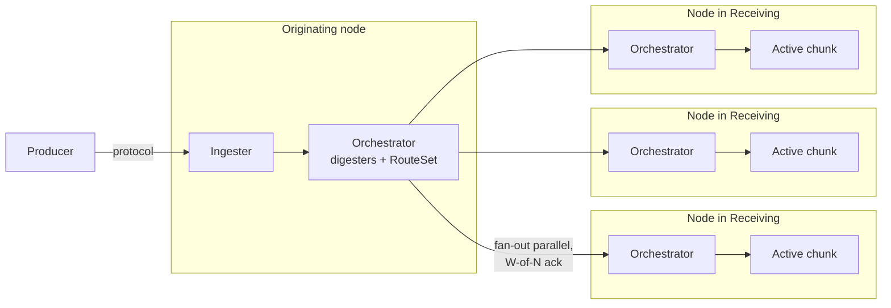
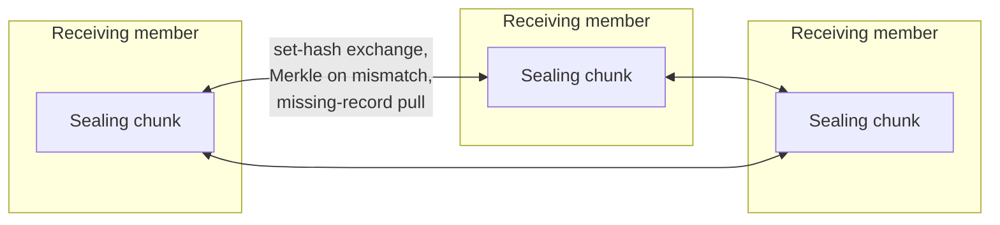

# Fan-out Data-Plane Architecture

**Status:** Design proposal under [gastrolog-2ujjh](dcat://gastrolog-2ujjh). Not yet implemented. Builds on the now-landed [gastrolog-2i1g9](dcat://gastrolog-2i1g9) (FSM-authority migration: lifecycle states, learner-based join, disk-vs-FSM authority cleanup); the substrate this design assumes is in place on `main`.

## Context

**The change in one line:** under fan-out the orchestrator forwards each record to every node listed in the vault's active chunk's `Receiving` set. Same forwarder, different topology source — the legacy "forward to the single placement-leader node" path is gone.

The pre-fan-out data-plane was leader-driven with two distinct replication paths:

- **Per-record real-time replication.** Records arrived at the placement leader's node, which appended locally and forwarded each record to followers via `ChunkReplicator.AppendRecords` over one bidirectional gRPC stream per (vault, follower).
- **At-seal sealed-chunk re-ship.** Once a chunk sealed, the canonical sealed chunk was re-shipped to followers via `replicateToFollower` → `ImportSealedChunk`.

Reads routed to the placement leader only via `remoteVaultsByNodeFiltered`; followers didn't serve reads.

That model had known pain:

- **Leader bandwidth ceiling.** Each vault's per-write outbound replication traffic is concentrated on one node. The leader's NIC is the per-vault scaling bottleneck.
- **Leader-failure stalls writes.** When the leader's node fails, writes to that vault halt until vault-ctl elects a new leader.
- **Placement-as-residency lies during transitions.** When placement rotates off an unreachable node, residency answers shift before any catchup has occurred — the cluster claims data exists where it doesn't, until catchup converges (the RF=1 redeploy bug).
- **Single-replica reads assume consistency that isn't guaranteed.** Real-time replication has backpressure, transient drops, and leader-transfer windows during which the queried replica may be missing records.

This design replaces the leader-driven data-plane with three coupled mechanisms: orchestrator-driven fan-out to Receiving, set-diff reconcile via EventID Merkle summaries over sealed chunks, and a receiving/holding placement split that decouples write intent from data residency.

**Ingesters are dumb pipes.** An ingester is a cluster-side protocol parser (syslog, HTTP, OTLP, Kafka, etc.) placed on a node by the orchestrator. Its job ends at "parse the wire protocol → produce an `IngestMessage` → send it on `o.ingestCh`." Everything downstream — the digester pipeline, EventID stamping, RouteSet matching, per-vault append, fan-out to Receiving, W-of-N accounting, replication — is owned by the per-node `*orchestrator.Orchestrator` ([backend/internal/orchestrator/orchestrator.go](backend/internal/orchestrator/orchestrator.go)). The ingester-to-orchestrator boundary is an in-process channel, not a network hop.

## Architecture overview

Every node runs an orchestrator. The orchestrator is the per-node central component; "originating" and "Receiving" below are roles relative to a single record write, not separate kinds of node.

### Write path: ingestion and fan-out

A producer connects to the node where the relevant ingester is placed. The ingester on that node parses the protocol and hands the resulting `IngestMessage` to the local orchestrator. The orchestrator runs its digester chain (stamping EventID and enriching attrs), matches the record against its `RouteSet`, and for each matched vault sends the record in parallel to every member of that vault's active chunk's `Receiving` set. If the orchestrator's own node is in `Receiving`, one of those parallel writes is a local append.



The originating node may itself be one of N1/N2/N3 — in which case the corresponding arrow is a local in-process call rather than a network hop, and the orchestrator counts that as one of the W-of-N acks. When it is not in `Receiving`, the fan-out is purely cross-node.

### Seal-time path: reconcile across Receiving

When the active chunk on some Receiving member crosses a rotation threshold, that member proposes the seal via vault-ctl Raft. Receiving members observe the apply, freeze the chunk's local record set, and exchange a set-hash. Matching set-hashes finalize the seal. Differing set-hashes drop into a Merkle descent that identifies missing EventIDs; missing records are pulled directly between Receiving members.



The seal-time exchange shown above is the main reconcile case. The one active-chunk exception is placement-change catch-up: when a node enters `Receiving` (or `Holding`) for an active chunk, it must iteratively pull records into a still-mutating set until it converges with the existing members. The originating node is not involved in either flow; reconcile is among Receiving members.

### Three coupled mechanisms

1. **Orchestrator-driven fan-out to Receiving.** After RouteSet matches a record to vault V, the orchestrator on the originating node sends the record in parallel to every member of V's active chunk's `Receiving` set, using the existing `o.forwarder`. The operator chooses W-of-N ack semantics per vault (e.g., "any 2 of 3 acks before durable"). The orchestrator aggregates acks and resolves the per-record write inside its `writeLoop`.
2. **Set-diff reconcile via EventID Merkle summaries.** Sealed chunks converge on set-equality across Receiving members, not byte-identity. Order-different is not divergence; only actual missing EventIDs are. The same mechanism, applied iteratively, catches up a new joiner against an active chunk after a placement change.
3. **Receiving/Holding placement split.** `Receiving` = where new records should land. `Holding` = where records actually exist. `Holding ⊇ Receiving` by invariant; placement edits affect Receiving immediately; nodes leave Holding only after explicit confirmation that other holders have their records.

## Benefits

1. **Static parallel throughput.** N actives ≈ N× per-vault write capacity when writes distribute across the Receiving set. The leader-bandwidth ceiling is eliminated.
2. **Dynamic load balancing.** The orchestrator's forwarder shifts writes toward less-pressured replicas using [`chanwatch.PressureGate`](backend/internal/cluster/record_forwarder.go#L102), the existing per-node forward-channel pressure signal. Variance in write throughput drops sharply even at the same average rate.
3. **Failure isolation for writes.** Node failure removes the failed replica from W-of-N ack accounting but does not stall writes — other replicas continue accepting. Single-leader failover gap is gone.
4. **Tunable durability per vault.** W-of-N lets the operator pick the durability/throughput tradeoff explicitly. A compliance vault sets `W = N` (all replicas must ack); a metrics firehose sets `W = 1` (any single ack).
5. **Honest consistency story.** Cross-replica divergence is explicit (via set-diff reconcile) instead of assumed-away. The `dedupWindow` mechanism collapses cross-replica duplicates in search results.

## Mechanism: Receiving/Holding FSM split

`ChunkMeta` (or a parallel per-chunk record) carries two sets:

```go
type ChunkPlacement struct {
    Receiving []NodeID  // where new records should be sent
    Holding   []NodeID  // where records actually exist (superset of Receiving in steady state)
}
```

**Invariants:**

- `Holding ⊇ Receiving` (nodes that should receive must also hold)
- `Receiving ⊆ {nodes with a vault instance for this vault}` — only nodes with storage placement (a `VaultPlacement` in the vault config) can be in Receiving, because only those nodes have a chunk manager / instance to append into. Verified against [`buildVaultInstance`](backend/internal/orchestrator/reconfig_vaults.go#L660): nodes without placement participate in the vault-ctl Raft group only and have no VaultInstance.
- One-replica-per-node invariant (Phase 2): a node hosts at most one instance per vault. Receiving is therefore `[]NodeID`, not `[]ReplicationTarget` — storage is resolved locally per-node via `StorageIDForNode`.
- Adding to Receiving: immediate (placement edit). The node starts receiving new records on the next orchestrator fan-out cycle. **Atomically adds to Holding too** in the same FSM apply (Holding ⊇ Receiving invariant). Pattern matches `applyAckDelete` ([fsm_receipts.go:219-243](backend/internal/vaultraft/vaultctlfsm/fsm_receipts.go#L219)), which mutates `tombstones`, `pendingDeletes`, and `chunks` in one apply.
- Removing from Receiving: immediate (placement edit). The node stops receiving new records but stays in Holding until PendingPulls drains.
- Adding to Holding (standalone, no Receiving change): fires on **reconcile catch-up completion** for a node that acquired the chunk's bytes without being in Receiving (e.g., orphan repatriation, snapshot restore). One apply per chunk, not per record.
- Removing from Holding: requires explicit ack that every remaining Receiving member holds the EventIDs this node held. Tracked **per-chunk** in FSM state via PendingPulls (resolves [gastrolog-3r38a](dcat://gastrolog-3r38a)).

`ChunkResidency` (consumed by read routing and operator queries) returns `Holding` directly. The placement-derived derivation (`placement_set - pendingDeletes.ExpectedFrom`) under the current architecture is replaced.

**Drain becomes a placement edit:** `cluster drain <node>` removes the node from `Receiving` for every chunk where it currently appears. Holding remains until each chunk's reconcile confirms other holders have the records. Once a chunk's Holding no longer includes the draining node, the node is safe to remove from membership for that chunk. The Draining state from [docs/node-lifecycle-design.md](docs/node-lifecycle-design.md) becomes a thin operator-facing label, not an orchestrated workflow.

## Mechanism: Fan-out writes with W-of-N ack

The orchestrator's `writeLoop` ([backend/internal/orchestrator/lifecycle.go#L425](backend/internal/orchestrator/lifecycle.go#L425)) drains digested records and calls `ingestWithSource` → `ingestLocked`, which matches the record against the `RouteSet` and yields one or more vault destinations. For each destination vault V:

1. Look up the active chunk for V (FSM-determined).
2. Snapshot that chunk's `Receiving` set at this moment. The snapshot is the fan-out target list for this write; subsequent placement edits do not retroactively change which nodes count toward W-of-N for this write (resolves [gastrolog-16msa](dcat://gastrolog-16msa)).
3. Send the record in parallel to each node in the snapshot. Each Receiving member's local orchestrator appends to its active chunk file and acks. If the originating orchestrator's node is itself in the snapshot, it appends locally as one of the parallel writes.
4. Wait for `W` acks (per-vault configured). Once W acks arrive, the per-vault write resolves successfully inside `writeLoop`; for ack-gated records (`WaitForReplica = true`), the ack is delivered to the ingester via `dr.ack`.
5. Remaining acks complete in the background. If fewer than W ever arrive within the write deadline, the per-vault write fails. Records that DID land remain valid in their local chunks; at seal time, the set-diff reconcile pass converges all replicas. (There is no in-flight, active-chunk reconcile triggered by missed acks — see "When reconcile runs" below.)

**W-of-N policy per vault:**

- `W = N` (default for high-durability vaults): every replica must ack before write is durable.
- `W = N - 1`: any one replica may be slow; the write tolerates one straggler.
- `W = quorum(N)`: majority — `ceil(N/2)`. Balances durability and throughput.
- `W = 1`: any single replica acks; maximum throughput, minimum durability.

The choice is per-vault config, not per-record. Operator sets it based on the vault's purpose.

**When the originating orchestrator's node is NOT in Receiving** — the fan-out is purely cross-node: every parallel write goes through the existing forwarder (`o.forwarder`). When the node IS in Receiving, the local append covers its slot and the forwarder handles the remaining N-1. Same mechanism; the topology source is the active chunk's Receiving set instead of the historical follower list.

**Load balancing within Receiving:**

The orchestrator sends to all N members of the Receiving snapshot in parallel and resolves the write once W acks arrive — straggler tolerance is built in (slow replicas simply lose the race; their writes still complete in the background). The orchestrator's forwarder biases its scheduling against high-pressure replicas via [`chanwatch.PressureGate`](backend/internal/cluster/record_forwarder.go#L102), the existing per-node forward-channel pressure signal — already broadcast on 1-second cadence, already used by the forwarder for upstream backpressure throttling. PressureGate is a cluster-internal signal; ingesters are unaware of it.

### W-of-N implementation: new primitive needed

The existing ack-gated path [`ackAfterReplication`](backend/internal/orchestrator/replication.go#L69) uses `errgroup.WithContext` to launch parallel goroutines and waits for **all** of them — `g.Wait()` returns when every goroutine finishes, with the first error winning. That pattern does not support W-of-N (succeed-on-first-W).

A new W-of-N coordinator is required. Shape:

1. Launch N goroutines, one per Receiving member from the snapshot. Each performs its `ChunkReplicator.AppendRecords`-equivalent and reports outcome on a shared result channel.
2. A coordinator goroutine reads outcomes:
   - On success: increment `acks`; if `acks >= W`, return success to the caller (`writeLoop` resolves the per-vault write or `dr.ack` is delivered to the ingester).
   - On failure or timeout from a snapshot member: **re-check that node's live Receiving membership.** If the node has since been removed from Receiving (a concurrent `CmdRemoveReceiving` applied during this write), treat the non-response as "not required" rather than "failure" — the node legitimately rejected because its local FSM transitioned out of Receiving. If the node IS still in live Receiving, count it as a failure; if `N - failures < W`, return failure.
   - The live-membership check is a local FSM read (every orchestrator has the state — see "Vault-ctl FSM substrate"), so the cost is negligible.
3. After the coordinator returns, the remaining goroutines keep running until completion or `cluster.ReplicationTimeout`. Their outcomes are not awaited by the caller, but their writes still land on those replicas — late acks contribute to background convergence, not the per-record W-of-N decision.
4. The Receiving snapshot taken at fan-out time is the immutable denominator for ack accounting (snapshot-at-fan-out, [gastrolog-16msa](dcat://gastrolog-16msa)); the live-membership check at failure time only reclassifies a non-response from "failure" to "not required" for nodes that have legitimately left Receiving. The denominator never grows; never shrinks the *snapshot*; only the *failure count* gets the de-escalation.

Implementation note: the coordinator can be a small dedicated helper (e.g., `waitWOfN(ctx, n, w, snapshot []NodeID, results <-chan nodeResult) error`) rather than reaching for a sync primitive. The helper closes over the FSM-state accessor for the live-Receiving check. The existing `pendingAcks` shape (`pa.replication`, `pa.forwards`) gets a third field for `pa.fanOut` carrying the Receiving snapshot + W parameter, dispatched from `writeLoop` (non-ack-gated) or from `ackAfterReplication` (ack-gated). For ack-gated records, the coordinator's result feeds `dr.ack <- err` exactly like the existing path.

**Failure-mode rationale.** Without the live-membership check, a roll-out that drains multiple nodes simultaneously (drain N1, drain N2, drain N3) produces spurious W-of-N failures for in-flight writes whose snapshot still references those nodes — every drained node is a "failure" in the coordinator's eyes even though the cluster legitimately decided those nodes should stop accepting writes. The live-membership de-escalation closes that hole. It does not weaken durability: a node that has left Receiving is not a record-holding peer, so requiring its ack would be requiring an ack from outside the new write quorum.

## Mechanism: Sealing under fan-out

The leader-driven model has a clean rotation decision: the leader's local chunk state is canonical, and `ShouldRotate` evaluated against it gives the authoritative answer. Under fan-out, no replica has canonical state — each replica's local view of records-received, bytes-accumulated, and age differs due to per-record arrival timing.

The mechanism: **first replica whose local state fires `ShouldRotate` proposes the seal; vault-ctl Raft serializes; first proposal wins.**

1. Each replica evaluates `ShouldRotate` locally on every append, against its own `ActiveChunkState` ([chunk/rotation.go#L46](backend/internal/chunk/rotation.go#L46)). The interface is already a pure function of one chunk's state — no cross-replica coordination required to evaluate.
2. The replica whose state hits the threshold first picks a new ChunkID and proposes `CmdBeginSeal(oldChunkID) + CmdCreateActive(newChunkID)` via vault-ctl Raft. The proposer picks the new ChunkID at proposal time using the existing locally-mintable GLID primitive ([`glid.New()`](backend/internal/glid/glid.go)) — any node can mint, no coordination required.
3. Other replicas observe the apply, transition the old chunk to `Sealing`, and start directing new appends to the new active chunk identified by `newChunkID`.
4. Reconcile at seal time converges record sets across replicas before the old chunk transitions from `Sealing` to `Sealed`.

**Who picks the new ChunkID, and what if replicas race:** any replica can mint; the proposer picks at proposal time; Raft resolves races. If two replicas fire `ShouldRotate` simultaneously, each picks its own candidate ChunkID and proposes; Raft serializes; the first-to-commit's ChunkID is the canonical new active. Losing proposals are discarded with no records associated, so the unused candidate ChunkIDs are leak-free. No privileged "ChunkID picker" role to track or fail over.

### Why this works for each rotation policy

- **`SizePolicy` / `RecordCountPolicy`**: per-replica state differs (different replicas got different records under fan-out). One replica hits the threshold first and proposes. The triggering count or size is *that* replica's local state; the chunk's final record set comes from reconcile, not the trigger count. The trigger is just the signal.
- **`AgePolicy`**: each replica opens the chunk at slightly different wall-clock times (when `CmdCreateActive` applied locally). Age-based rotation fires at slightly different absolute times across replicas. First to fire proposes; Raft serializes. The chunk's age boundary is determined by whichever replica's clock got there first, not by a synchronized cluster-wide timer.
- **`HardLimitPolicy`** ([chunk/rotation.go#L170](backend/internal/chunk/rotation.go#L170)): caps raw.log at the uint32-offset limit (~4GB). If any replica hits this, seal is required — the file format can't represent more. First-to-fire-proposes handles this naturally; hard-limit on any replica triggers seal cluster-wide.

A replica receiving very few records under load-balanced routing might never see its `ShouldRotate` fire before others propose. That is fine — it just observes the seal command and catches up via reconcile. No requirement that the deciding replica be the most-loaded one; the system needs *some* replica to notice.

### In-flight records at seal time: append to local current active

Records the originating orchestrator fans out just before `CmdBeginSeal` commits land on different replicas at different times. Each replica accepts the record into whatever its locally-current active chunk is at receive time:

- Replica with `CmdBeginSeal` already applied: record lands in the new active chunk.
- Replica without `CmdBeginSeal` applied yet: record lands in the old (now-sealing) chunk.

The ingester is oblivious to chunk lifecycle, and so is the originating orchestrator beyond looking up the Receiving set — it does not coordinate chunk-ID stamping or rotation gates. Each replica's local FSM state determines which chunk receives the record. Reconcile + `dedupWindow` at query time absorb the consequence (see "Accepted tradeoffs vs leader-driven sealing" below).

#### Considered and rejected: ingester chunk-ID stamping

An earlier design pass proposed the ingester carry a chunk-ID stamp on each record, learned from a watch stream over the vault-ctl FSM, with replicas rejecting records stamped with sealed chunk IDs. The intent was to reduce the cross-chunk-duplicate window from the full Raft commit duration to just the watch-stream propagation lag.

Rejected because the marginal benefit doesn't justify the complexity:

- The cross-chunk-duplicate window is already bounded by Raft commit latency (~10ms). At even 1M records/sec, ~10K records per seal could be cross-chunk — about 1% of a 1M-record chunk, well within compression-ratio noise.
- Stamping introduces chunk-lifecycle awareness in the ingester layer, which was previously oblivious. Ingester must now track current-active-chunk-ID per vault, watch FSM for updates, handle rejection responses, and retry.
- New failure modes: watch-stream disconnect → stale chunk IDs → rejection storms → ingester retry pressure.
- Cross-ingester coordination: if multiple ingester instances exist with different watch-update timing, records from different ingesters carry different chunk IDs during a transition, multiplying the race.
- The reconcile + dedupWindow mechanism already handles cross-chunk duplicates correctly — adding stamping is solving a problem we said was fine to live with.

The simpler model (ingester hands the IngestMessage to its node's orchestrator; the orchestrator runs digesters, matches the RouteSet, and fans out to Receiving; each Receiving member accepts into its local current active chunk) is structurally cleaner and the storage cost is negligible.

### Why not a single rotation coordinator

A reasonable alternative: designate the vault-ctl Raft leader as the rotation decision-maker. Only the leader proposes seals; followers just receive records.

This would work, but it reintroduces a soft leader concept the fan-out model otherwise avoids:

- It's another piece of state to track and a failure mode to handle (rotation coordinator unavailable → no seals fire → chunks grow unbounded → hits hard limit → emergency mode)
- It privileges one replica's view as "the" rotation-triggering state, even though every replica has equally valid local state
- It re-creates the leader-failure-stalls-rotation problem in miniature

The first-to-fire mechanism is more uniform: every replica participates symmetrically; Raft already handles the "multiple proposals, one wins" semantic; no extra coordinator role.

### Accepted tradeoffs vs leader-driven sealing

The first-to-fire-proposes mechanism has two properties that differ from the leader-driven model. Both are accepted, not bugs:

**Same EventID can land in adjacent chunks across replicas.** Under the leader-driven model, "each EventID belongs to exactly one chunk" was an invariant — the leader stamped chunk-ID atomically with append, so no record could be in two chunks. Under fan-out, the race window between `CmdBeginSeal` proposal and apply across replicas means in-flight records can be accepted into the old chunk on replicas where `CmdBeginSeal` hasn't yet applied, and rejected (then retried into the new chunk) on replicas where it has. Set-diff reconcile then *propagates* the duplication: the record ends up in the old chunk on replicas that originally accepted it (and have it pulled in by reconcile on the others), and in the new chunk on replicas that originally rejected it (likewise propagated). After reconcile converges, the record exists in **both** chunks on all replicas.

This is absorbed by `dedupWindow` at query time — `dedupWindow` is already keyed on `chunk.EventID`, so cross-chunk duplicates collapse identically to cross-replica duplicates. The storage cost is one extra copy of each in-flight-at-seal record per affected pair of chunks. With Raft commit latency in milliseconds and typical record rates, this is a small fraction of records (typically dozens out of thousands per seal cycle).

The architectural property change: downstream tooling that assumes "each EventID belongs to exactly one chunk" needs revisiting. Most paths already use `dedupWindow` for cross-source collapse; the same mechanism handles cross-chunk collapse.

**Rotate-by-count becomes approximate.** `RecordCountPolicy` evaluates the trigger replica's local count, not the cluster-wide count. The chunk's actual final record count after reconcile is "trigger count + drift from records that arrived at any replica during the Raft commit window." Drift depends on Raft commit latency × arrival rate, typically 1–3% overshoot on a typically-sized chunk.

For most workloads this is invisible. Operators who set strict count limits for downstream tooling reasons should know the policy is "approximately N records per chunk," not "exactly N." The same caveat applies to `SizePolicy` (size at trigger time vs after-reconcile size) and to `AgePolicy` (the trigger replica's wall-clock vs others' wall-clocks at apply time).

`HardLimitPolicy` is the exception: its limit comes from the file format (uint32 offsets), so even approximate overshoot would break the format. The hard-limit case must be handled specially — any replica approaching the file-format limit must propose seal *before* reaching the actual limit, leaving headroom for the in-flight drift. A small safety margin (e.g., trigger at 95% of the uint32-offset limit) absorbs typical drift without changing the policy interface.

## Mechanism: Set-diff reconcile via EventID Merkle summaries

**Why set-diff and not hash-chain:**

Order-different is the common case under fan-out (parallel writes from an orchestrator complete at different times per Receiving member; multiple orchestrators routing into the same vault — different nodes' RouteSet matches — interleave records non-deterministically). Set-different (actual missing EventIDs) is rare (only when an orchestrator's fan-out to a specific Receiving member fails past retry, or when a replica was unreachable during a write). Hash-chain reconcile would false-positive on order differences; set-diff handles them naturally.

**Mechanism:**

Each replica maintains its records in the existing IngestTS B+ tree ([backend/internal/chunk/file/manager.go#L345](backend/internal/chunk/file/manager.go#L345) `ingestBT`). Index gives canonical per-replica traversal order. The set of EventIDs in this tree IS the set of records this replica holds for the chunk.

Two-tier reconcile: a fast set-equality check that handles the common case, and a Merkle slow path that pinpoints divergence when it exists.

**Fast path — single set-hash:**

1. When `CmdBeginSeal` applies on a replica, no new records can be accepted into the chunk locally. The local EventID set is stable from that moment.
2. Each replica computes a set-hash over its chunk's EventIDs immediately after `CmdBeginSeal` apply. `chunk.EventID` is fully unique by construction (`IngesterID + NodeID + IngestTS + IngestSeq`; `IngestSeq` is the per-ingester rolling sequence that guarantees uniqueness even at colliding IngestTS values — see [chunk/types.go#L219-L234](backend/internal/chunk/types.go#L219)), so the hash can be order-independent or order-dependent and either works:
   - **Order-independent hash**: XOR (or other commutative aggregation) of `hash(EventID)` per record. Same set → same XOR regardless of any traversal order. O(N), no sort, no tiebreaker.
   - **Canonical-sort hash**: sort by full EventID, compute a chained hash. O(N log N) for the sort but produces a Merkle root the slow path can reuse without recomputation.
3. Replicas exchange set-hashes (32 bytes per replica per seal).
4. **If hashes match**: the chunk is set-equivalent across replicas. Seal completes (`Sealing → Sealed`). No Merkle work performed.
5. **If hashes differ**: fall back to the Merkle slow path.

**Slow path — Merkle divergence pinpointing:**

6. Each replica's Merkle tree (built lazily during fast-path computation, or eagerly under the canonical-sort hash option) is exchanged level-by-level.
7. Descend into divergent subtrees until divergent EventIDs are identified. Cost is `O(d × log K)` for `d` differences.
8. Each replica fetches the records it's missing by EventID. Existing replication primitives handle the transfer.
9. Recompute set-hash; verify convergence. Retry the fast-path comparison.

**Cost shape:**

- **Fast-path computation**: O(N) per chunk per replica at seal time. ~100ms for a 1M-record chunk at typical hash rates. One-time.
- **Fast-path exchange**: ~32 bytes per replica per seal. Effectively free.
- **Steady state (no divergence)**: fast path resolves; slow path doesn't activate. Most seals.
- **Realistic divergence (0.01–0.1% missed sends)**: slow path activates. `d × log K × hash_size` for Merkle identification + `d × avg_record_size` for transfer. For K=1M, d=1000: ~640KB metadata + ~200KB record-bytes.
- **Worst case (replica returns from long absence with 50% missing)**: slow path runs to completion. O(K) for full set comparison + O(0.5K × avg_record_size) for transfer.

**When reconcile runs:**

Reconcile normally operates on **sealed chunks**, where the record set is stable and a one-shot pass converges all members. The one exception is **placement-change catch-up against an active chunk**, where a newly-added member must pull existing records into a still-mutating set.

- **At seal time.** Before transitioning a chunk from `ChunkStateSealing` to `ChunkStateSealed`, run one reconcile pass to converge all Receiving members. After seal, the chunk's record set is fixed; later replicas in Holding pull via the same mechanism.
- **On placement change against an active chunk.** When a node is added to `Receiving` (or `Holding`) for an active chunk, the joining member must catch up to records that were appended before it joined. Because the set is still moving, catch-up is iterative — the joining member pulls everything an existing Receiving member has up to some EventID watermark, then resumes from there while new fan-out writes continue to land. Convergence is eventual; the joining member is considered fully caught up only once a pull pass returns "no new EventIDs since the prior watermark." This is the only active-chunk reconcile case.

  **Convergence invariant and escape hatch.** Iterative catch-up has an unbounded-delta failure mode: if the catch-up node is slow or the write rate is high, the per-pass delta can grow faster than pulls drain. To prevent a joining node from sitting in a liminal state forever (not in Receiving for fan-out yet, not cleanly failed), the catch-up loop enforces a convergence-progress contract:
   - **Progress invariant:** each pull pass must reduce the delta-to-watermark by at least a constant fraction (e.g., 50%) compared to the previous pass, OR the absolute delta must stay below a configured threshold (e.g., 10× the typical Raft commit batch size). If neither holds for K consecutive passes (K configurable, default 5), the joiner has not converged and the escape hatch fires.
   - **Escape hatch:** the joining orchestrator emits an `alert.Collector` entry (operator-visible: "active-chunk catch-up not converging for chunk X, vault Y, node Z; consider deferring this node's Receiving promotion until current chunk seals") and the joining node stays out of fan-out for that chunk. The chunk's natural seal boundary becomes the catch-up boundary: once the chunk transitions to `Sealing`, the EventID set freezes and the one-shot seal-time reconcile takes over (which has a bounded cost). The node enters Receiving for the NEXT chunk created in this vault.
   - This contract is the precondition for `CmdAddReceiving`: the proposer must be prepared for the joining node to skip the current active chunk and catch up at seal time instead. The FSM doesn't need to know the difference — it just records the joiner as a Receiving member; whether the joiner uses iterative catch-up or seal-time reconcile is a runtime choice made by the joiner's orchestrator based on the convergence-progress contract.
- **On node return.** When a node re-enters `Live` from `Unreachable`, schedule reconcile for the **sealed** chunks where the node appears in Receiving or Holding. Catches up missed records during absence. For any active chunk where the returning node is still in Receiving, the active-chunk placement-change mechanism applies (treat the return as effectively a re-add to Receiving for that chunk).
- **Operator on-demand.** `gastrolog cluster reconcile <vault>` triggers reconcile for sealed chunks in the vault.

Missed acks during fan-out writes do NOT trigger reconcile. A missed ack is W-of-N accounting business; the records that landed on responding replicas remain valid, and the seal-time pass converges everything. Polling-based or compensation-driven reconcile is the kind of half-assing the engineering principles call out — events trigger it, and there is no periodic sweep.

## Mechanism: Fan-out reads for active chunks

Under fan-out writes, each Receiving replica may be missing records the others have. This divergence persists for the lifetime of the active chunk — the seal-time pass is what converges replicas; the placement-change active-chunk reconcile only catches up new joiners and doesn't try to converge all members continuously. For active-chunk queries, a single-replica read therefore returns incomplete results; read fan-out + dedup is the mechanism that completes the picture.

The read path for vault V:

1. Determine the chunks the query touches. Split into "sealed" and "active."
2. For sealed chunks: read from any one node in `Holding` (single-replica suffices — reconcile already converged).
3. For active chunks: fan-out read to every node in `Receiving`. Each returns its local view; `dedupWindow` ([backend/internal/server/query.go#L485](backend/internal/server/query.go#L485)) collapses by EventID.

The dedup substrate is already in place — `dedupWindow` is keyed on `chunk.EventID`, exactly the right granularity. Currently used for cross-vault dedup; extending to cross-replica dedup needs no key-logic changes.

**Cost:** active-chunk searches do `|Receiving|×` the network bytes (most are duplicates that dedup discards). For typical workloads where active windows are minutes and sealed history is days, this overhead applies to a small fraction of total search bytes — but it IS a real read-amplification factor, not a steady-state target. Treat fan-out reads as a **correctness floor** that the mitigations below should chip away from once basic functionality lands; do not assume the |Receiving|× cost is acceptable indefinitely as cluster scale grows.

**Mitigations** (not required at first ship; available later if needed):

- **Stickiness.** Once a query is answered by replica A, route follow-ups to A first. Cuts fan-out for paginated queries.
- **Per-vault read-consistency tier.** Operator picks "strong (fan-out)" or "best-effort (single replica)" per vault.
- **Sample-and-merge.** First response answers fast; remaining replicas merge in for completeness. Latency stays low; bandwidth stays high; completeness opt-in.

### Divergence tolerance: contracts that survive the pre-reconcile window

Reconcile ([gastrolog-37k2b](dcat://gastrolog-37k2b)) eventually makes sealed-chunk record sets converge across replicas, but there's always an in-between period — between a record's W-of-N ack landing and reconcile firing — where a Receiver's local `idx.log` can hold fewer records than `meta.RecordCount` (which the FSM stamps to the proposer's count). The read path crosses this window on every query; the cursor contract has to tolerate it without crashing.

The contracts:

- **Cursor `Seek(Pos)` clamps to the cursor's actual record count.** All four `chunk.RecordCursor` implementations (mmap, stdio, GLCB, memory) silently bound an over-large `Pos` argument to their local end. `Prev()` from a clamped `revIndex` returns local data; `Next()` from a clamped `fwdIndex` returns `ErrNoMoreRecords` immediately. Callers like reverse-mode search at [`positionCursor`](backend/internal/orchestrator/query/query.go) Seek to `meta.RecordCount` and trust the cursor to behave; without clamping they'd compute positions past the local mmap end and surface `ErrInvalidRecordIdx`.
- **Read paths must tolerate early `ErrNoMoreRecords`.** Code computing positions from `meta.RecordCount` (`positionCursor`, `query/context.go`'s chunk walk) must accept that the cursor may terminate before reaching the FSM-stamped count. The defensive shape is fan-out + dedup at the merge layer, which is already in place for active chunks and is the de-facto fallback for sealed chunks until [gastrolog-4m68m](dcat://gastrolog-4m68m)'s reconcile-completion signal lands.
- **The contract is permanent, not transitional.** Even after reconcile lands, the cursor-clamp contract should stay. It covers transient cases like a chunk being mid-pull when a query arrives, a node recovering from disk corruption that lost records, etc. Divergence tolerance is a permanent property of distributed storage, not a migration-period workaround.

The cursor-clamp implementation landed under [gastrolog-hshgl](dcat://gastrolog-hshgl) (cluster-test fixes). Read-path callers should NOT add their own bounds-checking against `meta.RecordCount` — the cursor is the single source of truth for "what I can serve."

## Vault-ctl FSM substrate (reference)

The fan-out epic builds directly on the existing vault-ctl Raft FSM. This section captures what already exists so future work doesn't reinvent it.

### Group membership

- One vault-ctl Raft group **per vault**, identified by `raftgroup.VaultControlPlaneGroupID(vaultCfg.ID)`.
- The group is seeded symmetrically across **every cluster node** that resolves at startup ([`tryStartClusterRaftGroup`](backend/internal/orchestrator/reconfig_vaults.go#L1031)). It is NOT restricted to nodes hosting an instance of the vault.
- `RefreshVaultCtlMembers` re-derives the desired voter list from the current cluster node list on node-config changes ([`reconfig_vaults.go`](backend/internal/orchestrator/reconfig_vaults.go) — see the comment block above the function).
- Consequence: **every orchestrator has a local copy of the FSM state for every vault.** Receiving/Holding lookups are always a local read; no cluster-wide coordination required to route a record.

### FSM layering

Two FSMs compose:

- **`vaultraft.FSM`** ([backend/internal/vaultraft/fsm.go](backend/internal/vaultraft/fsm.go)): the outer Raft FSM. Holds `vaults map[GLID]*vaultctlfsm.FSM`. Commands carry a vault GLID prefix (`OpVaultChunkFSM`) and dispatch to the per-vault sub-FSM. Owns the cross-vault snapshot/restore format and the `onAfterRestore` hook used to wake reconcilers after snapshot install.
- **`vaultctlfsm.FSM`** ([backend/internal/vaultraft/vaultctlfsm/fsm.go](backend/internal/vaultraft/vaultctlfsm/fsm.go)): the per-vault sub-FSM. Holds `chunks map[ChunkID]*ManifestEntry` + `pendingDeletes map[ChunkID]*PendingDelete` + `tombstones map[ChunkID]time.Time`. All reads are lock-protected local; writes go through Raft.Apply.

### Existing FSM commands

| Command | Purpose |
|---|---|
| `CmdCreateChunk` | Create a new chunk (Active state) |
| `CmdBeginSeal` | Active → Sealing transition; stops local appends |
| `CmdSealChunk` | Sealing → Sealed transition; sets final counts/bounds |
| `CmdAttachOffsets` | Attach GLCB section offsets after `sealToGLCB` |
| `CmdCompressChunk` | Mark chunk as compressed (state metadata only) |
| `CmdUploadChunk` | Mark sealed chunk as cloud-backed |
| `CmdRequestDelete` | Receipt protocol: propose delete with `ExpectedFrom` set |
| `CmdAckDelete` | Receipt protocol: per-node ack; auto-finalizes when drained |
| `CmdFinalizeDelete` | Receipt protocol: explicit external finalize trigger |
| `CmdPruneNode` | Drop departed node's slot from every `ExpectedFrom` |
| `CmdRepatriateChunk` | Operator-driven recovery: re-introduce a chunk's manifest entry |
| `CmdRetentionPending` | Mark chunk as retention-pending |
| `CmdDeleteChunk` (legacy) | Pre-receipt-protocol delete; WAL-replay only |

### Key types

```go
// ManifestEntry — per-chunk metadata in the FSM
type ManifestEntry struct {
    ID                chunk.ChunkID
    WriteStart, WriteEnd, IngestStart, IngestEnd, SourceStart, SourceEnd time.Time
    RecordCount, Bytes, DiskBytes int64
    State             chunk.ChunkState // Active | Sealing | Sealed
    IngestTSMonotonic bool
    CloudBacked, Archived, RetentionPending bool
    // ... cloud TOC offsets, integrity hash, key scheme
}

// PendingDelete — receipt-protocol in-flight delete (the shape the new
// PendingPulls schema mirrors, inverted)
type PendingDelete struct {
    ChunkID      chunk.ChunkID
    Reason       string
    ProposedAt   time.Time
    ExpectedFrom map[string]bool // nodeIDs that still owe a CmdAckDelete
}
```

### Callbacks

The FSM exposes hooks the orchestrator wires to project FSM state changes into the local manager + reconciler:

- `onCreate(ManifestEntry)` — CmdCreateChunk applied
- `onSeal(ManifestEntry)` — CmdSealChunk applied
- `onUpload(ManifestEntry)` — CmdUploadChunk applied
- `onRetentionPending(ChunkID)` — CmdRetentionPending applied
- `onRequestDelete(PendingDelete)` — receipt protocol started
- `onAckDelete(ChunkID, nodeID)` — receipt protocol per-node ack
- `onFinalizeDelete(ChunkID)` — receipt protocol finalize (explicit OR natural)
- `onPruneNode(nodeID, []ChunkID)` — node-departure ExpectedFrom drain
- `onDelete(ChunkID)` — legacy CmdDeleteChunk applied
- `onAfterRestore()` (on outer `vaultraft.FSM`) — fires once after snapshot install for catch-up reconcile

### Authoritative residency function

`ChunkResidency(chunkID, placementNodeIDs)` ([fsm_receipts.go:131](backend/internal/vaultraft/vaultctlfsm/fsm_receipts.go#L131)) returns the set of nodes that hold the chunk's bytes:

- Chunk not in FSM (never existed, fully finalized, tombstoned) → `nil`
- Chunk in `pendingDeletes` → `ExpectedFrom` (acked nodes have already deleted; remaining nodes still hold)
- Otherwise → the passed-in `placementNodeIDs`

Under fan-out, residency = `Holding` directly. The placement-derived derivation becomes unnecessary.

### Tombstones

`tombstones map[ChunkID]time.Time` records chunk deletions. The receive side of vault replication rejects stale Append/ImportSealed RPCs for tombstoned chunks (closes the retention-vs-late-replication race; see `gastrolog-11rzz`). Pruned periodically by the orchestrator (entries older than the replication-job deadline are safe to drop).

## Storage layout: FSM schema additions

Under fan-out, the vault-ctl FSM gains a per-chunk placement record on top of `ManifestEntry`:

```go
type ChunkPlacement struct {
    Receiving       []NodeID
    Holding         []NodeID                       // invariant: Holding ⊇ Receiving
    PendingPulls    map[NodeID]ExpectedFromSet     // who owes a pull from each holder before removal
}
```

`PendingPulls` mirrors `pendingDeletes.ExpectedFrom`, inverted: when removing a node from Holding, every remaining Receiving member must ack having pulled the records that node held. The existing FSM apply machinery for `pendingDeletes` (lock discipline, snapshot encoding, `CmdPruneNode` cleanup, `onAfterRestore` catch-up) adapts directly.

### Extended commands

- `CmdCreateChunk` (extended): payload gains an initial `Receiving []NodeID` field. The set is populated by the proposer (rotation triggerer) from the current `placements` — i.e., every node with a `VaultPlacement` for this vault, derived via `system.FollowerNodeIDs(placements, nscs)` + the leader's own node under the current architecture, or the full union under fan-out (the leader/follower distinction in `VaultPlacement.Leader` becomes meaningless for FanOut-mode vaults but the field stays present for `LeaderDriven` migration coexistence).
- `CmdSealChunk` (extended): payload gains an optional `FinalSet` (set-hash result) so the apply records the converged set-hash alongside the existing final counts / bounds. Replicas observing the apply compare against their local set-hash to detect post-seal divergence (defense-in-depth).

### New FSM commands

The implicit-multi-mutation pattern is established by `applyAckDelete` ([fsm_receipts.go:219-243](backend/internal/vaultraft/vaultctlfsm/fsm_receipts.go#L219)), which mutates `tombstones`, `pendingDeletes`, and `chunks` in one apply.

- `CmdAddReceiving(chunkID, nodeID)` — placement-manager edit. The apply mutates **both** the chunk's Receiving and Holding sets atomically (Holding ⊇ Receiving invariant), in the same shape as `applyAckDelete`'s multi-map mutation. No separate CmdAddHolding is needed for nodes entering Receiving.
- `CmdRemoveReceiving(chunkID, nodeID)` — placement-manager edit. Node stops accepting new records but stays in Holding until PendingPulls drains.
- `CmdAddHolding(chunkID, nodeID)` — fires on **reconcile catch-up completion** for a node that acquired the chunk's bytes without being in Receiving (e.g., orphan-repatriation, snapshot restore). One apply per chunk, not per record.
- `CmdBeginHoldingRemoval(chunkID, nodeID)` — placement-manager begins removing a node from Holding; populates PendingPulls.
- `CmdAckPull(chunkID, fromNode, toNode)` — toNode acks having pulled records from fromNode; when PendingPulls drains, fromNode is removed from Holding. Auto-finalize on drain follows the `applyAckDelete` "natural finalize" pattern (no separate CmdFinalizeHoldingRemoval needed).

Most commands are structurally similar to existing ones. Lock discipline, snapshot/restore, prune-on-node-removal all follow the patterns established by `pendingDeletes`.

### Callbacks to wire

New callbacks parallel the existing pattern:

- `onAddReceiving(chunkID, nodeID)` — fires after CmdAddReceiving applies (every node observes; the joining node triggers reconcile catch-up from this hook).
- `onRemoveReceiving(chunkID, nodeID)` — fires after CmdRemoveReceiving applies.
- `onAddHolding(chunkID, nodeID)` — fires after CmdAddHolding applies.
- `onBeginHoldingRemoval(chunkID, nodeID)` — fires after CmdBeginHoldingRemoval applies; each remaining Receiving member that owes a pull schedules it.
- `onAckPull(chunkID, fromNode, toNode)` — fires after CmdAckPull applies.

### Routing-layer simplification

The current `MatchResult.NodeID` ([routing.go:113](backend/internal/orchestrator/routing.go#L113)) names the leader's node, and `ingestLocked` branches on `t.NodeID != ""` to send the record either through `appendLocal` or `handleRemoteVaultMatch`. Under fan-out the leader concept disappears, and the branch becomes a per-vault FSM lookup of the active chunk's Receiving set. The renamed-or-deleted `appendLocal`/`forwardToFollowers` path fans out via `o.forwarder` against Receiving directly; `handleRemoteVaultMatch` is no longer a separate code path because there is no privileged "owning" node to forward to.

### `replicaCircuit`

`o.replicaCircuit` is a per-peer circuit breaker over `forwarder`/`chunkReplicator` calls. It tracks every node the orchestrator talks to and skips unreachable peers on subsequent calls (`bumpReplicaBackoff`). Under fan-out it works unchanged — Receiving members are just the new set of peers it sees per write. No abstraction change required.

### Snapshot extensions: new sections, no version bump

The snapshot format ([fsm.go:1064-1104](backend/internal/vaultraft/vaultctlfsm/fsm.go#L1064)) uses TLV sections after a 12-byte versioned header. The decoder explicitly skips unknown section kinds: `// Unknown section — skip. Forward-compat for new sections in the same format version.` ([fsm.go:1296-1300](backend/internal/vaultraft/vaultctlfsm/fsm.go#L1296)).

Adding fan-out state to snapshots therefore requires no version bump — just two new section kinds:

- `sectionChunkPlacement sectionKind = 4` — per-chunk `Receiving []NodeID` + `Holding []NodeID`. Keyed by ChunkID; one entry per chunk.
- `sectionPendingPulls sectionKind = 5` — per-chunk `PendingPulls map[NodeID]ExpectedFromSet`. Same shape as `sectionPendingDeletes` (id 3), parameterized differently.

Existing `ManifestEntry` encoding (the 126-byte fixed-size entry) is unchanged. Placement state lives in its own section, parallel to the chunk-entries section, keyed by ChunkID. This avoids breaking the entry-size invariant and lets the decoder ignore placement data entirely when restoring on a node that doesn't yet have fan-out code (graceful rolling-restart story during migration).

## Existing primitives this builds on

| Primitive | Location | Role under fan-out |
|---|---|---|
| `chunk.EventID` | [chunk/types.go#L219](backend/internal/chunk/types.go#L219) | Cluster-wide unique record identifier; the key for set-diff reconcile and dedup |
| `ingestBT` (IngestTS B+ tree) | [chunk/file/manager.go#L345](backend/internal/chunk/file/manager.go#L345) | Per-replica canonical ordering for queries; the source of EventID lists for Merkle summaries |
| `chanwatch.PressureGate` | [cluster/record_forwarder.go#L102](backend/internal/cluster/record_forwarder.go#L102) | Per-node forward-channel pressure signal; consulted by the orchestrator's forwarder for load-balancing within Receiving. Cluster-internal; not exposed to ingesters |
| `dedupWindow` | [server/query.go#L485](backend/internal/server/query.go#L485) | EventID-keyed cross-source dedup; extends to cross-replica dedup for active-chunk searches |
| `pendingDeletes.ExpectedFrom` pattern | [vaultraft/vaultctlfsm/fsm.go#L209](backend/internal/vaultraft/vaultctlfsm/fsm.go#L209) | Template for `PendingPulls` (Holding-removal acks). Same lock/snapshot/prune semantics |
| Vault-ctl Raft group | [orchestrator/reconfig_vaults.go#L1091](backend/internal/orchestrator/reconfig_vaults.go#L1091) `ensureVaultCtlMetadata` | Serializes chunk-lifecycle and placement-edit commands (unchanged from current architecture) |
| `ingestTSMonotonic` flag | [chunk/file/manager.go#L293](backend/internal/chunk/file/manager.go#L293) | Already anticipates out-of-order arrival; codebase is prepared for the fan-out arrival model |

No new primitives are invented. The architecture is built on existing well-shaped infrastructure.

## Substrate from the landed control-plane epic

[gastrolog-2i1g9](dcat://gastrolog-2i1g9) (closed) shipped the substrate this design assumes is in place:

- **Node lifecycle states** (`Live`, `Unreachable`, `Maintenance`, `Removed`) — used to gate when nodes can be added/removed from Receiving and Holding. The Draining and Decommissioning states from the control-plane design become thinner here (drain = placement edit; decommissioning = waiting for PendingPulls to drain).
- **Learner-based join** — new nodes joining the cluster get added to Receiving for new chunks but not to Holding for historical chunks until they catch up. The learner mechanism's per-group apply-index promotion sets the watermark.
- **Disk-vs-FSM authority cleanup** ([gastrolog-5dfv7](dcat://gastrolog-5dfv7), closed) — the audit findings targeted code paths that need to consult FSM authority. Under this epic, that authority is the `Holding` set instead of placement-derived residency.
- **Orphan repatriation** ([gastrolog-32bf2](dcat://gastrolog-32bf2), closed) — repatriation becomes a `CmdAddHolding` for the repatriating node; the chunk re-enters the active set.

The control-plane epic provided the substrate (states, authority discipline, learner mechanism); this epic redesigns the data-plane on top.

## Status

This design is **partially implemented** on `main`. The legacy
LeaderDriven write path is removed and the fan-out vocabulary +
type-level scaffolding is in place, but several major mechanisms
remain stubbed or unfired. **Treat the existing types as scaffolding,
not implementation.** The audit on 2026-05-20 (under
[gastrolog-2ujjh](dcat://gastrolog-2ujjh)) catalogues the actual state
below.

### What ships

- The legacy LeaderDriven dispatch (`ChunkReplicator.AppendRecords`
  per-record forwarding, `replicateToFollower` → `ImportSealedChunk`
  at-seal re-ship, leader-only rotation, follower
  `NeverRotatePolicy`, senderChunkID stamping, `VaultPlacement.Leader`,
  `IsFollower` asymmetry) is fully removed under
  [gastrolog-hshgl](dcat://gastrolog-hshgl) (commits
  b7d54a87..9b9af0ff).
- Orchestrator fan-out write path + W-of-N coordinator (`waitWOfN` at
  `internal/orchestrator/fanout.go`, snapshot-at-fan-out semantics,
  live-membership de-escalation, late-acks-in-background).
- FSM schema for `ChunkPlacement` (`Receiving`, `Holding`,
  `PendingPulls`) plus `CmdAddReceiving` /
  `CmdRemoveReceiving` / `CmdAddHolding` /
  `CmdBeginHoldingRemoval` / `CmdAckPull` apply handlers, snapshot
  sections 4 + 5, and `CmdCreateChunkWithReceiving` /
  `CmdSealChunkFanOut` (with `FinalSetHash` trailer) in
  `internal/vaultraft/vaultctlfsm/`.
- FSM-mediated rotation via `chunk.RotationCoordinator` — every
  replica hands rotation to the coordinator, which proposes
  `CmdBeginSeal + CmdCreateChunk` via vault-ctl Raft and returns the
  canonical new chunk ID. The single-Active invariant
  (`ErrActiveChunkExists`) discriminates winners; losing proposers
  align via `OnCreate` → `AlignActive`. See
  [gastrolog-23ups](dcat://gastrolog-23ups) for the synchronous
  Raft-round-trip-under-mutex follow-up.
- `chunk.UploadGate`: cloud-upload gating on vault-ctl Raft leadership.
- Cursor `Seek` clamps to actual record count in every cursor
  implementation (mmap, stdio, GLCB, memory) so divergent local
  replicas don't crash queries during the pre-reconcile window. See
  [gastrolog-1ydn7](dcat://gastrolog-1ydn7) for the explicit
  contract.
- `ImportSealedChunk` / `replicateToFollower`: still live for
  receiver-driven catchup (`SweepMissingReplicas` →
  `RequestReplicaCatchup`) and vault drain.

### What doesn't ship yet

- **Set-diff reconcile** ([gastrolog-37k2b](dcat://gastrolog-37k2b)).
  `chunk.SetHasher` and the `FinalSetHash` FSM field exist; nothing
  consumes them. No seal-time hash exchange protocol. No Merkle slow
  path. No iterative active-chunk catch-up loop. No node-return
  reconcile. No `gastrolog cluster reconcile` CLI. The reconcile
  promise is unfired across the board.
- **Placement-edit commands have no callers**
  ([gastrolog-68cfq](dcat://gastrolog-68cfq)). `CmdAddReceiving` /
  `CmdRemoveReceiving` / `CmdAddHolding` / `CmdBeginHoldingRemoval` /
  `CmdAckPull` are wired in the FSM but nothing in the orchestrator
  or CLI fires them. `Receiving` is populated once at
  `CmdCreateChunk` and never edited; the Receiving/Holding split is
  cosmetic today. Drain-as-placement-edit doesn't happen; learner
  promotion doesn't add to Receiving; Holding-removal protocol never
  drains.
- **Per-vault W is hardcoded to N-of-N** in
  `internal/orchestrator/fanout.go`. `VaultConfig.WOfN` field +
  `WOfNPolicy` types exist; nothing reads them at dispatch time.
  Per-vault W configuration UI/CLI surface
  ([gastrolog-4xdvm](dcat://gastrolog-4xdvm)) is unfinished.
- **`PressureGate` is not consulted in fan-out dispatch.** Only in
  the upstream forwarder's backpressure layer. The design's
  "load-balancing within Receiving" property isn't realized.
- **Active-chunk read fan-out targets vault `Placements`, not chunk
  `Receiving`** ([gastrolog-6bt8s](dcat://gastrolog-6bt8s)).
  Observationally equivalent today because `Receiving` is never
  edited; becomes meaningful once placement edits start firing.
- **No sealed-vs-active distinction in the read path.** Reads
  fan out for every query. Single-replica reads for sealed chunks
  require a reconcile-completion signal
  ([gastrolog-4m68m](dcat://gastrolog-4m68m)).
- **Drain-as-placement-edit isn't wired.** `cluster drain` sets node
  state to Draining but doesn't fire `CmdRemoveReceiving` across
  chunks. Captured under
  [gastrolog-68cfq](dcat://gastrolog-68cfq).
- **Open design questions on partial reachability**
  ([gastrolog-4xjlp](dcat://gastrolog-4xjlp)): seal-time reconcile
  semantics when a Receiving member is unreachable; convergence
  rules under majority-but-not-unanimity; returning-member catch-up
  contract.

### Surviving fan-out vocabulary

- `system.PrimaryPlacementNodeID` (formerly `LeaderNodeID`):
  deterministic first-placement target used by the routing-layer
  interceptor. The routed-to node fans out internally; every other
  placement member is an equally authoritative peer.
- `system.PeerPlacementTargets` (formerly `FollowerTargets`):
  enumeration of every OTHER placement member, consumed by the
  reconciler's symmetric peer set for missing-replica catchup.
- `chunk.RotationCoordinator`, `chunk.UploadGate`,
  `chunk.ActiveChunkAligner`: the FSM-mediated rotation hooks.

## Out of scope (deferred to implementation issues)

- Specific Merkle tree fan-out / branching factor
- Default W-of-N policy values per vault type
- Reconcile retry / backoff strategy on transient failure
- Bulk-mode reconcile for replica returning from long absence (vs. iterative)
- UI surface for per-vault W-of-N configuration
- Search-fan-out detection: how the query path identifies "this query touches an active chunk" cheaply
- Tombstone-expiry policy (orthogonal but worth pairing with this work)

## Resolved design questions

- **PendingPulls granularity** ([gastrolog-3r38a](dcat://gastrolog-3r38a), closed): per-chunk. Cheapest FSM apply cost; mirrors `pendingDeletes.ExpectedFrom`; Holding-removal is rare, so "one straggler blocks chunk removal" is acceptable.
- **W-of-N under partial Receiving** ([gastrolog-16msa](dcat://gastrolog-16msa), closed): snapshot-at-fan-out. Each write freezes the Receiving membership at fan-out time and finalizes ack accounting against that snapshot. Topology churn does not reach in-flight writes.
- **Cross-node delivery strategy** ([gastrolog-3e571](dcat://gastrolog-3e571), [gastrolog-5gkxp](dcat://gastrolog-5gkxp), both closed as misframed): not a design question. The existing `o.forwarder` already handles parallel cross-node record transmission; under fan-out it is invoked with the active chunk's Receiving set as the target list — same mechanism, different topology source.
- **Holding entry granularity** (resolved by substrate analysis above): `CmdAddReceiving` atomically mutates both Receiving and Holding in one apply (matches the `applyAckDelete` multi-map mutation pattern). `CmdAddHolding` only fires for reconcile catch-up completion — that's per-chunk by nature, not per-record.
- **W-of-N implementation primitive**: the existing `ackAfterReplication` uses `errgroup` (wait-for-all). A new W-of-N coordinator is needed — small dedicated helper consuming a result channel from N goroutines, returning success at `acks ≥ W` or failure at `N - failures < W`. Background goroutines keep running; their writes land regardless of the W-of-N decision.
- **Initial Receiving population**: `CmdCreateChunk` payload extended with `Receiving []NodeID` and a `WriteModel` enum; proposer reads vault config at proposal time to populate. The receiving set is derived from the vault's `Placements` (`system.FollowerNodeIDs` + leader's node, or the union under FanOut).
- **Receiving membership constraint**: `Receiving ⊆ {nodes with a vault placement}`. Verified against [`buildVaultInstance`](backend/internal/orchestrator/reconfig_vaults.go#L660): nodes without placement participate in the Raft group only and have no VaultInstance, so they cannot append. Combined with the Phase 2 one-replica-per-node invariant, Receiving is `[]NodeID`.
- **Snapshot extension shape**: no version bump. The snapshot format ([fsm.go:1064](backend/internal/vaultraft/vaultctlfsm/fsm.go#L1064)) skips unknown section kinds — adding `sectionChunkPlacement = 4` and `sectionPendingPulls = 5` is forward-compat within version 1.
- **Per-vault cutover semantics**: chunk-immutable WriteModel stamped at `CmdCreateChunk` time. In-flight chunks complete under their original model; new chunks pick up the new model. No mid-chunk transition.

## Open design questions

No fan-out-specific design questions remain. Implementation can proceed from the substrate already in place plus the FSM additions enumerated above.

## Acceptance for this design

This document is sufficient to open the following implementation issues under this epic:

1. **Implement**: Receiving/Holding FSM schema (`ChunkPlacement`, `PendingPulls`) + commands (`CmdAddReceiving`, `CmdRemoveReceiving`, `CmdAddHolding`, `CmdBeginHoldingRemoval`, `CmdAckPull`) + apply handlers + callbacks (`onAddReceiving`, `onRemoveReceiving`, `onAddHolding`, `onBeginHoldingRemoval`, `onAckPull`) + snapshot/restore extensions
2. **Implement**: Orchestrator-driven fan-out to Receiving with W-of-N ack accounting (snapshot-at-fan-out semantics; replaces the current `forwardToFollowers` + `MatchResult.NodeID`-based local/remote split with a Receiving-set FSM lookup; reuses `o.forwarder` against Receiving)
3. **Implement**: Set-diff reconcile mechanism with Merkle summaries (seal-time pass + iterative active-chunk catch-up on placement change; new joiner pulls from existing Receiving member until watermark stabilizes)
4. **Implement**: Read fan-out for active chunks; extend `dedupWindow` ([server/query.go#L485](backend/internal/server/query.go#L485)) to absorb cross-replica duplicates
5. **Implement**: Per-vault W-of-N configuration (system FSM + UI + CLI)
6. **Implement**: Migration flag for per-vault opt-in (`WriteModel = LeaderDriven | FanOut`)
7. **Implement**: Removal of `ChunkReplicator.AppendRecords`, `replicateToFollower`, `ImportSealedChunk`, and the `MatchResult.NodeID` routing branch after migration complete
8. **Test**: Multi-node fan-out write + reconcile integration test (umbrella; complements per-feature multi-dimensional test coverage required on each implement issue)

The implementation issues can be drafted in dependency order: the FSM-schema issue (#1) unblocks fan-out writes (#2), which unblocks reconcile (#3) and read fan-out (#4); migration flag (#6) and W-of-N config (#5) can land alongside the writes work; removal (#7) is last.

## Relationship to other work

- Parent epic: [gastrolog-2ujjh](dcat://gastrolog-2ujjh) (this epic)
- Predecessor epic: [gastrolog-2i1g9](dcat://gastrolog-2i1g9) (FSM-authority migration: lifecycle, learners, audit cleanup) — closed; substrate is on `main`
- Related lifecycle design: [docs/node-lifecycle-design.md](docs/node-lifecycle-design.md) — covers the control-plane states; three pieces of that design (placement-rotation gate, Draining orchestrator, active-chunk seal on preStop) are transitional and get reframed when this epic lands
- Related audit: [docs/disk-authority-audit.md](docs/disk-authority-audit.md) — findings target code paths that consult FSM authority; the FSM field they target becomes Holding under this epic
- Superseded design issue: [gastrolog-5rh68](dcat://gastrolog-5rh68) (closed) — the Option A resolution there is replaced by the Receiving/Holding split; Option B (pendingCatchups twin) was essentially this design's structure, generalized
- Deferred but related: [gastrolog-617m6](dcat://gastrolog-617m6) (active-chunk reconcile at seal: per-chunk EventID hash chain) — its hash-chain mechanism is replaced by set-diff (order-sensitive vs order-independent); the sub-epic stays deferred under [gastrolog-3qr8z](dcat://gastrolog-3qr8z) but the design direction it captured informed this work
- Companion future feature: [gastrolog-1bd56](dcat://gastrolog-1bd56) (deferred — Remove ImportSealedChunk + sealed-chunk record-shipping) — falls out naturally as part of this epic's "remove old mechanism" step
