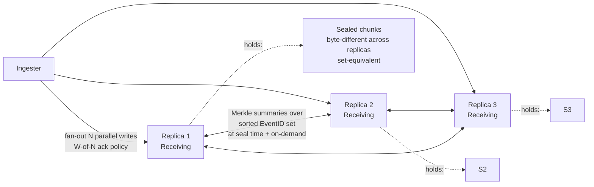

# Fan-out Data-Plane Architecture

**Status:** Design proposal under [gastrolog-2ujjh](dcat://gastrolog-2ujjh). Not yet implemented. Companion to [gastrolog-2i1g9](dcat://gastrolog-2i1g9) (FSM-authority migration); depends on that epic's control-plane work landing first.

## Context

The current cluster data-plane is leader-driven: every record for a vault arrives at the placement leader's node, which appends locally and streams to follower nodes via `replicateToFollower`. After seal, the canonical sealed chunk is re-shipped to followers via `ImportSealedChunk` ([backend/internal/orchestrator/replication.go#L125](backend/internal/orchestrator/replication.go#L125)). Reads route to the placement leader only ([backend/internal/server/query_remote.go#L135](backend/internal/server/query_remote.go#L135) `remoteVaultsByNodeFiltered`); followers don't serve reads.

This model has known pain:

- **Leader bandwidth ceiling.** Each vault's per-write outbound replication traffic is concentrated on one node. The leader's NIC is the per-vault scaling bottleneck.
- **Leader-failure stalls writes.** When the leader's node fails, writes to that vault halt until vault-ctl elects a new leader.
- **Placement-as-residency lies during transitions.** When placement rotates off an unreachable node, residency answers shift before any catchup has occurred — the cluster claims data exists where it doesn't, until catchup converges (the RF=1 redeploy bug).
- **Single-replica reads assume consistency that isn't guaranteed.** Real-time replication has backpressure, transient drops, and leader-transfer windows during which the queried replica may be missing records.

This design replaces the leader-driven data-plane with three coupled mechanisms: fan-out writes from the ingester, set-diff reconcile via EventID Merkle summaries, and a receiving/holding placement split that decouples write intent from data residency.

## Architecture overview



Three mechanisms compose:

1. **Fan-out writes.** Ingester forwarder sends each record to every node in the chunk's `Receiving` set in parallel. Operator chooses W-of-N ack semantics per vault (e.g., "any 2 of 3 acks before durable").
2. **Set-diff reconcile via EventID Merkle summaries.** Replicas converge on set-equality, not byte-identity. Order-different is not divergence; only actual missing EventIDs are.
3. **Receiving/Holding placement split.** `Receiving` = where new records should land. `Holding` = where records actually exist. `Holding ⊇ Receiving` by invariant; placement edits affect Receiving immediately; nodes leave Holding only after explicit confirmation that other holders have their records.

## Benefits

1. **Static parallel throughput.** N actives ≈ N× per-vault write capacity when writes distribute across the Receiving set. The leader-bandwidth ceiling is eliminated.
2. **Dynamic load balancing.** The forwarder shifts writes toward less-pressured replicas using [`chanwatch.PressureGate`](backend/internal/cluster/record_forwarder.go#L90), the existing per-node forward-channel pressure signal. Variance in write throughput drops sharply even at the same average rate.
3. **Failure isolation for writes.** Node failure removes the failed replica from W-of-N ack accounting but does not stall writes — other replicas continue accepting. Single-leader failover gap is gone.
4. **Tunable durability per vault.** W-of-N lets the operator pick the durability/throughput tradeoff explicitly. A compliance vault sets `W = N` (all replicas must ack); a metrics firehose sets `W = 1` (any single ack).
5. **Honest consistency story.** Cross-replica divergence is explicit (via set-diff reconcile) instead of assumed-away. The `dedupWindow` mechanism collapses cross-replica duplicates in search results.

## Mechanism: Receiving/Holding FSM split

`ChunkMeta` (or a parallel per-chunk record) carries two sets:

```go
type ChunkPlacement struct {
    Receiving []NodeID  // where new records should be sent
    Holding   []NodeID  // where records actually exist (superset of Receiving in steady state)
}
```

**Invariants:**

- `Holding ⊇ Receiving` (Receiving is a subset of Holding; nodes that should receive must also hold)
- Adding to Receiving: immediate (placement edit). The node starts receiving new records on the next ingester fan-out cycle.
- Removing from Receiving: immediate (placement edit). The node stops receiving new records but stays in Holding until other holders have its records.
- Adding to Holding: requires the node to have received bytes for at least one record of this chunk (initial entry on first record receipt, or via reconcile).
- Removing from Holding: requires explicit ack that every remaining Receiving member holds the EventIDs this node held. Modeled on `pendingDeletes.ExpectedFrom` shape, inverted.

`ChunkResidency` (consumed by read routing and operator queries) returns `Holding` directly. The placement-derived derivation (`placement_set - pendingDeletes.ExpectedFrom`) under the current architecture is replaced.

**Drain becomes a placement edit:** `cluster drain <node>` removes the node from `Receiving` for every chunk where it currently appears. Holding remains until each chunk's reconcile confirms other holders have the records. Once a chunk's Holding no longer includes the draining node, the node is safe to remove from membership for that chunk. The Draining state from [docs/node-lifecycle-design.md](docs/node-lifecycle-design.md) becomes a thin operator-facing label, not an orchestrated workflow.

## Mechanism: Fan-out writes with W-of-N ack

The ingester forwarder, given a record to write to vault V:

1. Look up the chunk that should receive this record (active chunk for V; FSM-determined).
2. Look up that chunk's `Receiving` set.
3. Send the record in parallel to each node in `Receiving`. Each node appends to its local active chunk file and acks.
4. Wait for `W` acks (per-vault configured). Return success to the producer once W acks arrive.
5. Remaining acks complete in the background. If fewer than W ever arrive, the write is reported failed; the records that DID land remain valid and will be picked up by set-diff reconcile.

**W-of-N policy per vault:**

- `W = N` (default for high-durability vaults): every replica must ack before write is durable.
- `W = N - 1`: any one replica may be slow; the write tolerates one straggler.
- `W = quorum(N)`: majority — `ceil(N/2)`. Balances durability and throughput.
- `W = 1`: any single replica acks; maximum throughput, minimum durability.

The choice is per-vault config, not per-record. Operator sets it based on the vault's purpose.

**Load balancing within Receiving:**

When multiple ingester instances exist and the chunk's Receiving set has N nodes, ingesters distribute writes by consulting `chanwatch.PressureGate`'s per-node pressure metric. The signal is already in the codebase ([record_forwarder.go#L90](backend/internal/cluster/record_forwarder.go#L90)), already broadcast on 1-second cadence, already used by ingesters for upstream backpressure throttling. Fan-out routing reuses the same data: prefer Receiving nodes with lower pressure when N > W.

## Mechanism: Sealing under fan-out

The leader-driven model has a clean rotation decision: the leader's local chunk state is canonical, and `ShouldRotate` evaluated against it gives the authoritative answer. Under fan-out, no replica has canonical state — each replica's local view of records-received, bytes-accumulated, and age differs due to per-record arrival timing.

The mechanism: **first replica whose local state fires `ShouldRotate` proposes the seal; vault-ctl Raft serializes; first proposal wins.**

1. Each replica evaluates `ShouldRotate` locally on every append, against its own `ActiveChunkState` ([chunk/rotation.go#L46](backend/internal/chunk/rotation.go#L46)). The interface is already a pure function of one chunk's state — no cross-replica coordination required to evaluate.
2. The replica whose state hits the threshold first proposes `CmdBeginSeal` (+ `CmdCreateActive` for the successor chunk) via vault-ctl Raft.
3. Other replicas observe the apply, transition the chunk to `Sealing`, and direct new appends to the new active chunk.
4. Reconcile at seal time converges record sets across replicas before the chunk transitions from `Sealing` to `Sealed`.

The triggering replica is whichever's `ShouldRotate` happened to fire first — under load-balanced fan-out routing, that's usually the most-loaded replica, which varies dynamically. Multiple replicas can race; vault-ctl Raft serializes; first to commit wins.

### Why this works for each rotation policy

- **`SizePolicy` / `RecordCountPolicy`**: per-replica state differs (different replicas got different records under fan-out). One replica hits the threshold first and proposes. The triggering count or size is *that* replica's local state; the chunk's final record set comes from reconcile, not the trigger count. The trigger is just the signal.
- **`AgePolicy`**: each replica opens the chunk at slightly different wall-clock times (when `CmdCreateActive` applied locally). Age-based rotation fires at slightly different absolute times across replicas. First to fire proposes; Raft serializes. The chunk's age boundary is determined by whichever replica's clock got there first, not by a synchronized cluster-wide timer.
- **`HardLimitPolicy`** ([chunk/rotation.go#L170](backend/internal/chunk/rotation.go#L170)): caps raw.log at the uint32-offset limit (~4GB). If any replica hits this, seal is required — the file format can't represent more. First-to-fire-proposes handles this naturally; hard-limit on any replica triggers seal cluster-wide.

A replica receiving very few records under load-balanced routing might never see its `ShouldRotate` fire before others propose. That is fine — it just observes the seal command and catches up via reconcile. No requirement that the deciding replica be the most-loaded one; the system needs *some* replica to notice.

### In-flight records at seal time: append to local current active

Records the ingester sends just before `CmdBeginSeal` commits land on different replicas at different times. Each replica accepts the record into whatever its locally-current active chunk is at receive time:

- Replica with `CmdBeginSeal` already applied: record lands in the new active chunk.
- Replica without `CmdBeginSeal` applied yet: record lands in the old (now-sealing) chunk.

The ingester is oblivious to chunk lifecycle. It sends records to replicas; each replica's local FSM state determines which chunk receives the record. Reconcile + `dedupWindow` at query time absorb the consequence (see "Accepted tradeoffs vs leader-driven sealing" below).

#### Considered and rejected: ingester chunk-ID stamping

An earlier design pass proposed the ingester carry a chunk-ID stamp on each record, learned from a watch stream over the vault-ctl FSM, with replicas rejecting records stamped with sealed chunk IDs. The intent was to reduce the cross-chunk-duplicate window from the full Raft commit duration to just the watch-stream propagation lag.

Rejected because the marginal benefit doesn't justify the complexity:

- The cross-chunk-duplicate window is already bounded by Raft commit latency (~10ms). At even 1M records/sec, ~10K records per seal could be cross-chunk — about 1% of a 1M-record chunk, well within compression-ratio noise.
- Stamping introduces chunk-lifecycle awareness in the ingester layer, which was previously oblivious. Ingester must now track current-active-chunk-ID per vault, watch FSM for updates, handle rejection responses, and retry.
- New failure modes: watch-stream disconnect → stale chunk IDs → rejection storms → ingester retry pressure.
- Cross-ingester coordination: if multiple ingester instances exist with different watch-update timing, records from different ingesters carry different chunk IDs during a transition, multiplying the race.
- The reconcile + dedupWindow mechanism already handles cross-chunk duplicates correctly — adding stamping is solving a problem we said was fine to live with.

The simpler model (ingester just sends; replicas accept into local current active) is structurally cleaner and the storage cost is negligible.

### Why not a single rotation coordinator

A reasonable alternative: designate the vault-ctl Raft leader as the rotation decision-maker. Only the leader proposes seals; followers just receive records.

This would work, but it reintroduces a soft leader concept the fan-out model otherwise avoids:

- It's another piece of state to track and a failure mode to handle (rotation coordinator unavailable → no seals fire → chunks grow unbounded → hits hard limit → emergency mode)
- It privileges one replica's view as "the" rotation-triggering state, even though every replica has equally valid local state
- It re-creates the leader-failure-stalls-rotation problem in miniature

The first-to-fire mechanism is more uniform: every replica participates symmetrically; Raft already handles the "multiple proposals, one wins" semantic; no extra coordinator role.

### Accepted tradeoffs vs leader-driven sealing

The first-to-fire-proposes mechanism has two properties that differ from the leader-driven model. Both are accepted, not bugs:

**Same EventID can land in adjacent chunks across replicas.** Under the leader-driven model, "each EventID belongs to exactly one chunk" was an invariant — the leader stamped chunk-ID atomically with append, so no record could be in two chunks. Under fan-out, the race window between `CmdBeginSeal` proposal and apply across replicas means in-flight records can be accepted into the old chunk on replicas where `CmdBeginSeal` hasn't yet applied, and rejected (then retried into the new chunk) on replicas where it has. Set-diff reconcile then *propagates* the duplication: the record ends up in the old chunk on replicas that originally accepted it (and have it pulled in by reconcile on the others), and in the new chunk on replicas that originally rejected it (likewise propagated). After reconcile converges, the record exists in **both** chunks on all replicas.

This is absorbed by `dedupWindow` at query time — `dedupWindow` is already keyed on `chunk.EventID`, so cross-chunk duplicates collapse identically to cross-replica duplicates. The storage cost is one extra copy of each in-flight-at-seal record per affected pair of chunks. With Raft commit latency in milliseconds and typical record rates, this is a small fraction of records (typically dozens out of thousands per seal cycle).

The architectural property change: downstream tooling that assumes "each EventID belongs to exactly one chunk" needs revisiting. Most paths already use `dedupWindow` for cross-source collapse; the same mechanism handles cross-chunk collapse.

**Rotate-by-count becomes approximate.** `RecordCountPolicy` evaluates the trigger replica's local count, not the cluster-wide count. The chunk's actual final record count after reconcile is "trigger count + drift from records that arrived at any replica during the Raft commit window." Drift depends on Raft commit latency × arrival rate, typically 1–3% overshoot on a typically-sized chunk.

For most workloads this is invisible. Operators who set strict count limits for downstream tooling reasons should know the policy is "approximately N records per chunk," not "exactly N." The same caveat applies to `SizePolicy` (size at trigger time vs after-reconcile size) and to `AgePolicy` (the trigger replica's wall-clock vs others' wall-clocks at apply time).

`HardLimitPolicy` is the exception: its limit comes from the file format (uint32 offsets), so even approximate overshoot would break the format. The hard-limit case must be handled specially — any replica approaching the file-format limit must propose seal *before* reaching the actual limit, leaving headroom for the in-flight drift. A small safety margin (e.g., trigger at 95% of the uint32-offset limit) absorbs typical drift without changing the policy interface.

## Mechanism: Set-diff reconcile via EventID Merkle summaries

**Why set-diff and not hash-chain:**

Order-different is the common case under fan-out (parallel ingester writes complete at different times per replica). Set-different (actual missing EventIDs) is rare (only when an ingester's send to a specific replica fails past retry). Hash-chain reconcile would false-positive on order differences; set-diff handles them naturally.

**Mechanism:**

Each replica maintains its records in the existing IngestTS B+ tree ([backend/internal/chunk/file/manager.go#L345](backend/internal/chunk/file/manager.go#L345) `ingestBT`). Index gives canonical per-replica traversal order. The set of EventIDs in this tree IS the set of records this replica holds for the chunk.

Two-tier reconcile: a fast set-equality check that handles the common case, and a Merkle slow path that pinpoints divergence when it exists.

**Fast path — single set-hash:**

1. When `CmdBeginSeal` applies on a replica, no new records can be accepted into the chunk locally. The local EventID set is stable from that moment.
2. Each replica computes a set-hash over its chunk's EventIDs immediately after `CmdBeginSeal` apply. `chunk.EventID` is fully unique by construction (`IngesterID + NodeID + IngestTS + IngestSeq`; `IngestSeq` is the per-ingester rolling sequence that guarantees uniqueness even at colliding IngestTS values — see [chunk/types.go#L219-L234](backend/internal/chunk/types.go#L219)), so the hash can be order-independent or order-dependent and either works:
   - **Order-independent hash**: XOR (or other commutative aggregation) of `hash(EventID)` per record. Same set → same XOR regardless of any traversal order. O(N), no sort, no tiebreaker.
   - **Canonical-sort hash**: sort by full EventID, compute a chained hash. O(N log N) for the sort but produces a Merkle root the slow path can reuse without recomputation.
3. Replicas exchange set-hashes (32 bytes per replica per seal).
4. **If hashes match**: the chunk is set-equivalent across replicas. Seal completes (`Sealing → Sealed`). No Merkle work performed.
5. **If hashes differ**: fall back to the Merkle slow path.

**Slow path — Merkle divergence pinpointing:**

6. Each replica's Merkle tree (built lazily during fast-path computation, or eagerly under the canonical-sort hash option) is exchanged level-by-level.
7. Descend into divergent subtrees until divergent EventIDs are identified. Cost is `O(d × log K)` for `d` differences.
8. Each replica fetches the records it's missing by EventID. Existing replication primitives handle the transfer.
9. Recompute set-hash; verify convergence. Retry the fast-path comparison.

**Cost shape:**

- **Fast-path computation**: O(N) per chunk per replica at seal time. ~100ms for a 1M-record chunk at typical hash rates. One-time.
- **Fast-path exchange**: ~32 bytes per replica per seal. Effectively free.
- **Steady state (no divergence)**: fast path resolves; slow path doesn't activate. Most seals.
- **Realistic divergence (0.01–0.1% missed sends)**: slow path activates. `d × log K × hash_size` for Merkle identification + `d × avg_record_size` for transfer. For K=1M, d=1000: ~640KB metadata + ~200KB record-bytes.
- **Worst case (replica returns from long absence with 50% missing)**: slow path runs to completion. O(K) for full set comparison + O(0.5K × avg_record_size) for transfer.

**When reconcile runs:**

- **At seal time.** Before transitioning a chunk from `ChunkStateSealing` to `ChunkStateSealed`, run one reconcile pass to converge all Receiving members. After seal, the chunk's record set is fixed; later replicas in Holding pull via the same mechanism.
- **On missed-ack triggers.** When fan-out write completes with fewer than `N` acks, schedule a targeted reconcile for that chunk (background, non-blocking).
- **On node return.** When a node re-enters `Live` from `Unreachable`, schedule reconcile for every chunk where the node appears in Receiving or Holding. Catches up missed records during absence.
- **Operator on-demand.** `gastrolog cluster reconcile <vault>` triggers reconcile for all active chunks in the vault.

Reconcile is NOT periodic. Polling-based reconcile is the kind of half-assing the engineering principles call out — events trigger it, the periodic sweep is a last-resort safety net only.

## Mechanism: Fan-out reads for active chunks

Under fan-out writes, each Receiving replica may be missing records the others have (until reconcile converges). For active-chunk queries, a single-replica read returns incomplete results.

The read path for vault V:

1. Determine the chunks the query touches. Split into "sealed" and "active."
2. For sealed chunks: read from any one node in `Holding` (single-replica suffices — reconcile already converged).
3. For active chunks: fan-out read to every node in `Receiving`. Each returns its local view; `dedupWindow` ([backend/internal/server/query.go#L485](backend/internal/server/query.go#L485)) collapses by EventID.

The dedup substrate is already in place — `dedupWindow` is keyed on `chunk.EventID`, exactly the right granularity. Currently used for cross-vault dedup; extending to cross-replica dedup needs no key-logic changes.

**Cost:** active-chunk searches do `RF×` the network bytes (most are duplicates that dedup discards). For typical workloads where active windows are minutes and sealed history is days, this overhead applies to a small fraction of total search bytes.

**Mitigations** (not required at first ship; available later if needed):

- **Stickiness.** Once a query is answered by replica A, route follow-ups to A first. Cuts fan-out for paginated queries.
- **Per-vault read-consistency tier.** Operator picks "strong (fan-out)" or "best-effort (single replica)" per vault.
- **Sample-and-merge.** First response answers fast; remaining replicas merge in for completeness. Latency stays low; bandwidth stays high; completeness opt-in.

## Storage layout: FSM schema additions

The vault-ctl FSM gains a per-chunk placement record:

```go
type ChunkPlacement struct {
    Receiving       []NodeID
    Holding         []NodeID
    PendingPulls    map[NodeID]ExpectedFromSet  // who owes a pull from each holder before removal
}
```

`PendingPulls` mirrors the `pendingDeletes.ExpectedFrom` pattern: when removing a node from Holding, every remaining Receiving member must ack having pulled the records that node held. Existing FSM apply machinery for `pendingDeletes` adapts directly.

New FSM commands:

- `CmdAddReceiving(chunkID, nodeID)` — placement-manager edit
- `CmdRemoveReceiving(chunkID, nodeID)` — placement-manager edit
- `CmdAddHolding(chunkID, nodeID)` — replica's first-record receipt for this chunk
- `CmdBeginHoldingRemoval(chunkID, nodeID)` — placement-manager begins removing a node from Holding; populates PendingPulls
- `CmdAckPull(chunkID, fromNode, toNode)` — toNode acks having pulled records from fromNode; when PendingPulls drains, fromNode is removed from Holding
- `CmdRecordReceived(chunkID, nodeID, eventID)` — optional; tracks per-replica record receipt for cross-validation (could be omitted if Merkle summaries are authoritative)

Most commands are structurally similar to existing ones. Lock discipline, snapshot/restore, prune-on-node-removal all follow established patterns.

## Existing primitives this builds on

| Primitive | Location | Role under fan-out |
|---|---|---|
| `chunk.EventID` | [chunk/types.go#L219](backend/internal/chunk/types.go#L219) | Cluster-wide unique record identifier; the key for set-diff reconcile and dedup |
| `ingestBT` (IngestTS B+ tree) | [chunk/file/manager.go#L345](backend/internal/chunk/file/manager.go#L345) | Per-replica canonical ordering for queries; the source of EventID lists for Merkle summaries |
| `chanwatch.PressureGate` | [cluster/record_forwarder.go#L90](backend/internal/cluster/record_forwarder.go#L90) | Per-node forward-channel pressure signal; used by ingester forwarder for load-balancing within Receiving |
| `dedupWindow` | [server/query.go#L485](backend/internal/server/query.go#L485) | EventID-keyed cross-source dedup; extends to cross-replica dedup for active-chunk searches |
| `pendingDeletes.ExpectedFrom` pattern | [vaultraft/vaultctlfsm/fsm.go](backend/internal/vaultraft/vaultctlfsm/fsm.go) | Template for `PendingPulls` (Holding-removal acks). Same lock/snapshot/prune semantics |
| Vault-ctl Raft group | [orchestrator/reconfig_vaults.go#L1467](backend/internal/orchestrator/reconfig_vaults.go#L1467) | Serializes chunk-lifecycle and placement-edit commands (unchanged from current architecture) |
| `ingestTSMonotonic` flag | [chunk/file/manager.go#L286](backend/internal/chunk/file/manager.go#L286) | Already anticipates out-of-order arrival; codebase is prepared for the fan-out arrival model |

No new primitives are invented. The architecture is built on existing well-shaped infrastructure.

## Dependencies on the control-plane epic

This epic depends on [gastrolog-2i1g9](dcat://gastrolog-2i1g9) landing first:

- **Node lifecycle states** (`Live`, `Unreachable`, `Maintenance`, `Removed`) — needed to gate when nodes can be added/removed from Receiving and Holding. The Draining and Decommissioning states from the control-plane design become thinner here (drain = placement edit; decommissioning = waiting for PendingPulls to drain).
- **Learner-based join** — new nodes joining the cluster get added to Receiving for new chunks but not to Holding for historical chunks until they catch up. The learner mechanism's per-group apply-index promotion sets the watermark.
- **Disk-vs-FSM authority cleanup** ([gastrolog-5dfv7](dcat://gastrolog-5dfv7)) — the audit findings target code paths that need to consult FSM authority. Under this epic, that authority is the `Holding` set instead of placement-derived residency.
- **Orphan repatriation** ([gastrolog-32bf2](dcat://gastrolog-32bf2)) — repatriation becomes a `CmdAddHolding` for the repatriating node; the chunk re-enters the active set.

The control-plane epic provides the substrate (states, authority discipline, learner mechanism); this epic redesigns the data-plane on top.

## Migration from current architecture

The current `replicateToFollower` + `ImportSealedChunk` mechanisms cannot be removed mid-flight without breaking existing clusters. Migration approach:

1. **Flag-gated rollout.** Per-vault config: `WriteModel = LeaderDriven` (current) or `FanOut` (new). Default LeaderDriven during transition.
2. **Implement fan-out alongside existing.** New `Receive` RPC per replica (replaces leader's `replicateToFollower` call); new FSM commands for Receiving/Holding; new reconcile mechanism. Old mechanisms remain operational for vaults still in LeaderDriven mode.
3. **Per-vault opt-in.** Operator switches vaults to FanOut individually after observing the mechanism works for less-critical vaults.
4. **Remove old mechanism.** Once all clusters have migrated all vaults, `replicateToFollower` and `ImportSealedChunk` paths get deleted ([gastrolog-1bd56](dcat://gastrolog-1bd56) had already flagged ImportSealedChunk for removal).

Per-vault rollout means the cluster runs both data-plane models simultaneously during the transition. The FSM commands are disjoint (Receiving/Holding for new mode; placement for old mode), so there's no consistency risk between them.

## Out of scope (deferred to implementation issues)

- Specific Merkle tree fan-out / branching factor
- Default W-of-N policy values per vault type
- Reconcile retry / backoff strategy on transient failure
- Bulk-mode reconcile for replica returning from long absence (vs. iterative)
- UI surface for per-vault W-of-N configuration
- Search-fan-out detection: how the query path identifies "this query touches an active chunk" cheaply
- Tombstone-expiry policy (orthogonal but worth pairing with this work)

## Open design questions

These are real forks that need a decision before implementation:

1. **First ingester or all ingesters do fan-out?** If multiple ingester instances exist, does the first to receive a record do the fan-out to all replicas, or does each ingester instance route independently? Affects how W-of-N is counted.
2. **PendingPulls granularity.** Per-chunk, per-record, or per-EventID-range? Per-chunk is cheapest; per-EventID-range is most precise; per-record is probably too granular.
3. **W-of-N under partial Receiving.** If Receiving shrinks mid-write (e.g., node enters Maintenance while writes are in flight), do in-flight writes use the old W or the new W?
4. **Holding entry on first record receipt — atomic or batched?** Each `CmdAddHolding` is an FSM apply; per-record could be expensive. Batched (first record in a "batch" triggers AddHolding) loses some precision. Worth exploring.
5. **Reconcile triggering policy.** What heuristics trigger an on-demand reconcile vs. waiting for seal-time? Missed-ack counts? Time-since-last-reconcile?

These need design issues under this epic before the implementation issues can be drafted with real acceptance criteria.

## Acceptance for this design

This document is sufficient to open the following design and implementation issues under this epic:

1. **Design (open question)**: First-ingester vs all-ingesters fan-out semantics
2. **Design (open question)**: PendingPulls granularity
3. **Design (open question)**: W-of-N under partial Receiving / mid-write Receiving changes
4. **Design (open question)**: Reconcile triggering heuristics
5. **Implement**: Receiving/Holding FSM schema + commands + apply handlers
6. **Implement**: Fan-out ingester forwarder routing with W-of-N ack accounting
7. **Implement**: Set-diff reconcile mechanism with Merkle summaries
8. **Implement**: Read fan-out for active chunks; dedupWindow extension
9. **Implement**: Per-vault W-of-N configuration (system FSM + UI + CLI)
10. **Implement**: Migration flag for per-vault opt-in
11. **Implement**: Removal of `replicateToFollower` + `ImportSealedChunk` after migration complete
12. **Test**: Multi-node fan-out write + reconcile regression test

Implementation issues are sequenced after design issues 1-4 close.

## Relationship to other work

- Parent epic: [gastrolog-2ujjh](dcat://gastrolog-2ujjh) (this epic)
- Predecessor epic: [gastrolog-2i1g9](dcat://gastrolog-2i1g9) (FSM-authority migration: lifecycle, learners, audit cleanup) — lands first
- Related lifecycle design: [docs/node-lifecycle-design.md](docs/node-lifecycle-design.md) — covers the control-plane states; three pieces of that design (placement-rotation gate, Draining orchestrator, active-chunk seal on preStop) are transitional and get reframed when this epic lands
- Related audit: [docs/disk-authority-audit.md](docs/disk-authority-audit.md) — findings target code paths that consult FSM authority; the FSM field they target becomes Holding under this epic
- Superseded design issue: [gastrolog-5rh68](dcat://gastrolog-5rh68) (closed) — the Option A resolution there is replaced by the Receiving/Holding split; Option B (pendingCatchups twin) was essentially this design's structure, generalized
- Deferred but related: [gastrolog-617m6](dcat://gastrolog-617m6) (active-chunk reconcile at seal: per-chunk EventID hash chain) — its hash-chain mechanism is replaced by set-diff (order-sensitive vs order-independent); the sub-epic stays deferred under [gastrolog-3qr8z](dcat://gastrolog-3qr8z) but the design direction it captured informed this work
- Companion future feature: [gastrolog-1bd56](dcat://gastrolog-1bd56) (deferred — Remove ImportSealedChunk + sealed-chunk record-shipping) — falls out naturally as part of this epic's "remove old mechanism" step
