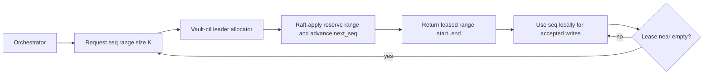
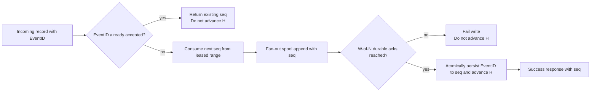
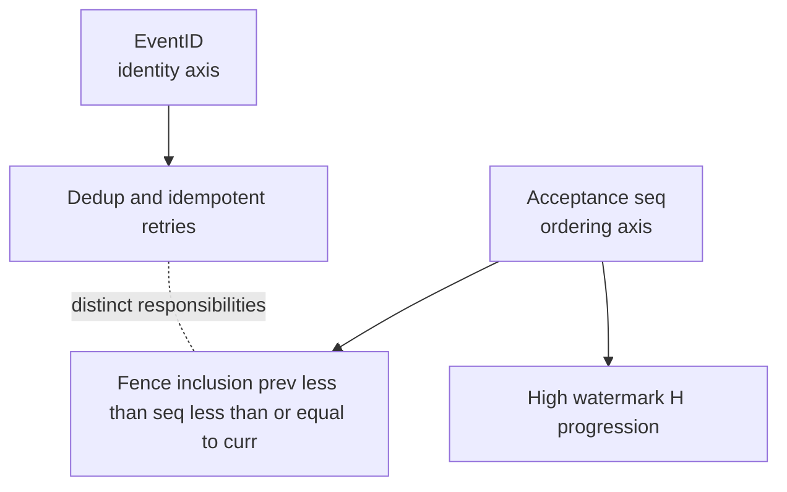
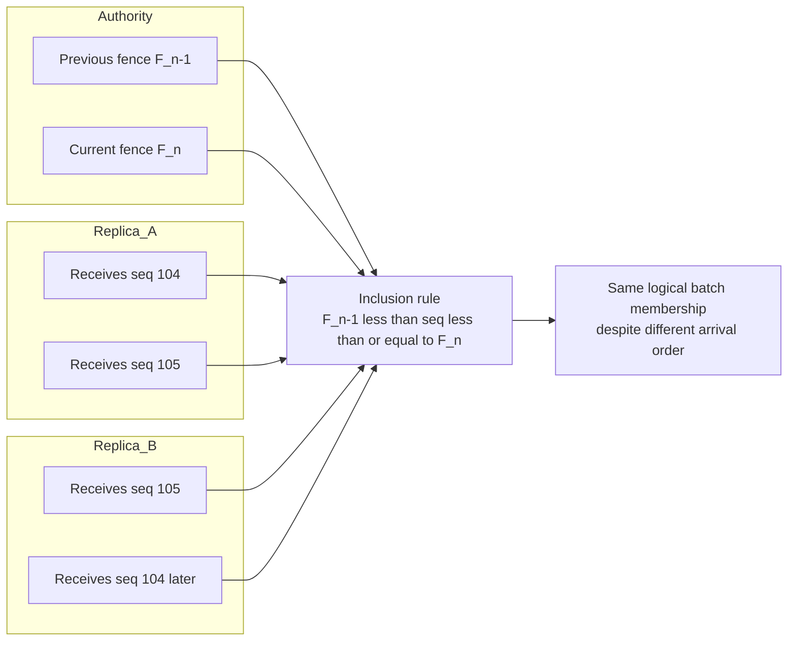
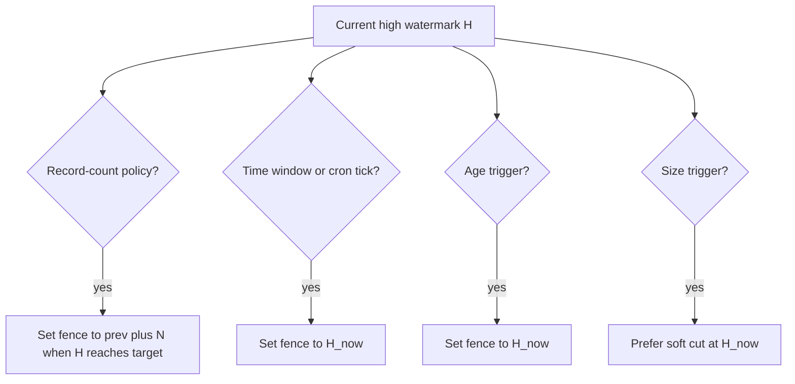
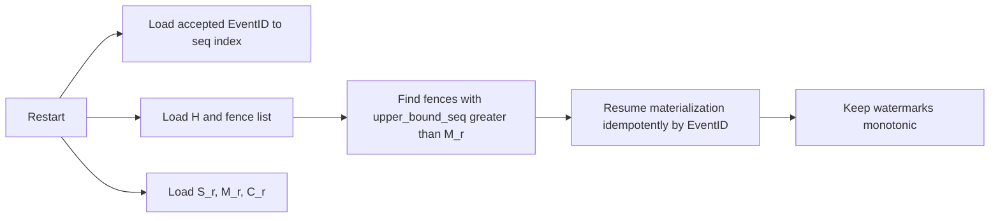

# Fan-Out V2 High Watermark Contract

Status: draft, untracked design note.

This document defines what the high watermark is, what it is not, and how it is used to cut deterministic fences for chunk materialization.

Related:

- `docs/fan-out/v2/architecture-overview.md`
- `docs/fan-out/v2/feasibility-gate.md`
- `docs/fan-out/v2/spool-state-machine.md`

Architecture-level fan-out pipeline and design rationale live in `architecture-overview.md`. This document is contract-only: sequence, watermarks, fences, and reconcile hole semantics.

## Why this exists

In V1, chunk naming and rotation decisions were coupled to the write hot path.
Under churn, that created synchronization pressure and ambiguous inclusion rules.

V2 separates concerns:

- write path decides durability (`W-of-N`),
- high watermark provides global ordering for accepted writes,
- fences cut deterministic batch boundaries,
- chunk IDs are created later during materialization.

## Core definition

For each vault, define a monotonic logical sequence:

- `H` (ingest high watermark) = highest logical sequence number durably accepted for that vault.

The destination write pipeline consumes `seq` values from leased allocator ranges before replica fan-out, but `H` advances only when the write is durably accepted (`W-of-N`).

High watermark is therefore a logical position in the accepted-write stream, not a byte offset and not a per-node local row count.

## Sequence allocation authority (not hand-waved)

`seq` values do not appear by magic. They are generated by a vault-scoped allocator with explicit authority and durability rules.

Authority choice for V2:

- allocator authority is the current **vault-ctl Raft leader** for that vault.

Persistence model:

- Raft stores allocator control state (for example `next_seq`, allocator epoch, and range-allocation metadata).
- Raft does **not** store one entry per record `EventID`.

Hot-path model:

- orchestrators request leased sequence ranges (for example `[500000,500999]`) from allocator authority,
- orchestrators consume leased values locally for accepted writes,
- when lease is exhausted, orchestrator renews,
- on authority failover, new leader continues from durable allocator state.

Type and bounds:

- `seq` is `uint64`,
- `0` is reserved as sentinel,
- allocator starts at `1`,
- overflow handling must be explicit and fail closed (stop allocation + alert), even though practical exhaustion is not expected.

Non-negotiable invariants:

- no overlapping leased ranges,
- monotonic global allocation across epochs,
- no per-record Raft logging on ingest hot path.

Durable ownership:

- allocator control state (`next_seq`, lease epochs/ranges) is owned by vault-ctl Raft.
- accepted-write state (`EventID -> seq`) and local sequence presence are owned by destination spool durability on replicas.
- `H` is an accepted-write watermark, not an allocation watermark.

## `EventID` vs acceptance sequence (`seq`)

These are distinct identifiers and must not be merged.

- **`EventID`** (already in GastroLog record model) is record identity for dedup/idempotency.
  It includes ingester-local components (`IngesterID`, `NodeID`, `IngestTS`, `IngestSeq`).
- **`seq`** (defined by this contract) is vault-wide logical acceptance order.

Why this distinction matters:

- `EventID.IngestSeq` is per-ingester/local and does not provide vault-global ordering.
- Different ingesters can emit overlapping local sequence values.
- Fence inclusion needs one monotonic vault-wide axis; that axis is `seq`, not `EventID` fields.

Rule:

- dedup identity uses `EventID`,
- ordering and fence inclusion use `seq`.

## What high watermark is NOT

`H` is not:

- local spool append offset on any node,
- local materialization progress,
- local chunk record count,
- post-reconcile sealed count.

Those are separate values and must not be conflated in code, metrics, or operator UX.

## Watermark taxonomy (must stay separate)

Per vault:

- **Ingest high watermark (`H`)**: global logical accepted-write position.
- **Fence high watermark (`F_n`)**: immutable cut point for fence `n`; always `F_n <= H_at_cut`.

Per `(vault, node)` replica:

- **Spool durable watermark (`S_r`)**: highest `seq` durably appended to this replica spool.
- **Materialization watermark (`M_r`)**: highest `seq` already materialized into local chunk set.
- **Convergence watermark (`C_r`)**: highest fence or `seq` range confirmed converge-sealed on this replica.

Required ordering (steady-state expectation):

- `C_r <= M_r <= S_r <= H`

Temporary deviations are allowed during failures/recovery, but backwards movement is never allowed.

## Write-path contract

For an incoming record with `EventID = e` (per destination vault):

1. Dedup precheck against accepted `EventID` index for the destination vault.
2. If `e` is already accepted, return existing `seq` (idempotent success) and do NOT advance `H`.
3. Otherwise consume next available `seq` from the destination vault's leased range.
4. Fan out append `(e, seq)` to destination replicas and wait for `W-of-N` durable acks.
5. On success, commit accepted record metadata `(e, seq)` and advance `H := seq`.
6. On failure, do not advance `H`; the `seq` remains unaccepted.

Atomicity requirement:

- `(e, seq)` acceptance and `H` advancement must be one durable transaction at the authority that owns `H`.

Without this, retries can create gaps, duplicates, or non-deterministic inclusion.

## Fence contract

Fence `n` is defined by:

- `prev = F_(n-1)` (or `0` for first fence),
- `curr = F_n` where `curr > prev`.

Inclusion rule is deterministic:

- record belongs to fence `n` iff `prev < seq <= curr`.

This rule is the canonical answer to "which records are in this sealed batch".

Out-of-order physical arrival across replicas is allowed. Inclusion remains deterministic because it is computed from `seq` range, not local append order.

## Rotation policy mapping to high watermark

Policies become "when to set next `F_n`":

- **Record-count `N`**: set `F_n = prev + N` once `H >= prev + N`.
- **Time window / cron**: on schedule tick, set `F_n = H_now`.
- **Age**: when age trigger fires, set `F_n = H_now` (age checks drive timing, H drives inclusion).
- **Size**: if retained, prefer soft trigger to cut `F_n = H_now`; do not require exact global bytes per fence.

This keeps inclusion deterministic even when trigger source is time or local observation.

## Dedup and retries semantics

To keep count semantics stable, dedup must happen before `H` increments.

- Client retry of same record (`EventID` equal): returns same `seq`, no new count.
- New record (`EventID` new): consumes one new `seq`.

Therefore, "count by high watermark delta" means count of unique accepted records, not attempts.

## Burned lease gaps and count fences

V2 constrains unassigned sequence gaps so record-count fences remain deterministic:

- Unassigned gaps are allowed only in abandoned lease tails (typically after allocator authority failover).
- Unassigned gaps must not exist below current accepted frontier for active writers.

Count-fence rule:

- record-count fences are based on accepted sequence progression (`H`) under the above gap constraint.
- if an implementation permits interior unassigned gaps below accepted frontier, it must switch to explicit accepted-cardinality accounting instead of raw sequence delta.

## Retention-route semantics (vault to vault)

When retention disposition routes records from source vault `V_src` into destination vault `V_dst`, sequence handling is per destination vault and must not be reused from source:

- `V_src` sequence (`seq_src`) remains source-local history.
- `V_dst` assigns a new destination sequence (`seq_dst`) using `V_dst` allocator lease rules.
- destination fenceing/materialization uses `seq_dst` only.

So the same logical record can carry:

- identity: same `EventID`,
- source ordering metadata: `seq_src` (optional lineage field),
- destination ordering metadata: `seq_dst` (authoritative for `V_dst` chunk inclusion).

Required contract:

- no cross-vault sequence reuse,
- destination write ack path applies normal `W-of-N` durability and destination dedup before advancing `H_dst`,
- if lineage is stored, it is informational and must not replace destination ordering.

## Hole classification for reconcile

Replica hole reporting is expected and useful in this model, but holes are not all equal.

Each hole in a fence range must be classified against allocator/fence authority:

- **Assigned-missing hole**: sequence was allocated and accepted for this vault but is absent on this replica.
  - Action: must reconcile (pull/fill).
  - Severity: data-missing until healed.
- **Unassigned gap**: sequence was never assigned/accepted (for example burned lease tail after failover).
  - Action: no data pull required.
  - Severity: none if gap is documented in allocator history.

Reconcile input should therefore be:

- expected assigned sequence set for the fence range (from authority),
- replica-present sequence set/range summary,
- difference classified into assigned-missing vs unassigned-gap.

A replica must never fabricate records to fill unassigned gaps.

## Recovery rules

On restart, each node reloads:

- accepted `(EventID -> seq)` index view for dedup/idempotency,
- last known `H` and fence list (`F_1..F_n`),
- local `S_r`, `M_r`, `C_r`.

Recovery must preserve:

- no reassignment of sequence numbers for already accepted `EventID`s,
- no rewind of any watermark,
- deterministic replay of materialization from `(M_r, F_n]`.

## Observability contract

Expose these separately:

- `vault_ingest_high_watermark`,
- `vault_fence_high_watermark`,
- `vault_replica_spool_watermark{node}`,
- `vault_replica_materialization_watermark{node}`,
- `vault_replica_convergence_watermark{node}`.

Do not expose any single "record count" metric as authoritative unless it is explicitly derived from converged fences.

## Worked example

Assume previous fence `F_7 = 700`, record-count policy `N = 100`.

- Writes advance `H` from `701 ... 800`.
- At `H = 800`, policy condition met; cut `F_8 = 800`.
- Fence 8 record set is exactly `701..800`.
- Replica A might have `S_A=800, M_A=790`; Replica B `S_B=798, M_B=798`.
- Materialization/reconcile proceeds until both converge for fence 8.

Despite replica skew, inclusion remains deterministic because it is sequence-based.

## No-go conditions

Reject any proposal that:

- uses local spool offsets as cross-node inclusion identity,
- increments `H` before `W-of-N` durability success,
- increments `H` for duplicate `EventID` retries,
- computes fence inclusion by local chunk contents instead of `seq` range.
