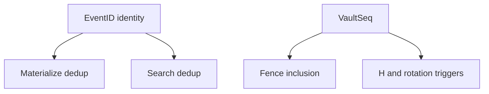

# Fan-Out V2 Sequence, Fence, and Watermark Contract

Status: draft. **Ingest assign / accept:** superseded by [write-path-lock.md](write-path-lock.md) where they conflict.

This document defines `VaultSeq`, fences, watermarks, and hole classification for materialization and operations.

Related:

- [write-path-lock.md](write-path-lock.md)
- [architecture-overview.md](architecture-overview.md)
- [spool-state-machine.md](spool-state-machine.md)

## Why this exists

V1 coupled chunk naming to the write hot path. V2 separates:

- write path: durability (`W-of-N`) + **`VaultSeq` labeling**,
- fences: deterministic batch boundaries over assigned seq,
- chunk IDs: minted at materialize time.

## Core definition

For each vault, **`VaultSeq`** is a monotonic `uint64` accept label starting at `1` (`0` reserved).

- **`H` (ingest high watermark)**: highest **`VaultSeq` accepted** under local counting policy on a reference view (typically the ingesting cluster path). **Not** a guarantee of contiguous prefix presence on every replica.
- **`F_n` (fence)**: immutable upper bound; inclusion **`prev < VaultSeq <= curr`**.

Allocator authority: **vault-ctl Raft leader**. Persistence: `next_seq`, epoch, **multi-node swath grants** (see write-path-lock). No per-record Raft entries.

## `EventID` vs `VaultSeq`

| | `EventID` | `VaultSeq` |
|---|---|---|
| Role | Identity | Accept label / fence axis |
| Dedup | materialize, search, other choke points | not used for identity dedup on ingest |
| Scope | global record identity | per destination vault |

**Ingest idempotency is not required.** Duplicate accepts may receive different `VaultSeq` values until downstream dedup.

## Sequence allocation (swaths)

- Each ingesting node requests **swaths** `[start..end]` from the vault-ctl leader.
- Node assigns with local `next++`; attaches `VaultSeq` before replica fan-out.
- Multiple nodes hold **concurrent non-overlapping swaths** for the same vault.
- Abandoned swath tails are **burned** → **unassigned gaps**.

Hot-path Raft frequency: ~one apply per swath size (default 256), not per record.

## Write-path contract (summary)

See [write-path-lock.md](write-path-lock.md) for full detail. Summary:

1. Router assigns `VaultSeq` from local swath (no `EventID` lookup).
2. Fan out labeled record to all replicas in parallel.
3. Replicas **slot-write** by `VaultSeq` (OOO OK).
4. `W-of-N` decides accept success on the ingesting router.

## What `H` is NOT

- local spool slot arrival order,
- unique-`EventID` count,
- contiguous-prefix present on all replicas,
- post-reconcile sealed count.

## Watermark taxonomy

Per vault:

- **`H`**: highest accepted **`VaultSeq`** (acceptance seq count axis).
- **`F_n`**: fence upper bound; `F_n <= H` at cut time.

Per `(vault, replica)`:

- **`S_r`**: highest **`VaultSeq`** with a durable spool slot on this replica.
- **`M_r`**: highest **`VaultSeq`** materialized into local chunks.
- **`C_r`**: highest fence upper bound converge-sealed locally.

Steady-state expectation: `C_r <= M_r <= S_r` (per replica). **`H` is global policy signal**, not required to equal `S_r` on every node at every instant.

OOO slot arrival means **`S_r` can advance on high seq while lower seq slots are still missing** → assigned-missing until filled or healed.

## Fence contract

Fence `n`: `prev = F_(n-1)` (or `0`), `curr = F_n`, `curr > prev`.

Inclusion: record belongs to fence `n` iff **`prev < VaultSeq <= curr`**.

Same membership on every replica once all **assigned** seq in range have slots (holes excluded).

## Rotation policy mapping

- **Record-count `N`**: cut when **`H >= prev + N`** (seq accepts, not unique EventIDs).
- **Time / age / size soft triggers**: cut at `F_n = H_now` (seq at trigger).

Document operator-facing copy accordingly.

## Materialize dedup (canonical choke point)

For fence range `(prev, curr]`:

1. Read each assigned **`VaultSeq`** slot.
2. Emit chunk records; **collapse duplicate `EventID`** (default: keep lowest `VaultSeq`).
3. Missing assigned seq → assigned-missing; never-assigned seq in range → unassigned gap.

## Burned swath gaps

- Allowed for abandoned swath tails and epoch bumps.
- **Unassigned gaps** must not be healed with fabricated records.
- Record-count fences operate on **assigned seq axis**; large gaps from slow-node burns are visible in allocator history.

## Retention-route semantics

Destination vault assigns **new `VaultSeq`** per accept. Same `EventID`, new seq. Source seq is lineage only.

## Hole classification

| Class | Meaning | Action |
|---|---|---|
| **Assigned-missing** | Seq was assigned and fan-out expected; slot missing on replica | heal / pull |
| **Unassigned gap** | Seq never assigned (burned tail) | no pull |

## Recovery

On restart:

- reload swath grants / epoch from allocator state,
- reload `H`, fences, `S_r`, `M_r`, `C_r` from durable markers,
- resume materialize for fences with `upper_bound > M_r` (idempotent by **`EventID`** at materialize),
- no watermark rewinds.

No requirement to reload assign-time **`EventID → VaultSeq`** index on routers.

## Observability

Expose separately:

- `vault_ingest_high_watermark`
- `vault_fence_high_watermark`
- `vault_replica_spool_watermark{node}`
- `vault_replica_materialization_watermark{node}`
- `vault_replica_convergence_watermark{node}`
- per-node swath grant ranges (holder, start, end, epoch)

Do not label seq-based counts as unique-event counts unless derived post-materialize.

## No-go conditions

Reject proposals that:

- use local append offset as cross-node inclusion identity,
- require ingest-time `EventID` dedup for correctness,
- compute fence membership from chunk contents instead of **`VaultSeq` range**,
- block slot write waiting for predecessor seq in RAM.
