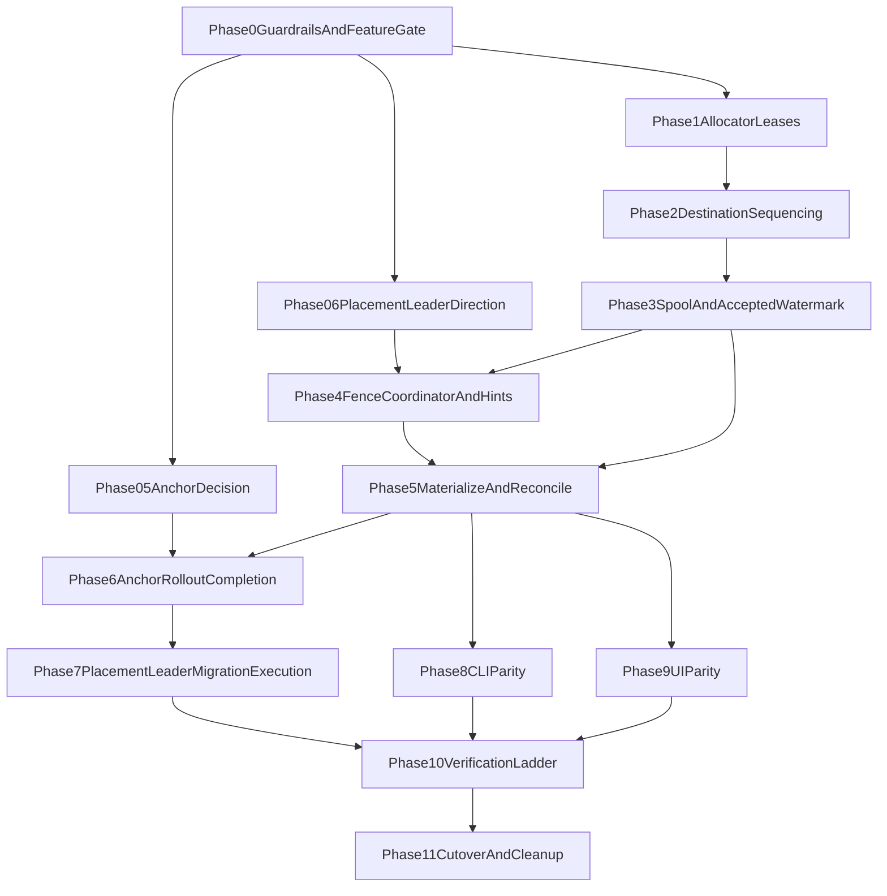

# Fan-out V2 Implementation Plan

## Branch isolation policy (non-negotiable)

All V2 implementation work happens on a dedicated branch (or stacked V2-only branches).

- Do not merge any V2 code, schema, API, CLI, or UI changes into `main` until V2 passes the full validation ladder (unit + multinode + e2e + live k8s) and stakeholders explicitly approve cutover.
- `main` remains the stable control baseline during V2 development and validation.
- If an intermediate V2 phase is incomplete or fails validation, continue iteration on V2 branches only; do not partially merge to `main`.
- Cutover to `main` is a single intentional decision after verification, not incremental leakage.

## Stacked-branch bugfix policy

When a bug is discovered during V2 work:

- Fix it on the branch where it originates (or the nearest parent branch in the same V2 stack).
- Avoid creating detached side branches/issues for every incidental fix if it makes stack reconciliation harder.
- Keep fixes aligned with stack topology so downstream branches inherit them naturally.
- Only split a separate branch/issue when the bug is truly cross-cutting and cannot be cleanly owned by one stack layer.
- Keep terminology aligned with [docs/ubiquitous_language.md](/Users/kluzz/Code/gastrolog/docs/ubiquitous_language.md) when writing bugfix code/comments/tests to avoid vocabulary drift in the stack.

## Branch topology decision (explicit)

Use stacked phase branches, not a single long-running epic branch.

- One parent V2 foundation branch, then one child branch per phase (or tightly-coupled phase pair).
- Bugfixes land on the originating phase branch (or nearest parent in the same stack), then flow upward.
- Avoid detached bugfix branches unless the bug is cross-cutting across multiple stack layers.

## Scope and delivery strategy

- Implement V2 in phases behind explicit feature gates so each phase is testable and revertable.
- Keep one authoritative source for V2 architecture/contracts in:
  - [write-path-lock.md](write-path-lock.md) — **locked write path**
  - [phase-rework-map.md](phase-rework-map.md) — stack rework order
  - [architecture-overview.md](architecture-overview.md)
  - [high-watermark-contract.md](high-watermark-contract.md)
  - [spool-state-machine.md](spool-state-machine.md)
- Default rollout pattern:
  - keep current path as default,
  - add per-vault opt-in write model,
  - cut over test vaults first,
  - then promote to default after k8s validation.

## Implementation invariants checklist (with phase gate)

**Authoritative ingest/spool accept:** [write-path-lock.md](write-path-lock.md). Items below reflect the locked model (2026-05-26).

- **Branch isolation** (from Phase 0): all V2 work stays on dedicated V2 stack branches; no partial merge to `main`.
- **Feature gate ownership** (from Phase 0): per-vault write-model flag lives in config schema and is read on hot path.
- **Two fan-outs stay distinct** (from Phase 0): route fan-out and replica fan-out are separate operations.
- **Anchor model decision is explicit** (from Phase 0.5): no implicit reliance on synchronous `ChunkID` for new writes.
- **Per-router swath assign** (from Phase 1–2): vault-ctl leader grants seq swaths per node; ingesting router assigns **`VaultSeq`** locally before fan-out.
- **Direct sequenced replica fan-out** (from Phase 2): ingesting router fans out labeled writes to all replicas; no chunk-append forward landing.
- **Durability ordering** (from Phase 3): write ack after destination-vault `W-of-N` slot durability success.
- **Identity vs ordering** (from Phase 2+): `EventID` identity dedup at materialize/search choke points; **`VaultSeq`** for fences; ingest idempotency **not** required.
- **Spool slots in windows** (from Phase 3): OOO slot arrival required; no RAM reorder buffer.
- **Fence determinism** (from Phase 4): inclusion rule remains `prev_fence < VaultSeq <= curr_fence`.
- **Multi-swath allocator** (from Phase 1 rework): non-overlapping concurrent swaths per node; burned tails → unassigned gaps.
- **No per-record Raft logging** (from Phase 1): allocator control state on Raft, per-record accepted data off Raft.
- **Hole discipline** (from Phase 5): assigned-missing vs unassigned-gap; materialize **`EventID`** dedup.
- **Retention re-sequencing** (from Phase 2): routed retention records receive new destination-vault **`VaultSeq`**.
- **Crash model carry-over** (from Phase 3): slot/window index-last commit; uncommitted tails truncated on restart.
- **Window reclaim safety** (from Phase 3/5): reclaim only after materialization + reconcile safety watermark.
- **Convergence gate** (from Phase 5): full sealed semantics require converge-sealed marker.
- **Pre-convergence read policy** (from Phase 5): coverage/visibility/labeling explicitly defined and observable.
- **Operator parity** (from Phase 8/9): CLI and UI both support config and inspection for verification workflows.
- **P0 write-path gate** (before Phase 10 sign-off): 4+ node asymmetric-ingest test per write-path-lock.md.

See [phase-rework-map.md](phase-rework-map.md) for branch restack after design merge.

## Phase dependency graph

## Execution phases (condensed checklist)

## Phase 0: Guardrails and feature gate

Deliver:

- Per-vault V2 feature gate in config schema:
  - [backend/internal/system/vault.go](/Users/kluzz/Code/gastrolog/backend/internal/system/vault.go)
  - [backend/internal/system/config.go](/Users/kluzz/Code/gastrolog/backend/internal/system/config.go)
- Hot-path branch points read the gate:
  - [backend/internal/orchestrator/ingest.go](/Users/kluzz/Code/gastrolog/backend/internal/orchestrator/ingest.go)
  - [backend/internal/orchestrator/routing.go](/Users/kluzz/Code/gastrolog/backend/internal/orchestrator/routing.go)
- Guardrail tests (not comments-only) for:
  - route fan-out vs replica fan-out separation,
  - destination-vault sequence ownership,
  - no V2 hot-path chunk naming.

Verify:

- [backend/internal/orchestrator/routing_test.go](/Users/kluzz/Code/gastrolog/backend/internal/orchestrator/routing_test.go)
- [backend/internal/orchestrator/lifecycle_test.go](/Users/kluzz/Code/gastrolog/backend/internal/orchestrator/lifecycle_test.go)

## Phase 0.5: Anchor decision lock

Deliver:

- Explicit anchor model decision for pre-materialized records (no deferred decision).
- Migration surface declared now:
  - [backend/api/proto/gastrolog/v1/query.proto](/Users/kluzz/Code/gastrolog/backend/api/proto/gastrolog/v1/query.proto)
  - [backend/internal/query/context.go](/Users/kluzz/Code/gastrolog/backend/internal/query/context.go)
  - [backend/internal/server/query_context.go](/Users/kluzz/Code/gastrolog/backend/internal/server/query_context.go)

Verify:

- GetContext anchor tests over pre-materialized + post-materialized records.

## Phase 0.6: Placement-leader direction lock

Deliver:

- Early migration decision: `VaultPlacement.Leader` is not V2 write-path authority.
- Transitional coexistence rule for legacy non-V2 code paths.

## Phase 1: Allocator swaths on vault-ctl Raft

Deliver:

- Multi-holder swath grants (concurrent non-overlapping ranges per node) — **rework** from single `ActiveLease`:
  - [backend/internal/vaultraft/vaultctlfsm/fsm.go](/Users/kluzz/Code/gastrolog/backend/internal/vaultraft/vaultctlfsm/fsm.go)
  - [backend/internal/vaultraft/cmd.go](/Users/kluzz/Code/gastrolog/backend/internal/vaultraft/cmd.go)
- Burned-tail semantics for abandoned swaths.
- No per-record Raft entries.

Verify:

- Concurrent swath grants to multiple nodes without overlap.
- Burn on node loss / epoch bump.
- WAL replay tests unchanged in intent.

## Phase 2: Router swath assign and sequenced fan-out

Deliver:

- Per-node swath cache per destination vault; refill from allocator leader.
- Assign **`VaultSeq`** on ingesting router (`swath.next++`); attach before fan-out.
- Direct sequenced replica fan-out from ingesting node (all RF members).
- **Remove** sequenced vault landing on chunk `Append` / residency relay.
- Same rule for retention-route writes.

Verify:

- Asymmetric multi-ingester scenario (see write-path-lock.md validation gate).
- Same **`VaultSeq`** on all replicas per write.
- Multi-vault route fan-out assigns independent seq per vault.

## Phase 3: Spool windows, slots, and accepted-write semantics

Deliver:

- Sequence **windows** (allocator swath range) containing **slots** keyed by **`VaultSeq`**:
  - [backend/internal/spool/file/manager.go](/Users/kluzz/Code/gastrolog/backend/internal/spool/file/manager.go)
  - [backend/internal/spool/memory/manager.go](/Users/kluzz/Code/gastrolog/backend/internal/spool/memory/manager.go)
- OOO slot arrival required; no monotonic-tail reject.
- Crash model: index-last commit per slot/window.
- W-of-N ack after slot durability.
- Metrics: `vault_replica_spool_watermark{node}`.

Verify:

- OOO slot write tests.
- Crash/restart at slot boundary.
- No write ack on failed fan-out.
- Window reclaim gated on materialization watermark.

## Phase 4: Fence coordinator + hint protocol

Deliver:

- Authoritative fence coordinator on vault-ctl leader:
  - [backend/internal/orchestrator/vault_ctl_leader_manager.go](/Users/kluzz/Code/gastrolog/backend/internal/orchestrator/vault_ctl_leader_manager.go)
  - [backend/internal/orchestrator/rotationsweep.go](/Users/kluzz/Code/gastrolog/backend/internal/orchestrator/rotationsweep.go)
- Ephemeral stale-safe `FenceHint` handling.
- Explicit coexistence with legacy placement-leader references for non-V2 path.
- Metrics:
  - `vault_ingest_high_watermark`
  - `vault_fence_high_watermark`

Verify:

- Leader-not-holder + stale hint suppression:
  - [backend/internal/orchestrator/reliability_orch_harness_test.go](/Users/kluzz/Code/gastrolog/backend/internal/orchestrator/reliability_orch_harness_test.go)

## Phase 5: Materialize and reconcile

Deliver:

- Materializer reads spool **slots** by **`VaultSeq`**; **dedup by `EventID`** at emit.
- Hole classification: assigned-missing vs unassigned gap (burned swaths).
- Converge-sealed gating.
- Re-evaluate peer-pull heal work against slot model (see phase-rework-map.md).

Verify:

- Duplicate `EventID` at two seqs in one fence → one sealed record.
- Assigned-missing holes heal when applicable.
- Unassigned gaps untouched.
- 4+ node write-path gate passes before full ladder.

## Phase 6: Anchor rollout completion

Deliver:

- Complete API/query migration from Phase 0.5 decision:
  - [backend/api/proto/gastrolog/v1/query.proto](/Users/kluzz/Code/gastrolog/backend/api/proto/gastrolog/v1/query.proto)
  - [backend/internal/query/context.go](/Users/kluzz/Code/gastrolog/backend/internal/query/context.go)
  - [backend/internal/server/query_context.go](/Users/kluzz/Code/gastrolog/backend/internal/server/query_context.go)
- Regenerate clients:
  - [frontend/src/api/gen/gastrolog/v1](/Users/kluzz/Code/gastrolog/frontend/src/api/gen/gastrolog/v1)

Verify:

- Context-anchor behavior remains correct across spool + materialized records.

## Phase 7: Placement-leader migration execution

Deliver:

- Remove/redefine `VaultPlacement.Leader` write-path semantics:
  - [backend/internal/app/placement.go](/Users/kluzz/Code/gastrolog/backend/internal/app/placement.go)
  - [backend/internal/system/vault.go](/Users/kluzz/Code/gastrolog/backend/internal/system/vault.go)
  - [backend/internal/system/config.go](/Users/kluzz/Code/gastrolog/backend/internal/system/config.go)

Verify:

- [backend/internal/app/dispatch_test.go](/Users/kluzz/Code/gastrolog/backend/internal/app/dispatch_test.go)
- [backend/internal/app/placement_test.go](/Users/kluzz/Code/gastrolog/backend/internal/app/placement_test.go)

## Phase 8: CLI config + inspection parity

Deliver:

- Command surfaces:
  - `vault`: set/get write model + sequencing config.
  - `inspect`: allocator ranges, `H`, fence state, replica watermarks.
  - `cluster`: reconcile + V2 health visibility.
- Primary files:
  - [backend/cmd/gastrolog/cli/vault.go](/Users/kluzz/Code/gastrolog/backend/cmd/gastrolog/cli/vault.go)
  - [backend/cmd/gastrolog/cli/rotation_policy.go](/Users/kluzz/Code/gastrolog/backend/cmd/gastrolog/cli/rotation_policy.go)
  - [backend/cmd/gastrolog/cli/inspect.go](/Users/kluzz/Code/gastrolog/backend/cmd/gastrolog/cli/inspect.go)
  - [backend/cmd/gastrolog/cli/cluster.go](/Users/kluzz/Code/gastrolog/backend/cmd/gastrolog/cli/cluster.go)

Verify:

- [backend/cmd/gastrolog/cli/inspect_test.go](/Users/kluzz/Code/gastrolog/backend/cmd/gastrolog/cli/inspect_test.go)
- Operator can configure/inspect V2 entirely via CLI.

## Phase 9: UI config + inspection parity

Deliver:

- Settings UI for write model and sequencing visibility:
  - [frontend/src/components/settings/VaultsSettings.tsx](/Users/kluzz/Code/gastrolog/frontend/src/components/settings/VaultsSettings.tsx)
  - vault-params form surface (the old `VaultParamsForm.tsx` was unreferenced and deleted in gastrolog-57warp; Phase 9 builds its replacement where the vault settings live)
- Inspector UI for `H`, fences, replica watermarks, convergence:
  - [frontend/src/components/inspector/VaultCard.tsx](/Users/kluzz/Code/gastrolog/frontend/src/components/inspector/VaultCard.tsx)
  - [frontend/src/components/inspector/SystemStatsView.tsx](/Users/kluzz/Code/gastrolog/frontend/src/components/inspector/SystemStatsView.tsx)
  - [frontend/src/components/inspector/NodeDetailPane.tsx](/Users/kluzz/Code/gastrolog/frontend/src/components/inspector/NodeDetailPane.tsx)

Verify:

- [frontend/src/components/settings/VaultsSettings.test.tsx](/Users/kluzz/Code/gastrolog/frontend/src/components/settings/VaultsSettings.test.tsx)
- Inspector component tests and manual checklist.

## Phase 10: Verification ladder (local -> multinode -> e2e -> k8s)

Deliver/Run:

- Local/unit: phase-focused `go test`.
- Multi-node: reliability + churn/failover/hint/reconcile hole tests.
- E2E: [test/e2e/tests](/Users/kluzz/Code/gastrolog/test/e2e/tests).
- Live k8s (required):
  - [deploy/k8s.yml](/Users/kluzz/Code/gastrolog/deploy/k8s.yml)
  - [deploy/k8s-deps.yml](/Users/kluzz/Code/gastrolog/deploy/k8s-deps.yml)
  - [deploy/helm/gastrolog](/Users/kluzz/Code/gastrolog/deploy/helm/gastrolog)
  - [docs/deployment/kubernetes.md](/Users/kluzz/Code/gastrolog/docs/deployment/kubernetes.md)

Required k8s scenarios:

- burst ingest with small rotation thresholds,
- node restart/eviction during traffic,
- leader failover during active leases,
- retention-route destination sequencing,
- UI/CLI inspection parity with backend truth.

## Phase 11: Cutover and rollback-safe cleanup

- **Release N:** V2 default-capable; V1 still reachable via per-vault kill switch.
- **Release N+M:** remove V1 write-path only after soak period with no rollback-triggering regressions.
- Update docs/help:
  - [frontend/src/help](/Users/kluzz/Code/gastrolog/frontend/src/help)
  - [docs/fan-out/v2](/Users/kluzz/Code/gastrolog/docs/fan-out/v2)

## Phase 12: Router delivery queue (`gastrolog-2qrec`)

**After P11 cutover.** Closes the ingest durability gap for routed records that cannot deliver immediately (vault-not-ready, partition, no local replica, restart mid-write).

Deliver:

- Persistent per-node **router delivery queue** (pre-vault, not RF) — design: [router-delivery-queue.md](router-delivery-queue.md).
- Drain worker: retry assign + replica fan-out (sequenced) or forward (chunk-append) until success.
- Sequenced delivery from nodes **without** vault replicas (W-of-N without local spool slot).
- PressureGate + inspect surfaces; full test matrix per design doc.

**Not gating P10 or P11.** P10/P11 proceed with asymmetric ingest on delivery-capable nodes; P12 satisfies the full system contract afterward.

## Acceptance criteria

- V2 passes local + multinode + e2e + live 4+ node k8s verification.
- Durability/convergence evidence is measurable and documented in runbooks.
- CLI and UI both provide full configuration + inspection coverage.
- Legacy leader-bit and synchronous chunk-identity write-path dependencies are removed or explicitly redefined.
