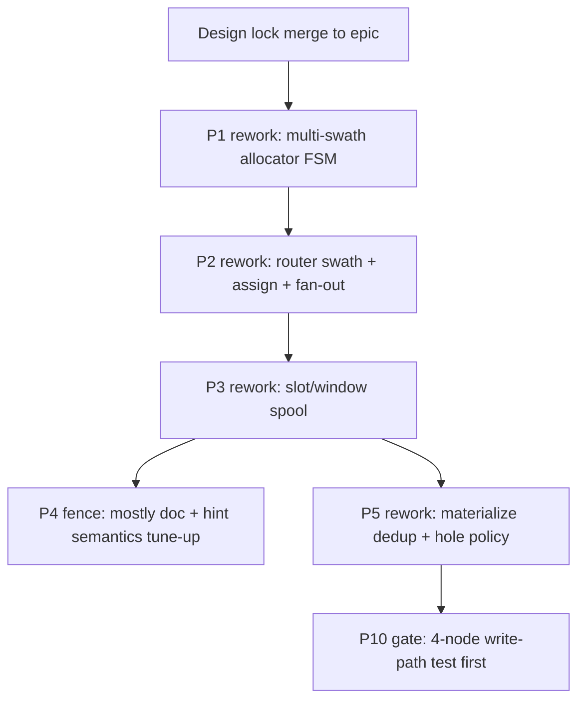

# Fan-Out V2 Phase Rework Map

Status: companion to [write-path-lock.md](write-path-lock.md) (2026-05-26).

This document maps the **write-path lock** onto the existing V2 phase stack: which design artifacts change, which implementation branches are affected, and in what order work must land.

## Stack topology (git)

Current V2 stack (child inherits parent):

```text
main
  └── feat/gastrolog-4ecqt-fan-out-v2          (epic; design foundation)
        └── … phase implementation commits …
              └── feat/gastrolog-2wg3z-materializer-gap-skip   (closed)
                    └── feat/gastrolog-5nj7s-peer-pull-heal     (in review; may be superseded)
```

**Design doc landing branch:** `docs/v2-write-path-lock` (branched from epic) merges into `feat/gastrolog-4ecqt-fan-out-v2` **before** downstream phase branches rebase.

Rule: **do not implement write-path rework on `5nj7s` peer-pull** until design merges to epic and P0 allocator/spool/router issues are restacked.

## Execution order after design merge



P0 / P0.5 / P0.6 docs: terminology and authority matrix updates only (gates unchanged).

P6–P11: downstream of corrected spool/materialize semantics; no write-path hot-path changes except inspect labels.

## Phase-by-phase impact

### Phase 0 — `gastrolog-69in0` (guardrails)

| Area | Action |
|---|---|
| Docs | Guardrail tests description: sequenced path = swath + fan-out, not residency relay |
| Code | Keep feature gate; add guardrail test **failing today**: cross-node sequenced ingest must not hit chunk `Append` |
| Branch | Nearest parent of first code rework (likely epic + P2 branch after restack) |

### Phase 0.5 — `gastrolog-1gqh7` (anchor)

| Area | Action |
|---|---|
| Docs | Unchanged — `(vault_id, vault_seq)` anchor still valid |
| Code | No write-path change |

### Phase 0.6 — `gastrolog-3c35d` (placement leader)

| Area | Action |
|---|---|
| Docs | Clarify: placement residency **≠** seq assign locus; residency not payload relay for sequenced vaults |
| Code | Phase 7 migration unchanged; remove forward-to-residency as sequenced write authority in docs |

### Phase 1 — `gastrolog-16w8x` (allocator)

| Area | Action |
|---|---|
| Docs | Replace single `ActiveLease` story with **multi-swath grants per holder node** |
| Code | **Major rework** — `vaultctlfsm` allocator: concurrent grants, burn per holder, inspect surfaces |
| Tests | Multi-node concurrent swath grants; burn abandoned slow-node tail |
| Branch | New issue/branch off epic: **P1 rework** (blocks P2) |

**Withdraw:** assumption that only one node consumes a vault lease.

### Phase 2 — `gastrolog-2zvcm` (router sequencing)

| Area | Action |
|---|---|
| Docs | Assign on **ingesting router** from local swath; attach `VaultSeq` before replica fan-out |
| Code | **Major rework** — swath cache per `(node, vault)`; remove assign-only-on-local-append residency path; sequenced fan-out from ingesting node to all replicas; **delete** forward→chunk landing for sequenced vaults |
| Tests | Two ingesters asymmetric rate; same `VaultSeq` all replicas; multi-vault route fan-out |
| Branch | **P2 rework** stacked on P1 rework |

**Withdraw:** `LookupSeq` assign dedup; retry idempotency tests as P2 acceptance criteria.

### Phase 3 — `gastrolog-5e4d0` (spool)

| Area | Action |
|---|---|
| Docs | Spool = slot storage inside sequence windows (see spool-state-machine.md) |
| Code | **Major rework** — replace append-only tail accept with `PutSlot`; window directories; `ReadByVaultSeq` from slots |
| Tests | OOO slot arrival; crash at slot commit; window reclaim |
| Branch | **P3 rework** stacked on P2 rework |

**Withdraw:** monotonic `VaultSeq < lastSeq` reject; interim assign metadata as dedup source.

Existing commits on stack (`5e4d0` spool wiring) are **starting point**, not correct accept model.

### Phase 4 — `gastrolog-4rs46` / `gastrolog-3hidq` (fence + hints)

| Area | Action |
|---|---|
| Docs | Fence still seq-range; hints may reference high assigned seq, not contiguous prefix |
| Code | Minor — verify fence coordinator tolerates holes from burned swaths / slow nodes |
| Branch | Rebase after P3; completion issue `3hidq` continues |

### Phase 5 — `gastrolog-13g0o` / `gastrolog-1iale` (materialize + reconcile)

| Area | Action |
|---|---|
| Docs | Materialize dedup by `EventID`; assigned-missing vs unassigned gap unchanged |
| Code | **Rework** — materializer canonicalization; reassess peer-pull heal (`5nj7s`) — likely **obsolete or narrow** to post-materialize gap fill only |
| Tests | Duplicate EventIDs at two seqs in fence → one chunk row |
| Branch | **P5 rework** after P3; **pause/close** `5nj7s` until ingest graph correct |

**Withdraw:** reconcile-as-substitute-for-broken-ingest.

Children under `1iale`:

| Issue | Disposition |
|---|---|
| `2wg3z` burned-tail gap skip | Keep (still valid) |
| `5nj7s` peer-pull heal | **Re-evaluate** after P0 gate; likely cancel or shrink scope |
| `326i6` durable watermarks | Keep; semantics tied to revised `H`/`M_r` |
| `21fdf` chunk presence fallback | Re-evaluate after slot spool |
| `1gm1j` multinode tests | **Replace** with write-path-lock P0 gate first |

### Phase 6 — `gastrolog-1n79l` (anchor API)

No write-path hot-path change. Spool anchor reads use `ReadByVaultSeq` (slot-backed).

### Phase 7 — `gastrolog-38rtk` (placement leader migration)

Docs already locked. Code: ensure sequenced path does not use placement leader as write gate **or** payload relay.

### Phase 8–9 — CLI / UI (`57ji3`, `41lsj`)

Update inspect labels:

- per-node swaths (holder, range, epoch)
- spool windows / slot coverage
- de-emphasize ingest idempotency metrics

Blocked until P1–P3 rework surfaces exist.

### Phase 10 — `gastrolog-22d15` (verification ladder)

**Reorder gate:** 4-node write-path test (write-path-lock §Validation) **before** full ladder sign-off.

Add burst asymmetric ingesters scenario (A @ 1/s, B @ 1000/s, same vault).

### Phase 11 — `gastrolog-390uk` (cutover)

Unchanged process; cutover only after new P0 gate + ladder.

## Issues to file (suggested)

| ID | Title | Blocks |
|---|---|---|
| (new) | `[V2 P0 write-path] Design lock merge + epic realign` | all rework |
| (new) | `[V2 P1 rework] Multi-swath seq allocator per node` | P2 |
| (new) | `[V2 P2 rework] Router swath assign and direct sequenced fan-out` | P3, P10 |
| (new) | `[V2 P3 rework] Spool sequence windows and slots` | P5 |
| (new) | `[V2 P5 rework] Materialize EventID canonicalization` | P10 |

Confirm with tracker before creating; parent `gastrolog-4ecqt`.

## Branch restack procedure

1. Merge `docs/v2-write-path-lock` → `feat/gastrolog-4ecqt-fan-out-v2`.
2. Create `feat/<issue>-p1-multi-swath-allocator` from epic HEAD.
3. Land P1 → P2 → P3 reworks as stacked branches (single issue per branch).
4. Rebase `2wg3z` / `5nj7s` only after assessing fit, or close and re-cherry-pick tests.
5. Do **not** merge to `main` until Phase 10 gate passes with new write path.

## Code hotspots (all phases)

| File / area | P1 | P2 | P3 |
|---|---|---|---|
| `vaultraft/vaultctlfsm/fsm_allocator.go` | ✓ major | | |
| `orchestrator/seq_assign.go` | ✓ | ✓ major | |
| `orchestrator/ingest.go`, `routing.go`, `write_path.go` | | ✓ major | |
| `orchestrator/sequenced_write.go`, `replication.go` | | ✓ major | |
| `app/app.go` `SetRecordAppender` | | ✓ remove sequenced chunk landing | |
| `internal/spool/file`, `memory` | | | ✓ major |
| `orchestrator/spool_store.go` | | | ✓ major |

## Doc artifacts changed in this pass

- [write-path-lock.md](write-path-lock.md) — **new authoritative**
- [architecture-overview.md](architecture-overview.md)
- [high-watermark-contract.md](high-watermark-contract.md)
- [spool-state-machine.md](spool-state-machine.md)
- [implementation-plan.md](implementation-plan.md)
- [feasibility-gate.md](feasibility-gate.md)
- [README.md](README.md)
