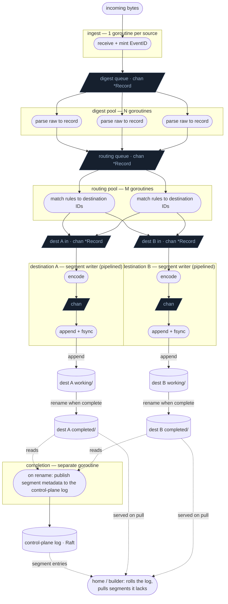

# Fan-Out V3 — Design Notes

Status: **early exploration — nothing here is locked.** Captured from a
clean-slate design discussion.

Everything below is provisional: a snapshot of where the thinking currently
leans, not a set of commitments. Each point is open to challenge and revision,
and several rest on each other, so revisiting one may unsettle others. Treat this
as material to argue with, not a spec to implement.

This document reasons from first principles and does not describe itself by
contrast with any earlier design. It states only what V3 *is*, never what it
*isn't*.

## Pipeline at a glance

```
ingest → digest → route → per-destination segment write → complete + publish
```

A record is allocated once at digest; only its pointer travels between stages.
Replication is not part of this pipeline: once a segment completes and its metadata
is published, home nodes pull it (see the durable layer).

## Pipeline (goroutines and channels)

Stadiums are goroutines; parallelograms are channels. Bounded channels are what
provide backpressure. The ingestion ack fires at the append + fsync stage.



A record that matches multiple destinations is sent to each destination's in
channel (fan-out); the same immutable record pointer is reused, never copied.

The segment writer's only job is to write records into a durable segment file.
Completing a segment can be as crude as moving the file from a working directory
to a completed directory, then publishing its metadata to the control-plane log.
Replication is pull, not push: home nodes roll that log, notice segments they lack,
and pull them from any current holder; the origin serves pulls and retains until
the holders cover the home set (or the records are chunked). So a slow or
unreachable home just hasn't pulled yet — completed segments accumulate on disk
without ever backpressuring the writer or ingest. Channels carry record pointers,
not files.

## Segment file format (provisional)

Hand-rolled binary, following the conventions in `docs/file_formats.md`:
multi-byte integers little-endian, GLIDs as raw 16-byte values, timestamps as
int64 Unix nanoseconds, and the shared 4-byte header prefix (signature `0x69`,
type byte, version, flags). No gob — no inline type descriptors.

This is treated as a public interchange spec from the outset, not an internal-only
layout — formats outlive the code that writes them, and a third party may one day
implement an independent reader, exporter, or replica. What portability needs is a
*mandated, documented, versioned* byte order, not a particular one: little-endian
interchange formats (Protocol Buffers, FlatBuffers, Cap'n Proto) are routine, and
network protocols are big-endian by heritage, not necessity. So the order is
mandated little-endian (native on every arch that matters, consistent with the
project's other formats), the common header's signature/type/version/flags let an
independent implementation identify and evolve it, and every field is documented.
The choice rests on those properties, not on owning every reader today.

A segment file is a header followed by a sequence of length-prefixed records.

Header — enough to inspect a segment without reading its records:

- common 4-byte prefix (signature, segment type byte, version, flags)
- SegmentID (GLID, 16 bytes)
- destination ID (GLID, 16 bytes)
- record count (uint32)
- byte offset of the last written record (uint32), which also marks the end of
  valid data
- first and last IngestTS (int64 nanos), the order/merge axis
- optionally the first and last EventID

The header is fixed-size and lives at the front, and is rewritten in place after
each record — count incremented, last IngestTS/EventID updated (first set on the
first record). So the header is always current: the segment is valid and
inspectable at any point, and completion needs no finalization step — it is just
the working→completed rename. The record is appended first, then the header
rewritten, so the header is never ahead of the data. The recorded last-record
position is the recovery anchor: on reopen, valid data ends at that record's
frame, so any torn bytes from an interrupted final append are discarded and the
writer resumes from there. Readers get the full segment metadata — and the exact
valid extent — from the front without scanning records.

Records: each record is `[frameLen:u32][frame body]`, frame after frame — the
same framing as the GLCB records section. The frame body leads with the
fixed-width EventID (ingesterID 16, nodeID 16, ingestTS 8, ingestSeq 4 — 44 bytes
at a known offset), followed by the variable-length payload: sourceTS, attributes
as length-prefixed key/value pairs, and the raw bytes. Leading with a fixed-width
EventID is deliberate: the k-way merge that builds a chunk decodes only the frame
length and the EventID (the merge key) and copies the rest of the frame verbatim
into the output — the attribute map and raw bytes are never decoded or re-encoded
during the merge. Per-record overhead is just the 4-byte length prefix; there is
no inline type information.

Each record is self-contained and length-prefixed, so records are read, skipped,
and recovered one at a time — a truncated tail costs only the last partial
record. A per-record CRC may live inside the frame (see the durable layer's
checksum note); the writer encodes each record, appends it, and releases it, so
memory stays bounded regardless of segment size, mapping straight onto the
encode → append pipeline.

Key-based query access needs a side index over the records; the staging tier
supplies one (see the durable layer below), reusing the generic
`backend/internal/btree`.

## Where the thinking leans (provisional)

1. Cardinal rule: once a record matches a route, it must never be lost. The only
   valid drop is a record that matches no route.
2. Two separate acks: an **ingestion ack** (faced at the ingester, only some want
   it) and a **replication ack** (internal, about durability across nodes).
3. The pipeline is: ingest → digest → route → per-destination segment write →
   complete + publish. Replication is downstream and pull-driven, not part of it.
4. Ingest mints the EventID; EventID is cluster-unique from
   `(IngesterID, NodeID, IngestTS, IngestSeq)`.
5. Digestion (raw → record) is a worker pool. Processing out of order is fine
   because order is carried by EventID, not by processing order.
6. Digest workers put record pointers on a routing queue; routing workers consume
   from the other end. Pointers only — the record is allocated once and never
   copied between stages.
7. A record is immutable after digestion, so one pointer can fan out to several
   destination writers with no copy and no lock.
8. Routing is a separate stage from digestion: per-record, in-memory rule match,
   record → opaque destination IDs. Routing never defers.
9. The router knows nothing about what a destination is. RF, storage class, and
   home nodes are resolved later, at placement.
10. Each destination has its own write path, structured as a pipeline of
    single-step workers chained by short channels. Each worker hands off and
    immediately takes the next record, so stages overlap.
11. The write path is lock-free: each stage owns its step, ownership moves through
    channels, no shared mutable state.
12. Segments are durable on-disk files, written in the per-destination write path.
13. The ingestion ack fires when the record is durably written into its
    destination segment.
14. Replication is pull, not push: completing a segment publishes its metadata to
    the control-plane log; home nodes roll the log, notice segments they lack, and
    pull them from any current holder. The origin serves pulls and does not forward.
15. One piece of cluster state decides local vs remote: a placement directory
    mapping destination ID to its home nodes (including whether self is a home).
16. EventID is the single key for identity, dedup, and order. It gets a
    `Compare`/`Less`: `IngestTS`, then `NodeID`, then `IngesterID`, then
    `IngestSeq` — a tie-free total order.
17. Storage and merge order is EventID order. On-disk order within a segment does
    not need to be canonical; EventID restores order at read.
18. Query order (by `IngestTS` or `SourceTS`) is an index choice, independent of
    storage order. `SourceTS` is carried on the record but not part of EventID.
19. Within the ingest→segment path, local disk write is the only throughput
    governor. Group commit (batched fsync) is the lever; everything above the write
    is parallel and lock-free.
20. If the disk ever fails to keep up, the bounded channels backpressure rather
    than drop, so the cardinal rule holds under load with no special mechanism. In
    practice sequential segment appends far outrun log ingestion rates, so this is
    a correctness safety valve, not an operating mode to expect.
21. Completing a segment can be as crude as moving the file from a working
    directory to a completed directory, then publishing its metadata. Serving pulls
    runs independently, so a slow or unreachable home just hasn't pulled yet —
    completed segments accumulate on disk without backpressuring the writer or
    ingest. The only backpressure is slow local disk.
22. Segments are ephemeral build inputs; the chunk is the durable artifact.
    Durability responsibility moves at that boundary.
23. A vault control plane plans chunks from segment metadata alone (destination,
    record count, byte size, first/last IngestTS, holder). Segment bodies move
    lazily — only once a builder is ready.
24. Segment metadata is published at completion (the working→completed rename); a
    still-growing segment's header is provisional and not yet eligible.
25. A chunk is a deterministic, ordered list of segment spans
    `(segmentID, startRecord, count)`, sliced on a record/size budget; a
    partial-segment cut resumes in the next chunk. The offsets are positions in the
    segment's EventID order (see 36), not on-disk positions.
26. Builds are reproducible: the same plan over the same immutable segments yields
    a byte-identical chunk on every builder.
27. Completeness is binary: a builder either holds the named segments or it does
    not. No time-window closure, and no straggler can belong inside an
    already-built chunk.
28. Replication is pull/reconcile, not push: a home rolls the log, pulls segments
    it lacks from any holder, and adds itself to the holder-set. The desired-vs-
    holder gap is the replicate signal; `holders ⊇ homes` (or records chunked) is
    the release signal. The holder-set is explicit and survives restarts — it gates
    durability, so it cannot be inferred.
29. Two layers, two mechanisms: the segment layer is transport for building chunks;
    durability lives entirely in a separate chunk-replication mechanism.
30. Chunk replication is the same reconciliation — desired placement vs. holder-set,
    driven to zero by copy or delete — so segments and chunks share one model. It
    must exist anyway for RF changes, node loss, decommission, and placement changes.
31. Determinism (single origin per segment + dictated spans) makes replicas
    identical by construction — no merge, read-repair, vector clocks, or
    anti-entropy. Verification is a chunk-ID/hash equality check.
32. Checksums are optional belt-and-suspenders against physical faults only:
    per-record CRC in the frame, per-segment checksum at completion in the reported
    metadata, per-chunk checksum doubling as identity and build-agreement check.
33. Staging (completed segments awaiting chunking) is the recent, hot, queryable
    tier — the role active chunks fill today. Chunks are therefore always built
    complete and immutable; there is no open or growing chunk state.
34. Queries read staging and chunks together, merging/dedup by EventID. Staging
    carries only the ordered (EventID/IngestTS) `backend/internal/btree` index —
    fast by time/EventID, scanned for field/content. The richer field/token indexes
    are built at chunk construction (see the indexing rewrite).
35. The first choke points are cross-node, not local disk: Raft commit throughput
    for metadata, and segment-transfer bandwidth. Keep Raft metadata-only and
    batched (≈ segments × RF, never records); transfer is parallel, resumable bulk
    copy. Neither risks the cardinal rule — the record is already durable on the
    origin, so lag only delays chunking (staged segments pile up, bounded by
    retention; no ingest backpressure).
36. A segment's on-disk order is arbitrary (concurrent digestion), so each carries
    an EventID-ordered index (the staging B+ tree) and chunk building is a k-way
    merge over it; span offsets (25) are positions in this order. Order by the full
    EventID so equal timestamps resolve identically. Because IngestTS leads the key,
    the same index serves IngestTS range search — one structure, not two.
37. Chunk building is key-only: the merge decodes just the frame length and the
    fixed-width EventID, then copies each frame body verbatim — attributes/raw never
    parsed (deferred to the index passes). Chunk frames come out byte-identical to
    their source segment frames: cheap (memcpy) and deterministic.

## From segments to chunks (the durable layer)

Segments are ephemeral build inputs; the chunk is the durable artifact. The
boundary between them is where durability responsibility moves.

**The control plane plans chunks from segment metadata.** When a segment
completes (the working→completed rename), the origin reports its metadata to a
vault control plane: destination, record count, byte size, first/last IngestTS,
and the holding node. The control plane never needs the segment bodies to plan —
from the metadata index alone it decides chunk composition by record count, size,
or time, and only pulls bodies once a builder is ready. Metadata is published for
completed segments only; a still-growing segment's header is provisional.

**Chunk plans are deterministic spans.** A chunk is not a time window that records
fall into; it is an explicit, ordered list of segment spans, each
`(segmentID, startRecord, count)`. A chunk needing 2000 records from 1500-record
segments takes all of the first and the first 500 of the second; the next chunk
resumes at record 500. Because segments are immutable and a span always yields the
same records, the plan is fully reproducible: every node that builds a chunk from
the same plan and the same segments produces byte-identical output. Because a
segment's on-disk order is arbitrary, the build is a k-way merge across the plan's
segments using a per-segment EventID-ordered index (the staging B+ tree), and the
span offsets are positions in that EventID order — that index is what makes both
the merge and the cuts reproducible.

**Completeness is binary, not windowed.** A builder either holds the segments
named in a chunk's plan or it does not. No straggler can retroactively belong
inside an already-built chunk, because the chunk is defined by its named segments,
not by a predicate over time. Cross-chunk timestamp overlap is fine — the indexes
already merge interleaved ranges.

**Replication is pull, and the holder-set is the signal.** Replication is not
pushed; it is reconciled. The control plane holds, per segment, its desired home
set and its holder-set — the nodes that currently hold it (origin plus any home
that has pulled a copy). The difference is the work: a home that is in the desired
set but not the holder-set rolls the log, notices the gap, pulls the segment from
any current holder, and then adds itself to the holder-set. That one structure
drives everything — the gap (`homes − holders`) is the replicate signal,
`holders ⊇ homes` (or records chunked) is the release signal that lets the origin
drop its copy, and the holder-set is the set to pull *from*. Steady-state
replication, catch-up after downtime, and fetching a builder's chunk inputs are all
the same operation: reconcile local holdings against the log. A node back from an
hour offline is not a special case — it just has a longer backlog to roll. The
origin retains a segment until its records are in a chunk or the holders cover the
home set; the "suitable time" fallback covers only segments not yet built. Once the
records are in a chunk, the segment is disposable everywhere.

The holder-set is authoritative, not inferred — it gates the origin's release and
thus durability, so it must record who actually holds a segment (updated as each
home pulls) and survive restarts. It is two distinct sets working together: the
desired home set (who should hold it) and the holder-set (who does), with their
difference as the work.

**Staging is a searchable tier.** Completed segments awaiting chunk construction
are not only transport — they are a queryable store. Until a chunk is built the
newest records live only in staged segments, so a query must read staging
alongside chunks or it would miss the most recent data. This needs an index at two
scopes: the control-plane metadata index already routes a query to the right
holders by destination and IngestTS range; a per-node staging index over the held
segments then serves record-level lookups by IngestTS/EventID. Field/content
search over staged records is a bounded scan — staging is the small, recent tier,
so this stays cheap, and the heavier field/token indexes are not built here. A
query fans out to staged segments and chunks together and merges by EventID —
which also dedups the staging→chunk transition window, where a record can
momentarily exist in both. The staging index tracks segment lifecycle — populated
when a segment completes, dropped when the segment is disposed after chunking —
and is rebuildable from the self-describing segment files on restart.

For that ordered (EventID/IngestTS) index the machinery need not be new: a generic,
file-backed B+ tree already lives in the internal packages
(`backend/internal/btree` — a `Tree[K, V]` with a pluggable key codec) and can be
pointed at staged segments directly. Advanced field/token indexing is a separate,
chunk-build-time concern — built when the chunk is constructed, not during staging
— and follows the indexing rewrite (`docs/advanced_indexing.md`, spiked in
`gastrolog-jqylj`): FST term dictionaries, Roaring posting lists, and per-block
bloom filters, emitted as sections inside the chunk rather than as sidecar files.
So staging carries only the ordered B+ tree; the richer indexes are a property of
built chunks.

This split is structural, not merely economical. An FST term dictionary is
constructed in one pass from the complete, sorted term set and is immutable once
built — Vellum's builder requires lexicographic insertion order and offers no
in-place insert; extending an FST means rebuilding (or merging into a new one).
Roaring posting lists are themselves mutable, but here they encode row IDs
(`0..N-1`) that are positions in the finished chunk, so they are naturally built
once the chunk's record order is frozen. Per-block bloom filters are sized from the
cardinality of a complete fixed-size block. All three want the frozen record set a
chunk *is* and are unsuited to a growing staging segment. The ordered B+ tree, by
contrast, accepts the incremental inserts a live staging tier requires. The
dividing line falls out of the data structures themselves: incremental index in
staging, batch-built indexes on the finished chunk.

This staging tier is the system's recent, hot, queryable layer — the role that
"active chunks" fill today. A direct consequence: chunks are always built complete
and immutable, with no open or growing chunk state. The most-recent,
still-accumulating data lives in segments; a chunk only ever exists as a sealed,
deterministic, replicated artifact. That collapses the active-vs-sealed chunk
duality and reinforces presence-only replication — there is never a growing chunk
to reconcile.

**Two layers, two mechanisms.** The segment layer is transport for building
chunks; durability lives entirely at the chunk layer, in a separate
chunk-replication mechanism. That mechanism must exist regardless, because the
replication factor can change after the fact — raising RF replicates existing
chunks to more homes, lowering it drops surplus copies — and node loss,
decommission, or a placement-policy change demand the same. So it is a continuous
reconciliation loop: compare each chunk's actual holder-set against its desired
placement and drive the difference to zero with plain copy or delete.

**Reconciliation is over presence, not content.** Single origin per segment plus
planner-dictated spans means replicas are identical by construction. Divergence —
missing records, reordered records, conflicting copies — cannot arise, so there is
no merge, read-repair, vector clock, or anti-entropy logic. The loop only ever
answers a boolean ("does node X hold chunk C?") and acts by byte copy.
Verification is a chunk-ID/hash equality check.

**Checksums (optional belt-and-suspenders).** On top of a model already correct by
construction, checksums guard against physical faults — bit-rot, torn writes, a
flaky transfer — not logical divergence. Three levels: a per-record CRC in each
frame (detect and drop a corrupt or torn record at the framing granularity); a
per-segment checksum computed at completion and carried in the reported metadata
(verify a transferred copy end-to-end before a builder trusts it; on mismatch,
re-fetch from another holder); and a per-chunk checksum that doubles as the
presence loop's identity check and as a cross-check that two independent
deterministic builds agree.

## Open

- In-flight segment durability: the ingestion ack fires when the record is durable
  in the origin's segment, but until those records are in a chunk the
  chunk-replication mechanism is not yet involved. How many copies must a segment
  have before the ack is safe — origin only, or origin plus at least one home that
  has pulled it — and since replication is pull-driven, does the ack wait on that
  first pull, or fire on the origin's durable write and accept a brief origin-only
  window?
- Build placement: does each home of a chunk build it independently from the plan
  (safe, because builds are deterministic), or does one node build and the others
  pull the finished chunk via the same reconciliation loop?
- How a built chunk enters local storage / the vault manager — the same bytes the
  builder produced, handed over directly, versus ingested into a distinct store.
- Staging index reach: staged segments must be searchable by IngestTS/EventID now,
  since recent data lives only in staging until chunked. The mechanism is not
  greenfield — the generic `backend/internal/btree` is the index — so the open
  part is the mapping: per-segment index versus per-staging-area, the key codec(s)
  to register, how it tracks segment lifecycle, and whether it is persisted or
  rebuilt on restart.
- Chunk index build timing: the ordered EventID/IngestTS index can be built inline
  during the k-way merge — the merge already emits in its key order, so it is a
  sequential, densely-packed append essentially for free; building it in a later
  pass would re-read the chunk to reconstruct an order already in hand. The
  advanced field/token structures (FST term dict, Roaring postings, per-block
  bloom) cannot be built inline at all: an FST needs the complete sorted term set,
  which does not exist until the merge is done; Roaring postings key off final row
  IDs (positions in the finished chunk); bloom filters are sized from the finished
  block's cardinality — so all are necessarily batch builds over the finished body
  (read, sort by key, bulk-load), independent, parallelizable, deferrable, and
  cheap while the fresh chunk is still in page cache. So the shape is forced: ordered index inline
  (or a pass), advanced structures always post-body passes. Because chunk indexes
  are derived, rebuildable, local artifacts (only the chunk body must be
  byte-identical across replicas), build timing is a per-holder performance choice,
  not a correctness one, and a crash mid-build just re-runs the affected pass over
  an already-valid body. Structures follow the indexing rewrite
  (`docs/advanced_indexing.md`, `gastrolog-jqylj`), emitted as in-file sections.
