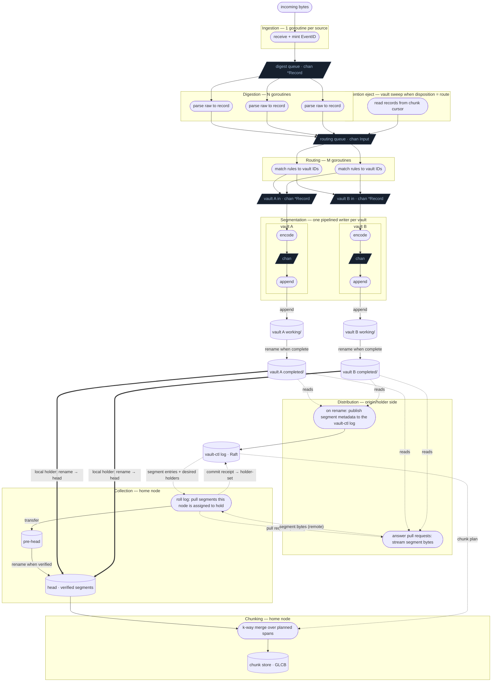

# Fan-Out V3 — Design Notes

Status: **early exploration — nothing here is locked.** Captured from a
clean-slate design discussion.

Everything below is provisional: a snapshot of where the thinking currently
leans, not a set of commitments. Each point is open to challenge and revision,
and several rest on each other, so revisiting one may unsettle others. Treat this
as material to argue with, not a spec to implement.

This document reasons from first principles and does not describe itself by
contrast with any earlier design. It states only what V3 *is*, never what it
*isn't*.

## Where the thinking leans (provisional)

1. Cardinal rule: once a record matches a route, it must never be lost. The only
   valid drop is a record that matches no route — and that discard is intentional
   and counted, surfaced as a tally in the router inspector, not a silent loss.
2. Two separate acks: an **ingestion ack** (an optional return channel —
   `Ack chan<- error` on the ingest message — non-nil for only one or two ingester
   types like RELP, not the norm) and a **replication ack** (internal, about
   durability across nodes).
3. The live-ingest pipeline is: ingest → digest → route → per-vault segment write →
   complete + publish. Retention eject (when a vault's disposition is `route`) re-enters
   at **route** — records are already parsed, read from the chunk being destroyed, and
   skip ingest and digest. Both paths share one routing input channel. Replication is
   downstream and pull-driven, not part of either path.
4. Ingest mints the EventID; EventID is cluster-unique from
   `(IngesterID, NodeID, IngestTS, IngestSeq)`. IngestSeq is a per-ingester monotonic
   counter, so uniqueness and the total order (16) hold regardless of clock movement.
5. Digestion (raw → record) is a worker pool. Processing out of order is fine
   because order is carried by EventID, not by processing order.
6. Digest workers hand record pointers to the routing queue; routing workers consume
   from the other end. The queue item is `{Record, Source}` — record pointer plus
   routing-time origin metadata (not stored on the record). Two producers merge on
   the same bounded channel: digest output (`Source = ingest`, ingester from
   EventID) and retention eject (`Source = retention`, source vault ID and optional
   reason). Pointers only — the record is allocated once and never copied between
   stages.
7. A record is immutable before it enters routing (after digestion for live ingest,
   or when read from a chunk cursor on retention eject), so one pointer can fan out
   to several vault writers with no copy and no lock.
8. Routing is a separate stage from digestion: per-record, in-memory rule match,
   record → vault IDs. Routing never defers. Match evaluation overlays synthetic
   attrs (`_source`, `_ingester`, `_vault`, `_reason`) from `Source` for the
   duration of the match only — same mechanism for live ingest and retention eject.
   Routes that target retention match on `_source = "retention"` (and often
   `_vault`); live-ingest routes match on record attrs and/or `_source = "ingest"`.
9. The router's only target concept is the vault: a rule match yields vault IDs and
   nothing more — no RF, no storage class, no node placement. Which nodes hold a
   vault is the vault leader's call, made from live cluster state and committed to
   the vault-ctl FSM. Placement stays out of the hot path so rule matching is
   insulated from membership churn — but the decision itself is concrete and owned
   by a named authority (the vault leader), not an abstract "resolved later".
10. Each vault has its own write path, structured as a pipeline of
    single-step workers chained by short channels. Each worker hands off and
    immediately takes the next record, so stages overlap.
11. The write path is lock-free: each stage owns its step, ownership moves through
    channels, no shared mutable state.
12. Segments are durable on-disk files, written in the per-vault write path.
13. The durability bar is one on-disk copy in the record's vault segment on the
    origin (holder or not). Segments are written post-routing, so a routed record is
    durable as the immediate consequence of routing: no "routed but not durable" gap,
    cardinal rule holds by construction. That single on-disk copy is the bar (durable
    storage, not surviving node loss); RF coverage is the background replication climb.
    The ingestion ack is not a pipeline stage: it is the optional return channel on
    the message (2), and the durable write simply sends nil on it (or the error) when
    the channel is non-nil. The local segment is the durable capture buffer either way
    — no separate durable router queue.
14. Replication is pull, not push: completing a segment publishes its metadata to
    the vault-ctl FSM. The vault leader decides which nodes should hold it — the
    desired set — and those replicas roll the log, pull the segment from any current
    holder, and commit a receipt; the acks are what build the holder-set. The origin
    serves pulls and never forwards: the leader publishes intent, not bytes.
15. A node learns whether it holds a vault from the vault-ctl FSM, not from the
    router: the home/holder set names the nodes, so each node knows whether it must
    pull and hold that vault's segments. The router never consults this — it only
    matches vaults.
16. EventID is the single key for identity, dedup, and order. It gets a
    `Compare`/`Less`: `IngestTS`, then `NodeID`, then `IngesterID`, then
    `IngestSeq` — a tie-free total order. Dedup means collapsing one EventID seen in
    two places (a record live in both a head segment and a chunk during handoff), not
    suppressing client-level duplicates — a client that delivers the same line twice
    mints two EventIDs and gets two records; that is the client's problem.
17. Storage and merge order is EventID order. On-disk order within a segment does
    not need to be canonical; EventID restores order at read.
18. Query order (by `IngestTS` or `SourceTS`) is an index choice, independent of
    storage order. `SourceTS` is carried on the record but not part of EventID.
19. Within the route→segment path (live ingest and retention eject), local disk
    write is the only throughput governor. Group commit is the lever; everything
    above the write is parallel and lock-free.
20. If the disk ever fails to keep up, the bounded channels backpressure rather
    than drop, so the cardinal rule holds under load with no special mechanism. In
    practice sequential segment appends far outrun log ingestion rates, so this is
    a correctness safety valve, not an operating mode to expect.
21. Completing a segment can be as crude as moving the file from a working
    directory to a completed directory, then publishing its metadata. Serving pulls
    runs independently, so a slow or unreachable home just hasn't pulled yet —
    completed segments accumulate on disk without backpressuring the writer or
    ingest. The only backpressure is slow local disk.
22. Segments are ephemeral build inputs; the chunk is the durable artifact.
    Durability responsibility moves at that boundary.
23. Two roles, paired: the vault-ctl plans chunks from segment metadata
    alone (vault, record count, byte size, first/last IngestTS, holder); a
    per-home vault manager executes — it owns that vault's chunk store and head,
    and builds chunks in place. Segment bodies move lazily, only once a vault
    manager is ready to build.
24. A segment closes on size or age, whichever comes first (both configurable).
    Closure is the working→completed rename, at which point its metadata is published;
    a still-growing segment's header is provisional and not yet eligible.
25. A chunk is a deterministic, ordered list of segment spans
    `(segmentID, startRecord, count)`, sliced on a record/size budget; a
    partial-segment cut resumes in the next chunk. The offsets are positions in the
    segment's EventID order (see 36), not on-disk positions.
26. Builds are reproducible: the same plan over the same immutable segments yields
    a byte-identical chunk on every builder. So every home builds its own chunk
    independently — no designated builder, no build-then-replicate, no
    leader-dies-mid-build failover (a crash just re-runs the fixed plan).
27. Completeness is binary: a builder either holds the named segments or it does
    not. No time-window closure, and no straggler can belong inside an
    already-built chunk.
28. Replication is pull/reconcile, not push: a home rolls the log, pulls segments
    it lacks from any holder, and adds itself to the holder-set. The desired-vs-
    holder gap is the replicate signal; `holders ⊇ homes`, records chunked, or a
    configurable retention period elapsed is the release signal — the last bounds
    growth when a segment can't be collected (an island origin, no reachable home),
    a deliberate, counted expiry rather than a silent pipeline loss. The holder-set is
    explicit and survives restarts — it gates durability, so it cannot be inferred.
29. Two layers, two mechanisms: the segment layer is transport for building chunks;
    durability lives entirely in a separate chunk-replication mechanism.
30. Chunk replication is the same reconciliation — desired placement vs. holder-set,
    driven to zero by copy or delete — so segments and chunks share one model. It
    must exist anyway for RF changes, node loss, decommission, and placement changes.
31. Determinism (single origin per segment + dictated spans) makes replicas
    identical by construction — no merge, read-repair, vector clocks, or
    anti-entropy. Verification is a chunk-ID/hash equality check.
32. Checksums are mandatory, not optional: they guard against physical faults and
    gate transfer acceptance (the head invariant verifies a pulled segment before
    admitting it). Per-record CRC in the frame, per-segment checksum at completion in
    the reported metadata, per-chunk checksum doubling as identity and build-agreement
    check.
33. The head (completed segments awaiting chunking) is where the recent, queryable
    records live — the role active chunks fill today. Chunks are therefore always
    built complete and immutable; there is no open or growing chunk state.
34. Queries read the head and chunks together, merging/dedup by EventID. The ordered
    (EventID/IngestTS) `backend/internal/btree` index is per segment (born and
    discarded with it — nothing to prune, unlike one head-wide index) and is the
    same index the build merge uses (36); foundational — fast by time/EventID,
    field/content by bounded scan. Field/content indexing of chunks is deferred
    sugar, out of scope until the foundation is solid.
35. The first choke points are cross-node, not local disk: Raft commit throughput
    for metadata, and segment-transfer bandwidth. Keep Raft metadata-only and
    batched (≈ segments × RF, never records); transfer is parallel, resumable bulk
    copy. Neither risks the cardinal rule — the record is already durable on the
    origin, so lag only delays chunking (head segments pile up, bounded by
    retention; no ingest backpressure).
36. A segment's on-disk order is arbitrary (concurrent digestion), so each carries
    an EventID-ordered index (the head B+ tree) and chunk building is a k-way
    merge over it; span offsets (25) are positions in this order. Order by the full
    EventID so equal timestamps resolve identically. Because IngestTS leads the key,
    the same index serves IngestTS range search — one structure, not two.
37. Chunk building is key-only for ordering: the merge reads just the frame length
    and EventID fields to order records, and copies `raw` verbatim. Attributes are
    inline (denormalized) in segments and normalized into the chunk's string
    dictionary at build — a deterministic remap (the dictionary is a deterministic
    function of the planned records), so chunks stay byte-identical across builders
    while ingest stays free of interning. The dictionary is normalization (a real
    space saver on repetitive log attributes), not indexing, and is kept — and being
    the canonical string table, it is the natural substrate the deferred index types
    (term dictionaries, postings) reference later, by ID rather than raw string.
38. Placement and holder-set live in one consensus group: the vault-ctl owns
    RF/home set/leader *and* residency, so the reconcile gap is evaluable
    atomically. The system layer keeps only inventory (nodes, storage classes,
    capacity, vault existence) and seeds vault-ctl membership, since a group cannot
    define its own initial voter set.
39. A segment's life ends with an explicit purge, not just release (28). Once its
    records live in chunks replicated to their home set, the segment is superseded:
    every holder deletes its on-disk copy and the vault-ctl drops the registry entry,
    so the segment registry — and the FSM snapshots over it — stay bounded rather than
    growing without limit. Ordering is the safety invariant: purge only after the data
    survives in a replicated chunk, so a returning or long-offline node never needs a
    purged segment — it gets those records via chunk replication, not a segment
    re-pull.

## Phases & managers

The write path is a chain of phases, each separated from the next by a queue. The
rule: one manager per queue — a manager owns the consumer side of a queue, does its
step, hands off to the next. This is what keeps the orchestrator from owning
everything.

Phases, in order; each name is also the manager (`<Phase>Manager`):

1. **Ingestion** — receive bytes, mint the EventID (the ingesters).
2. **Digestion** — parse raw → record.
3. **Routing** — match rules → vault IDs. One static worker pool and one input
   queue; digest and retention eject are both producers (`Input{Record, Source}` in
   `backend/internal/pipeline/routing`).
4. **Segmentation** — write records into per-vault segments.
5. **Distribution** — make completed segments available: publish metadata to the
   vault-ctl log and answer pull requests for segment bytes (origin/holder side).
6. **Collection** — fetch segments (remote or local) into the head (collector side).
7. **Chunking** — build chunks from the head (deterministic-span merge → GLCB).

The **orchestrator** owns no phase. It is a supervisor: it wires the queues and
reconciles the dynamic managers against control-plane state.

Distribution's queue is incoming pull requests: it owns the serve side of the pull
and is also where a completed segment is published as ready. Delivery splits by
locality. When this node is itself a designated holder of the vault, distribution is
a filesystem move — a co-located `completed/`→head rename — never a stream to self.
Only a *remote* holder's request is served by streaming segment bytes (from
`completed/`, or the head once promoted). Segmentation's job ends at the
working→completed rename; making that segment available — locally by move, remotely
by stream — is Distribution's.

**Static vs dynamic.**
- Static (one set per process, config-sized): the Digestion and Routing pools.
- Dynamic by assignment: **Ingestion** — ingesters exist per the node's assignments.
  Lift the existing, tested ingester lifecycle into IngestionManager; the logic is
  settled, only the move is new.
- Dynamic by placement: **Segmentation / Distribution / Collection / Chunking** for
  each vault this node routes to or homes.

**ChunkingManager is new.** A chunk manager exists today, but it carries baggage
(mutex-bound append, active/sealed state, rotation) that the deterministic-span
build discards. ChunkingManager is a fresh build, not an extension of it.

**Collection and Chunking are the proactive and reactive halves of one pull.**
Collection runs ahead — rolling the vault-ctl log, it pulls segments this home
should hold into the head before any build needs them, which also grows the
holder-set (durability) and backfills a returning node (catch-up). Chunking decides
*what* to build from a vault-ctl plan and consumes the head. If the plan's named
segments are not all present, Chunking does not build (binary completeness — never a
short chunk): it nudges Collection with the missing IDs and waits. The wait is safe
and terminating — the origin retains a segment until its records are chunked
(release/purge rules), so a planned segment stays collectable from some holder until
the build succeeds; an unreachable holder only delays chunking, never drops data.

**Storage areas are roles bound to storage.** The phases own on-disk areas —
Segmentation's `working/` and `completed/`, Collection's **pre-head**, and the
**head** and chunk store. Each area's location resolves either explicitly
(operator-pinned) or automatically from the vault's storage class matched against
the node's available storages (default). Two constraints:
- *Head invariant.* A segment enters the head only when complete and
  checksum-verified; in-flight transfers sit in pre-head, invisible to queries and
  Chunking. A failed or corrupt transfer is discarded and re-fetched from another
  holder. Everything in the head is a whole, verified, immutable segment.
- *Rename-paired areas co-locate.* Promotion is an atomic `rename(2)`, so paired
  areas must share storage: `working`↔`completed` on the origin, pre-head↔head on
  the collector. A locally written segment needs no transfer — Segmentation's
  `completed/` promotes straight into the head.

## Pipeline at a glance

```
Ingestion → Digestion ──┐
                        ├── Routing → Segmentation → Distribution → Collection → Chunking
Retention eject ────────┘
```

The first four phases are one in-process pipeline for live ingest: a record is
allocated once at Digestion and only its pointer travels the channels through
Routing into a per-vault Segmentation writer. Retention eject sideloads already-built
records onto the same routing queue with `Source = retention` (source vault ID on
the overlay). This is the durable-capture path — by the end of Segmentation the
record is durable in its segment, so the cardinal rule holds by construction.

A boundary falls after Segmentation. Distribution publishes the completed segment's
metadata to the vault-ctl log and answers pull requests for its bytes; Collection and
Chunking run on the home nodes, pulling segments into the head and merging them into
chunks. That half is cross-node, log- and pull-driven, and asynchronous — it never
backpressures ingest (see the pull/reconcile points above).

## Pipeline (goroutines and channels)

Stadiums are goroutines; parallelograms are channels; cylinders are on-disk areas.
Bounded channels are what provide backpressure, and the record becomes durable at the
append stage. Everything from Ingestion through Distribution is one origin process;
Collection and Chunking run on each home node, driven by the vault-ctl log and pulls
rather than channels (dotted edges), so the cross-node half cannot backpressure ingest.



A record that matches multiple vaults is sent to each vault's in channel
(fan-out); the same immutable record pointer is reused, never copied.

Each routing-queue item carries a `Source` tag used only at match time: digest
hands off `Source = ingest` (ingester ID from EventID); retention eject hands off
`Source = retention` with the source vault ID and optional reason (`age`, `size`,
`count`). Both producers block on the same bounded channel, so eject backpressure
is unified with live ingest — neither path drops when the queue or downstream
writers are slow.

Cluster lifecycle for eject (who runs it, when the source chunk may be deleted)
is **not** designed here — see [Open questions — retention eject](#open-questions--retention-eject).

The segment writer's only job is to write records into a durable segment file.
Completing a segment can be as crude as moving the file from a working directory
to a completed directory, then publishing its metadata to the vault-ctl log.
Replication is pull, not push: the vault leader decides which nodes should hold a
segment, and those holders roll the log, pull it from any current holder, and commit
a receipt; the origin serves pulls and retains until the holder-set covers the
desired set (or the records are chunked). So a slow or unreachable holder just hasn't
pulled yet — completed segments accumulate on disk without ever backpressuring the
writer or ingest. Channels carry record pointers, not files.

On a remote home node, Collection lands each pull in pre-head and promotes it to the
head by an atomic rename once it is whole and verified. When the origin is itself a
holder, there is no pull at all: Distribution renames `completed/` straight into the
co-located head — a local move, not a stream to self. Either way Chunking reads a
vault-ctl plan and merges the named head segments into a GLCB chunk, running off the
log, not the origin's channels — remote segment bytes move only when a home pulls them.

## Segment file format (provisional)

Hand-rolled binary, following the conventions in `docs/file_formats.md`:
multi-byte integers little-endian, GLIDs as raw 16-byte values, timestamps as
int64 Unix nanoseconds, and the shared 4-byte header prefix (signature `0x69`,
type byte, version, flags). No gob — no inline type descriptors.

This is treated as a public interchange spec from the outset, not an internal-only
layout — formats outlive the code that writes them, and a third party may one day
implement an independent reader, exporter, or replica. What portability needs is a
*mandated, documented, versioned* byte order, not a particular one: little-endian
interchange formats (Protocol Buffers, FlatBuffers, Cap'n Proto) are routine, and
network protocols are big-endian by heritage, not necessity. So the order is
mandated little-endian (native on every arch that matters, consistent with the
project's other formats), the common header's signature/type/version/flags let an
independent implementation identify and evolve it, and every field is documented.
The choice rests on those properties, not on owning every reader today.

A segment file is a header followed by a sequence of length-prefixed records.

Header — enough to inspect a segment without reading its records:

- common 4-byte prefix (signature, segment type byte, version, flags)
- SegmentID (GLID, 16 bytes)
- vault ID (GLID, 16 bytes)
- record count (uint32)
- byte offset of the last written record (uint32), which also marks the end of
  valid data
- first and last IngestTS (int64 nanos), the order/merge axis
- optionally the first and last EventID

The header is fixed-size and lives at the front, and is rewritten in place after
each record — count incremented, last IngestTS/EventID updated (first set on the
first record). So the header is always current: the segment is valid and
inspectable at any point, and completion needs no finalization step — it is just
the working→completed rename. The record is appended first, then the header
rewritten, so the header is never ahead of the data. The recorded last-record
position is the recovery anchor: on reopen, valid data ends at that record's
frame, so any torn bytes from an interrupted final append are discarded and the
writer resumes from there. Readers get the full segment metadata — and the exact
valid extent — from the front without scanning records.

Records: each record is `[frameLen:u32][frame body]`, frame after frame — the
same framing as the GLCB records section. The frame body leads with the
fixed-width EventID (ingesterID 16, nodeID 16, ingestTS 8, ingestSeq 4 — 44 bytes
at a known offset), followed by the variable-length payload: sourceTS, attributes
as length-prefixed key/value pairs (inline/denormalized — segments do not intern),
and the raw bytes. Leading with a fixed-width EventID is deliberate: the k-way merge
that builds a chunk reads only the frame length and the EventID (the merge key) to
order records, and copies the raw bytes verbatim into the output. Attributes are
normalized into the chunk's string dictionary at build (a deterministic remap), so
they are re-encoded on output while the key and raw bytes are not. Per-record
overhead is just the 4-byte length prefix; there is no inline type information.

Each record is self-contained and length-prefixed, so records are read, skipped,
and recovered one at a time — a truncated tail costs only the last partial
record. A per-record CRC may live inside the frame (see the checksum point above);
the writer encodes each record, appends it, and releases it, so
memory stays bounded regardless of segment size, mapping straight onto the
encode → append pipeline.

Key-based query access needs a side index over the records; the head
supplies one (see the head points above), reusing the generic
`backend/internal/btree`.

## Open questions — retention eject

The routing stage already accepts retention eject on the shared input
channel (`Source = retention`). What is **not** designed yet is the
cluster lifecycle around it: who fires eject, and when the source chunk
(or its V3 equivalent) may be destroyed. Notes only — nothing here is
decided.

### Who runs eject?

Today (`backend/internal/orchestrator/retention.go`) the retention sweep
runs on the **config placement leader** for the vault instance (not
necessarily the vault-ctl Raft leader). That node reads records from a
local chunk cursor and pushes them through routing, then requests chunk
deletion via the lifecycle reconciler.

V3 will need an explicit owner per vault (or per chunk) so eject fires
**exactly once** — the current `retention-pending` flag and
`!alreadyPending` routing gate exist precisely because re-running eject
on every sweep duplicates records at route targets. Candidates:

- **Vault leader** (vault-ctl elected leader for that vault's group) —
  aligns with other vault-scoped decisions (holder set, chunk plans).
  Lean, but the leader may not hold the chunk bytes locally; eject still
  needs a defined way to read the records (local holder, pull, or
  forward-to-leader).
- **Any holder** with a lease/FSM flag — simpler locally, harder to
  prove single-fire cluster-wide without vault-ctl coordination.
- **Placement leader** (status quo) — works in the current architecture
  but couples retention to a role that V3 is trying to move toward
  vault-ctl.

Open: which role owns the sweep, who may open the cursor, and how a
follower learns eject already ran for chunk *C* without re-streaming.

### Chunk deletion after eject

Disposition `route` means: stream records through routing, **then**
destroy the source chunk. Deletion is already coordinated cluster-wide
today: `CmdRequestDelete` → each node in `expectedFrom` deletes its
local copy and acks → `CmdFinalizeDelete` when the set is empty. That
receipt protocol lives outside the routing hot path.

V3 adds tension with the cardinal rule (1): routing must not drop
**matched** records, yet today's eject path destroys the source chunk
regardless of whether every ejected record reached a durable destination
segment. Open questions:

- **Delete gate:** may the source chunk/segment be purged only after
  ejected records are durably captured on their destination vaults (per
  vault segment append), or is best-effort route-then-delete acceptable
  for retention (matching current `disposition = route` semantics)?
- **Partial eject:** if fan-out sends to vaults A and B and B's writer
  is slow or fails, does deletion wait, retry unrouted slots, or proceed
  and count drops?
- **Cross-node destinations:** eject runs on one node; matched records
  may land in segments on other nodes. What ack or vault-ctl receipt
  proves "safe to delete source" — per-destination, or a single
  retention receipt on the source vault group?
- **Idempotency vs retry:** `retention-pending` prevents re-routing on
  delete retry; if routing succeeded but delete stalled, how does a
  retry distinguish "already ejected, finish delete" from "never
  ejected"?

These interact with segment purge (39) and chunk replication (28–30):
the source artifact must not disappear until downstream durability is
either proven or explicitly abandoned (counted drop, not silent loss).

## Out of scope (for now)

The priority is a solid foundation — durable capture, deterministic chunks,
replication, placement — which is what the previous attempts failed to nail. These
are deliberately deferred so they cannot distract from that:

- The distributed query/read path, the replica-placement algorithm, and
  routing-rule config/propagation already exist in code and are reused, not
  redesigned here — placement merely relocates from the system-ctl group to vault-ctl
  (38). Treat them as inputs, not open questions.
- Field/content indexing of chunks. Indexes are derived, rebuildable, local
  artifacts (only the chunk body must be byte-identical across replicas), so they
  can be added later with zero impact on the on-disk truth, and a crash mid-build
  just re-runs over an already-valid body. The ordered EventID/IngestTS index is the
  exception — it is foundational (the build merge runs over it; it serves head
  time/EventID search) and comes essentially for free from the merge. Whether to
  reuse the existing index machinery or build new is itself a later decision; no
  FST/Roaring/bloom choice is in scope now.
