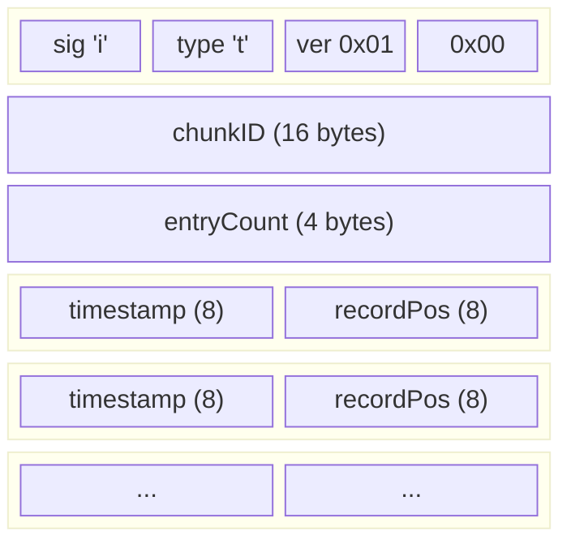
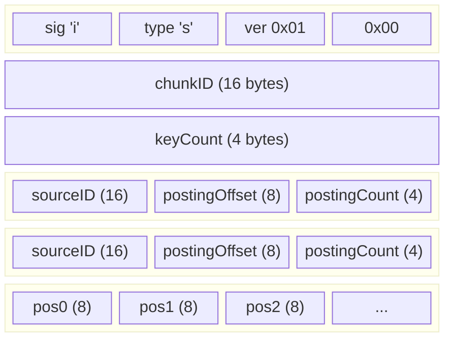

# GastroLog File Formats

All multi-byte integers are **little-endian**. UUIDs are stored as raw 16-byte values. Timestamps are stored as **int64 Unix microseconds**.

## Directory Layout

```
<data_dir>/
  <chunk-uuid>/
    meta.bin            Chunk metadata
    sources.bin         SourceID-to-LocalID mapping table
    records.log         Append-only record log
  <index_dir>/
    <chunk-uuid>/
      _time.idx         Sparse time index
      _source.idx       Source index (inverted posting list)
```

## Common Header Pattern

Index files and the meta file share a common header prefix:

| Field     | Size | Description                              |
|-----------|------|------------------------------------------|
| signature | 1    | Always `0x69` (`'i'`)                    |
| type      | 1    | File type: `'m'` meta, `'t'` time, `'s'` source |
| version   | 1    | Format version (`0x01`)                  |
| flags     | 1    | Bit flags (file-type specific)           |

---

## meta.bin -- Chunk Metadata

Fixed-size file (44 bytes). Validated on decode by checking that the file size matches exactly.

### Layout

```
 0                   1                   2                   3
 0 1 2 3 4 5 6 7 8 9 0 1 2 3 4 5 6 7 8 9 0 1 2 3 4 5 6 7 8 9 0 1
+-+-+-+-+-+-+-+-+-+-+-+-+-+-+-+-+-+-+-+-+-+-+-+-+-+-+-+-+-+-+-+-+
|  sig (0x69)   |  type ('m')   |  version (1)  |    flags      |
+-+-+-+-+-+-+-+-+-+-+-+-+-+-+-+-+-+-+-+-+-+-+-+-+-+-+-+-+-+-+-+-+
|                                                               |
+                        chunkID (16 bytes)                     +
|                                                               |
+-+-+-+-+-+-+-+-+-+-+-+-+-+-+-+-+-+-+-+-+-+-+-+-+-+-+-+-+-+-+-+-+
|                                                               |
+                     startTS (int64 micros)                    +
|                                                               |
+-+-+-+-+-+-+-+-+-+-+-+-+-+-+-+-+-+-+-+-+-+-+-+-+-+-+-+-+-+-+-+-+
|                                                               |
+                      endTS (int64 micros)                     +
|                                                               |
+-+-+-+-+-+-+-+-+-+-+-+-+-+-+-+-+-+-+-+-+-+-+-+-+-+-+-+-+-+-+-+-+
|                                                               |
+                      dataSize (int64 bytes)                   +
|                                                               |
+-+-+-+-+-+-+-+-+-+-+-+-+-+-+-+-+-+-+-+-+-+-+-+-+-+-+-+-+-+-+-+-+
```

### Fields

| Offset | Size | Field     | Description                              |
|--------|------|-----------|------------------------------------------|
| 0      | 1    | signature | `0x69` (`'i'`)                           |
| 1      | 1    | type      | `0x6D` (`'m'`)                           |
| 2      | 1    | version   | `0x01`                                   |
| 3      | 1    | flags     | Bit 0: sealed (`0x01` = sealed)          |
| 4      | 16   | chunkID   | Chunk UUID (raw bytes)                   |
| 20     | 8    | startTS   | First record timestamp (Unix micros)     |
| 28     | 8    | endTS     | Last record timestamp (Unix micros)      |
| 36     | 8    | dataSize  | Total records.log size in bytes          |

**Total: 44 bytes**

### Flags

| Bit | Mask   | Meaning |
|-----|--------|---------|
| 0   | `0x01` | Sealed  |

---

## sources.bin -- Source ID Mapping Table

Append-only sequence of fixed-size records. Each record maps one `SourceID` (UUID) to a `localID` (uint32) used in `records.log`.

### Record Layout

```
 0                   1                   2                   3
 0 1 2 3 4 5 6 7 8 9 0 1 2 3 4 5 6 7 8 9 0 1 2 3 4 5 6 7 8 9 0 1
+-+-+-+-+-+-+-+-+-+-+-+-+-+-+-+-+-+-+-+-+-+-+-+-+-+-+-+-+-+-+-+-+
|                        size (uint32)                          |
+-+-+-+-+-+-+-+-+-+-+-+-+-+-+-+-+-+-+-+-+-+-+-+-+-+-+-+-+-+-+-+-+
|  version (1)  |                                               |
+-+-+-+-+-+-+-+-+                                               +
|                        sourceID (16 bytes)                    |
+               +-+-+-+-+-+-+-+-+-+-+-+-+-+-+-+-+-+-+-+-+-+-+-+-+
|               |                  localID (uint32)             |
+-+-+-+-+-+-+-+-+-+-+-+-+-+-+-+-+-+-+-+-+-+-+-+-+-+-+-+-+-+-+-+-+
|                     trailing size (uint32)                    |
+-+-+-+-+-+-+-+-+-+-+-+-+-+-+-+-+-+-+-+-+-+-+-+-+-+-+-+-+-+-+-+-+
```

### Fields

| Offset | Size | Field         | Description                              |
|--------|------|---------------|------------------------------------------|
| 0      | 4    | size          | Total record size (always 29)            |
| 4      | 1    | version       | `0x01`                                   |
| 5      | 16   | sourceID      | Source UUID (raw bytes)                  |
| 21     | 4    | localID       | Local uint32 identifier (starts at 1)   |
| 25     | 4    | trailing size | Repeat of size field (must match)        |

**Total: 29 bytes per record**

Local IDs are assigned sequentially starting from 1. The file contains one record per distinct source seen by the chunk.

---

## records.log -- Record Log

Append-only sequence of variable-length records. Each record is framed with leading and trailing size fields to support both forward and backward traversal.

### Record Layout

```
 0                   1                   2                   3
 0 1 2 3 4 5 6 7 8 9 0 1 2 3 4 5 6 7 8 9 0 1 2 3 4 5 6 7 8 9 0 1
+-+-+-+-+-+-+-+-+-+-+-+-+-+-+-+-+-+-+-+-+-+-+-+-+-+-+-+-+-+-+-+-+
|                        size (uint32)                          |
+-+-+-+-+-+-+-+-+-+-+-+-+-+-+-+-+-+-+-+-+-+-+-+-+-+-+-+-+-+-+-+-+
|  magic (0x69) |  version (1)  |                               |
+-+-+-+-+-+-+-+-+-+-+-+-+-+-+-+-+                               +
|                                                               |
+                     ingestTS (uint64 micros)                  +
|                               +-+-+-+-+-+-+-+-+-+-+-+-+-+-+-+-+
|                               |     sourceLocalID (uint32)    |
+-+-+-+-+-+-+-+-+-+-+-+-+-+-+-+-+-+-+-+-+-+-+-+-+-+-+-+-+-+-+-+-+
|                        rawLen (uint32)                        |
+-+-+-+-+-+-+-+-+-+-+-+-+-+-+-+-+-+-+-+-+-+-+-+-+-+-+-+-+-+-+-+-+
|                                                               |
~                       raw (rawLen bytes)                      ~
|                                                               |
+-+-+-+-+-+-+-+-+-+-+-+-+-+-+-+-+-+-+-+-+-+-+-+-+-+-+-+-+-+-+-+-+
|                     trailing size (uint32)                    |
+-+-+-+-+-+-+-+-+-+-+-+-+-+-+-+-+-+-+-+-+-+-+-+-+-+-+-+-+-+-+-+-+
```

### Fields

| Offset | Size    | Field         | Description                            |
|--------|---------|---------------|----------------------------------------|
| 0      | 4       | size          | Total record size including this field |
| 4      | 1       | magic         | `0x69`                                 |
| 5      | 1       | version       | `0x01`                                 |
| 6      | 8       | ingestTS      | Ingest timestamp (Unix micros)         |
| 14     | 4       | sourceLocalID | Local source ID (from sources.bin)     |
| 18     | 4       | rawLen        | Length of raw payload                  |
| 22     | rawLen  | raw           | Raw log message bytes                  |
| 22+N   | 4       | trailing size | Repeat of size field (must match)      |

**Minimum size: 26 bytes** (empty payload)
**Maximum size: ~4 GB** (limited by uint32 size field)

The `sourceLocalID` references a mapping in `sources.bin`. To resolve back to a full UUID, look up the local ID in the source map.

The leading and trailing size fields enable bidirectional cursor traversal: forward by reading the leading size and skipping ahead, backward by reading the trailing size and jumping back.

---

## _time.idx -- Time Index

Sparse time index mapping sampled timestamps to record positions within a chunk. Only built for sealed chunks.

### Layout

```
+---------------------------+
|          Header           |
+---------------------------+
|     Entry 0               |
+---------------------------+
|     Entry 1               |
+---------------------------+
|     ...                   |
+---------------------------+
|     Entry N-1             |
+---------------------------+
```

### Header (24 bytes)

| Offset | Size | Field      | Description                        |
|--------|------|------------|------------------------------------|
| 0      | 1    | signature  | `0x69` (`'i'`)                     |
| 1      | 1    | type       | `0x74` (`'t'`)                     |
| 2      | 1    | version    | `0x01`                             |
| 3      | 1    | flags      | `0x00` (reserved)                  |
| 4      | 16   | chunkID    | Chunk UUID (raw bytes)             |
| 20     | 4    | entryCount | Number of index entries (uint32)   |

### Entry (16 bytes each)

| Offset | Size | Field     | Description                          |
|--------|------|-----------|--------------------------------------|
| 0      | 8    | timestamp | Record timestamp (int64 Unix micros) |
| 8      | 8    | recordPos | Byte offset into records.log (uint64)|

**Total file size: 24 + (entryCount x 16) bytes**

Entries are written in cursor traversal order (the order records appear in `records.log`). A sparsity parameter controls how many records are sampled: with sparsity N, every N-th record is indexed (plus the first record always).



---

## _source.idx -- Source Index

Inverted index mapping each `SourceID` to the list of record positions where that source appears within a chunk. Only built for sealed chunks.

### Layout

```
+---------------------------+
|          Header           |
+---------------------------+
|     Key Table             |
|  (keyCount entries)       |
+---------------------------+
|     Posting Blob          |
|  (flat uint64 positions)  |
+---------------------------+
```

### Header (24 bytes)

| Offset | Size | Field    | Description                        |
|--------|------|----------|------------------------------------|
| 0      | 1    | signature| `0x69` (`'i'`)                     |
| 1      | 1    | type     | `0x73` (`'s'`)                     |
| 2      | 1    | version  | `0x01`                             |
| 3      | 1    | flags    | `0x00` (reserved)                  |
| 4      | 16   | chunkID  | Chunk UUID (raw bytes)             |
| 20     | 4    | keyCount | Number of distinct sources (uint32)|

### Key Table Entry (28 bytes each)

| Offset | Size | Field         | Description                                  |
|--------|------|---------------|----------------------------------------------|
| 0      | 16   | sourceID      | Source UUID (raw bytes)                       |
| 16     | 8    | postingOffset | Byte offset into posting blob (uint64)       |
| 24     | 4    | postingCount  | Number of positions for this source (uint32) |

Key entries are sorted by `sourceID` string representation for deterministic output.

### Posting Blob

Flat array of `uint64` record positions (8 bytes each). Each key entry references a contiguous slice of this blob via `postingOffset` (byte offset from the start of the posting blob) and `postingCount` (number of positions).

**Total file size: 24 + (keyCount x 28) + (totalPositions x 8) bytes**



---

## Validation Summary

All file formats include validation checks on decode:

| File         | Checks                                                         |
|--------------|----------------------------------------------------------------|
| meta.bin     | Exact size, signature, type, version                           |
| sources.bin  | Min size, version, trailing size match                         |
| records.log  | Min size, magic, version, size match, rawLen match, trailing   |
| _time.idx    | Min size, signature+type, version, chunkID, entry size match   |
| _source.idx  | Min size, signature+type, version, chunkID, key size, posting size |
