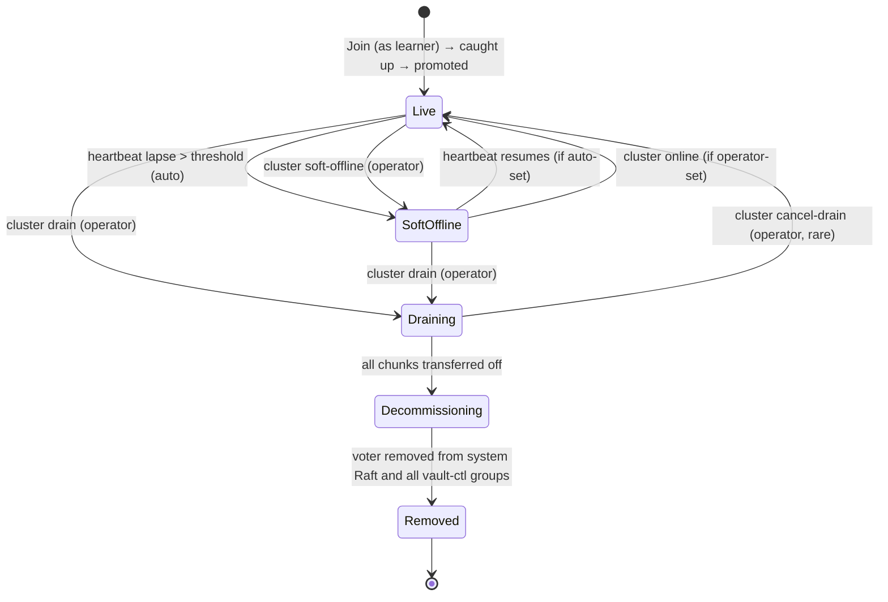

# Node Lifecycle: States, Transitions, and Learner Promotion

**Status:** Design proposal under [gastrolog-gr6wy](dcat://gastrolog-gr6wy). Not yet implemented. This document defines the target state for cluster node lifecycle and the learner-based join model. Implementation issues will be opened against this design once accepted.

## Context

The current node-lifecycle treats node liveness as binary: a node is either in `LivePeers` (heartbeats current within ~4s) or it is not. Every cluster decision — placement rotation, peer routing, decommission — derives from this single bit. The recent wave of fixes (gastrolog-2yeie series) hardened the *membership* layer but did not introduce gradations between "live" and "decommissioned." That gap is what allows transient absence (k8s rolling restart) to be misclassified as permanent removal, triggering placement rotation that orphans chunks on the absent node's disk.

This design introduces five explicit node states with deliberate transitions, and folds in a learner-based join model so new nodes do not count toward Raft quorum until they are caught up.

## States



### Per-state semantics

**Live** — heartbeats current; full participation. Placement may rotate to or from this node. Vault-ctl Raft groups: voter (or learner during initial join). Receives reads and writes when leader.

**SoftOffline** — heartbeats lapsed past threshold (default 5 min) OR explicit operator mark. **Placement does NOT rotate off this node.** Vault-ctl Raft groups: still a voter (unreachable; quorum maintained by other voters). Reads to this node fail with connection error (no change to current read routing). Auto-trigger entry: heartbeat-lapse exceeds the threshold (configurable via env var). Auto-clear: heartbeat resumes (only if auto-set; operator-set is sticky). Persistent alert fires on entry.

**Draining** — operator-initiated via `cluster drain`. Active chunk transfers OUT to remaining holders. Placement updates only after the destination has the bytes (coordinated migration, not a flip-and-hope). No new placements assigned. Reads and writes still served while transfers run. Operator can cancel while in progress. Transitions to Decommissioning automatically once all chunks for which this node is in the placement set have moved AND the under-RF refusal check passes.

**Decommissioning** — all chunks moved; node holds no data the cluster needs. Membership removal in progress: voter removed from system Raft, then from each vault-ctl group. Reads and writes refused. The decommission gate (separate implementation issue) has already verified no orphaning would result.

**Removed** — voter removed from system Raft and all vault-ctl groups; NodeConfig deleted from system FSM. Node is no longer addressable. Any files remaining on retained PVCs are orphaned and handled by the orphaned-PVC sweep (separate issue).

## Behavior gates by state

| Concern | Live | SoftOffline | Draining | Decommissioning | Removed |
|---|---|---|---|---|---|
| Placement may rotate TO | yes | no | no | no | no |
| Placement may rotate FROM | yes | **no (gate)** | yes (drain mgr) | n/a | n/a |
| New placements assigned | yes | no | no | no | no |
| Receives reads when leader | yes | yes (likely fails) | yes | no | n/a |
| Receives writes when leader | yes | yes (likely fails) | yes | no | n/a |
| Counts for Raft quorum | yes (if voter) | yes (if voter) | yes | yes | no |
| Heartbeat tracked | yes | yes (lapsed) | yes | yes | no |

The **"Placement may rotate FROM SoftOffline = no"** row is the load-bearing gate for the RF=1 rolling-redeploy scenario. The placement guard in [placement.go](backend/internal/app/placement.go) enforces this rule and is the primary code change.

## Storage layout for state

Node state lives on the existing `NodeConfig` system-FSM record per node. Schema addition:

```go
type NodeConfig struct {
    ID          glid.GLID
    Address     string
    // ... existing fields ...

    State       NodeState    // NEW: Live / SoftOffline / Draining / Decommissioning
    StateSource StateSource  // NEW: Auto / Operator — distinguishes trigger source
    StateSince  time.Time    // NEW: when the current state was entered
}
```

`Removed` is not a stored state; it is the absence of the NodeConfig entry. Transition `Decommissioning → Removed` happens via `DeleteNode`.

## Transitions in detail

| From → To | Trigger | Mechanism |
|---|---|---|
| Live → SoftOffline (auto) | `time.Since(peerState.LastSeen(node)) > softOfflineThreshold` | Leader-side sweep on a low-frequency tick (e.g. 30s) proposes `CmdSetNodeState{node, SoftOffline, source: auto}` |
| Live → SoftOffline (op) | `cluster soft-offline <node>` CLI | RPC proposes `CmdSetNodeState{node, SoftOffline, source: operator}` |
| SoftOffline → Live (auto) | heartbeat resumes AND state was auto-set | Same sweep proposes `CmdSetNodeState{node, Live}` |
| SoftOffline → Live (op) | `cluster online <node>` CLI | RPC proposes `CmdSetNodeState{node, Live}`. Required if `source == operator` |
| {Live, SoftOffline} → Draining | `cluster drain <node>` CLI | RPC proposes `CmdSetNodeState{node, Draining}`. Drain orchestrator begins transfers |
| Draining → Decommissioning | all chunks where this node is in placement set have been transferred AND verified | Drain orchestrator proposes `CmdSetNodeState{node, Decommissioning}` once verification passes |
| Decommissioning → Removed | voter removed from system Raft + every vault-ctl group | Cluster removal sweep calls `RemoveServer` for each group, then `DeleteNode` on system FSM |

The `source` field distinguishes auto-set from operator-set, controlling whether heartbeat-resume can clear the state. Operator-set SoftOffline is sticky against flaky heartbeats; auto-set clears as soon as the node comes back.

## Operator CLI surface

```
gastrolog cluster soft-offline <node>    # Live | SoftOffline → SoftOffline (operator-set, sticky)
gastrolog cluster online <node>          # SoftOffline → Live (clears operator-set)
gastrolog cluster drain <node>           # Live | SoftOffline → Draining
gastrolog cluster cancel-drain <node>    # Draining → Live (rare; only while transfers running)
gastrolog cluster remove-node <node>     # convenience: drain + decommission + remove (must pass orphan gate)
```

## UI surface

Cluster overview shows per-node state with color/icon coding. SoftOffline duration is visible; alerts trigger with operator-action suggestions when duration exceeds an operator-tuned threshold. Draining shows transfer progress (chunks remaining).

## Learner-based join

### Mechanism

New nodes joining via `JoinCluster` are added as **non-voting learners** in two layers:

1. **System Raft** — `JoinCluster` calls `AddNonvoter` (was `AddVoter` today).
2. **Every vault-ctl Raft group** — `RefreshVaultCtlMembers` adds new nodes as non-voters in each per-vault group.

The new node receives replicated state via Raft log replication (and snapshots if far behind). It does NOT count toward quorum during this phase.

### Promotion: per-group, FSM apply-index match

A new background sweep runs per vault-ctl group **on the group's leader**. When the learner's `appliedIndex` matches the leader's `commitIndex` AND has remained matched for one full heartbeat interval, the leader proposes a config change to promote the learner to voter. System Raft has the same sweep on its leader.

**Why per-group:** vault-ctl groups are independent. A learner caught up in vault A can be promoted there even while still catching up on vault B. Convergence is incremental.

**Why apply-index match (not log-index threshold):** the most rigorous criterion. "Has applied every command the leader has applied" is the strongest correctness statement before counting toward quorum. Log-index thresholds admit learners that have replicated entries but not yet applied them — fine for some systems, but vault-ctl groups have FSM-sensitive operations (chunk lifecycle commands) where apply-index match matters.

**Stability window:** one heartbeat interval (default 1s). Prevents flapping if the learner momentarily catches up then falls behind.

### Failure modes

- **Learner falls behind faster than catches up:** stays a learner, alert fires ("node-X is a learner in 3/12 vault-ctl groups; investigate"). Operator decides whether to wait or remove.
- **Snapshot install in progress:** sweep does not propose promotion until snapshot installation completes and applies.
- **Operator force-promotion:** `gastrolog cluster promote-learner <node>` exists as an escape hatch when the operator knows the learner is functionally caught up.

### Composition with soft-offline

Learners can become SoftOffline the same way voters can. A SoftOffline learner is not promoted while in that state. Heartbeat resumption may unlock promotion on the next sweep tick.

## How this design resolves [gastrolog-5rh68](dcat://gastrolog-5rh68)

The companion design issue for residency tracking offered three options. Empirical investigation of read routing (see [query_remote.go#L105-L142](backend/internal/server/query_remote.go#L105) `remoteVaultsByNodeFiltered`) showed:

- Read fan-out routes to the placement leader's node only
- No consultation of `LivePeers`, no follower fallback, no `ChunkResidency` consultation

Given that read routing does not consult residency, **Option A (constrained placement, no new FSM state)** is sufficient. Residency continues to derive from `placement_set - pendingDeletes.ExpectedFrom`. The soft-offline gate above prevents placement from rotating off a transiently-absent node — the only path through which placement could lie about residency.

Option B (`pendingCatchups` twin) and Option C (explicit `Holders` field) remain available as escalation paths if a future design adds read routing that consults residency (e.g., follower-based read fallback).

## Out of scope (deferred to implementation issues)

- Specific threshold values (5 min default for auto-trigger is provisional; tune operationally)
- Exact FSM command proto schemas
- Migration semantics for existing clusters (existing voters likely stay voters; only new joiners become learners — but the transition path needs an explicit issue)
- UI mockups
- Alert text and severity
- Interaction with the decommission orphan-refusal gate (separate implementation issue from this design)

## Acceptance for this design

This document is sufficient to open the following implementation issues:

1. Node state machine — `NodeConfig` schema addition + `CmdSetNodeState` + transition validators
2. State-driven placement guard in [placement.go](backend/internal/app/placement.go)
3. Soft-offline auto-trigger sweep (leader-side) + heartbeat-resume auto-clear
4. Operator CLI verbs for state transitions
5. UI surface for per-node state visibility
6. Learner-based join: `AddNonvoter` path in [cluster/join.go](backend/internal/cluster/join.go)
7. Per-group learner promoter
8. System-Raft learner promoter

Each implementation issue inherits its acceptance criteria from the corresponding section of this document.

## Relationship to other work

- Parent epic: [gastrolog-2i1g9](dcat://gastrolog-2i1g9) (FSM-authority migration)
- Companion design: [gastrolog-5rh68](dcat://gastrolog-5rh68) (residency tracking — resolved to Option A by this document)
- Companion audit: [gastrolog-5dfv7](dcat://gastrolog-5dfv7) (subsystems treating disk as authority — independent, runs in parallel)
- Superseded context (preserved as deferred reminders): [gastrolog-3xmtk](dcat://gastrolog-3xmtk), [gastrolog-3qr8z](dcat://gastrolog-3qr8z) — capture the symptom set this design eliminates by construction.
