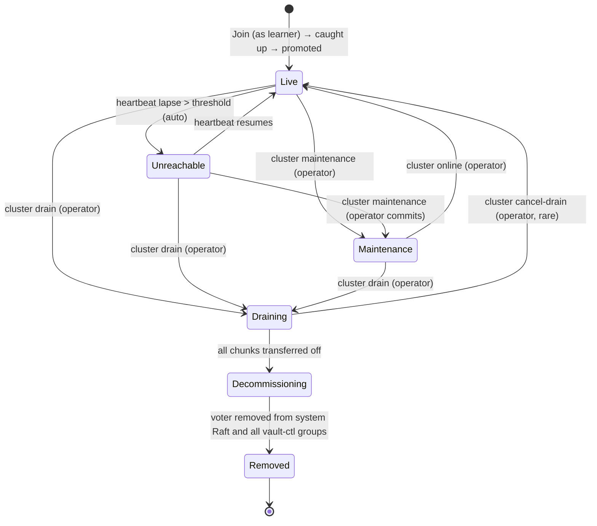

# Node Lifecycle: States, Transitions, and Learner Promotion

**Status:** Design proposal under [gastrolog-gr6wy](dcat://gastrolog-gr6wy). Not yet implemented. This document defines the target state for cluster node lifecycle and the learner-based join model. Implementation issues will be opened against this design once accepted.

## Context

The current node-lifecycle treats node liveness as binary: a node is either in `LivePeers` (heartbeats current within ~4s) or it is not. Every cluster decision — placement rotation, peer routing, decommission — derives from this single bit. The recent wave of fixes (gastrolog-2yeie series) hardened the *membership* layer but did not introduce gradations between "live" and "decommissioned." That gap is what allows transient absence (k8s rolling restart) to be misclassified as permanent removal, triggering placement rotation that orphans chunks on the absent node's disk.

This design introduces six explicit node states with deliberate transitions, separates **cluster-detected absence** (`Unreachable`) from **operator-declared absence** (`Maintenance`) — both of which share the *soft-offline* property of "do not rotate placement off this node" — and folds in a learner-based join model so new nodes do not count toward Raft quorum until they are caught up.

The category "soft-offline" describes any state where the cluster considers the node temporarily not-fully-participating without considering it removed. Two concrete states fall in this category: `Unreachable` (cluster's automatic detection) and `Maintenance` (operator's deliberate declaration). They share the placement-rotation gate but differ in their entry/exit semantics and operator UX.

A companion epic, [gastrolog-2ujjh](dcat://gastrolog-2ujjh) (Fan-out data-plane architecture), reshapes the record write path, reconcile mechanism, and chunk residency model afterward. This document covers the control-plane work that lands first. Three pieces of this design are transitional under that future architecture — see "Relationship to the data-plane epic" below.

## States



### Per-state semantics

**Live** — heartbeats current; full participation. Placement may rotate to or from this node. Vault-ctl Raft groups: voter (or learner during initial join). Receives reads and writes when leader.

**Unreachable** (soft-offline; cluster-detected) — heartbeats have lapsed past the threshold (default 5 min). **Placement does NOT rotate off this node.** Vault-ctl Raft groups: still a voter (unreachable; quorum maintained by other voters). Reads addressed to this node fail with connection error (no change to current read routing). Auto-trigger entry: heartbeat-lapse exceeds the threshold (configurable via env var). Auto-clear: heartbeat resumes. Persistent alert fires on entry; alert tone is "noticed a problem" — operator may want to act.

**Maintenance** (soft-offline; operator-declared) — operator has explicitly placed this node in maintenance mode via `cluster maintenance <node>`. Cluster behavior identical to `Unreachable` for placement-rotation and quorum participation. The differences: entry is operator-initiated and sticky (heartbeat resumption does NOT auto-clear), exit requires explicit `cluster online <node>`, and alerts are informational rather than warning ("this is intentional"). The state captures operator intent that may persist across transient reachability changes — e.g., the operator is preparing the underlying host for kernel maintenance and wants the cluster to ignore brief reachability flaps during the window.

**Draining** — operator-initiated via `cluster drain <node>`. Active chunk transfers OUT to remaining holders. Placement updates only after the destination has the bytes (coordinated migration, not a flip-and-hope). No new placements assigned. Reads and writes still served while transfers run. Operator can cancel while in progress. Transitions to Decommissioning automatically once all chunks for which this node is in the placement set have moved AND the under-RF refusal check passes.

**Decommissioning** — all chunks moved; node holds no data the cluster needs. Membership removal in progress: voter removed from system Raft, then from each vault-ctl group. Reads and writes refused. The decommission gate (separate implementation issue) has already verified no orphaning would result.

**Removed** — voter removed from system Raft and all vault-ctl groups; NodeConfig deleted from system FSM. Node is no longer addressable. Any files remaining on retained PVCs are orphaned and handled by the orphaned-PVC sweep (separate issue).

## Behavior gates by state

| Concern | Live | Unreachable | Maintenance | Draining | Decommissioning | Removed |
|---|---|---|---|---|---|---|
| Placement may rotate TO | yes | no | no | no | no | no |
| Placement may rotate FROM | yes | **no (gate)** | **no (gate)** | yes (drain mgr) | n/a | n/a |
| New placements assigned | yes | no | no | no | no | no |
| Receives reads when leader | yes | yes (likely fails) | yes (may succeed if reachable) | yes | no | n/a |
| Receives writes when leader | yes | yes (likely fails) | yes (may succeed if reachable) | yes | no | n/a |
| Counts for Raft quorum | yes (if voter) | yes (if voter) | yes (if voter) | yes | yes | no |
| Heartbeat tracked | yes | yes (lapsed) | yes | yes | yes | no |

The **"Placement may rotate FROM Unreachable/Maintenance = no"** rows are the load-bearing gate for the RF=1 rolling-redeploy scenario and for operator maintenance windows. Both soft-offline states share the same placement-rotation gate; the placement guard in [placement.go](backend/internal/app/placement.go) treats them identically.

The reads/writes row differs slightly between `Unreachable` and `Maintenance` only in expected outcome: an `Unreachable` node is by definition not heartbeating, so reads to it will almost always fail; a `Maintenance` node may or may not be reachable depending on what the operator is doing (it may be fully functional and just flagged as "leave me alone"). The cluster's *behavior* is the same in both — try the node, observe success or failure — but the *probability of success* differs.

## Storage layout for state

Node state lives on the existing `NodeConfig` system-FSM record per node. Schema addition:

```go
type NodeConfig struct {
    ID         glid.GLID
    Address    string
    // ... existing fields ...

    State      NodeState  // NEW: Live / Unreachable / Maintenance / Draining / Decommissioning
    StateSince time.Time  // NEW: when the current state was entered
}
```

`Removed` is not a stored state; it is the absence of the NodeConfig entry. Transition `Decommissioning → Removed` happens via `DeleteNode`.

## Transitions in detail

| From → To | Trigger | Mechanism |
|---|---|---|
| Live → Unreachable | `time.Since(peerState.LastSeen(node)) > unreachableThreshold` | Leader-side sweep on a low-frequency tick (e.g. 30s) proposes `CmdSetNodeState{node, Unreachable}` |
| Live → Maintenance | `cluster maintenance <node>` CLI | RPC proposes `CmdSetNodeState{node, Maintenance}` |
| Live → Draining | `cluster drain <node>` CLI | RPC proposes `CmdSetNodeState{node, Draining}`; drain orchestrator begins transfers |
| Unreachable → Live | heartbeat resumes | Same sweep proposes `CmdSetNodeState{node, Live}` |
| Unreachable → Maintenance | `cluster maintenance <node>` CLI | Operator commits to the offline state; auto-restore-on-heartbeat behavior is replaced with sticky operator control |
| Unreachable → Draining | `cluster drain <node>` CLI | Operator begins removal |
| Maintenance → Live | `cluster online <node>` CLI | Operator clears maintenance |
| Maintenance → Draining | `cluster drain <node>` CLI | Operator begins removal |
| Draining → Decommissioning | all chunks where this node is in placement set have been transferred AND verified | Drain orchestrator proposes `CmdSetNodeState{node, Decommissioning}` once verification passes |
| Draining → Live | `cluster cancel-drain <node>` CLI | Rare; only while transfers still running |
| Decommissioning → Removed | voter removed from system Raft + every vault-ctl group | Cluster removal sweep calls `RemoveServer` for each group, then `DeleteNode` on system FSM |

## Operator CLI surface

```
gastrolog cluster maintenance <node>     # Live | Unreachable → Maintenance
gastrolog cluster online <node>          # Maintenance → Live
gastrolog cluster drain <node>           # Live | Unreachable | Maintenance → Draining
gastrolog cluster cancel-drain <node>    # Draining → Live (rare; only while transfers running)
gastrolog cluster remove-node <node>     # convenience: drain + decommission + remove (must pass orphan gate)
```

Cluster-detected soft-offline (`Unreachable`) is not something the operator manually invokes; the cluster auto-detects it via heartbeat lapse, and the operator promotes it to `Maintenance` via `cluster maintenance` if sticky operator control is desired.

## API surface principles

The CLI verbs and status RPCs above must satisfy these properties:

- **Idempotent verbs.** Calling `cluster maintenance <node>` twice has the same effect as calling it once: the second call returns success with no state change, not an error. Same for `cluster drain`, `cluster online`, `cluster cancel-drain`, `cluster promote-learner`. A consumer that retries on transient failure must be safe to do so.
- **Watchable status.** Node states and per-node metadata (state, `StateSince`, last-heartbeat, etc.) are accessible via a server-stream RPC, not just point-in-time queries. Consumers can react to state transitions without polling.
- **Machine-readable output.** Every state-querying CLI verb supports `--output json` (or equivalent structured output) for parseable consumption.
- **Stable state names.** `Live` / `Unreachable` / `Maintenance` / `Draining` / `Decommissioning` are part of the API contract once released. Renaming or splitting them post-release is a breaking change.
- **No hidden state.** Every operationally-relevant fact about a node (current state, entry timestamp, transition history, alert-relevant counters) is observable via the status API. Decisions made by external systems cannot rely on state that the API doesn't surface.
- **Command/query separation.** Verbs that mutate state (`maintenance`, `drain`, `online`) are distinct from verbs that read state (`status`, `inspect`). Mutating verbs return the new state; querying verbs do not mutate.

These are good properties for any cluster CLI regardless of whether an external orchestrator (Kubernetes operator, deployment automation, runbook script) ever consumes them. Designing for them up front avoids retrofitting if an external controller is added later.

## UI surface

Cluster overview shows per-node state with color/icon coding. The two soft-offline states are visually distinguishable: `Unreachable` uses a warning tone (cluster noticed a problem), `Maintenance` uses an informational tone (operator action). Duration is shown for both. Alerts trigger with operator-action suggestions when `Unreachable` duration exceeds an operator-tuned threshold; `Maintenance` alerts are silent or low-priority. `Draining` shows transfer progress (chunks remaining).

## Learner-based join

### Mechanism

New nodes joining via `JoinCluster` are added as **non-voting learners** in two layers:

1. **System Raft** — `JoinCluster` calls `AddNonvoter` (was `AddVoter` today).
2. **Every vault-ctl Raft group** — `RefreshVaultCtlMembers` adds new nodes as non-voters in each per-vault group.

The new node receives replicated state via Raft log replication (and snapshots if far behind). It does NOT count toward quorum during this phase.

### Promotion: per-group, FSM apply-index match

A new background sweep runs per vault-ctl group **on the group's leader**. When the learner's `appliedIndex` matches the leader's `commitIndex` AND has remained matched for one full heartbeat interval, the leader proposes a config change to promote the learner to voter. System Raft has the same sweep on its leader.

**Why per-group:** vault-ctl groups are independent. A learner caught up in vault A can be promoted there even while still catching up on vault B. Convergence is incremental.

**Why apply-index match (not log-index threshold):** the most rigorous criterion. "Has applied every command the leader has applied" is the strongest correctness statement before counting toward quorum. Log-index thresholds admit learners that have replicated entries but not yet applied them — fine for some systems, but vault-ctl groups have FSM-sensitive operations (chunk lifecycle commands) where apply-index match matters.

**Stability window:** one heartbeat interval (default 1s). Prevents flapping if the learner momentarily catches up then falls behind.

### Failure modes

- **Learner falls behind faster than catches up:** stays a learner, alert fires ("node-X is a learner in 3/12 vault-ctl groups; investigate"). Operator decides whether to wait or remove.
- **Snapshot install in progress:** sweep does not propose promotion until snapshot installation completes and applies.
- **Operator force-promotion:** `gastrolog cluster promote-learner <node>` exists as an escape hatch when the operator knows the learner is functionally caught up.

### Composition with the soft-offline states

Learners can become `Unreachable` (heartbeats lapsed) or be placed in `Maintenance` (operator) the same way voters can. A learner in either soft-offline state is not promoted while in that state. State transition back to `Live` unlocks promotion on the next sweep tick.

## Relationship to the data-plane epic

This design's lifecycle work — states, transitions, learner promotion, placement guard, CLI surface — ships under the FSM-authority migration epic. The companion epic [gastrolog-2ujjh](dcat://gastrolog-2ujjh) (Fan-out data-plane architecture) lands afterward and reshapes the record write path, reconcile mechanism, and chunk residency model.

Three pieces of this design are **transitional**: they correctly fix pre-fan-out bugs but become unnecessary or reframed under the data-plane redesign.

- **The placement-rotation gate on soft-offline states.** Under the current placement-as-residency model, the gate prevents placement from rotating off `Unreachable` or `Maintenance` nodes, fixing the RF=1 redeploy bug. Under fan-out's Receiving/Holding split, placement editing is confined to the Receiving set; removal from Holding requires explicit confirmation that other holders have the records. The gate dissolves into the Holding-set semantics.
- **The `Draining` state with its drain orchestrator.** Today (under this epic): Draining is an explicit state with a worker that transfers chunks off the node before transitioning to Decommissioning. Under fan-out: drain becomes a placement edit (remove from Receiving); Holding shrinks naturally as records propagate; the node becomes safe to remove when Holding no longer references it. The orchestrator goes away.
- **Active-chunk seal on preStop drain.** Today the leader holds unsealed state that must be flushed before SIGTERM to avoid losing records. Under fan-out there is no leader-only unsealed state; records exist on all Receiving replicas at write time. The preStop seal step becomes unnecessary.

These transitional pieces ship as part of the current epic, then get removed or reframed when the data-plane epic lands. The lifecycle states themselves, learner-based join, soft-offline category (`Unreachable` + `Maintenance`), API surface principles, and operator CLI verbs all survive the transition unchanged.

## Out of scope (deferred to implementation issues)

- Specific threshold values (5 min default for `Unreachable` auto-trigger is provisional; tune operationally)
- Exact FSM command proto schemas
- Migration semantics for existing clusters (existing voters likely stay voters; only new joiners become learners — but the transition path needs an explicit issue)
- UI mockups
- Alert text and severity
- Interaction with the decommission orphan-refusal gate (separate implementation issue from this design)

## Acceptance for this design

This document is sufficient to open the following implementation issues:

1. Node state machine — `NodeConfig` schema addition + `CmdSetNodeState` + transition validators (six states: Live / Unreachable / Maintenance / Draining / Decommissioning / Removed)
2. State-driven placement guard in [placement.go](backend/internal/app/placement.go) — gates on both soft-offline states identically
3. `Unreachable` auto-trigger sweep (leader-side) + heartbeat-resume auto-clear
4. Operator CLI verbs for state transitions (`maintenance`, `online`, `drain`, `cancel-drain`, `remove-node`)
5. UI surface for per-node state visibility with the warning/informational tone distinction
6. Learner-based join: `AddNonvoter` path in [cluster/join.go](backend/internal/cluster/join.go)
7. Per-group learner promoter
8. System-Raft learner promoter

Each implementation issue inherits its acceptance criteria from the corresponding section of this document.

## Relationship to other work

- Parent epic: [gastrolog-2i1g9](dcat://gastrolog-2i1g9) (FSM-authority migration: lifecycle, learners, audit cleanup)
- Companion epic: [gastrolog-2ujjh](dcat://gastrolog-2ujjh) (Fan-out data-plane architecture) — lands after this epic; reframes the three transitional pieces above.
- Companion design: [gastrolog-5dfv7](dcat://gastrolog-5dfv7) (audit of disk-as-authority subsystems — independent, runs in parallel)
- Superseded context (preserved as deferred reminders): [gastrolog-3xmtk](dcat://gastrolog-3xmtk), [gastrolog-3qr8z](dcat://gastrolog-3qr8z) — capture the symptom set the migration eliminates by construction.
