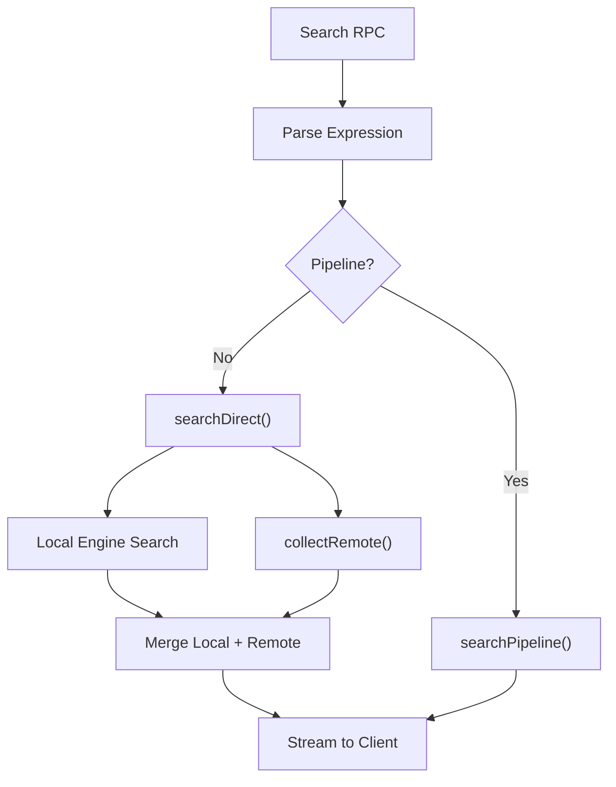
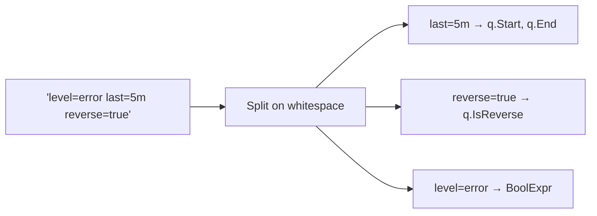
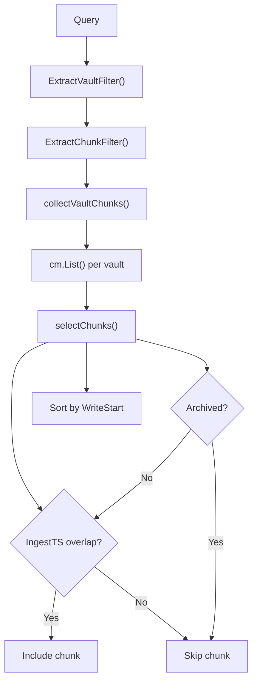
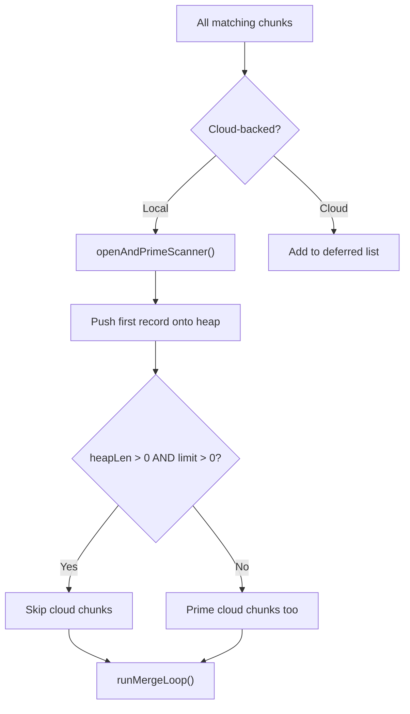
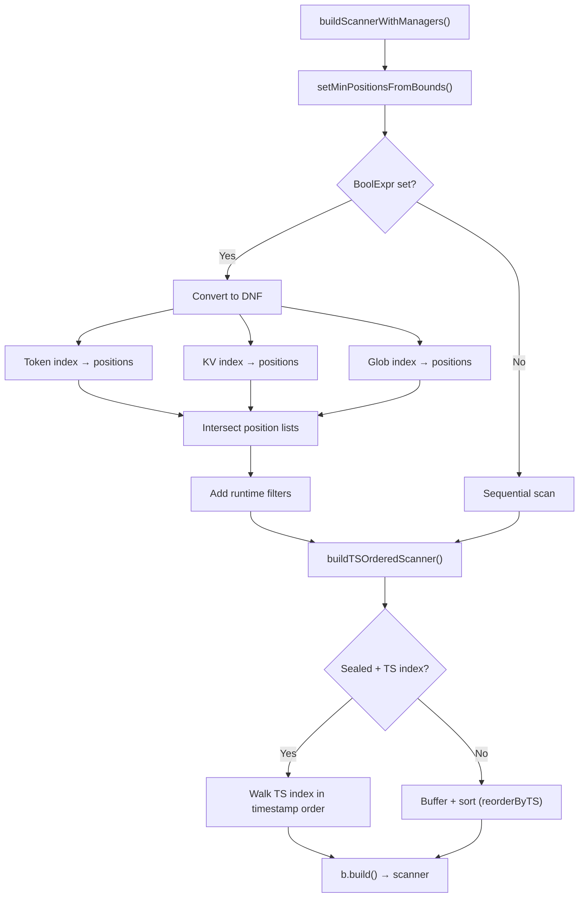
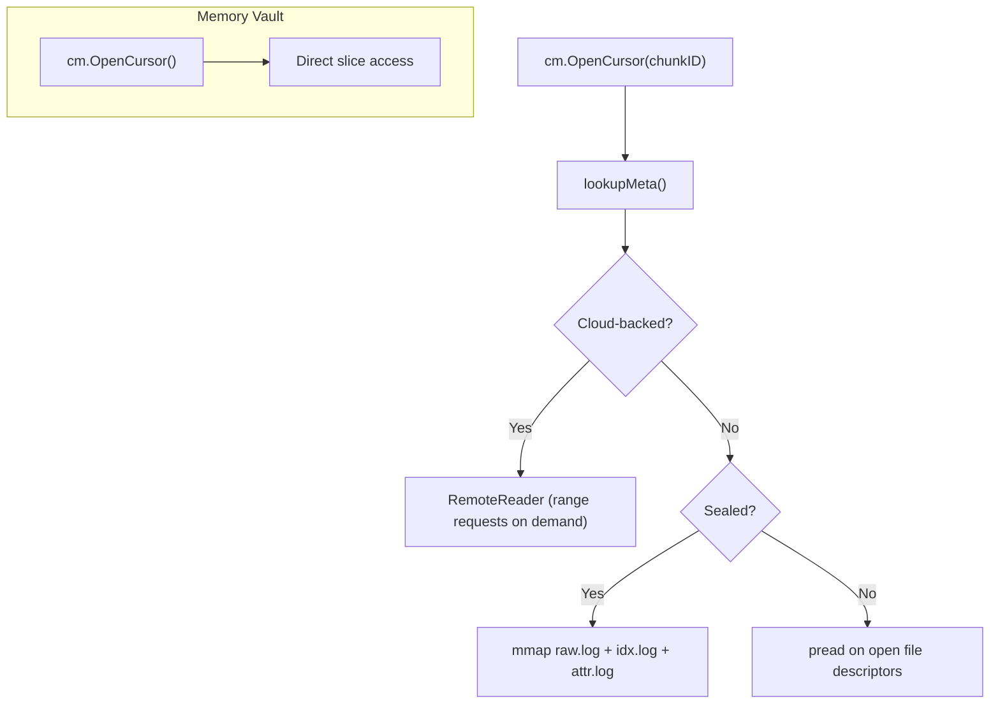
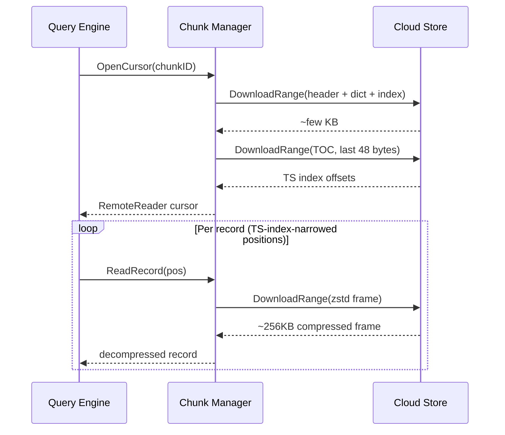
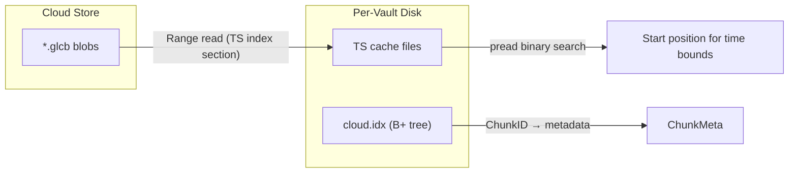
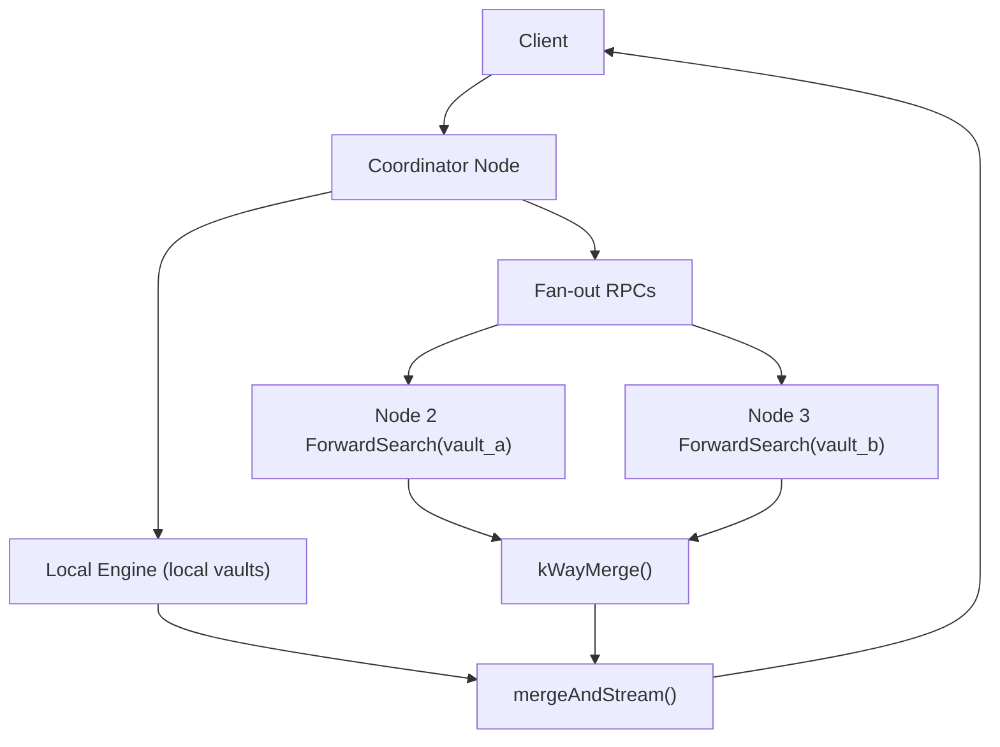
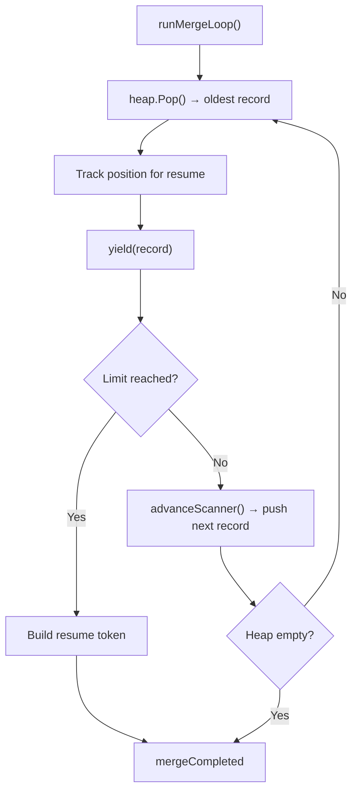

# Query Execution Pipeline

How a query travels from RPC request to streamed results, covering file vaults,
memory vaults, local chunks, cloud-backed chunks, and multi-node fan-out.

## High-Level Flow

## Expression Parsing

The expression string (e.g. `level=error last=5m limit=10`) is parsed in
`server/query.go → parseExpression()`. Whitespace-separated tokens are classified
as either **directives** (key=value pairs the engine understands) or **filter
predicates** (fed to the query language parser).

| Directive | Effect |
|-----------|--------|
| `last=<dur>` | Sets `Start = now-dur`, `End = now` |
| `start=<t>` / `end=<t>` | Explicit IngestTS bounds (RFC3339 or relative) |
| `source_start=` / `source_end=` | SourceTS bounds (runtime filter) |
| `limit=<n>` | Max records to return |
| `reverse=true` | Newest-first ordering |
| `order=source_ts` | Switch ordering from default IngestTS |
| `pos=<n>` | Single record by position |

Remaining tokens become filter predicates parsed by `querylang.ParsePipeline()`,
producing a `BoolExpr` tree (AND/OR/NOT over token matches, KV predicates, globs).

## Vault and Chunk Selection

**`selectChunks`** filters chunks by time overlap. A chunk is included if its
`[IngestStart, IngestEnd]` range intersects the query's `[lower, upper]` bounds.
Unsealed (active) chunks are always included since their WriteEnd is not final.

For **file vaults**, `cm.List()` returns both in-memory metadata (local chunks)
and B+ tree entries (cloud chunks). For **memory vaults**, all chunks are in-memory.

## Merge Heap Priming

The engine uses a min-heap to merge records from multiple chunks in timestamp
order. Priming opens a scanner per chunk and pushes its first record onto the heap.

**Cloud deferral**: local chunks are primed first. If any local chunk produces
a record and the query has a limit, cloud chunks are deferred entirely — they're
never downloaded. This is why a `last=5m limit=10` query with an active chunk
serving data does zero cloud I/O. (The `limit=` directive works in both the UI
query input and the CLI's `--limit` flag.)

## Scanner Pipeline

Each chunk gets a scanner built from composable stages. The scanner determines
which records to read and in what order.

### Position Narrowing

For **sealed chunks** with indexes, the engine narrows which records to read:

1. **Time-based**: B+ tree (active) or flat index (sealed) finds the first
   position with IngestTS ≥ lower bound → `setMinPosition()`
2. **Token index**: posting lists intersected for all required tokens
3. **KV index**: positions of records matching key/value predicates
4. **Glob index**: prefix-based positions, verified at runtime

If positions are available, a **position scanner** seeks directly to each one.
Otherwise, a **sequential scanner** reads records in order, applying runtime
filters.

### TS-Ordered Scanning

Records are stored in physical write order (WriteTS) but must always be yielded
in IngestTS order (the default) or SourceTS order. Every query goes through the
TS-ordered scanning path:

| Chunk Type | Strategy |
|------------|----------|
| Sealed + TS index available | Walk embedded TS index, seek to positions in TS order |
| Sealed + no TS index | Buffer all records, sort by TS field |
| Active (unsealed) | Buffer all records, sort by TS field (`reorderByTS`) |
| Cloud + TS index cached | Same as sealed — TS index downloaded once, cached locally |

## Chunk Access Paths

### File Vault Cursors

| Chunk State | Cursor Type | I/O Method |
|-------------|------------|------------|
| Active (unsealed) | `stdioCursor` | `pread` on raw.log, idx.log, attr.log |
| Sealed (local) | `mmapCursor` | Memory-mapped files, random access via offsets |
| Cloud-backed | `seekableCursor` | Range requests per zstd frame via `RemoteReader` (rare — deferred for bounded queries) |

### Memory Vault Cursors

Memory vaults hold records in Go slices. `OpenCursor()` returns a cursor backed
by direct slice indexing — no disk I/O, no file formats.

### Cloud Chunk Read Path

Cloud chunks are deferred during heap priming — if local chunks satisfy the
query's limit, cloud cursors are never opened and zero cloud I/O occurs.
Cloud cursors are opened when the query needs more records than local
chunks can provide — typically for longer time ranges or unbounded queries.

When a cloud cursor is opened, `RemoteReader` fetches only what's needed via
range requests:

The TS index narrows access to specific positions, so typically only a
handful of frames are fetched rather than the full blob.

## Cloud Index Infrastructure

Cloud chunk metadata lives in a B+ tree on disk (`cloud.idx`), not in the Go
heap. This keeps memory stable regardless of cloud chunk count.

**TS index cache**: on first query, the TS index section (~840KB for 70K records)
is downloaded via a single range request and cached as a local file. Subsequent
queries use `pread`-based binary search on the cache file — no cloud I/O.

## Multi-Node Cluster Query

The coordinator determines which vaults live on remote nodes via
`remoteVaultsByNode()`. For each remote vault, a streaming `ForwardSearch` RPC
is opened. Results flow back without buffering — `kWayMerge()` performs
selection-based merging across N streams (N is typically 1–3 vaults per node).

**Resume tokens** are split: local chunk positions stay on the coordinator,
remote vault tokens are opaque blobs forwarded back to their originating nodes
on the next page request.

## Merge Loop

The merge loop pops the entry with the smallest timestamp (or largest, for
reverse queries) from the heap, yields it to the client, and advances that
chunk's scanner to get the next record. When the limit is reached or the heap
is empty, it builds a resume token encoding each chunk's last-returned position.
