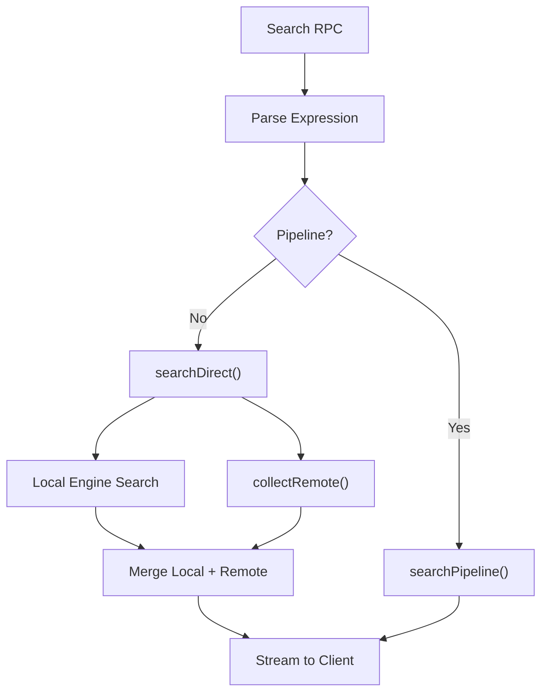
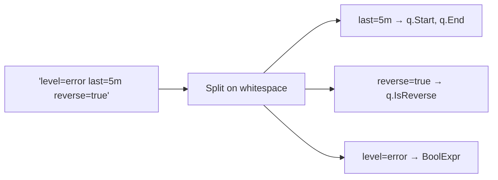
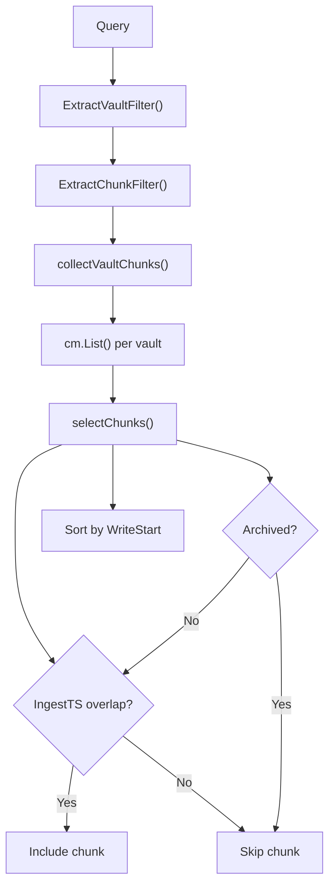
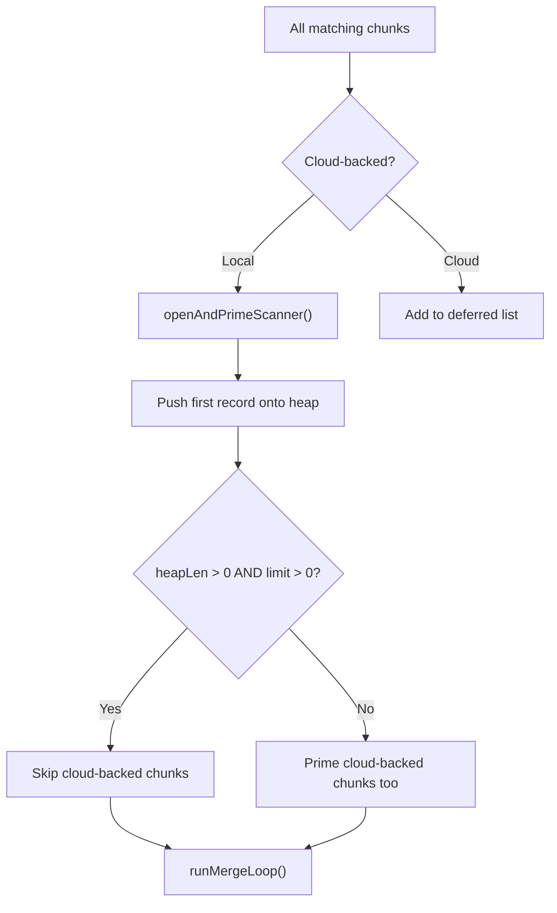
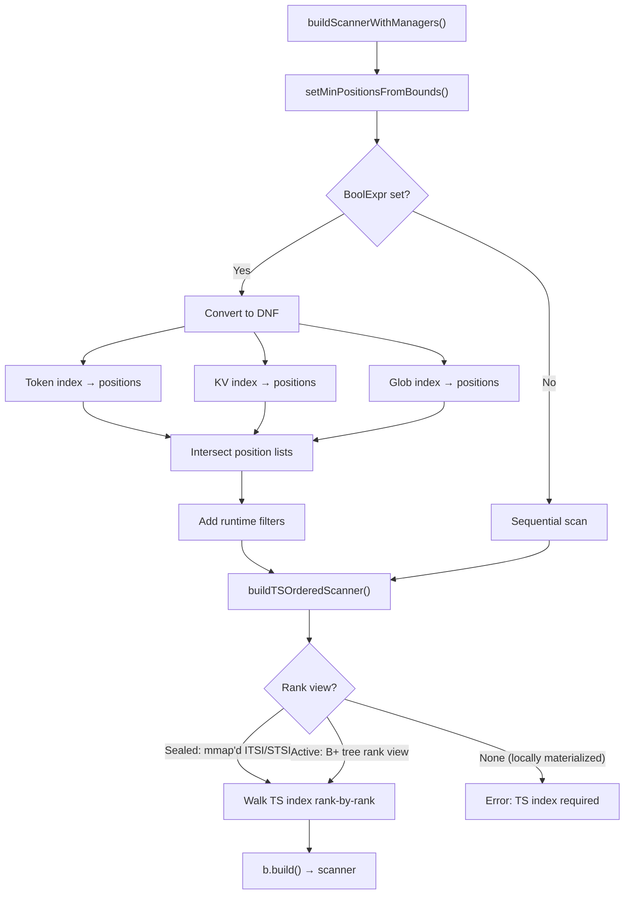
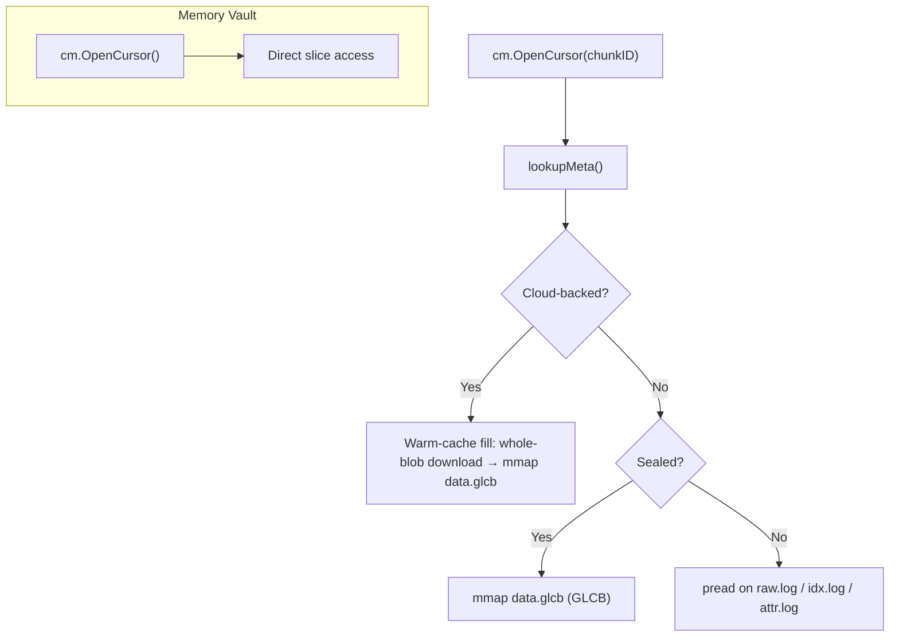
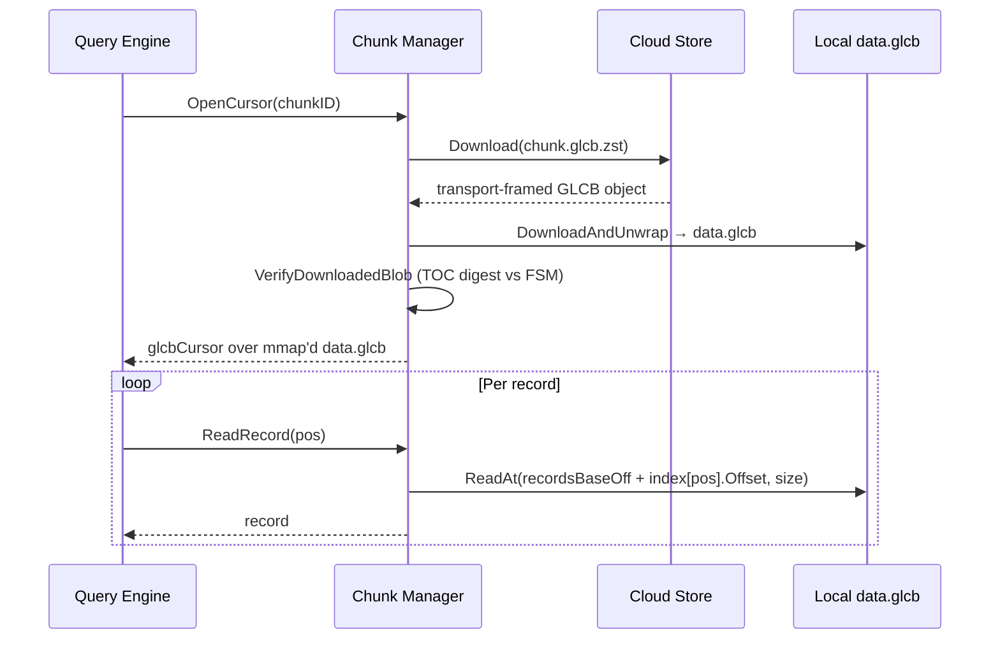
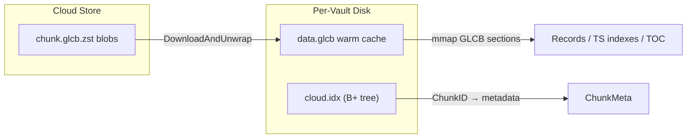
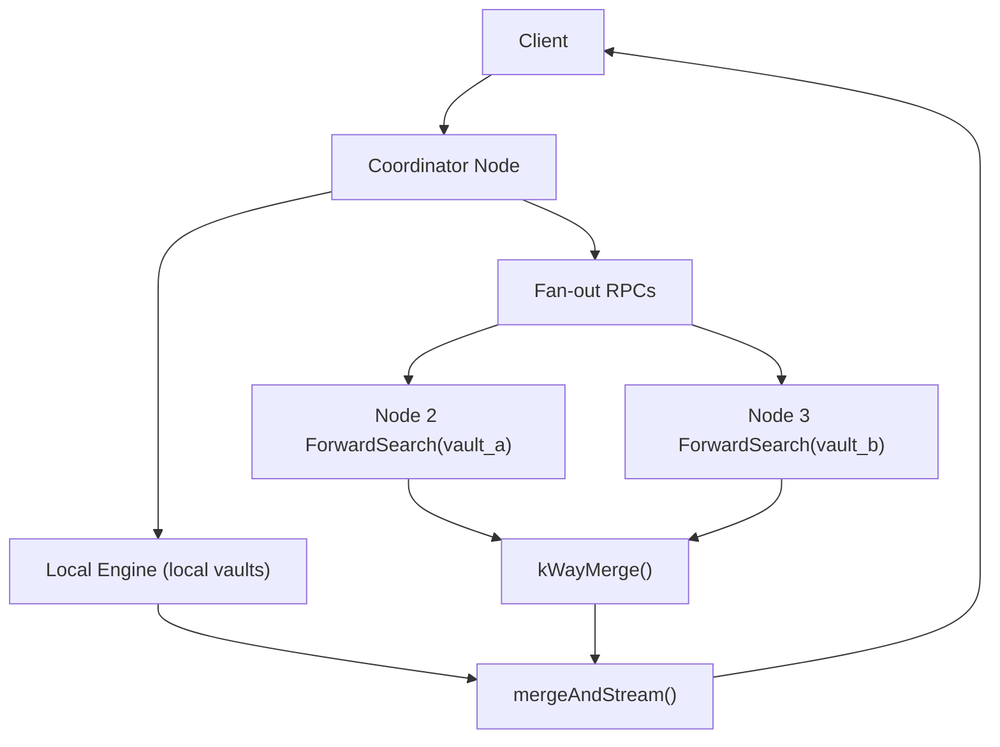
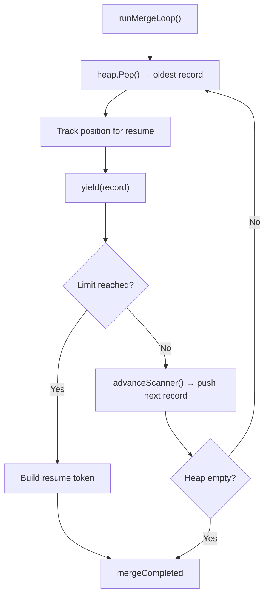

# Query Execution Pipeline

How a query travels from RPC request to streamed results, covering file vaults,
memory vaults, local chunks, cloud-backed chunks, and multi-node fan-out.

## High-Level Flow

```mermaid
flowchart TD
    RPC["Search RPC"] --> Parse["Parse Expression"]
    Parse --> Route{"Pipeline?"}
    Route -->|No| Direct["searchDirect()"]
    Route -->|Yes| Pipeline["searchPipeline()"]

    Direct --> Local["Local Engine Search"]
    Direct --> Remote["collectRemote()"]

    Local --> Merge["Merge Local + Remote"]
    Remote --> Merge
    Merge --> Stream["Stream to Client"]
    Pipeline --> Stream
```

## Expression Parsing

The expression string (e.g. `level=error last=5m limit=10`) is parsed in
`server/query.go → parseExpression()`. Whitespace-separated tokens are classified
as either **directives** (key=value pairs the engine understands) or **filter
predicates** (fed to the query language parser).

```mermaid
flowchart LR
    Expr["'level=error last=5m reverse=true'"]
    Expr --> Split["Split on whitespace"]
    Split --> D1["last=5m → q.Start, q.End"]
    Split --> D2["reverse=true → q.IsReverse"]
    Split --> F1["level=error → BoolExpr"]
```

| Directive | Effect |
|-----------|--------|
| `last=<dur>` | Sets `Start = now-dur`, `End = now` |
| `start=<t>` / `end=<t>` | Explicit IngestTS bounds (RFC3339 or relative) |
| `source_start=` / `source_end=` | SourceTS bounds (runtime filter) |
| `limit=<n>` | Max records to return |
| `reverse=true` | Newest-first ordering |
| `order=source_ts` | Switch ordering from default IngestTS |
| `pos=<n>` | Single record by position |

Remaining tokens become filter predicates parsed by `querylang.ParsePipeline()`,
producing a `BoolExpr` tree (AND/OR/NOT over token matches, KV predicates, globs).

## Vault and Chunk Selection

```mermaid
flowchart TD
    Q["Query"] --> VF["ExtractVaultFilter()"]
    VF --> CF["ExtractChunkFilter()"]
    CF --> CV["collectVaultChunks()"]

    CV --> ListLocal["cm.List() per vault"]
    ListLocal --> SC["selectChunks()"]

    SC --> TimeCheck{"IngestTS overlap?"}
    TimeCheck -->|Yes| Include["Include chunk"]
    TimeCheck -->|No| Skip["Skip chunk"]

    SC --> ArchiveCheck{"Archived?"}
    ArchiveCheck -->|Yes| Skip
    ArchiveCheck -->|No| TimeCheck

    SC --> Sort["Sort by WriteStart"]
```

**`selectChunks`** filters chunks by time overlap. A chunk is included if its
`[IngestStart, IngestEnd]` range intersects the query's `[lower, upper]` bounds.
Unsealed (active) chunks are always included since their WriteEnd is not final.

For **file vaults**, `cm.List()` returns both in-memory metadata (local chunks)
and B+ tree entries (cloud-backed chunks). For **memory vaults**, all chunks are in-memory.

## Merge Heap Priming

The engine uses a min-heap to merge records from multiple chunks in timestamp
order. Priming opens a scanner per chunk and pushes its first record onto the heap.

```mermaid
flowchart TD
    AllChunks["All matching chunks"] --> Classify{"Cloud-backed?"}

    Classify -->|Local| Prime["openAndPrimeScanner()"]
    Classify -->|Cloud| Defer["Add to deferred list"]

    Prime --> Heap["Push first record onto heap"]

    Heap --> Check{"heapLen > 0 AND limit > 0?"}
    Check -->|Yes| DeferCloud["Skip cloud-backed chunks"]
    Check -->|No| PrimeCloud["Prime cloud-backed chunks too"]

    DeferCloud --> MergeLoop
    PrimeCloud --> MergeLoop

    MergeLoop["runMergeLoop()"]
```

**Cloud deferral**: local chunks are primed first. If any local chunk produces
a record and the query has a limit, cloud-backed chunks are deferred entirely — they're
never downloaded. This is why a `last=5m limit=10` query with an active chunk
serving data does zero cloud I/O. (The `limit=` directive works in both the UI
query input and the CLI's `--limit` flag.)

## Scanner Pipeline

Each chunk gets a scanner built from composable stages. The scanner determines
which records to read and in what order.

```mermaid
flowchart TD
    Build["buildScannerWithManagers()"] --> MinPos["setMinPositionsFromBounds()"]
    MinPos --> BoolExpr{"BoolExpr set?"}

    BoolExpr -->|Yes| DNF["Convert to DNF"]
    DNF --> TokenIdx["Token index → positions"]
    DNF --> KVIdx["KV index → positions"]
    DNF --> GlobIdx["Glob index → positions"]
    TokenIdx --> Intersect["Intersect position lists"]
    KVIdx --> Intersect
    GlobIdx --> Intersect
    Intersect --> RuntimeFilters["Add runtime filters"]

    BoolExpr -->|No| Sequential["Sequential scan"]

    RuntimeFilters --> TSScanner["buildTSOrderedScanner()"]
    Sequential --> TSScanner

    TSScanner --> TSCheck{"Rank view?"}
    TSCheck -->|"Sealed: mmap'd ITSI/STSI"| TSIndex["Walk TS index rank-by-rank"]
    TSCheck -->|"Active: B+ tree rank view"| TSIndex
    TSCheck -->|"None (locally materialized)"| Fail["Error: TS index required"]

    TSIndex --> FinalBuild["b.build() → scanner"]
```

### Position Narrowing

For **sealed chunks** with indexes, the engine narrows which records to read:

1. **Time-based**: B+ tree (active) or flat index (sealed) finds the first
   position with IngestTS ≥ lower bound → `setMinPosition()`
2. **Token index**: posting lists intersected for all required tokens
3. **KV index**: positions of records matching key/value predicates
4. **Glob index**: prefix-based positions, verified at runtime

If positions are available, a **position scanner** seeks directly to each one.
Otherwise, a **sequential scanner** reads records in order, applying runtime
filters.

### TS-Ordered Scanning

Records are stored in physical write order (WriteTS) but must always be yielded
in IngestTS order (the default) or SourceTS order. Every query goes through the
TS-ordered scanning path:

| Chunk Type | Strategy |
|------------|----------|
| Sealed (local or warm-cached cloud) | Walk the embedded mmap'd ITSI/STSI rank-by-rank, seek to positions in TS order |
| Active (unsealed) | Same rank-ordered path via the chunk manager's B+ tree rank view (`IngestTSRankView`) |
| Locally materialized, no rank view | Query fails with `TS index required` — there is no buffer-and-sort fallback |
| Not locally materialized, no TS index | Sequential scan (`b.build()`), yielded in write order |

The old `reorderByTS` buffer-and-sort path was removed (gastrolog-2o9e9,
gastrolog-1dg3i); rank-based TS index scanning is the only TS-ordered path.

## Chunk Access Paths

```mermaid
flowchart TD
    Open["cm.OpenCursor(chunkID)"] --> LookupMeta["lookupMeta()"]

    LookupMeta --> IsCloud{"Cloud-backed?"}
    IsCloud -->|Yes| CloudPath["Warm-cache fill: whole-blob download → mmap data.glcb"]
    IsCloud -->|No| IsSealed{"Sealed?"}
    IsSealed -->|Yes| MmapPath["mmap data.glcb (GLCB)"]
    IsSealed -->|No| StdioPath["pread on raw.log / idx.log / attr.log"]

    subgraph Memory Vault
        MemOpen["cm.OpenCursor()"] --> MemSlice["Direct slice access"]
    end
```

### File Vault Cursors

| Chunk State | Cursor Type | I/O Method |
|-------------|------------|------------|
| Active (unsealed) | `stdioCursor` | `pread` on raw.log, idx.log, attr.log |
| Sealing (local) | `stdioCursor` (no GLCB yet) or `mmapCursor` (GLCB committed) | Read path adapts to whichever artifacts are present; `OpenCursor` prefers `data.glcb` when it exists |
| Sealed (local) | `mmapCursor` | Memory-mapped GLCB, random access via record-index offsets |
| Cloud-backed | `glcbCursor` (after warm-cache fill) | One whole-object download → reassemble GLCB → mmap; reads are local from then on. Histogram rank lookups on cold chunks skip the fill: the ITSI section arrives via KB-scale range GETs |

For Phase 3 (gastrolog-1huz5) Sealing chunks, the query engine branches on the **local** `meta.Sealed` (active-form closed?) rather than the cluster `State == Sealed` (GLCB committed?). This is the one place where local truth is the right truth — the chunk is locally readable as soon as the active-form files are closed; whether the cluster has finished publishing its GLCB digest is irrelevant to the read path. If `PostSealProcess` hasn't built the embedded indexes yet, TS-ordered scanning has no rank view for the chunk (the B+ tree rank view serves only the live active chunk) and the query fails with `TS index required` — no buffer-and-sort fallback exists.

### Memory Vault Cursors

Memory vaults hold records in Go slices. `OpenCursor()` returns a cursor backed
by direct slice indexing — no disk I/O, no file formats.

### Cloud-Backed Chunk Read Path

Cloud-backed chunks are deferred during heap priming — if local chunks satisfy the
query's limit, cloud cursors are never opened and zero cloud I/O occurs.
Cloud cursors are opened when the query needs more records than local
chunks can provide — typically for longer time ranges or unbounded queries.

Phase 6 (gastrolog-69fd5) replaced the per-record range-request path with
a whole-blob download + warm-cache fill. The first cursor pays one
download; every subsequent read on the same chunk goes through the local
mmap fast path:

```mermaid
sequenceDiagram
    participant QE as Query Engine
    participant CM as Chunk Manager
    participant S3 as Cloud Store
    participant Cache as Local data.glcb

    QE->>CM: OpenCursor(chunkID)
    CM->>S3: Download(chunk.glcb.zst)
    S3-->>CM: transport-framed GLCB object
    CM->>Cache: DownloadAndUnwrap → data.glcb
    CM->>CM: VerifyDownloadedBlob (TOC digest vs FSM)
    CM-->>QE: glcbCursor over mmap'd data.glcb

    loop Per record
        QE->>CM: ReadRecord(pos)
        CM->>Cache: ReadAt(recordsBaseOff + index[pos].Offset, size)
        CM-->>QE: record
    end
```

The local cache is byte-for-byte equivalent to a freshly-sealed local
chunk. Subsequent queries reuse the cache; eviction policy reclaims
disk space under pressure (`gastrolog-2idw8`).

## Cloud Index Infrastructure

Cloud-backed chunk metadata lives in a B+ tree on disk (`cloud.idx`), not in the Go
heap. This keeps memory stable regardless of cloud-backed chunk count.

```mermaid
flowchart LR
    subgraph "Per-Vault Disk"
        BTree["cloud.idx (B+ tree)"]
        WarmCache["data.glcb warm cache"]
    end

    subgraph "Cloud Store"
        Blobs["chunk.glcb.zst blobs"]
    end

    BTree -->|"ChunkID → metadata"| Meta["ChunkMeta"]
    Blobs -->|"DownloadAndUnwrap"| WarmCache
    WarmCache -->|"mmap GLCB sections"| Positions["Records / TS indexes / TOC"]
```

**Warm cache.** First read of a cloud-backed chunk pulls the
zstd-wrapped blob, decompresses it into a local `data.glcb`, and verifies
the TOC's blob digest against the FSM-stamped value (gastrolog-grnc3).
The TS index, record index, and records all live in the same file from
that point on — `pread`-based binary search runs against the local mmap
with no further cloud I/O.

## Multi-Node Cluster Query

```mermaid
flowchart TD
    Client["Client"] --> Coord["Coordinator Node"]

    Coord --> LocalEng["Local Engine (local vaults)"]
    Coord --> Fan["Fan-out RPCs"]

    Fan --> Node2["Node 2 ForwardSearch(vault_a)"]
    Fan --> Node3["Node 3 ForwardSearch(vault_b)"]

    LocalEng --> MergeAll["mergeAndStream()"]
    Node2 --> KWay["kWayMerge()"]
    Node3 --> KWay
    KWay --> MergeAll

    MergeAll --> Client
```

The query travels to a peer as text: the coordinator prints the parsed filter
and pipeline back into query syntax and the peer parses it again. That printer
(`Expr.String()`, `Pipeline.String()`) is therefore a wire format, not a
diagnostic: every predicate kind prints as syntax the parser reads back as the
same predicate, values are quoted whenever the lexer could not take them as a
bareword (the empty string included), and a pipeline without a filter prints
with its leading `|`. A round-trip test and a fuzzer pin this.

The coordinator determines which vaults live on peer nodes via
`remoteVaultsByNode()`. For each remote vault, a streaming `ForwardSearch` RPC
is opened. Results flow back without buffering — `kWayMerge()` performs
selection-based merging across N streams (N is typically 1–3 vaults per node).

**Every merge uses one order**: `OrderBy.CompareRecords` — the ordering
timestamp, then `chunk.EventID`'s own total order (IngestTS, NodeID,
IngesterID, IngestSeq), with `reverse` negating the whole comparison. That
applies at all three levels: a node's `tsHeap` fan-in across its own vaults and
chunks, the coordinator's `kWayMerge` fan-in across remote vaults, and the
local/remote merge on top of them.

A timestamp tie is ordinary rather than exotic — under `order=source_ts` a
whole second of syslog shares one timestamp, so a `head`/`tail` cutoff lands
inside a tie group as a matter of course. Ranking such records by which side
was "local", by vault ID, or by an entry's position in a concurrently-built
merge slice would make the same query return a different window depending on
which node the client connected to and on how routing fanned copies across
vaults. EventID's fields are intrinsic to the event and identical on every copy
of it, so every node ranks any two records the same way.

**Histograms travel ahead of records.** Each remote vault's histogram arrives
whole in its stream's first message, and `SearchStream`'s `getHistogram` must
answer from that message alone. The coordinator reads every vault's histogram
*before* it starts draining any vault's records, so a getter that waited for
its stream to finish would deadlock the fan-out: the record channel fills, the
peer's producer parks on a send nobody is reading, and the coordinator is still
waiting on the histogram. It only bites past the channel's depth, which is why
paged queries never showed it and an unlimited one did.

**Resume tokens** carry the coordinator's local chunk positions plus one
canonical cursor for the merged stream: the last emitted record's timestamp on
the ordering axis and its EventID. Remote vaults are not resumed by their own
tokens; the next page bounds every source at the cursor's timestamp
(inclusively) and the merge skips whatever sits at or before the cursor in
canonical order, so a page boundary inside a group of records sharing a
timestamp neither repeats nor drops any of them, from any node.

## Query Memory Budget

Pipeline operators control their own result limits, so `RunPipeline` clears the
incoming `Limit` before scanning: a scan limit would cut an aggregator's or a
sort's *input*, making `| stats count` report the count of an arbitrary prefix
and `| sort` order one. What bounds the work instead is a per-query memory
budget (`query.MaxQueryMemoryBytes`, 256 MiB), which bounds retained bytes
without changing the answer.

Every path that retains data charges it: the record buffer behind an uncapped
sort, the top-N working set behind a capped one, the slot array a `tail`/`slice`
declares, the dedup seen-event set, stats group state, and the collections
inside `dcount`, `median`, `values`, `first`, and `last`. Records are charged
*after* field extraction, since the JSON/logfmt fields that materialization
moves into `Attrs` are most of what a buffered record retains. Exceeding the
budget fails the query with a `query.MemoryLimitError` naming the structure that
overflowed and the ceiling; the RPC layer surfaces it as `ResourceExhausted`.
The budget never trims a result to fit.

Two older caps do produce a partial table, and both label it: exceeding
`MaxGroupCardinality` stops admitting new `stats` groups, and gap-fill stops
padding empty bins when it would exhaust the cardinality cap or the budget.
Both set `TableResult.Truncated`, which travels to the client, so the partial
result is flagged rather than silent — but it is still partial, which is a
different contract from the budget's outright failure.

The budget is **per query, per node**. Each node executing part of a fan-out
gets its own, and the coordinator runs its whole share — the local scan and the
records streaming back from peers — on one ledger. There is no cluster-wide
total: the exhaustion being prevented is a node running out of memory, a
per-node resource, and a shared counter would need a cluster round trip on the
per-record path.

A pipeline that ends in `stats` or `timechart` with combinable aggregates
(`count`, `sum`, `min`, `max`, `avg`) is split at the aggregating operator. Every node
runs the filter, the operators ahead of the aggregate, and the aggregate
itself; the coordinator merges the per-node tables by the operator's structure
— the leading columns are the group keys, the rest are the aggregates in
declaration order, each combined by its own rule — and then runs the operators
after the aggregate (`where`, `eval`, `sort`, `head`, …) once over the merged
table. Column names play no part in the merge, so an alias cannot hide an
aggregate, and a filter after `stats` sees the cluster's count rather than each
node's share of it. Every node is asked for *partial* aggregates: an `avg`
arrives as its sum and its count, and the coordinator divides once, so the
cluster average never needs the records.

A pipeline the cluster cannot answer by merging per-node results — a `head`,
`tail`, or `slice` that would otherwise apply once per node, a `dedup` whose
window spans nodes, or an aggregate like `dcount`/`median`/`values` that
cannot be recombined from partials — runs once on the coordinator over every
node's records. Those records are
*streamed* through it, merged with the local scan in query order, not collected
first: the coordinator retains only what the pipeline's own operators hold, so
memory tracks the answer rather than the match set. An uncapped `sort` is the
one shape that genuinely has to hold every record, and the budget is what
bounds it. A `timechart` behind such an operator bins from that merged stream
rather than from the coordinator's chunk metadata, so its buckets hold the
survivors of the cap applied cluster-wide; without an explicit time range they
span those survivors, whichever node coordinates.

The ceiling is a fixed constant rather than a setting. A node runs queries for
every vault it leads, so raising it to make one query fit would re-arm the same
exhaustion for every other vault on that node; the remedy for a query that does
not fit belongs in the query.

## Merge Loop

```mermaid
flowchart TD
    Loop["runMergeLoop()"] --> Pop["heap.Pop() → oldest record"]
    Pop --> Track["Track position for resume"]
    Track --> Yield["yield(record)"]
    Yield --> LimitCheck{"Limit reached?"}
    LimitCheck -->|Yes| Token["Build resume token"]
    LimitCheck -->|No| Advance["advanceScanner() → push next record"]
    Advance --> HeapCheck{"Heap empty?"}
    HeapCheck -->|No| Pop
    HeapCheck -->|Yes| Done["mergeCompleted"]
    Token --> Done
```

The merge loop pops the entry with the smallest timestamp (or largest, for
reverse queries) from the heap, yields it to the client, and advances that
chunk's scanner to get the next record. When the limit is reached or the heap
is empty, it builds a resume token encoding each chunk's last-returned position.
