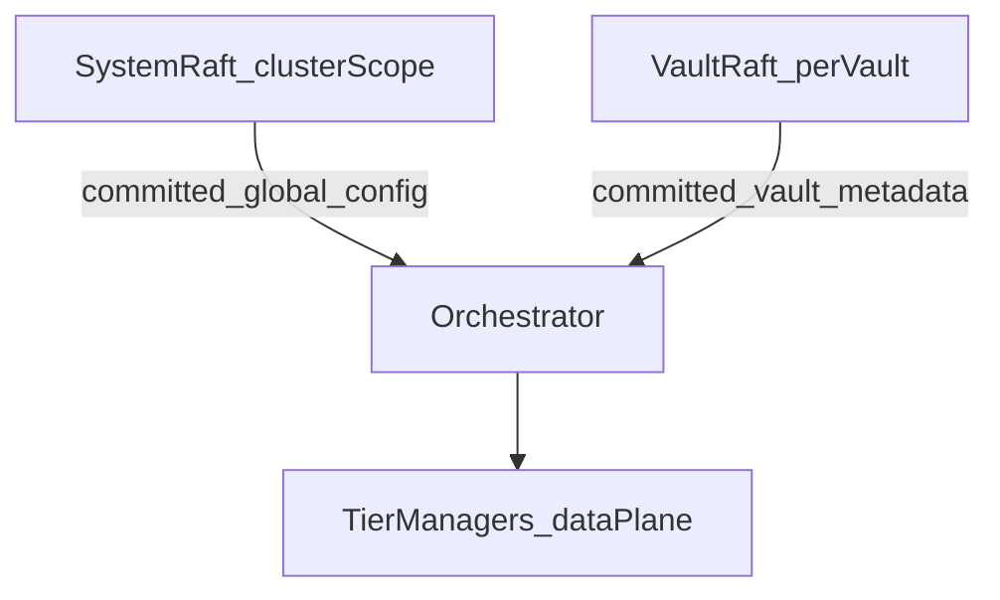
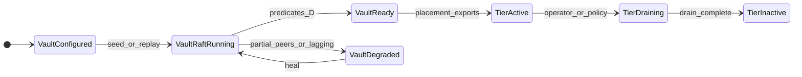

# Vault-level control-plane architecture

**Planning artifact:** dcat `gastrolog-k1ej7`  
**Parent:** Architectural redesign — orchestration and metadata consistency (`gastrolog-3eghu`)  
**Unblocks:** `gastrolog-5xxbd` (vault-level Raft + FSM namespacing), `gastrolog-554s3` (explicit vault → tier manager ownership)

**Acceptance criterion (k1ej7):** A **uniform Raft group model** — system/config and vault groups share **lifecycle and on-disk conventions**. Any exception is a **named compatibility shim** with an explicit **sunset** (no undocumented privileged directory layout).

**Terminal state (5xxbd complete):** There are **no** per-tier metadata Raft groups. **One vault-scoped control-plane Raft** (plus system Raft for cluster-global config) owns every cross-node tier/chunk metadata mutation that today goes through `tierfsm` + tier `GroupTransport`. Tier **instances** (chunk/index managers) remain the data plane and **do not** host their own Raft groups.

**Vocabulary:** canonical terms follow [`ubiquitous_language.md`](./ubiquitous_language.md). In particular, this architecture uses **vault-ctl Raft** (one group per vault, authoritative for tier/chunk metadata) and **tier FSM** (the per-tier sub-state-machine inside the vault-ctl FSM). There is no "tier Raft group" — where this document discusses the pre-5xxbd design, it is describing what's being replaced.

---

## Table of contents

1. [Inventory: today (as implemented)](#inventory-today-as-implemented)
2. [A) Vocabulary (normative)](#a-vocabulary-normative)
3. [B) Authority model (normative)](#b-authority-model-normative)
4. [C) Uniform Raft group model (target)](#c-uniform-raft-group-model-target)
5. [D) Vault readiness semantics](#d-vault-readiness-semantics-normative--testable)
6. [E) Legal state machine (chunk / tier / vault)](#e-legal-state-machine-chunk--tier--vault)
7. [F) Non-goals and open questions](#f-non-goals-and-open-questions)
8. [G) Handoff checklists](#g-handoff-checklists)
9. [Code anchors (maintenance)](#code-anchors-maintenance)

---

## Inventory: today (as implemented)

### System / cluster config Raft

| Aspect | Detail |
|--------|--------|
| **Entry** | `openRaftSystemStore` in [`backend/internal/app/raft.go`](../backend/internal/app/raft.go) |
| **Persistence** | `raftwal.Open(filepath.Join(Home.RaftDir(), "wal"))` with `GroupStore("system")`; file snapshot store `hraft.NewFileSnapshotStore(raftDir, …)` on `Home.RaftDir()` (same `raft/` tree as home layout in [`backend/internal/home/home.go`](../backend/internal/home/home.go)) |
| **Transport** | Cluster server transport (not multiraft group-scoped) |
| **Apply path** | `cluster.SetApplyFn` → `raftstore.Store.ApplyRaw` (config mutations) |

### Vault control-plane Raft (per vault, `vault/<id>/ctl`)

| Aspect | Detail |
|--------|--------|
| **Entry** | `ensureVaultControlPlaneRaftGroup` in [`backend/internal/orchestrator/reconfig_vaults.go`](../backend/internal/orchestrator/reconfig_vaults.go) |
| **FSM** | [`backend/internal/vaultraft/`](../backend/internal/vaultraft/) — holds per-tier sub-FSMs ([`tierfsm.FSM`](../backend/internal/vaultraft/tierfsm/)) namespaced by `OpTierFSM` commands |
| **Cross-node apply** | `orchestrator.ApplyVaultControlPlane` → `cluster.VaultApplyForwarder` when `PeerConns` is set, else local `Raft.Apply`; RPC path: `ForwardVaultApply` + `cluster.SetGroupApplyFn` ([`backend/internal/orchestrator/vault_ctl_apply.go`](../backend/internal/orchestrator/vault_ctl_apply.go), [`backend/internal/cluster/vault_apply_forwarder.go`](../backend/internal/cluster/vault_apply_forwarder.go), [`backend/internal/cluster/forward.go`](../backend/internal/cluster/forward.go), [`backend/internal/app/app.go`](../backend/internal/app/app.go)) |
| **Client forwarder** | [`backend/internal/cluster/vault_apply_forwarder.go`](../backend/internal/cluster/vault_apply_forwarder.go) (`VaultApplyForwarder`) |

### Tier chunk metadata (cluster mode)

Replicated tier chunk metadata uses the **vault control-plane** group only (`OpTierFSM` wrapping `tierfsm` wire payloads). There is **no** separate per-tier multiraft group. Entry: `ensureVaultCtlTierMetadata` in [`backend/internal/orchestrator/reconfig_vaults.go`](../backend/internal/orchestrator/reconfig_vaults.go). Cross-node apply uses `ForwardTierApply` with the vault ctl `group_id` and wrapped command bytes (`cluster.NewVaultCtlTierApplyForwarder`).

### Orchestrator

Vault / tier / chunk operations and routing: [`backend/internal/orchestrator/vault_ops.go`](../backend/internal/orchestrator/vault_ops.go) and related orchestrator code; replicated metadata callbacks from `ensureVaultCtlTierMetadata` / `tierRaftCallbacks` read the per-tier sub-FSM inside [`backend/internal/vaultraft/`](../backend/internal/vaultraft/).

### Status: target design achieved (gastrolog-5xxbd + gastrolog-2ze8j)

The deltas below were the original design questions this spec needed to resolve. They have been addressed by the gastrolog-5xxbd (vault-level Raft groups + FSM namespacing) and gastrolog-2ze8j (decommission of legacy tier-Raft code paths) work. Preserved here for historical reference.

1. **Authority scope:** Replicated tier metadata is on **vault control-plane Raft** (cluster mode). Done.
2. **Snapshot layout asymmetry:** System snapshots live under `raftDir`; group snapshots under `raft/groups/<groupId>/`. Target must either justify a **uniform two-root pattern** or **converge** layouts.
3. **Shared WAL:** System and vault groups share one `raftwal` on-disk segment stream; coupling is total. A vault redesign **must not** assume independent WALs unless the design explicitly splits them (default stays shared). Done.
4. **Readiness / partial peers:** Vault readiness predicates landed in gastrolog-4ip1o + gastrolog-5j6eu (`Vault.ReadinessErr`, keyed on `r.AppliedIndex()`). Done.
5. **Apply entrypoints:** Unified to **one** `cluster.Server.SetGroupApplyFn` (both `ForwardTierApply` and `ForwardVaultApply` RPC handlers dispatch to it). Done in 2ze8j.

---

## A) Vocabulary (normative)

| Term | Definition |
|------|------------|
| **Control plane** | Replicated metadata and decisions that must survive restart and agree cluster-wide (Raft-backed configuration, placement-derived invariants that affect safety, chunk/tier metadata that must not fork across nodes). |
| **Data plane** | Bytes on disk / object store / cloud blobs and record streams; may be locally authoritative under placement rules but **must not** contradict committed control-plane state. |
| **Authority** | The sole writer path for a given decision (typically through the Raft leader for that group). |
| **Cache / hint** | Read models that may lag (peer discovery, placement views). **MUST** be labeled as such; **MUST NOT** be the only source for unsafe actions. |
| **Vault readiness** | Predicate bundle (section D) for whether this node may execute **vault-scoped** control-plane responsibilities for a vault. |
| **Tier readiness** | Whether this node may operate a **specific tier instance** (local export) for a vault — may depend on vault readiness + local placement + resource state. |
| **Node readiness** | Process-level (gRPC up, system Raft available, etc.) — orthogonal to vault readiness. |

---

## B) Authority model (normative)

**MUST**

- Every mutation that changes **cross-node** interpretation of vault/tier/chunk metadata **MUST** go through a **defined Raft group** (system or vault-scoped per target topology), or through an explicitly documented non-Raft path that remains safe under partition (rare; default is “no”).
- **System Raft** remains the home for **cluster-global** configuration and membership that is not vault-owned (exact list to be enumerated during implementation; default: anything not naturally keyed by vault ID stays system-scoped until moved).
- **Vault-scoped** control-plane state **MUST** be keyed and replicated under a **vault-scoped Raft identity** in the target architecture (section C), not ad hoc per-tier groups for vault-wide invariants.

**MUST NOT**

- Introduce a second silent writer path for the same metadata (e.g. direct boltdb / local files that diverge from what Raft would apply).
- Treat placement caches, peer tables, or “last known leader” hints as authoritative for commits that need consensus.

**Partial membership / unresolved peers**

- **MUST** inherit the safety principle already documented for tier groups: **do not bootstrap** a new Raft group with an incomplete voter set when that would bake a bad configuration.
- **MUST** define whether **deferred creation** means “vault not ready” vs “tier not ready” vs both — and what user-visible behavior is (backpressure, skip, retry).

---

## C) Uniform Raft group model (target)

**Goal:** System and vault groups follow the **same lifecycle and storage conventions**. Any exception is a **named compatibility shim** with a **sunset** (version gate or explicit removal deadline).

### Target topology (conceptual)

- **SystemRaft:** Global cluster config / membership (existing role, possibly narrowed as vault scope grows).
- **VaultRaft (per vault):** Authoritative for **all** vault/tier/chunk control-plane metadata that is replicated today via per-tier Raft + `tierfsm`. **No separate tier Raft** in the finished design.
- **Tier managers / chunk path:** Consume committed state from VaultRaft + system; **do not** host Raft; **do not** own consensus for cross-node metadata.

### Identifiers and routing

- String `GroupID` remains the routing key for `multiraft.GroupTransport` ([`backend/internal/multiraft/transport.go`](../backend/internal/multiraft/transport.go)).
- Target naming convention **MUST** be explicit. **Vault control-plane Raft** uses `vault/<vaultGLID>/ctl` (`raftgroup.VaultControlPlaneGroupID`) and is the **only** vault-scoped multiraft group for replicated tier/chunk metadata. System config group stays `system` in multiraft transport wiring.

### Persistence (target rules)

- **WAL:** Either (1) one shared `raftwal` for **all** group stores including system and vault groups with stable `GroupStore` naming, or (2) split WALs with a **documented** reason and identical **semantic** contract per WAL. Default direction: **(1)** unless I/O isolation proves mandatory.
- **Snapshots:** One directory pattern for all group kinds — e.g. `raft/groups/<groupID>/` **including** a system alias `system` — OR elevate both to a symmetric `{wal, groups}` layout with zero special cases. The spec **MUST** pick one. **Greenfield only:** no on-disk upgrade path from older layouts; wipe or replace the raft tree when the layout changes during development.

### Lifecycle

- **Create / seed / restart:** Symmetric across group kinds (same `GroupManager` patterns in [`backend/internal/raftgroup/groupmanager.go`](../backend/internal/raftgroup/groupmanager.go)).
- **Shutdown:** Preserve ordering already relied upon (Raft shutdown before transport removal; see `DestroyGroup`). Vault redesign **MUST NOT** weaken shutdown invariants.

### Authority direction (target)

---

## D) Vault readiness semantics (normative + testable)

Predicate names are illustrative; exact symbols belong in implementation.

| Predicate | Intent |
|-----------|--------|
| **VaultRaft_LocalReplicaReady** | Local process has joined/replayed the vault group far enough that **reads** required for safe local work are valid (define minimum: e.g. snapshot + committed config applied, or stricter). |
| **Vault_ControlPlaneReady** (node-local) | AND of: node process ready, `VaultRaft_LocalReplicaReady`, and any **dependency** declared mandatory (system Raft catchup, peer resolvability, etc.). |
| **Vault_ServeIngestReady** / **Vault_ServeQueryReady** | **MAY** be stricter than control-plane ready; **MUST** be explicit if ingest is allowed before full FSM catch-up. |

**Consistency**

- Metadata read from VaultRaft-backed state **MUST** be **linearizable** via normal Raft reads / barriers where this spec says “strong”.
- Caches **MAY** be eventually consistent only where this spec lists allowed staleness and the failure mode is bounded.

**WAL / replay / partial peers**

- **MUST** state whether tier-style **defer create** becomes **vault-group defer create**, and how that surfaces in readiness bits and logs.

---

## E) Legal state machine (chunk / tier / vault)

**MUST** document transitions that today touch `tierfsm` / tier Raft applies (`reconfig_vaults.go` callbacks) and state which transitions become **vault Raft commands** vs **local tier instance** bookkeeping.

Chunk/tier substates (delete pending, transition streamed, tombstone, etc.) **MUST** be mapped in implementation to: **vault-committed**, **tier-local**, or **system-committed**.

### Compact diagram (refine during 5xxbd)

---

## F) Non-goals and open questions

These require explicit product/architecture decisions:

1. **One VaultRaft vs multiple raft groups per vault** (e.g. separate hot/cold metadata): pick one default.
2. **Cutover** to **no tier Raft**: ~~move `tierfsm` commands and `ForwardTierApply` onto vault control-plane Raft, then remove `createTierRaftGroup`, tier `GroupStore` names, and `SetTierApplyFn`~~ — **done** (gastrolog-5xxbd + gastrolog-2ze8j). `ensureVaultCtlTierMetadata` replaces `createTierRaftGroup`; the single `SetGroupApplyFn` replaces the `SetTierApplyFn`/`SetVaultApplyFn` split.
3. **System Raft shrink/grow:** Which config moves to vault Raft vs stays global; backward compatibility for existing clusters.
4. **Snapshot layout convergence:** Single rule for system + vault + tier snapshots (no legacy on-disk compatibility).
5. **Feature flags:** Whether vault Raft rolls out behind a flag per vault or cluster-wide.

---

## G) Handoff checklists

### For gastrolog-5xxbd — vault-level Raft groups and FSM namespacing

- [x] Implement `GroupID` scheme and `GroupStore` / `CreateGroup` wiring chosen in C/F. — done (5xxbd).
- [x] Align snapshot directories with the chosen uniform pattern (greenfield; remove old `raft/` tree if layout changes). — done (5xxbd).
- [x] FSM boundary: which commands move from `tierfsm` to vault-scoped FSM; serialization + versioning rules. — done (5xxbd): tier FSM runs as a sub-FSM inside `vaultraft.FSM`, commands dispatched via `OpTierFSM` envelopes (`vaultraft.MarshalTierCommand`).
- [x] **RPC / naming cleanup:** consolidate apply entrypoints — done (2ze8j): `SetTierApplyFn` + `SetVaultApplyFn` collapsed into a single `SetGroupApplyFn`; `ForwardTierApply` and `ForwardVaultApply` both dispatch via `groupApplyFn`.
- [x] Bootstrap/defer rules from D for partial membership; tests for "no bad initial config". — done (5xxbd).
- [x] WAL: confirm shared `raftwal` grouping and replay order; extend `raftwal` tests if new group naming or churn patterns appear. — done (5xxbd): vault-ctl groups share the per-node `raftwal` with system/config groups.
- [x] Shutdown: preserve `DestroyGroup` ordering vs transport; add vault group to shutdown sequence in `app` if needed. — done (5xxbd).

### For gastrolog-554s3 — explicit vault → tier manager ownership

- [x] Replace implicit "find tier raft / chunk manager" shortcuts with APIs that take **vault context** first (`vault_ops.go` and call sites). — done (554s3 + 2ze8j): orchestrator shortcuts retired in favor of vault-scoped lookups.
- [x] Document and enforce: tier managers are **owned** under a vault umbrella; no orphan tier lifetimes. — done (554s3).
- [x] Forwarding (vault/tier apply path and record/search forwarding) must use stable vault/tier identity keys consistent with C; drop tier-only apply forwarding now that there is no per-tier Raft (5xxbd). — done (2ze8j): both `ForwardTierApply` and `ForwardVaultApply` share one `groupApplyFn`.
- [x] Readiness plumbing: orchestrator checks **Vault_ControlPlaneReady** before operations that require it (per D). — done (5xxbd): `vaultCtlReady` gate drives readiness; `r.AppliedIndex() > 0` semantics in `vaultraft.FSM.Ready()`.
- [x] Remove or quarantine legacy paths called out during inventory once vault Raft is live. — done (2ze8j): `tier_apply_forwarder.go` simplified, legacy tier-Raft group-id helpers and tests deleted.

---

## Code anchors (maintenance)

| Area | Paths |
|------|--------|
| System Raft | `backend/internal/app/raft.go` |
| Multi-Raft setup, unified group apply | `backend/internal/app/app.go` (`setupMultiRaft`, `wireClusterRaftApplies`, `SetGroupApplyFn`) |
| Vault control-plane Raft | `backend/internal/orchestrator/reconfig_vaults.go` (`ensureVaultControlPlaneRaftGroup`), `backend/internal/orchestrator/vault_ctl_apply.go`, `backend/internal/vaultraft/`, `backend/internal/cluster/vault_apply_forwarder.go`, `backend/internal/cluster/tier_apply_forwarder.go` |
| Vault ctl + tier metadata wiring | `backend/internal/orchestrator/reconfig_vaults.go` (`ensureVaultControlPlaneRaftGroup`, `ensureVaultCtlTierMetadata`) |
| Group manager | `backend/internal/raftgroup/groupmanager.go` |
| WAL | `backend/internal/raftwal/` |
| Transport | `backend/internal/multiraft/transport.go` |
| Orchestrator | `backend/internal/orchestrator/vault_ops.go` |

**Normative text:** This file is the readable **source of truth** for k1ej7 scope. Implementation issues should link here; scope changes **MUST** update this document rather than reinterpret informally.

**Tracker:** dcat issue `gastrolog-k1ej7` tracks the planning task and links child issues (`gastrolog-5xxbd`, `gastrolog-554s3`).
