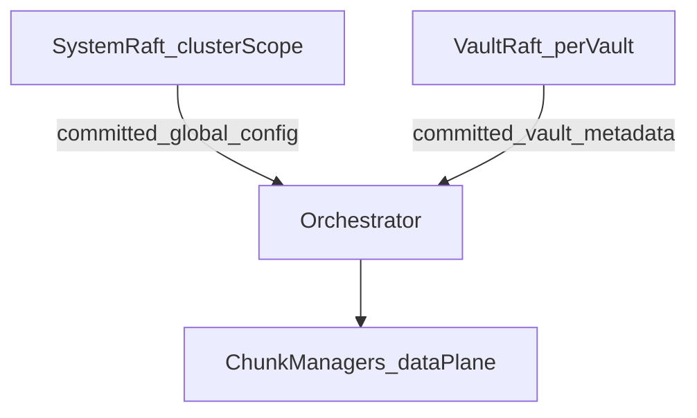
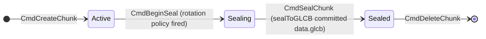
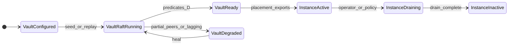

# Vault-level control-plane architecture

**Planning artifact:** dcat `gastrolog-k1ej7`  
**Parent:** Architectural redesign — orchestration and metadata consistency (`gastrolog-3eghu`)  
**Unblocks:** `gastrolog-5xxbd` (vault-level Raft + FSM namespacing), `gastrolog-554s3` (explicit vault → instance ownership)

**Acceptance criterion (k1ej7):** A **uniform Raft group model** — system/config and vault groups share **lifecycle and on-disk conventions**. Any exception is a **named compatibility shim** with an explicit **sunset** (no undocumented privileged directory layout).

**Terminal state (5xxbd complete):** There are **no** per-vault-instance metadata Raft groups. **One vault-scoped control-plane Raft** (plus system Raft for cluster-global config) owns every cross-node chunk metadata mutation. **Vault instances** (chunk/index managers) remain the data plane and **do not** host their own Raft groups.

**Vocabulary:** canonical terms follow [`ubiquitous_language.md`](./ubiquitous_language.md). In particular, this architecture uses **vault-ctl Raft** (one group per vault, authoritative for that vault's chunk metadata) and **instance FSM** (the per-vault-instance sub-state-machine inside the vault-ctl FSM, implemented in `vaultctlfsm`).

---

## Table of contents

1. [Inventory: today (as implemented)](#inventory-today-as-implemented)
2. [A) Vocabulary (normative)](#a-vocabulary-normative)
3. [B) Authority model (normative)](#b-authority-model-normative)
4. [C) Uniform Raft group model (target)](#c-uniform-raft-group-model-target)
5. [D) Vault readiness semantics](#d-vault-readiness-semantics-normative--testable)
6. [E) Legal state machine (chunk / vault)](#e-legal-state-machine-chunk--vault)
7. [F) Non-goals and open questions](#f-non-goals-and-open-questions)
8. [G) Handoff checklists](#g-handoff-checklists)
9. [Code anchors (maintenance)](#code-anchors-maintenance)

---

## Inventory: today (as implemented)

### System / cluster config Raft

| Aspect | Detail |
|--------|--------|
| **Entry** | `openRaftSystemStore` in [`backend/internal/app/raft.go`](../backend/internal/app/raft.go) |
| **Persistence** | `raftwal.Open(filepath.Join(Home.RaftDir(), "wal"))` with `GroupStore("system")`; file snapshot store `hraft.NewFileSnapshotStore(raftDir, …)` on `Home.RaftDir()` (same `raft/` tree as home layout in [`backend/internal/home/home.go`](../backend/internal/home/home.go)) |
| **Transport** | Cluster server transport (not multiraft group-scoped) |
| **Apply path** | `cluster.SetApplyFn` → `raftstore.Store.ApplyRaw` (config mutations) |

### Vault control-plane Raft (per vault, `vault/<id>/ctl`)

| Aspect | Detail |
|--------|--------|
| **Entry** | `ensureVaultControlPlaneRaftGroup` in [`backend/internal/orchestrator/reconfig_vaults.go`](../backend/internal/orchestrator/reconfig_vaults.go) |
| **FSM** | [`backend/internal/vaultraft/`](../backend/internal/vaultraft/) — holds per-instance sub-FSMs ([`vaultctlfsm.FSM`](../backend/internal/vaultraft/vaultctlfsm/)) namespaced by `OpVaultChunkFSM` commands |
| **Cross-node apply** | `orchestrator.ApplyVaultControlPlane` → `cluster.VaultApplyForwarder` when `PeerConns` is set, else local `Raft.Apply`; RPC path: `ForwardVaultApply` + `cluster.SetGroupApplyFn` ([`backend/internal/orchestrator/vault_ctl_apply.go`](../backend/internal/orchestrator/vault_ctl_apply.go), [`backend/internal/cluster/vault_apply_forwarder.go`](../backend/internal/cluster/vault_apply_forwarder.go), [`backend/internal/cluster/forward.go`](../backend/internal/cluster/forward.go), [`backend/internal/app/app.go`](../backend/internal/app/app.go)) |
| **Client forwarder** | [`backend/internal/cluster/vault_apply_forwarder.go`](../backend/internal/cluster/vault_apply_forwarder.go) (`VaultApplyForwarder`) |

### Vault chunk metadata (cluster mode)

Replicated chunk metadata uses the **vault control-plane** group only (`OpVaultChunkFSM` wrapping `vaultctlfsm` wire payloads). Entry: `ensureVaultCtlMetadata` in [`backend/internal/orchestrator/reconfig_vaults.go`](../backend/internal/orchestrator/reconfig_vaults.go). Cross-node apply uses `ForwardVaultApply` with the vault-ctl `group_id` and wrapped command bytes (`cluster.NewVaultCtlChunkApplyForwarder`).

### Orchestrator

Vault / chunk operations and routing: [`backend/internal/orchestrator/vault_ops.go`](../backend/internal/orchestrator/vault_ops.go) and related orchestrator code; replicated metadata callbacks from `ensureVaultCtlMetadata` / `vaultRaftCallbacks` read the per-instance sub-FSM inside [`backend/internal/vaultraft/`](../backend/internal/vaultraft/).

### Status: target design achieved (gastrolog-5xxbd + gastrolog-2ze8j)

The deltas below were the original design questions this spec needed to resolve. They have been addressed by the gastrolog-5xxbd (vault-level Raft groups + FSM namespacing) and gastrolog-2ze8j (decommission of legacy per-instance Raft code paths) work. Preserved here for historical reference.

1. **Authority scope:** Replicated chunk metadata is on **vault control-plane Raft** (cluster mode). Done.
2. **Snapshot layout asymmetry:** System snapshots live under `raftDir`; group snapshots under `raft/groups/<groupId>/`. Target must either justify a **uniform two-root pattern** or **converge** layouts.
3. **Shared WAL:** System and vault groups share one `raftwal` on-disk segment stream; coupling is total. A vault redesign **must not** assume independent WALs unless the design explicitly splits them (default stays shared). Done.
4. **Readiness / partial peers:** Vault readiness predicates landed in gastrolog-4ip1o + gastrolog-5j6eu (`Vault.ReadinessErr`, keyed on `r.AppliedIndex()`). Done.
5. **Apply entrypoints:** Unified to **one** `cluster.Server.SetGroupApplyFn`; `ForwardVaultApply` is the single cross-node apply RPC. Done in 2ze8j.

---

## A) Vocabulary (normative)

| Term | Definition |
|------|------------|
| **Control plane** | Replicated metadata and decisions that must survive restart and agree cluster-wide (Raft-backed configuration, placement-derived invariants that affect safety, chunk metadata that must not fork across nodes). |
| **Data plane** | Bytes on disk / object store / cloud blobs and record streams; may be locally authoritative under placement rules but **must not** contradict committed control-plane state. |
| **Authority** | The sole writer path for a given decision (typically through the Raft leader for that group). |
| **Cache / hint** | Read models that may lag (peer discovery, placement views). **MUST** be labeled as such; **MUST NOT** be the only source for unsafe actions. |
| **Vault readiness** | Predicate bundle (section D) for whether this node may execute **vault-scoped** control-plane responsibilities for a vault. |
| **Instance readiness** | Whether this node may operate a **specific vault instance** (local placement) — may depend on vault readiness + local placement + resource state. |
| **Node readiness** | Process-level (gRPC up, system Raft available, etc.) — orthogonal to vault readiness. |

---

## B) Authority model (normative)

**MUST**

- Every mutation that changes **cross-node** interpretation of vault/chunk metadata **MUST** go through a **defined Raft group** (system or vault-scoped per target topology), or through an explicitly documented non-Raft path that remains safe under partition (rare; default is “no”).
- **System Raft** remains the home for **cluster-global** configuration and membership that is not vault-owned (exact list to be enumerated during implementation; default: anything not naturally keyed by vault ID stays system-scoped until moved).
- **Vault-scoped** control-plane state **MUST** be keyed and replicated under a **vault-scoped Raft identity** in the target architecture (section C), not ad hoc sub-Raft groups for vault-wide invariants.

**MUST NOT**

- Introduce a second silent writer path for the same metadata (e.g. direct boltdb / local files that diverge from what Raft would apply).
- Treat placement caches, peer tables, or “last known leader” hints as authoritative for commits that need consensus.

**Partial membership / unresolved peers**

- **MUST** inherit the safety principle: **do not bootstrap** a new Raft group with an incomplete voter set when that would bake a bad configuration.
- **MUST** define whether **deferred creation** means “vault not ready” vs “instance not ready” vs both — and what user-visible behavior is (backpressure, skip, retry).

---

## C) Uniform Raft group model (target)

**Goal:** System and vault groups follow the **same lifecycle and storage conventions**. Any exception is a **named compatibility shim** with a **sunset** (version gate or explicit removal deadline).

### Target topology (conceptual)

- **SystemRaft:** Global cluster config / membership (existing role, possibly narrowed as vault scope grows).
- **VaultRaft (per vault):** Authoritative for **all** vault/chunk control-plane metadata. The single per-vault Raft hosts the chunk-FSM as a sub-FSM (`vaultctlfsm`).
- **Chunk path (data plane):** Consumes committed state from VaultRaft + system; **does not** host Raft; **does not** own consensus for cross-node metadata.

### Identifiers and routing

- String `GroupID` remains the routing key for `multiraft.GroupTransport` ([`backend/internal/multiraft/transport.go`](../backend/internal/multiraft/transport.go)).
- Target naming convention **MUST** be explicit. **Vault control-plane Raft** uses `vault/<vaultGLID>/ctl` (`raftgroup.VaultControlPlaneGroupID`) and is the **only** vault-scoped multiraft group for replicated chunk metadata. System config group stays `system` in multiraft transport wiring.

### Persistence (target rules)

- **WAL:** Either (1) one shared `raftwal` for **all** group stores including system and vault groups with stable `GroupStore` naming, or (2) split WALs with a **documented** reason and identical **semantic** contract per WAL. Default direction: **(1)** unless I/O isolation proves mandatory.
- **Snapshots:** One directory pattern for all group kinds — e.g. `raft/groups/<groupID>/` **including** a system alias `system` — OR elevate both to a symmetric `{wal, groups}` layout with zero special cases. The spec **MUST** pick one. **Greenfield only:** no on-disk upgrade path from older layouts; wipe or replace the raft tree when the layout changes during development.

### Lifecycle

- **Create / seed / restart:** Symmetric across group kinds (same `GroupManager` patterns in [`backend/internal/raftgroup/groupmanager.go`](../backend/internal/raftgroup/groupmanager.go)).
- **Shutdown:** Preserve ordering already relied upon (Raft shutdown before transport removal; see `DestroyGroup`). Vault redesign **MUST NOT** weaken shutdown invariants.

### Authority direction (target)

```mermaid
flowchart TB
  sysRaft[SystemRaft_clusterScope]
  vaultRaft[VaultRaft_perVault]
  orch[Orchestrator]
  chunkMgr[ChunkManagers_dataPlane]
  sysRaft -->|"committed_global_config"| orch
  vaultRaft -->|"committed_vault_metadata"| orch
  orch --> chunkMgr
```

---

## D) Vault readiness semantics (normative + testable)

Predicate names are illustrative; exact symbols belong in implementation.

| Predicate | Intent |
|-----------|--------|
| **VaultRaft_LocalReplicaReady** | Local process has joined/replayed the vault group far enough that **reads** required for safe local work are valid (define minimum: e.g. snapshot + committed config applied, or stricter). |
| **Vault_ControlPlaneReady** (node-local) | AND of: node process ready, `VaultRaft_LocalReplicaReady`, and any **dependency** declared mandatory (system Raft catchup, peer resolvability, etc.). |
| **Vault_ServeIngestReady** / **Vault_ServeQueryReady** | **MAY** be stricter than control-plane ready; **MUST** be explicit if ingest is allowed before full FSM catch-up. |

**Consistency**

- Metadata read from VaultRaft-backed state **MUST** be **linearizable** via normal Raft reads / barriers where this spec says “strong”.
- Caches **MAY** be eventually consistent only where this spec lists allowed staleness and the failure mode is bounded.

**WAL / replay / partial peers**

- **MUST** state whether the prior style of **defer create** becomes **vault-group defer create**, and how that surfaces in readiness bits and logs.

---

## E) Legal state machine (chunk / vault)

Documents the transitions that flow through `vaultctlfsm` / vault-ctl Raft applies (`reconfig_vaults.go` callbacks) and which transitions are **vault Raft commands** vs **local instance** bookkeeping.

Chunk substates (delete pending, tombstone, etc.) are mapped to: **vault-committed**, **instance-local**, or **system-committed**.

### Chunk lifecycle (Phase 3, gastrolog-1huz5)

A chunk traverses three FSM-tracked states. The state is `vault-committed` (replicated through the per-vault control-plane Raft).

```mermaid
stateDiagram-v2
  direction LR
  [*] --> Active: CmdCreateChunk
  Active --> Sealing: CmdBeginSeal (rotation policy fired)
  Sealing --> Sealed: CmdSealChunk (sealToGLCB committed data.glcb)
  Sealed --> [*]: CmdDeleteChunk
```

| State    | Producer trigger                          | Files on the leader                          | Followers                              |
|----------|-------------------------------------------|----------------------------------------------|----------------------------------------|
| Active   | `CmdCreateChunk`                          | `raw.log`+`idx.log`+`attr.log`+`dict.log` open for append; B+ trees in use | Best-effort active-form mirror via record streaming |
| Sealing  | `CmdBeginSeal` (in `sealActiveLocked`)    | active-form files closed but readable; B+ trees removed; `data.glcb` not yet on disk | Mirror frozen — no further append; not yet a promotion candidate |
| Sealed   | `CmdSealChunk` (in `PostSealProcess` after `sealToGLCB`) | `data.glcb` on disk; FSM carries the GLCB whole-blob digest | Eligible for sealed-form GLCB byte replication from leader |

**Authority during Sealing.** Only the leader's bytes are authoritative. `OverlayFromFSM` projects the FSM state onto `chunk.ChunkMeta`, so retention / archival sweep / cloud backfill / replication catchup / vault drain gate on `State == Sealed` rather than the local `Sealed` bool. The local bool flips at `sealActiveLocked` time; the cluster-wide signal flips when `sealToGLCB` commits the GLCB.

**Local vs cluster `Sealed` semantics.** The two bits answer different questions and must not be conflated:

- **Local `meta.Sealed`** (returned by `cm.List()` and `ListChunkMetas`): "is this chunk's active form closed on this node?" Used by query / index / read paths to decide between sealed-cursor and active-cursor strategies. Robust to transient mid-`PostSealProcess` state because `OpenCursor` reads from active-form files when `data.glcb` isn't yet present.
- **Cluster `State == Sealed`** (via `OverlayFromFSM`): "has the GLCB been committed cluster-wide?" Used by every producer-side gate that ships, retires, or otherwise irreversibly acts on a chunk. Conservative: a Sealing chunk reads as not-yet-Sealed so producers wait for the assembly to complete.

A blanket overlay on `ListChunkMetas` would conflate them — the query path would see Sealing chunks as not-Sealed and try the active-chunk fast path, which can no longer access the chunk via `ScanActive*`. Each caller chooses explicitly.

**Crash recovery.** A leader that dies between `CmdBeginSeal` (`Active → Sealing`) and `CmdSealChunk` (`Sealing → Sealed`) leaves the FSM holding a `Sealing` entry indefinitely. `VaultLifecycleReconciler.ReconcileFromSnapshot` runs `resumeSealingFromFSM` after every Restore: for each `State == Sealing` entry whose chunk the local Manager still holds (sealed bit set on disk), it re-schedules `PostSealProcess`. `sealToGLCB` is idempotent (writes via `data.glcb.tmp` + atomic rename), so re-running after a partial pass is safe. Followers-turned-leaders that never had the active-form files cannot resume; their Sealing entries fall to `SweepStaleLeaderFSMEntries`' grace-period cleanup.

### Vault state diagram

```mermaid
stateDiagram-v2
  direction LR
  [*] --> VaultConfigured
  VaultConfigured --> VaultRaftRunning: seed_or_replay
  VaultRaftRunning --> VaultReady: predicates_D
  VaultRaftRunning --> VaultDegraded: partial_peers_or_lagging
  VaultDegraded --> VaultRaftRunning: heal
  VaultReady --> InstanceActive: placement_exports
  InstanceActive --> InstanceDraining: operator_or_policy
  InstanceDraining --> InstanceInactive: drain_complete
```

---

## F) Non-goals and open questions

These require explicit product/architecture decisions:

1. **One VaultRaft vs multiple raft groups per vault** (e.g. separate hot/cold metadata): pick one default.
2. **Cutover** to **no per-instance Raft**: ~~move chunk-FSM commands and apply-forwarding onto vault control-plane Raft, then remove the legacy per-instance Raft groups, group store names, and apply-fn split~~ — **done** (gastrolog-5xxbd + gastrolog-2ze8j). `ensureVaultCtlMetadata` is the canonical entry; the single `SetGroupApplyFn` replaces the prior split apply-fns.
3. **System Raft shrink/grow:** Which config moves to vault Raft vs stays global; backward compatibility for existing clusters.
4. **Snapshot layout convergence:** Single rule for system and vault snapshots (no legacy on-disk compatibility).
5. **Feature flags:** Whether vault Raft rolls out behind a flag per vault or cluster-wide.

---

## G) Handoff checklists

### For gastrolog-5xxbd — vault-level Raft groups and FSM namespacing

- [x] Implement `GroupID` scheme and `GroupStore` / `CreateGroup` wiring chosen in C/F. — done (5xxbd).
- [x] Align snapshot directories with the chosen uniform pattern (greenfield; remove old `raft/` tree if layout changes). — done (5xxbd).
- [x] FSM boundary: chunk-metadata commands run as a sub-FSM (`vaultctlfsm`) inside `vaultraft.FSM`, dispatched via `OpVaultChunkFSM` envelopes (`vaultraft.MarshalVaultChunkCommand`). Done (5xxbd).
- [x] **RPC / naming cleanup:** consolidated apply entrypoints — done (2ze8j): single `SetGroupApplyFn`; `ForwardVaultApply` is the single cross-node apply RPC.
- [x] Bootstrap/defer rules from D for partial membership; tests for "no bad initial config". — done (5xxbd).
- [x] WAL: confirm shared `raftwal` grouping and replay order; extend `raftwal` tests if new group naming or churn patterns appear. — done (5xxbd): vault-ctl groups share the per-node `raftwal` with system/config groups.
- [x] Shutdown: preserve `DestroyGroup` ordering vs transport; add vault group to shutdown sequence in `app` if needed. — done (5xxbd).

### For gastrolog-554s3 — explicit vault → instance ownership

- [x] Replace implicit "find chunk manager" shortcuts with APIs that take **vault context** first (`vault_ops.go` and call sites). — done (554s3 + 2ze8j): orchestrator shortcuts retired in favor of vault-scoped lookups.
- [x] Document and enforce: chunk managers are **owned** under a vault umbrella; no orphan instance lifetimes. — done (554s3).
- [x] Forwarding (vault apply path and record/search forwarding) must use stable vault identity keys consistent with C. — done (2ze8j): `ForwardVaultApply` is the single apply RPC, `groupApplyFn` is the single apply path.
- [x] Readiness plumbing: orchestrator checks **Vault_ControlPlaneReady** before operations that require it (per D). — done (5xxbd): `vaultCtlReady` gate drives readiness; `r.AppliedIndex() > 0` semantics in `vaultraft.FSM.Ready()`.
- [x] Remove or quarantine legacy paths called out during inventory once vault Raft is live. — done (2ze8j): legacy per-instance Raft group-id helpers and tests deleted.

---

## Code anchors (maintenance)

| Area | Paths |
|------|--------|
| System Raft | `backend/internal/app/raft.go` |
| Multi-Raft setup, unified group apply | `backend/internal/app/app.go` (`setupMultiRaft`, `wireClusterRaftApplies`, `SetGroupApplyFn`) |
| Vault control-plane Raft | `backend/internal/orchestrator/reconfig_vaults.go` (`ensureVaultControlPlaneRaftGroup`), `backend/internal/orchestrator/vault_ctl_apply.go`, `backend/internal/vaultraft/`, `backend/internal/cluster/vault_apply_forwarder.go`, `backend/internal/cluster/vault_ctl_chunk_apply_forwarder.go` |
| Vault ctl metadata wiring | `backend/internal/orchestrator/reconfig_vaults.go` (`ensureVaultControlPlaneRaftGroup`, `ensureVaultCtlMetadata`) |
| Group manager | `backend/internal/raftgroup/groupmanager.go` |
| WAL | `backend/internal/raftwal/` |
| Transport | `backend/internal/multiraft/transport.go` |
| Orchestrator | `backend/internal/orchestrator/vault_ops.go` |

**Normative text:** This file is the readable **source of truth** for k1ej7 scope. Implementation issues should link here; scope changes **MUST** update this document rather than reinterpret informally.

**Tracker:** dcat issue `gastrolog-k1ej7` tracks the planning task and links child issues (`gastrolog-5xxbd`, `gastrolog-554s3`).
