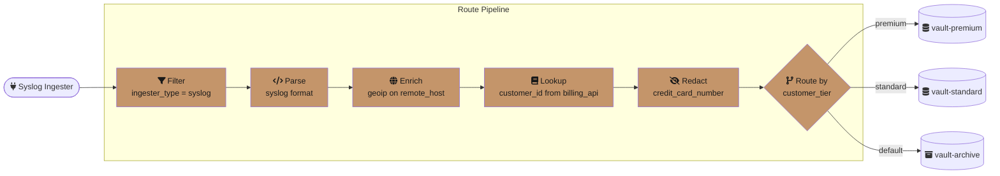
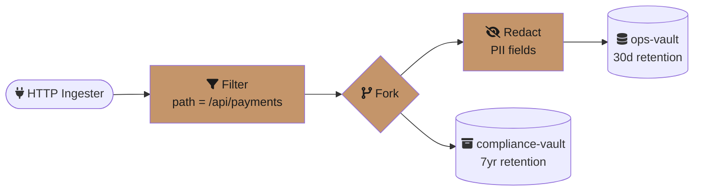
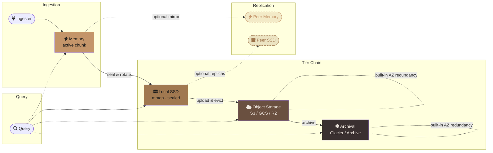

# GastroLog Vision

This document describes GastroLog at its ceiling — the product it becomes given no compromises on time, resources, or ambition. It is not a roadmap. It is a destination. Individual features will be extracted into issues and prioritized as capacity allows, but this document exists so that every decision made along the way can be measured against the whole.

---

## The Query Language as Analytical Substrate

The pipeline query language is GastroLog's most important interface. Today it handles filtering, aggregation, and visualization. At its ceiling, it becomes a full analytical substrate — expressive enough that people build dashboards, define alerts, and run investigations entirely from the query bar.

**Cross-vault joins.** Queries can correlate records across vaults by time window or shared field values. An SRE investigating a payment failure joins the API gateway vault with the payment processor vault on `trace_id`, seeing the full request lifecycle without leaving the query bar.

```
api_gateway | where path="/payments" status=500 last=1h
  | join payment_processor on trace_id window=30s
  | sort -latency
```

**Computed virtual columns.** Fields that don't exist in the raw data can be defined as expressions and used as if they were real columns. A `latency` field derived from `response_ts - request_ts` is queryable, sortable, and aggregatable. Virtual columns persist as named definitions in the cluster config, available to all users.

**Subqueries.** The output of one pipeline stage can feed the input of another. "Find the p99 latency over the last hour, then show me every request that exceeded it" is a single query, not two.

```
* | where latency > (
    * | stats percentile(latency, 99) as p99 last=1h
  )
  | correlate trace_id
  | timeline
```

**Live dashboards from queries.** A saved query with a poll interval is a dashboard panel. A collection of saved queries is a dashboard. No separate dashboard builder, no drag-and-drop widget editor. The query language is the dashboard language. If you can write the query, you can build the dashboard.

---

## Traces and Logs Are the Same Thing

GastroLog does not need a separate tracing backend. A distributed trace is a set of log records that share a correlation identifier — a trace ID, a request ID, a session token. The distinction between "logs" and "traces" is a rendering choice, not a data model choice.

**Automatic shape detection.** When query results contain span-like fields (`trace_id`, `span_id`, `parent_span_id`, `duration`), GastroLog renders them as a waterfall diagram. When they don't, it renders them as a log list. The user never switches modes — the UI adapts to the data.

**Correlation without instrumentation.** Even without OpenTelemetry spans, GastroLog can correlate records by shared field values within time windows. Records from different services that share a `request_id` within 30 seconds are implicitly part of the same trace. The correlation is computed at query time, not at ingestion — no schema changes, no re-instrumentation.

**Span indexing.** For services that emit proper OpenTelemetry spans, GastroLog indexes the parent-child relationships as attributes. Querying `span_id=abc123 | children` returns all child spans. Querying `trace_id=xyz | critical_path` highlights the spans that dominated the total latency. These are query operators, not special UI features.

---

## Programmable Ingestion

Routes today are filter-to-vault mappings. At its ceiling, the routing layer is a lightweight data pipeline — the same pipeline language used for queries, applied at ingestion time.

**Transform on ingest.** Parse unstructured logs into fields, enrich with external data, normalize timestamps, redact sensitive fields — all before the record hits storage. The transform pipeline uses the same operator syntax as query pipelines, but is configured visually through the route editor in Settings — not through config files.

**Visual route editor.** The route configuration UI extends the existing Settings route panel with a flow builder. Each transform stage is a card: parse, enrich, redact, sample, route-by-field. Cards are added from a categorized picker, configured with forms that show only valid options, and connected visually to their destinations. The flow builder makes it obvious what your options are at each stage — you never guess keywords or read docs to discover that `geoip`, `lookup`, or `redact` exist. The underlying pipeline syntax is generated from the visual representation and displayed as a read-only text preview for users who want to see it, but the source of truth is the visual editor.

A syslog route with enrichment and tiered routing:



A fork route that sends raw data to compliance and redacted data to operations:



Each node in these diagrams is a card in the visual editor. No YAML. No text editing. The same crafted quality as the rest of the UI.

**Sampling.** High-volume sources can be sampled at ingestion: keep 100% of errors, 10% of info, 1% of debug. Sampling is a stage card in the route editor — a slider per severity level, adjustable at runtime without restarting ingesters. The sampling rate is recorded as a field on each record so that aggregation queries can extrapolate accurately.

**Fork and fan-out.** A single record can be routed to multiple vaults — the raw record to a high-retention compliance vault, a redacted version to the operational vault, a summary to a metrics vault. In the visual editor, a fork is a branch point where the flow splits into parallel paths, each with its own transform stages and destination. Forking happens at the route level, not the ingester level.

**The key insight:** the routing language and the query language share the same operators. The query bar is text-first (experts type fast). The route editor is visual-first (configuration is infrequent and discoverability matters more than speed). Both generate the same pipeline syntax under the hood. Learn the operators once, encounter them in both contexts.

---

## Structural Anomaly Detection

Traditional alerting is threshold-based: "alert when error rate exceeds 5%." This requires someone to know the right threshold in advance. Structural anomaly detection inverts this — GastroLog learns what "normal" looks like and surfaces deviations automatically.

**Behavioral baselines.** For each log source, GastroLog builds a probabilistic model of normal behavior: which fields appear, what their value distributions are, what the ingestion cadence is, what the severity breakdown looks like. The model updates continuously but slowly — it represents weeks of history, not minutes.

**Quiet annotations.** When current behavior deviates from the baseline, GastroLog annotates the timeline with an anomaly score. This is not an alert — it is a signal visible when you're looking, invisible when you're not. The severity bar in the sidebar might show a subtle shimmer when the error ratio has doubled compared to the baseline. You notice it peripherally, or you don't. It is never a notification.

**Queryable anomalies.** Anomaly scores are fields, queryable like any other attribute. `* | where anomaly_score > 0.8 last=24h | stats count by source` answers "which sources behaved unusually in the last day?" without anyone having configured an alert for each source.

**Root cause correlation.** When an anomaly is detected, GastroLog can automatically identify which fields changed most relative to the baseline. "Error rate spiked because the `deployment_version` field changed from `v2.3.1` to `v2.4.0` and errors with `v2.4.0` are 40x the baseline." This is computed on demand, not pre-configured.

---

## Tiered and Infinite Storage

Storage should be a budget, not a cliff. Today, a vault is tightly coupled to a single storage backend — you create a memory vault, a file vault, or a cloud vault. The vault *is* its storage. That's the wrong abstraction.

### The vault as logical container

A vault should be the **logical container** — it owns the records, the indexes, the retention policy, the access controls. The vault type distinction (memory/file/cloud) goes away entirely. Every vault has the same type. Underneath, a vault has a **tier chain**: an ordered set of storage backends that data flows through as it ages.

```
Vault "api-logs"
  ├── Tier 0: Memory      (active chunk, last ~5 min)
  ├── Tier 1: Local SSD    (sealed, mmap'd, last 7 days)
  ├── Tier 2: S3 Standard  (compressed, last 90 days)
  ├── Tier 3: S3 Glacier   (archived, last 3 years)
  └── Transition policy: budget $30/month, pin errors to Tier 1 for 30 days
```

The vault doesn't care whether a chunk is in memory, on SSD, in S3, or in archival storage. It asks the tier chain "store this chunk" and "fetch this chunk" and the tiers handle the rest.

### Tier types

| Tier | Medium | Latency | Cost | Replication |
|------|--------|---------|------|-------------|
| Memory | RAM | Microseconds | $$$$ | Optional write-mirror to peer |
| Local SSD | File, mmap'd | Milliseconds | $$$ | Optional peer forwarding of sealed chunks |
| Object storage | S3 / GCS / R2 | Seconds | $ | Built-in (cloud provider handles AZ redundancy) |
| Archival | Glacier / Archive / Cool | Minutes–hours | Cents | Built-in (cloud provider) |

### Replication as a tier property

Replication is not a vault-level concern — it is a property of each tier. Each tier type achieves durability in the way that makes sense for its medium:

- **Object storage and archival tiers** replicate for free. S3 stores objects across multiple availability zones. The vault gets durability without any cluster coordination.
- **Local SSD tiers** can optionally replicate sealed chunks to a peer node. The sealed chunk is immutable and self-contained (data + indexes), so replication is a simple file copy. Configuration: `replicas: 2` on the tier.
- **Memory tiers** can optionally mirror active writes to a peer's memory buffer, so node failure loses zero records. Or the operator accepts the small loss window (minutes of data, re-ingestable from source). Configuration: `mirror: true` on the tier.

This dissolves the vault replication question entirely. Instead of "how do we replicate vaults across nodes" (complex, doubles storage, requires failover logic), it becomes "which tiers need redundancy and how does each one achieve it." The answer is usually: object storage handles it, and the active chunk's loss window is acceptable.



### Tier transitions

The transition between tiers is driven by policy. Multiple strategies can coexist, with the most restrictive one winning:

- **Time-based**: chunks older than N days demote to the next tier. Simple, predictable.
- **Size-based**: when the current tier exceeds N GB, the oldest chunks demote. Practical for capacity planning.
- **Budget-based**: the vault has a monthly storage budget; the cluster distributes data across tiers to stay within it. The most powerful model — the operator sets a dollar amount and GastroLog figures out the rest.
- **Access-based**: chunks that haven't been queried in N days demote. Data that's actively used stays warm; data that's gathering dust moves cold.
- **Value-based**: high-value records (errors, traced requests) can be pinned to warmer tiers longer than low-value records (debug, info). The pin criteria is a filter expression — the same syntax used in queries and routes.

### Transparent query fan-out

A query for `last=90d` scans all tiers automatically. The user doesn't know or care where the data lives. Results from warmer tiers arrive first; colder tiers stream in progressively, with a subtle loading indicator showing that older data is still arriving.

### Zero-copy tier transitions

The sealed chunk is the natural unit for tier movement. It's immutable, self-contained (data + indexes), and already has a well-defined lifecycle (seal → compress → index). Moving a chunk between tiers is:

- **Demote (warm → cold)**: upload the sealed chunk file to object storage as-is. Delete the local copy. Replace with a stub that knows how to fetch from the remote tier.
- **Promote (cold → warm)**: download the chunk to local SSD, mmap it. Happens on-demand during queries (with caching) or proactively based on access patterns.
- **Evict (warm cache)**: delete the local cache of a chunk that's already durable in a colder tier. The stub remains; the next query re-fetches it.

No rewriting, no re-indexing, no format conversion. The chunk is the same bytes at every tier.

---

## First-Class Multi-Tenancy

Multi-tenancy is not an afterthought bolted onto single-tenant architecture. It is a fundamental property of the vault model.

**Tenant isolation at the vault level.** Each tenant gets dedicated vaults with independent encryption keys, retention policies, and storage budgets. A query from tenant A physically cannot access tenant B's data — the isolation is enforced at the index level, before any records are read.

**Per-tenant encryption.** Each tenant's data is encrypted with a tenant-specific key. The cluster operator can rotate keys per tenant without affecting others. A tenant can bring their own key (BYOK) so that even the cluster operator cannot read their data without the tenant's cooperation.

**Tenant-aware routing.** The ingestion pipeline identifies tenant boundaries (by source IP, API key, field value, or ingester configuration) and routes records to the correct tenant vault. Cross-tenant data never mingles in storage.

**Resource quotas.** Each tenant has configurable limits on ingestion rate, storage volume, query concurrency, and retention duration. Quotas are enforced at the cluster level, not per-node — a tenant's budget is a cluster-wide constraint regardless of which node handles the request.

**Managed service model.** A service provider runs a single GastroLog cluster for hundreds of customers. Each customer sees only their own data, has their own saved queries and dashboards, and can be billed based on actual storage and query usage. The provider sees aggregate cluster health and can manage tenant lifecycle (onboarding, offboarding, migrations) through the admin API.

---

## The UI as Instrument

The GastroLog UI is not a dashboard — it is an instrument for understanding systems. Like a good musical instrument, it rewards practice. The more fluent you become, the faster you can move.

**Keyboard-driven investigation.** Every action has a keyboard shortcut. Not as an accessibility accommodation — as the primary interaction mode for power users. Select a record with arrow keys, press `T` for trace view, `C` for context (surrounding records from the same source), `F` to fan out (similar patterns across all vaults), `D` to diff against the previous record. The mouse is for exploration; the keyboard is for investigation.

**The detail panel as workspace.** The right sidebar is not just a field inspector. It is a workspace where you build understanding. Pin multiple records side by side. Diff them to see what changed. Annotate them with notes. Copy field values into the query bar with a click. The workspace state persists across page reloads — your investigation survives a browser crash.

**Saveable investigations.** An investigation is a first-class object: a query, a time range, a set of selected records, annotations, and a narrative. Investigations are shareable as permalinks. When someone pages you at 3am, they send you a link that puts you exactly where they were — same query, same time range, same selected records, same annotations. You pick up where they left off.

**Progressive disclosure.** The default view is clean and calm. Complexity appears only when you reach for it. The sidebar expands to show attributes when you click a severity bucket. The detail panel slides in when you select a record. The histogram reveals brush selection when you hover. The UI teaches itself through use, never through documentation.

**Responsive density.** On a 4K monitor, the UI shows more records, wider timestamps, and expanded field values. On a laptop, it compresses gracefully — shorter timestamps, truncated fields, collapsed panels. The information density adapts to the available space, not to a fixed breakpoint grid.

---

## Ambient Collaboration

Investigating incidents is a team activity, but most tools treat it as a solo one. GastroLog makes collaboration ambient — present but unobtrusive.

**Presence awareness.** When two people are looking at overlapping time ranges in the same vault, they see each other's presence — a subtle avatar in the timeline gutter. Not a cursor that tracks mouse movement. A quiet signal that says "you are not alone in this investigation." Clicking the avatar opens a shared view where both people see the same records.

**Investigation timeline.** During an incident, every query, every record selection, every annotation is recorded in a shared timeline. After the incident, the timeline becomes the postmortem artifact — a complete record of who looked at what, when, and what they found. No more "what did you see?" in the debrief. It's all there.

**Shared saved queries.** Queries can be saved to a team namespace, not just a personal one. The team's query library is a knowledge base — "How do I check for connection pool exhaustion?" has an answer in the saved queries, written by the person who debugged it last time.

**Handoff protocol.** When you need to hand an investigation to a colleague (shift change, escalation, different expertise), you create a handoff. The handoff includes your current investigation state, a summary of what you've found so far, and what you think should be checked next. The recipient opens it and is immediately in context.

---

## Self-Healing Cluster

The cluster should not need an operator for steady-state operations. It should heal itself, rebalance itself, and operate within its resource budget without human intervention.

**Automatic vault rebalancing.** When a node joins or leaves the cluster, vaults are redistributed across the remaining nodes to maintain even load. The rebalancing is lightweight because most data lives in object storage tiers — only the active chunk and warm-tier cache need to migrate. Queries continue to work during rebalancing; the routing layer forwards requests to whichever node currently owns each vault.

**Storage pressure management.** When local storage approaches capacity, the tier chain handles it automatically — warm-tier chunks are promoted to object storage, local caches are evicted, and rotation accelerates. This isn't a separate mechanism; it's the tier transition policy responding to its size-based trigger. The operator sets the budget; the tier chain manages within it.

**Graceful degradation.** When a node goes down, its vaults' sealed data is already durable in object storage tiers. Another node picks up ingestion for the affected vaults, and queries against sealed chunks continue to work (they're in S3, not on the dead node's disk). The only data at risk is the active memory-tier chunk — minutes of records, recoverable from the peer mirror if configured, or re-ingested from source. The cluster never refuses to answer a query because a node is down — it answers with what's durable and tells you what's missing.

**Capacity planning signals.** The cluster exposes forward-looking metrics: "At current ingestion rate, local storage will be full in 14 days." "Adding one node would reduce average query latency by 30%." These are not alerts — they are planning signals visible in the inspector, available when you need them, invisible when you don't.

---

## Compliance as a Query

Compliance requirements — data retention, access auditing, right-to-erasure, data residency — should be satisfiable through the same interfaces used for everything else: queries and configuration.

**Right to erasure.** `gastrolog purge user_id=abc123` removes all records containing that user's data across all vaults, all tiers, all nodes. The purge is audited, cryptographically verifiable, and produces a compliance certificate. It is a command, not a project.

**Field-level encryption.** Sensitive fields (PII, credentials, health data) can be encrypted at the field level, not just the vault level. The raw record is stored with the sensitive field encrypted; the decryption key is scoped to a role. Analysts see `credit_card=****` unless they have the PII role, in which case they see the real value. The encryption happens at ingestion time via the route pipeline.

**Access auditing.** Every query, every record access, every export is logged to a dedicated audit vault. "Who accessed records containing `patient_id=12345` in the last 90 days?" is a query against the audit vault. The audit trail is itself immutable and tamper-evident.

**Data residency.** Vaults can be pinned to specific nodes or regions. A vault configured with `residency: eu-west-1` will only store data on nodes in that region, and queries against it will only execute on those nodes. Cross-region queries are explicitly opt-in, with clear indication of which data is crossing boundaries.

**Retention enforcement.** Retention policies are not suggestions — they are cryptographic guarantees. When a retention policy says "delete after 90 days," the data is verifiably gone from all tiers after 90 days. The cluster produces retention compliance reports that can be submitted to auditors without manual verification.

---

## The CLI as First-Class Peer

The CLI is not a wrapper around the API. It is a full-fidelity interface to GastroLog, designed for Unix pipelines, automation, and power users who live in the terminal.

**Full query language.** Every query that works in the UI works in the CLI. Streaming results, pipeline operators, visualizations (rendered as terminal charts via Unicode block characters), and follow mode.

```bash
# Live follow with severity coloring
gastrolog follow "level=error" --color

# Export last hour of errors as newline-delimited JSON
gastrolog query "level=error last=1h" --format ndjson > errors.json

# Chain queries through Unix pipes
gastrolog query "* last=1h" --format ndjson \
  | jq -r '.trace_id' | sort -u \
  | gastrolog query --stdin "trace_id={}" --format table
```

**Pipe-friendly output.** Every output format is designed for composition. NDJSON for jq, CSV for spreadsheets, Parquet for data science tools, table for human reading. The `--format` flag is the only thing that changes — the query is the same.

**Shared state.** Saved queries, investigation state, and query history sync between the CLI and the UI. A query you saved in the CLI appears in the UI's saved queries panel. An investigation you started in the UI can be continued in the CLI.

**Scriptable administration.** Cluster management, vault lifecycle, user management, route configuration — everything available in the settings UI is available as CLI commands. Deployment automation uses the same CLI that operators use interactively. No separate admin API, no hidden endpoints.

---

## Speed as Absence of Friction

Performance is not a feature to appreciate — it is the absence of friction you would otherwise accept as normal. The goal is not "fast enough." The goal is "you never wait."

**Index-driven queries return in milliseconds.** A query for `trace_id=abc123` on a terabyte of data should return in under 10ms. The token, attribute, and timestamp indexes exist so that the query engine never reads data it doesn't need.

**Full-text scan of a terabyte takes seconds.** When indexes can't help (regex search, substring match), the scan is parallelized across all nodes and all cores. Compressed data is decompressed and scanned in streaming fashion — the first results appear while the scan is still running.

**Follow mode has sub-100ms latency.** From the moment a record is ingested to the moment it appears on screen, less than 100 milliseconds. This is the latency budget for the entire pipeline: network, parsing, indexing, query evaluation, WebSocket push, and rendering. It requires careful engineering at every layer, but the result is that follow mode feels like `tail -f` — immediate and alive.

**Query result streaming.** Results are not batched and sent as a single response. They stream as they are found, oldest first or newest first depending on sort order. The UI renders incrementally — you see the first results while the query is still scanning. For large result sets, this means the first result appears in milliseconds even if the full result takes seconds.

**Startup time under 3 seconds.** A GastroLog node goes from process start to serving requests in under 3 seconds. This makes rolling upgrades, container restarts, and autoscaling responsive. The cluster doesn't have "warming up" periods where performance is degraded.

---

## The Feeling

The cumulative effect of all these capabilities is a tool that changes your relationship with your systems. You stop dreading log investigation. You stop context-switching between four different observability tools. You stop accepting slow queries as the cost of having logs.

Instead, you think of a question about your system, and you ask it. The answer appears before you've finished forming the next question. You notice something unusual in the timeline, and you drill in. The drill-in takes you to the exact records, the exact trace, the exact moment where things diverged from normal. You annotate what you found, share it with your team, and move on.

The Observatory aesthetic — the copper accents, the serif typography, the grain texture, the gentle animations — is not decoration. It is a signal that every detail has been considered. That someone cared about the scrollbar, the focus ring, the loading state, the empty state. That this is a tool built by people who use tools like this, for people who use tools like this.

The kind of tool where people say "wait, you should see this" and pull up the UI to show a colleague. Not because they have to. Because they want to.
