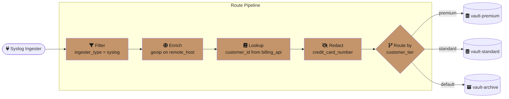
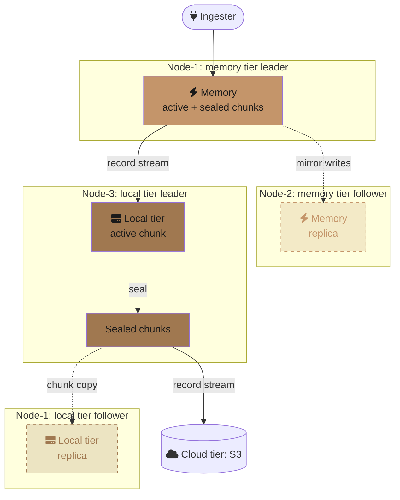
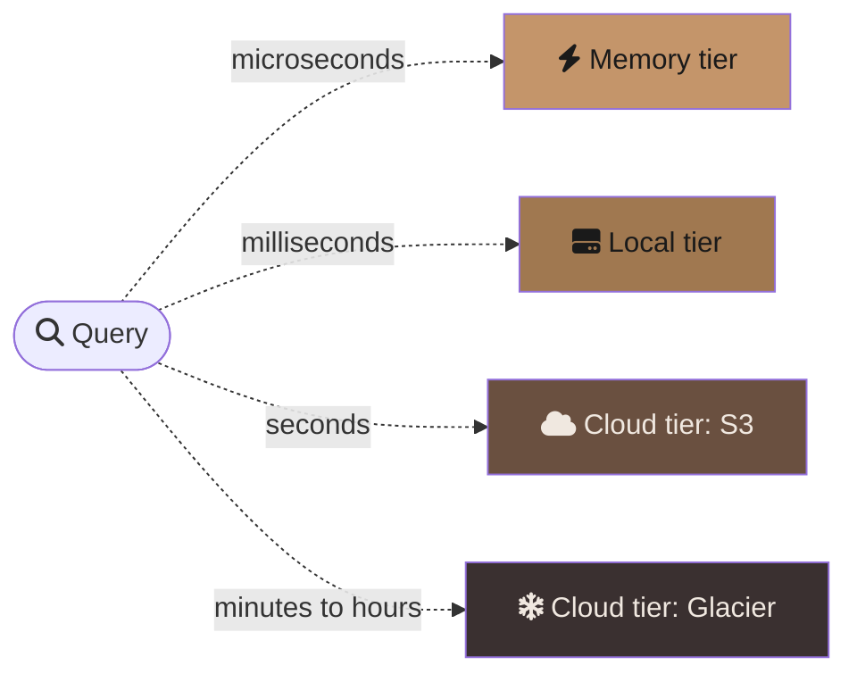
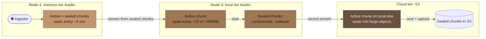

# GastroLog Vision

This document describes GastroLog at its ceiling — the product it becomes given no compromises on time, resources, or ambition. It is not a roadmap. It is a destination. Individual features will be extracted into issues and prioritized as capacity allows, but this document exists so that every decision made along the way can be measured against the whole.

---

## The Query Language as Analytical Substrate

The pipeline query language is GastroLog's most important interface. Today it handles filtering, aggregation, and visualization. At its ceiling, it becomes a full analytical substrate — expressive enough that people build dashboards, define alerts, and run investigations entirely from the query bar.

**Computed virtual columns.** Fields that don't exist in the raw data can be defined as expressions and used as if they were real columns. A `latency` field derived from `response_ts - request_ts` is queryable, sortable, and aggregatable. Virtual columns persist as named definitions in the cluster config, available to all users.

**Inline stats.** The `inline_stats` operator computes an aggregate and appends it as a field to every record without collapsing rows. "Find the p99 latency and show me every request that exceeded it" is a single, streaming query:

```
* | inline_stats percentile(latency, 99) as p99
  | where latency > p99
  | timeline trace_id
```

**Named intermediate results.** For multi-step composition, `let` statements bind a name to a query result that can be referenced later:

```
let error_users = level=error last=1h | fields user_id
* | where user_id in $error_users
```

The `let` query runs to completion first (blocking). The main query uses the result as a lookup set. This handles set-membership cases that `inline_stats` can't express.

**Live dashboards from queries.** A saved query with a poll interval is a dashboard panel. A collection of saved queries is a dashboard. No separate dashboard builder, no drag-and-drop widget editor. The query language is the dashboard language. If you can write the query, you can build the dashboard.

---

## Traces and Logs Are the Same Thing

GastroLog does not need a separate tracing backend. A distributed trace is a set of log records that share a correlation identifier — a trace ID, a request ID, a session token. The distinction between "logs" and "traces" is a rendering choice, not a data model choice.

**Automatic shape detection.** When query results contain span-like fields (`trace_id`, `span_id`, `parent_span_id`, `duration`), GastroLog renders them as a waterfall diagram. When they don't, it renders them as a log list. The user never switches modes — the UI adapts to the data.

**Correlation without instrumentation.** Even without OpenTelemetry spans, GastroLog can correlate records by shared field values within time windows. Records from different services that share a `request_id` within 30 seconds are implicitly part of the same trace. The correlation is computed at query time, not at ingestion — no schema changes, no re-instrumentation.

**Span indexing.** For services that emit proper OpenTelemetry spans, GastroLog indexes the parent-child relationships as attributes. Querying `span_id=abc123 | children` returns all child spans. Querying `trace_id=xyz | critical_path` highlights the spans that dominated the total latency. These are query operators, not special UI features.

---

## Programmable Ingestion

Routes today are filter-to-vault mappings. At its ceiling, the routing layer is a lightweight data pipeline — the same pipeline language used for queries, applied at ingestion time.

**Route pipeline transforms.** Enrich with external data, redact sensitive fields, sample by severity — all after digestion but before the record hits storage. Parsing and field extraction are handled upstream by the ingester and digester; the route pipeline operates on fully digested records regardless of ingester type. The transform pipeline uses the same operator syntax as query pipelines, but is configured visually through the route editor in Settings — not through config files.

**Visual route editor.** The route configuration UI extends the existing Settings route panel with a flow builder. Each transform stage is a card: enrich, lookup, redact, sample, route-by-field. Cards are added from a categorized picker, configured with forms that show only valid options, and connected visually to their destinations. The flow builder makes it obvious what your options are at each stage — you never guess keywords or read docs to discover that `geoip`, `lookup`, or `redact` exist. The underlying pipeline syntax is generated from the visual representation and displayed as a read-only text preview for users who want to see it, but the source of truth is the visual editor.

A syslog route with enrichment and tiered routing (parsing already handled by the syslog ingester and digester):



A fork route that sends raw data to compliance and redacted data to operations:


Each node in these diagrams is a card in the visual editor. No YAML. No text editing. The same crafted quality as the rest of the UI.

**Sampling.** High-volume sources can be sampled at ingestion: keep 100% of errors, 10% of info, 1% of debug. Sampling is a stage card in the route editor — a slider per severity level, adjustable at runtime without restarting ingesters. The sampling rate is recorded as a field on each record so that aggregation queries can extrapolate accurately.

**Fork and fan-out.** A single record can be routed to multiple vaults — the raw record to a high-retention compliance vault, a redacted version to the operational vault, a summary to a metrics vault. In the visual editor, a fork is a branch point where the flow splits into parallel paths, each with its own transform stages and destination. Forking happens at the route level, not the ingester level.

**The key insight:** the routing language and the query language share the same operators. The query bar is text-first (experts type fast). The route editor is visual-first (configuration is infrequent and discoverability matters more than speed). Both generate the same pipeline syntax under the hood. Learn the operators once, encounter them in both contexts.

---

## Structural Anomaly Detection

Traditional alerting is threshold-based: "alert when error rate exceeds 5%." This requires someone to know the right threshold in advance. Structural anomaly detection inverts this — GastroLog learns what "normal" looks like and surfaces deviations automatically.

**Behavioral baselines.** For each log source, GastroLog builds a probabilistic model of normal behavior: which fields appear, what their value distributions are, what the ingestion cadence is, what the severity breakdown looks like. The model updates continuously but slowly — it represents weeks of history, not minutes.

**Quiet annotations.** When current behavior deviates from the baseline, GastroLog annotates the timeline with an anomaly score. This is not an alert — it is a signal visible when you're looking, invisible when you're not. The severity bar in the sidebar might show a subtle shimmer when the error ratio has doubled compared to the baseline. You notice it peripherally, or you don't. It is never a notification.

**Queryable anomalies.** Anomaly scores are fields, queryable like any other attribute. `* | where anomaly_score > 0.8 last=24h | stats count by source` answers "which sources behaved unusually in the last day?" without anyone having configured an alert for each source.

**Root cause correlation.** When an anomaly is detected, GastroLog can automatically identify which fields changed most relative to the baseline. "Error rate spiked because the `deployment_version` field changed from `v2.3.1` to `v2.4.0` and errors with `v2.4.0` are 40x the baseline." This is computed on demand, not pre-configured.

---

## Tiered and Infinite Storage

Storage should be a budget, not a cliff. Today, a vault is tightly coupled to a single storage backend — you create a memory vault, a file vault, or a cloud vault. The vault *is* its storage. That's the wrong abstraction.

### The vault as logical container

A vault should be the **logical container** — it owns the records, the indexes, the retention policy, the access controls. The vault type distinction (memory/file/cloud) goes away entirely. Every vault has the same type. Underneath, a vault has a **tier chain**: an ordered list of storage priorities that data flows through as it ages.

### Storage building blocks

Three separate concepts make up the storage model:

**FileStorage** — per-node declaration of locally-attached storage. Each has a path, a **storage class** (numeric — lower is faster), and a capacity. A node can declare multiple file storages. Two NVMe drives can both be class 1; a NAS at class 3.

```
Node-1 file storages:
  class 1: label=NVMe-1, path=/data/nvme0, capacity=200GB
  class 1: label=NVMe-2, path=/data/nvme1, capacity=200GB
  class 3: label=NAS, path=/mnt/nas, capacity=10TB
```

**CloudService** — cluster-wide definition of a cloud storage service. S3 bucket, credentials, region, storage class. Multiple can exist (production S3, archival Glacier, etc.). Not tied to any node — any node can access it.

```
Cloud services:
  s3-prod: provider=s3, bucket=logs-prod, region=eu-west-1
  glacier-archive: provider=s3, bucket=logs-archive, region=eu-west-1, storage-class=GLACIER
```

**Tier** — three types, each a full chunk manager:

- **Memory tier**: RAM-backed. Active + sealed chunks in memory. Budget limits how much RAM it can use.
- **Local tier**: disk-backed. Has a storage class requirement — the system matches it to file storages on nodes that declare that class. That's where its chunks live.
- **Cloud tier**: references a CloudService for sealed chunk storage. Has a storage class requirement for the **active chunk** (needs local disk to write to before sealing and uploading). Has a separate storage class requirement for the **chunk cache** (local disk for caching sealed chunks fetched from the cloud during queries).

A vault contains one or more tiers, ordered:

```
Vault "api-logs"
  ├── Memory tier (budget: 4GB)
  ├── Local tier (storage class: 1, last 7 days)
  ├── Cloud tier (service: s3-prod, active chunk class: 3, cache class: 3, last 90 days)
  └── Transition policy: budget $30/month
```

Every tier is a full chunk manager — it has an active chunk that receives writes, seals on its own schedule, and maintains its own set of sealed chunks with its own rotation and retention policies. The memory tier is not just a write buffer; it holds an active chunk plus sealed chunks in RAM, queryable at microsecond latency. Cloud tiers can't append to remote objects, so their active chunk lives on local disk matching the active chunk storage class. When the active chunk seals, it's uploaded to the cloud service.

The vault doesn't care where its data lives. It hands records to the first tier in the chain, and each tier manages its own chunking, sealing, and transition to the next tier. Queries fan out across all tiers transparently.

At configuration time, the system validates that at least one node can serve each tier's storage class requirement. At runtime, if a tier's nodes become unavailable, the upstream tier holds its data (see durability handoff below) — effectively failing up until the operator resolves the issue.

### Per-tier leader nodes

Each tier within a vault has an **elected leader node** (via tier Raft groups). The leader is the single authority for that tier — it receives all writes, decides chunk boundaries, and handles rotation. Follower nodes for the same tier receive replicated records with chunk assignment metadata, producing identical chunks (same boundaries, same content, same IDs). No independent chunking decisions on replicas.

### Replication

The leader for each tier replicates to its followers. How replication works depends on the tier type:

- **Memory tiers**: the leader mirrors writes to follower nodes' memory buffers. Followers receive records tagged with chunk assignment. If the leader dies, a follower is promoted — it has identical data and can resume streaming to the next tier.
- **Local tiers**: the leader replicates sealed chunks (post-compression, post-indexing) to followers. A sealed chunk is stable and self-contained, so replication is a file copy.
- **Cloud tiers**: no cluster-level replication of sealed chunks needed — the cloud provider handles AZ redundancy. Only chunk metadata needs to be shared across the cluster so every node knows what exists. The active chunk (on local disk) is replicated the same way as a local tier.

### The golden thread

Tier transitions are **leader-to-leader**. When a tier's leader rotates sealed chunks, it streams records to the next tier's leader. There is exactly one authoritative path from first insert through every tier — the golden thread:



No duplicate uploads. No coordination questions about who does what. The leader for each tier is the single decision-maker. If a leader dies, a follower is promoted and the golden thread reconnects — the new leader picks up where the old one left off, resuming the stream to the next tier's leader.

### Durability handoff

A tier must not drop a chunk until the next tier has **received and durably replicated** the records it contained. Without this guarantee, a poorly timed failure loses data:

1. Priority 0 drops a sealed chunk ("priority 1 received it")
2. Priority 1 leader has the records but hasn't replicated to followers yet
3. Priority 1 leader dies → records lost

The handoff sequence at each tier boundary:

1. Source tier leader streams records from a sealed chunk to the destination tier leader
2. Destination tier leader appends records to its active chunk
3. If the destination tier has replication configured, the leader waits for replication ack from its followers
4. Destination tier leader sends a **durable ack** back to the source tier leader
5. Only then does the source tier mark the chunk as eligible for removal by its retention policy

The same pattern applies at every tier boundary. A local-disk tier doesn't delete a chunk until the cloud tier confirms the upload completed. The ack always means "durably stored according to this tier's replication requirements," not just "received by the leader."

This is effectively a two-phase commit at each tier boundary — the cost is one extra round-trip per chunk transition, which is negligible given that chunks seal on the order of minutes to hours.

### Resolved: chunk metadata in Raft

Each tier has its own Raft group (tier Raft). The config Raft stores cluster-wide configuration; per-tier Raft groups store the chunk manifest for that tier — which chunks exist, their sealed/deleted state, and replication metadata. This is the hybrid approach: config-plane state in the config Raft, data-plane metadata in per-tier Raft groups. Leaders and followers for each tier are determined by the tier Raft group's election.

### Tier transitions

The transition between tiers is driven by policy. Multiple strategies can coexist, with the most restrictive one winning:

- **Time-based**: chunks older than N days demote to the next tier. Simple, predictable.
- **Size-based**: when the current tier exceeds N GB, the oldest chunks demote. Practical for capacity planning.
- **Budget-based**: the vault has a monthly storage budget; the cluster distributes data across tiers to stay within it. The most powerful model — the operator sets a dollar amount and GastroLog figures out the rest.
- **Access-based**: chunks that haven't been queried in N days demote. Data that's actively used stays warm; data that's gathering dust moves cold.
- **Value-based differentiation** is handled by routing, not by tier policies. Sealed chunks are immutable and contain mixed severities — you can't demote half a chunk. Instead, use route forking to send high-value records (errors, traced requests) to a vault with a longer warm tier, and low-value records (debug, info) to a vault with aggressive demotion. The visual route editor makes this a natural fork in the flow, not a special tier feature.

### Live tier chain reconfiguration

A vault's tier chain can be modified while the vault is live — adding tiers, removing tiers, or changing transition policies. The principle: **reconfiguration affects the future, not the past.**

**Adding a tier** (e.g., [0, 1, 5] → [0, 1, 3, 5]): new data from priority 1 streams to priority 3 instead of 5. Existing data already in priority 5 stays there — no back-migration.

**Removing a tier** (e.g., [0, 1, 3, 5] → [0, 1, 5]): new data from priority 1 streams directly to priority 5. Priority 3 enters a **wind-down** state: it stops receiving new records, but its existing sealed chunks remain part of the vault. They are still queryable, still count toward storage metrics, and still visible in the inspector. The wind-down tier drains forward — its sealed chunks stream to the next active tier (priority 5) in the background. Once drained, the tier is empty and can be fully removed.

The key invariant: **orphaned data in a removed tier still belongs to the vault.** It doesn't disappear, it doesn't become invisible, it doesn't move to a different vault. Queries still hit it. The inspector shows it as a draining tier. The operator can see exactly how much data remains and how long the drain will take.

**Changing transition policies**: new thresholds apply to future transitions. Data already seated in a tier is unaffected until its next evaluation.

### Transparent query fan-out

A query for `last=90d` scans all tiers automatically. The user doesn't know or care where the data lives. Results from warmer tiers arrive first; colder tiers stream in progressively, with a subtle loading indicator showing that older data is still arriving.



### Inter-tier record streaming

Chunks never move between tiers. **Records do.** Each tier is its own ingestion pipeline — it receives a record stream from the tier above, appends to its own active chunk, seals on its own schedule, and manages its own sealed chunks with its own retention policy. Each tier's chunk size, rotation schedule, and compression strategy are tuned for its medium independently.

This means each tier produces different chunks from the same records. A memory tier might have dozens of small 5-minute chunks. A local tier might have a few large hourly chunks. A cloud tier might have even fewer, multi-GB chunks. Same records, different containers, each optimized for its access pattern.

Records can also move between vaults based on policies (e.g. eject old records, re-route by severity), but this operates at the vault level — selecting which chunks to keep or discard — not by mutating individual chunks.



Each tier is a full chunk manager with its own active chunk and sealed chunks. When a sealed chunk in one tier reaches its transition threshold, its records stream to the next tier's leader. Each tier just does what it already knows how to do: accept records, chunk them, seal them. No compaction, no merge logic.

**Every tier in the chain is a full chunk manager** — including cloud tiers. Cloud tiers receive a record stream, buffer into an active chunk on local disk (matching the active chunk storage class requirement), and seal into objects optimized for their medium (fewer, larger objects to minimize per-request overhead and listing costs). The only exception is the archival transition (e.g. S3 Standard → Glacier): a storage class change on the same object, not a re-chunking.

### On-demand promotion and caching

Cloud-backed priorities store sealed chunks remotely. Querying them incurs latency and egress costs. To mitigate this, queried chunks are cached locally on the node's `cache` storage (declared per-node alongside `active-buffer`). The cache is shared across all vaults using the same cloud priority.

- **Promote**: query hits a cloud-stored chunk → download to local cache → serve from local → keep in cache.
- **Evict**: LRU or TTL-based. Evict least-recently-queried chunks when cache fills, or chunks not accessed within a configurable window. The cloud copy is the source of truth; the cache is purely a performance optimization.
- **Cost awareness**: cache hits avoid egress charges entirely. Budget-based transition policies should include storage + request + egress costs, not just GB-months.

---

## First-Class Multi-Tenancy

Multi-tenancy is not an afterthought bolted onto single-tenant architecture. It is a fundamental property of the vault model.

**Tenant isolation at the vault level.** Each tenant gets dedicated vaults with independent retention policies and storage budgets. A query from tenant A physically cannot access tenant B's data — the isolation is enforced at the index level, before any records are read.

**Per-tenant encryption.** For local tiers, encryption is handled at the volume/filesystem level (LUKS, encrypted EBS volumes), transparent to the application and compatible with mmap. For cloud tiers, provider-native encryption with per-tenant keys is standard (S3 SSE-KMS with customer-managed keys, GCS CMEK). A tenant can bring their own KMS key (BYOK) for cloud tiers, giving them independent control over their data's encryption without the cluster operator holding plaintext keys.

**Tenant-aware routing.** The ingestion pipeline identifies tenant boundaries (by source IP, API key, field value, or ingester configuration) and routes records to the correct tenant vault. Cross-tenant data never mingles in storage.

**Resource quotas.** Each tenant has configurable limits on ingestion rate, storage volume, query concurrency, and retention duration. Quotas are enforced at the cluster level, not per-node — a tenant's budget is a cluster-wide constraint regardless of which node handles the request.

**Managed service model.** A service provider runs a single GastroLog cluster for hundreds of customers. Each customer sees only their own data, has their own saved queries and dashboards, and can be billed based on actual storage and query usage. The provider sees aggregate cluster health and can manage tenant lifecycle (onboarding, offboarding, migrations) through the admin API.

---

## The UI as Instrument

The GastroLog UI is not a dashboard — it is an instrument for understanding systems. Like a good musical instrument, it rewards practice. The more fluent you become, the faster you can move.

**Keyboard-driven investigation.** Every action has a keyboard shortcut. Not as an accessibility accommodation — as the primary interaction mode for power users. Select a record with arrow keys, press `T` for trace view, `C` for context (surrounding records from the same source), `F` to fan out (similar patterns across all vaults), `D` to diff against the previous record. The mouse is for exploration; the keyboard is for investigation.

**The detail panel as workspace.** The right sidebar is not just a field inspector. It is a workspace where you build understanding. Pin multiple records side by side. Diff them to see what changed. Annotate them with notes. Copy field values into the query bar with a click. The workspace state persists across page reloads — your investigation survives a browser crash.

**Saveable investigations.** An investigation is a first-class object: a query, a time range, a set of selected records, annotations, and a narrative. Investigations are shareable as permalinks. When someone pages you at 3am, they send you a link that puts you exactly where they were — same query, same time range, same selected records, same annotations. You pick up where they left off.

**Progressive disclosure.** The default view is clean and calm. Complexity appears only when you reach for it. The sidebar expands to show attributes when you click a severity bucket. The detail panel slides in when you select a record. The histogram reveals brush selection when you hover. The UI teaches itself through use, never through documentation.

**Responsive density.** On a 4K monitor, the UI shows more records, wider timestamps, and expanded field values. On a laptop, it compresses gracefully — shorter timestamps, truncated fields, collapsed panels. The information density adapts to the available space, not to a fixed breakpoint grid.

---

## Ambient Collaboration

Investigating incidents is a team activity, but most tools treat it as a solo one. GastroLog makes collaboration ambient — present but unobtrusive.

**Presence awareness.** When two people are looking at overlapping time ranges in the same vault, they see each other's presence — a subtle avatar in the timeline gutter. Not a cursor that tracks mouse movement. A quiet signal that says "you are not alone in this investigation." Clicking the avatar opens a shared view where both people see the same records.

**Investigation timeline.** During an incident, every query, every record selection, every annotation is recorded in a shared timeline. After the incident, the timeline becomes the postmortem artifact — a complete record of who looked at what, when, and what they found. No more "what did you see?" in the debrief. It's all there.

**Shared saved queries.** Queries can be saved to a team namespace, not just a personal one. The team's query library is a knowledge base — "How do I check for connection pool exhaustion?" has an answer in the saved queries, written by the person who debugged it last time.

**Handoff protocol.** When you need to hand an investigation to a colleague (shift change, escalation, different expertise), you create a handoff. The handoff includes your current investigation state, a summary of what you've found so far, and what you think should be checked next. The recipient opens it and is immediately in context.

---

## Self-Healing Cluster

The cluster should not need an operator for steady-state operations. It should heal itself, rebalance itself, and operate within its resource budget without human intervention.

**Automatic vault rebalancing.** When a node joins or leaves the cluster, vaults are redistributed across the remaining nodes to maintain even load. The rebalancing is lightweight because most data lives in object storage tiers — only the active chunk and warm-tier cache need to migrate. Queries continue to work during rebalancing; the routing layer forwards requests to whichever node currently owns each vault.

**Storage pressure management.** When local storage approaches capacity, the tier chain handles it automatically — warm-tier chunks are promoted to object storage, local caches are evicted, and rotation accelerates. This isn't a separate mechanism; it's the tier transition policy responding to its size-based trigger. The operator sets the budget; the tier chain manages within it.

**Graceful degradation.** When a node goes down, its vaults' sealed data is already durable in object storage tiers. Another node picks up ingestion for the affected vaults, and queries against sealed chunks continue to work (they're in S3, not on the dead node's disk). The only data at risk is the active memory-tier chunk — minutes of records, recoverable from the peer mirror if configured, or re-ingested from source. The cluster never refuses to answer a query because a node is down — it answers with what's durable and tells you what's missing.

**Capacity planning signals.** The cluster exposes forward-looking metrics: "At current ingestion rate, local storage will be full in 14 days." "Adding one node would reduce average query latency by 30%." These are not alerts — they are planning signals visible in the inspector, available when you need them, invisible when you don't.

---

## Security and Compliance

GastroLog is a commercial-grade product for SREs, developers, and operations teams who need to move fast. Its security posture is designed to satisfy SOC 2 and GDPR — not to store classified intelligence. Military-grade security (per-field encryption, HSM-backed key management, zero-trust between components) is fundamentally incompatible with the performance model (mmap, zero-copy, sub-millisecond index lookups, searchable fields). GastroLog chooses usability and performance, with pragmatic security that meets real-world compliance needs.

### Security model

- **Transport**: mTLS between all cluster nodes. HTTPS for client connections.
- **Authentication**: JWT-based with per-session refresh tokens. RBAC for authorization.
- **Encryption at rest (local tiers)**: delegated to the operating system or infrastructure — LUKS, dm-crypt, encrypted EBS volumes. Transparent to the application, compatible with mmap. GastroLog does not implement application-level encryption of local data.
- **Encryption at rest (cloud tiers)**: provider-native encryption — S3 SSE-KMS, GCS CMEK. Per-tenant KMS keys for multi-tenant deployments. BYOK via customer-managed KMS keys.
- **Sensitive field handling**: two mechanisms, chosen at ingestion time via the route pipeline:
  - **Role-based display masking**: data stored in plaintext (searchable, indexable), masked at query time based on role. Analysts see `credit_card=****` unless they have the PII role.
  - **Irreversible redaction**: the `redact` stage removes or hashes fields before they reach any tier. Data is gone — not masked, not encrypted, gone. For fields that must never be stored.
- **No field-level encryption**: encrypting individual fields would make them unsearchable and unindexable, which conflicts with the query model. This is a deliberate tradeoff, consistent with how Elasticsearch, Splunk, and Loki handle it.

### Compliance

Compliance requirements — data retention, access auditing, right-to-erasure, data residency — should be satisfiable through the same interfaces used for everything else: queries and configuration.

**Right to erasure.** `gastrolog purge user_id=abc123` removes all records containing that user's data across all vaults, all tiers, all nodes. The purge is audited and produces a compliance certificate. It is a command, not a project.

**Access auditing.** Every query, every record access, every export is logged to a dedicated audit vault. "Who accessed records containing `patient_id=12345` in the last 90 days?" is a query against the audit vault. The audit trail is itself immutable and tamper-evident.

**Data residency.** Vaults can be pinned to specific nodes or regions. A vault configured with `residency: eu-west-1` will only store data on nodes in that region, and queries against it will only execute on those nodes. Cross-region queries are explicitly opt-in, with clear indication of which data is crossing boundaries.

**Retention enforcement.** Retention policies are verifiable. When a retention policy says "delete after 90 days," the data is gone from all tiers after 90 days. The cluster produces retention compliance reports that can be submitted to auditors without manual verification.

---

## The CLI as First-Class Peer

The CLI is not a wrapper around the API. It is a full-fidelity interface to GastroLog, designed for Unix pipelines, automation, and power users who live in the terminal.

**Full query language.** Every query that works in the UI works in the CLI. Streaming results, pipeline operators, visualizations (rendered as terminal charts via Unicode block characters), and follow mode.

```bash
# Live follow with severity coloring
gastrolog follow "level=error" --color

# Export last hour of errors as newline-delimited JSON
gastrolog query "level=error last=1h" --format ndjson > errors.json

# Chain queries through Unix pipes
gastrolog query "* last=1h" --format ndjson \
  | jq -r '.trace_id' | sort -u \
  | gastrolog query --stdin "trace_id={}" --format table
```

**Pipe-friendly output.** Every output format is designed for composition. NDJSON for jq, CSV for spreadsheets, Parquet for data science tools, table for human reading. The `--format` flag is the only thing that changes — the query is the same.

**Shared state.** Saved queries, investigation state, and query history sync between the CLI and the UI. A query you saved in the CLI appears in the UI's saved queries panel. An investigation you started in the UI can be continued in the CLI.

**Scriptable administration.** Cluster management, vault lifecycle, user management, route configuration — everything available in the settings UI is available as CLI commands. Deployment automation uses the same CLI that operators use interactively. No separate admin API, no hidden endpoints.

---

## Speed as Absence of Friction

Performance is not a feature to appreciate — it is the absence of friction you would otherwise accept as normal. The goal is not "fast enough." The goal is "you never wait."

**Index-driven queries return in milliseconds.** A query for `trace_id=abc123` on a terabyte of data should return in under 10ms. The token, attribute, and timestamp indexes exist so that the query engine never reads data it doesn't need.

**Full-text scan of a terabyte takes seconds.** When indexes can't help (regex search, substring match), the scan is parallelized across all nodes and all cores. Compressed data is decompressed and scanned in streaming fashion — the first results appear while the scan is still running.

**Follow mode has sub-100ms latency.** From the moment a record is ingested to the moment it appears on screen, less than 100 milliseconds. This is the latency budget for the entire pipeline: network, parsing, indexing, query evaluation, WebSocket push, and rendering. It requires careful engineering at every layer, but the result is that follow mode feels like `tail -f` — immediate and alive.

**Query result streaming.** Results are not batched and sent as a single response. They stream as they are found, oldest first or newest first depending on sort order. The UI renders incrementally — you see the first results while the query is still scanning. For large result sets, this means the first result appears in milliseconds even if the full result takes seconds.

**Startup time under 3 seconds.** A GastroLog node goes from process start to serving requests in under 3 seconds. This makes rolling upgrades, container restarts, and autoscaling responsive. The cluster doesn't have "warming up" periods where performance is degraded.

---

## The Feeling

The cumulative effect of all these capabilities is a tool that changes your relationship with your systems. You stop dreading log investigation. You stop context-switching between four different observability tools. You stop accepting slow queries as the cost of having logs.

Instead, you think of a question about your system, and you ask it. The answer appears before you've finished forming the next question. You notice something unusual in the timeline, and you drill in. The drill-in takes you to the exact records, the exact trace, the exact moment where things diverged from normal. You annotate what you found, share it with your team, and move on.

The Observatory aesthetic — the copper accents, the serif typography, the grain texture, the gentle animations — is not decoration. It is a signal that every detail has been considered. That someone cared about the scrollbar, the focus ring, the loading state, the empty state. That this is a tool built by people who use tools like this, for people who use tools like this.

The kind of tool where people say "wait, you should see this" and pull up the UI to show a colleague. Not because they have to. Because they want to.

---

## Current State vs. Vision

A snapshot of where GastroLog is today against each pillar of the vision. This section should be kept up to date as work progresses.

### Query Language

| Capability | Status | Notes |
|---|---|---|
| Pipeline operators | 20 operators | stats, where, eval, sort, head, tail, slice, rename, fields, timechart, dedup, raw, lookup, linechart, barchart, donut, heatmap, map, scatter, export |
| Inline stats | Not started | Append aggregate as field without collapsing rows |
| Let statements | Not started | Named intermediate results for multi-step composition |
| Computed virtual columns | Not started | No persisted derived fields |
| Live dashboards from queries | Not started | Saved queries exist but are name + expression only |

### Traces and Logs

| Capability | Status | Notes |
|---|---|---|
| OTLP span ingestion | Done | trace_id, span_id, parent_span_id stored as attributes |
| Automatic shape detection | Not started | UI doesn't auto-render waterfall when span fields present |
| Span-aware query operators | Not started | No `children`, `critical_path`, `correlate` operators |
| Implicit time-window correlation | Not started | No automatic grouping by shared field values |

### Programmable Ingestion

| Capability | Status | Notes |
|---|---|---|
| Filter-based routing | Done | Filter expression → vault destinations |
| Multi-destination fanout | Done | Fanout, round-robin, failover distribution |
| Transform pipelines on ingest | Not started | No parse, enrich, redact, sample stages in routes |
| Visual route editor | Not started | Routes configured via form fields, no flow builder |
| Sampling | Not started | No per-severity sampling at ingestion |

### Tiered Storage

| Capability | Status | Notes |
|---|---|---|
| Memory chunk manager | Done | In-memory chunks with rotation/retention |
| File chunk manager | Done | Local SSD, mmap'd reads, sealed chunk compression |
| Cloud chunk manager | Done | S3/GCS/Azure for sealed chunks and indexes |
| FileStorage model | Done | Per-node local storage declarations with storage classes |
| CloudService model | Done | Cluster-wide cloud service definitions with archival lifecycle |
| Three tier types (memory/local/cloud) | Done | Memory, file, cloud — each a full chunk manager. JSONL also supported |
| Vault as logical container | Done | Vault owns an ordered tier chain; vault type decoupled from storage |
| Per-tier leader election | Done | Tier Raft groups with leader/follower election per tier |
| Inter-tier record streaming | Done | Sealed chunks stream records to the next tier via transitions |
| Replication | Done | Leader replicates to followers via TierReplicator; ack-gated durability |
| Durability handoff | Not started | No durable ack protocol between tiers (leader→next-tier guarantee) |
| Budget-driven retention | Not started | Retention is time/count/size-based only |
| Cloud chunk caching | Partial | Cloud index exists; cache eviction (LRU/TTL) not implemented |
| Memory tier budget enforcement | Done | Total budget with drain to next tier on overflow |

### Anomaly Detection

| Capability | Status | Notes |
|---|---|---|
| Behavioral baselines | Not started | No probabilistic modeling |
| Anomaly scoring | Not started | No anomaly_score field |
| Root cause correlation | Not started | No automatic field change detection |

### Multi-Tenancy

| Capability | Status | Notes |
|---|---|---|
| Tenant model | Not started | No tenant concept in config or proto |
| Per-tenant encryption | Not started | Volume-level for local tiers, SSE-KMS for cloud tiers |
| Resource quotas | Not started | No per-tenant rate/storage limits |
| Tenant-aware routing | Not started | No tenant boundary detection |

### UI as Instrument

| Capability | Status | Notes |
|---|---|---|
| Keyboard shortcuts | Partial | Escape, arrow keys, Enter. Not comprehensive |
| Detail panel | Done | Field inspector with click-to-filter, copy |
| Saveable investigations | Not started | No persistent investigation state |
| Investigation permalinks | Not started | URL encodes query + time range, but not selected records or annotations |
| Record diffing | Not started | No side-by-side comparison |
| Responsive density | Partial | Works across screen sizes but not density-adaptive |

### Collaboration

| Capability | Status | Notes |
|---|---|---|
| Saved queries | Partial | Personal name + expression. No team namespace |
| Presence awareness | Not started | No multi-user visibility |
| Shared investigations | Not started | No investigation sharing or handoff |
| Investigation timeline | Not started | No audit trail of who looked at what |

### Self-Healing Cluster

| Capability | Status | Notes |
|---|---|---|
| Raft consensus | Done | Config Raft + per-tier Raft groups |
| Cross-node query fan-out | Done | ForwardSearch, collectRemote, GetFields, GetContext |
| Config push (WatchConfig) | Done | Real-time config propagation via server stream |
| Chunk push (WatchChunks) | Done | Real-time chunk metadata notifications via server stream |
| Ingest pipeline backpressure | Done | PressureGate with hysteresis, per-ingester throttling |
| Forward backpressure | Done | ForwardSync for ack-gated records, PressureGate probes on forward channels |
| Operational alerting | Done | Rotation/retention rate alerts, self-ingester drop visibility, ingest pressure |
| Automatic vault rebalancing | Not started | Vaults stay on their assigned node |
| Storage pressure management | Not started | No automatic tier demotion under pressure |
| Graceful degradation | Partial | Queries fan out but don't indicate missing data |
| Capacity planning signals | Not started | No forward-looking metrics |

### Compliance

| Capability | Status | Notes |
|---|---|---|
| Retention policies | Done | Per-tier time/count/size-based with expire, eject, transition, or archive actions |
| Right to erasure | Not started | No purge command |
| Sensitive field masking | Not started | Role-based display masking, not encryption. Redact stage for irreversible removal |
| Access auditing | Not started | No audit vault |
| Data residency | Not started | No regional vault pinning |

### CLI

| Capability | Status | Notes |
|---|---|---|
| Query command | Done | Full query language, multiple output formats |
| Follow command | Done | Live streaming with severity coloring |
| Config management | Done | Full CRUD for all config entities |
| Cluster management | Done | Join, bootstrap, status, node removal |
| Stdin piping | Not started | No `--stdin` mode for chaining queries |
| Terminal charts | Not started | No Unicode chart rendering |

### Performance

| Capability | Status | Notes |
|---|---|---|
| Index-driven queries | Done | Token, attribute, timestamp, KV, JSON indexes |
| Streaming results | Done | Server-streaming RPC, incremental rendering |
| Follow mode latency | Done | Sub-second ingestion to screen |
| Mmap reads | Done | Zero-copy for sealed file chunks |
| Seekable zstd compression | Done | Random-access reads on compressed sealed chunks |
| Startup time | Not measured | No benchmark target enforced |
