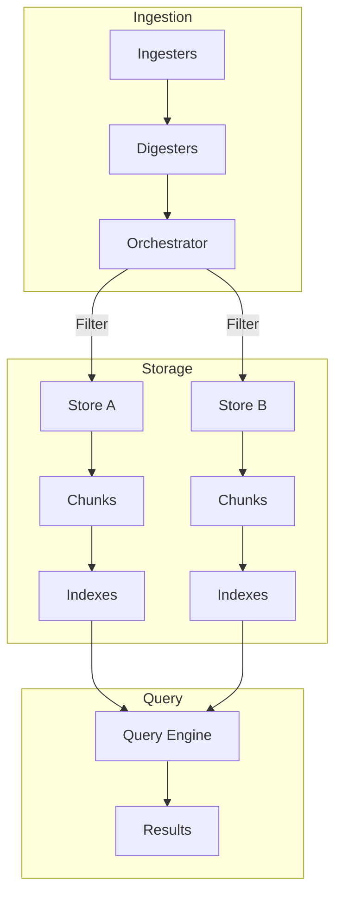

# Architectural Decisions

This page explains the design rationale behind GastroLog's core architecture.

## Chunk-Based Storage

Rather than writing all logs to a single file or database table, GastroLog splits records into **chunks** — bounded, append-only segments.

**Why chunks?**

- **Bounded indexing**: Each chunk is indexed independently. Index builds are fast because they operate on a fixed-size segment, not the entire dataset.
- **Clean retention**: Deleting old data means removing entire chunk directories. No compaction, no garbage collection, no fragmentation.
- **Concurrent access**: The active chunk handles writes while sealed chunks serve reads. No write locks block queries.
- **Portability**: Each chunk is a self-contained directory that can be moved, backed up, or transferred independently.

## Append-Only Design

Records within a chunk are strictly append-only. Once written, they are never modified. Sealing a chunk flips a flag in the file header and is permanent.

**Benefits**: Crash safety (no partial updates to worry about), simple recovery (last record may be truncated, everything before it is intact), and predictable I/O patterns.

## Inverted Indexes

GastroLog builds inverted indexes on sealed chunks — data structures that map search terms to record positions.

**Why inverted indexes?**

- **Sublinear search**: Instead of scanning every record, the engine looks up which positions contain the search terms and reads only those records.
- **Composable**: AND queries intersect position lists; OR queries union them. Complex boolean expressions decompose naturally.
- **Deferred cost**: Indexes are built asynchronously after sealing. Write latency is unaffected.

**Trade-off**: Indexes are only available for sealed chunks. The active chunk is always scanned at runtime. This is acceptable because the active chunk is small (bounded by the rotation policy).

## Multi-Store Model

A single GastroLog instance can host multiple stores, each with its own storage engine, rotation policy, and retention policy.

**Why multiple stores?**

- **Isolation**: Production logs and debug logs can have different retention periods without affecting each other.
- **Routing**: Filter expressions direct records to the right store based on attributes, so a single ingester stream can feed multiple stores.
- **Tiered storage**: High-value logs can use aggressive retention while verbose debug logs are discarded quickly.

## Filter-Based Routing

Instead of ingesters targeting specific stores, GastroLog uses declarative **filter expressions** evaluated against record attributes. This decouples ingestion from storage.

**Benefits**: Adding a new store doesn't require reconfiguring ingesters. Changing routing rules is a configuration change, not a code change. The catch-rest filter (`+`) ensures no messages are silently dropped.

## Three Timestamps

Every record carries SourceTS, IngestTS, and WriteTS. Most log systems track only one or two timestamps.

**Why three?**

- **SourceTS**: The timestamp from the log producer. Essential for correlating events across systems, but may be unreliable (clock skew, delayed delivery) or absent.
- **IngestTS**: When the ingester received the message. Reliable for measuring pipeline latency and detecting delivery delays.
- **WriteTS**: When the record was committed to storage. Monotonic within a chunk, used as the primary ordering key. Reliable for pagination and consistent iteration.

Having all three lets you answer different questions: "when did this happen?" (SourceTS), "when did we learn about it?" (IngestTS), "when was it stored?" (WriteTS).

## Digester Pipeline

Between ingestion and storage, messages pass through **digesters** — enrichment stages that extract structured information from raw log content. Digesters are best-effort: parse failures are silently ignored, and the message passes through unchanged.

**Why digesters?** Log sources vary widely in format. Rather than requiring each ingester to understand every log format, digesters provide a uniform enrichment layer. A syslog message and a JSON-structured HTTP push both get normalized severity levels and extracted timestamps, regardless of their source.

Digesters run in-place on the message before filter evaluation, so their extracted attributes (like `level`) can be used in store filter expressions.

## Configuration System

GastroLog stores its configuration (stores, ingesters, filters, policies, users, certificates) in a pluggable config store. Three backends are available:

- **SQLite** (default): Persistent relational storage with ACID transactions
- **JSON**: File-based persistence with atomic writes (temp file + rename)
- **Memory**: In-process only, useful for testing and ephemeral instances

All configuration is managed through the Settings dialog or the API. Stores, ingesters, filters, and policies reference each other by UUID — a store points to its rotation policy, retention policy, and filter by ID.

## DNF Query Compilation

Boolean query expressions are compiled to **Disjunctive Normal Form** (OR of ANDs) before evaluation. This enables the engine to plan each conjunction branch independently — checking index coverage, choosing scan strategies, and merging results efficiently.

## UUIDv7 Chunk IDs

Chunk IDs use UUIDv7, which embeds a timestamp in the high bits. This makes IDs time-ordered and lexicographically sortable, allowing chunk enumeration by time range without a separate index. The IDs are encoded as 26-character lowercase base32hex strings for compact, filesystem-safe representation.
