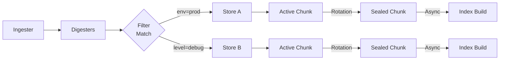

# General Concepts

GastroLog is a log management system built around **chunk-based storage** and **inverted indexes**. This page covers the core data model.

## Records

A **record** is a single log entry. Each record contains:

- **Raw**: The original log payload (bytes)
- **Attrs**: Key-value attributes (e.g., `host=web-01`, `level=error`) stored alongside the payload
- **Three timestamps** (see below)
- **Ref**: A stable reference (chunk ID + position) used for pagination and linking

## Timestamps

Every record carries three timestamps, each capturing a different moment in the log's journey:

| Timestamp | Meaning | Set by |
|-----------|---------|--------|
| **SourceTS** | When the log was generated at the source | Parsed from the log message (syslog header, JSON field, etc.). Zero if unknown. |
| **IngestTS** | When the ingester received the message | Set automatically by the ingester on arrival |
| **WriteTS** | When the record was appended to a chunk | Set by the chunk manager. Monotonic within a chunk. |

**WriteTS** is the primary ordering key. Queries use WriteTS bounds by default (`start=` / `end=`). You can also filter on SourceTS (`source_start=` / `source_end=`) and IngestTS (`ingest_start=` / `ingest_end=`).

## Chunks

Records are stored in **chunks** — append-only segments that hold a batch of records.

- Each chunk has a **UUIDv7 identifier** that is time-ordered and lexicographically sortable
- Chunks track their own time range (`StartTS`, `EndTS`) and record count
- An **active chunk** accepts new records; a **sealed chunk** is immutable
- Sealing triggers asynchronous **index builds** that accelerate queries
- Chunks are self-contained: all record data, attributes, and metadata live within the chunk's files

## Stores

A **store** groups chunks under a single namespace with shared configuration:

- **Type**: The storage engine (`file` or `memory`)
- **Filter**: An expression controlling which ingested records are routed to this store
- **Rotation policy**: Rules for when to seal the active chunk and start a new one
- **Retention policy**: Rules for when to delete old sealed chunks
- **Params**: Engine-specific configuration (e.g., data directory)

You can have multiple stores for different purposes — production logs in one, debug logs in another, each with independent rotation and retention.

## Ingestion Flow

The path from a log message to a stored, indexed record:

1. An **ingester** (syslog, HTTP, tail, etc.) receives a log message and emits an `IngestMessage` with the raw payload, parsed attributes, SourceTS, and IngestTS
2. **Digesters** enrich the message in-place — extracting severity levels, parsing timestamps, and adding attributes based on message content (see below)
3. The **orchestrator** evaluates each store's **filter** against the message's attributes to determine which stores should receive it
4. For each matching store, the record is **appended** to the store's active chunk with a WriteTS
5. If the append causes the active chunk to exceed its **rotation policy** limits, the chunk is **sealed** and a new active chunk begins
6. Sealing schedules asynchronous **index builds** (token, attribute, KV) on the sealed chunk
7. **Retention policies** periodically scan sealed chunks and delete those that have expired

## Digesters

Digesters are a message enrichment pipeline that runs between ingestion and storage. They process each message in-place, adding or refining attributes based on the raw log content. Digesters are best-effort — a parse failure simply means no enrichment is applied.

### Level Digester

Extracts severity from the message body and sets a normalized `level` attribute. Skipped if a `level`, `severity`, or `severity_name` attribute is already present. Recognizes:

- **KV format**: `level=ERROR`, `severity=warn`
- **JSON format**: `"level":"error"`, `"severity":"warn"`
- **Syslog priority**: `<NNN>` where severity = priority % 8

**Normalization mappings:**

| Normalized | Also matches |
|------------|-------------|
| `error` | err, fatal, critical, emerg, emergency, alert, crit |
| `warn` | warning |
| `info` | notice, informational |
| `debug` | |
| `trace` | |

Syslog priorities map numeric severity to these levels: 0-3 (emerg through err) become `error`, 4 (warning) becomes `warn`, 5-6 (notice, info) become `info`, 7 (debug) becomes `debug`.

### Timestamp Digester

Extracts SourceTS from the raw log content when the ingester didn't set one. Skipped if SourceTS is already non-zero. Recognizes (in order of earliest match position):

- **RFC 3339 / ISO 8601**: `2024-01-15T10:30:45.123Z`
- **Apple unified log**: `2024-01-15 10:30:45.123456-0800`
- **Syslog BSD (RFC 3164)**: `Jan  5 15:04:02`
- **Common Log Format**: `[02/Jan/2006:15:04:05 -0700]`
- **Go/Ruby datestamp**: `2024/01/15 10:30:45`
- **Ctime / BSD**: `Fri Feb 13 17:49:50 2026`

All formats support fractional seconds up to nanosecond precision and timezone offsets. When a format lacks a year (e.g., RFC 3164), the current year is inferred with rollover detection — if the parsed time would be more than 24 hours in the future, the previous year is used instead.

When multiple timestamp patterns appear in a single message, the one at the earliest byte position wins.

## Multi-Store Routing

Filters control which stores receive which records. A single ingested message can be routed to multiple stores if their filters match. Special filter values:

- `*` (catch-all): Receives every message
- `+` (catch-rest): Receives messages that matched no other filter
- An expression like `env=prod AND level=error`: Receives only matching messages
