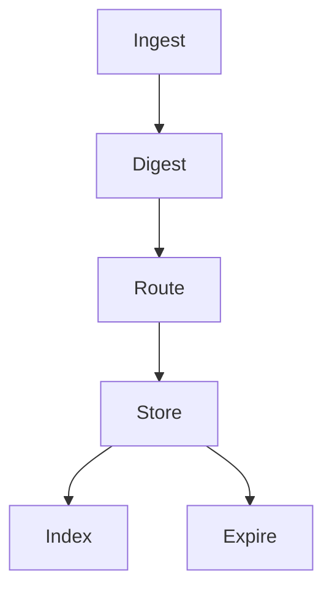

# General Concepts

GastroLog collects logs from various sources, stores them in time-ordered segments called **chunks**, and builds **indexes** on those chunks so you can search them quickly. This page covers the core data model — what gets stored and how it flows through the system.

## Records

Every log line that enters GastroLog becomes a **record** — the fundamental unit of storage. A record carries the original log text, key-value metadata, and timestamps tracking its journey from source to storage.

## Timestamps

Every record carries three timestamps, each capturing a different moment in the log's journey:

| Timestamp | Meaning |
|-----------|---------|
| **SourceTS** | When the log was generated at the source (may be unknown) |
| **IngestTS** | When the ingester received the message |
| **WriteTS** | When the record was written to a chunk (primary ordering key) |

Having all three lets you answer different questions: "when did this happen?" (SourceTS), "when did we learn about it?" (IngestTS), "when was it stored?" (WriteTS).

## Chunks

Records are stored in **chunks** — bounded, append-only segments that hold a batch of records.

- An **active chunk** accepts new records; a **sealed chunk** is immutable and never modified
- Sealing triggers **index builds** that accelerate queries
- Each chunk tracks its own time range and record count
- Deleting old data means removing entire chunks — no compaction or garbage collection needed

## Stores

A **store** groups chunks under a single namespace with shared configuration:

- **Type**: The storage engine (`file` or `memory`)
- **Filter**: An expression controlling which ingested records are routed to this store
- **Rotation policy**: Rules for when to seal the active chunk and start a new one
- **Retention policy**: Rules for when to delete old sealed chunks
- **Params**: Engine-specific configuration (e.g., data directory)

You can have multiple stores for different purposes — production logs in one, debug logs in another, each with independent rotation and retention.

## Ingestion Flow

Every log message follows the same pipeline:

**Ingest** — An ingester receives a log message from an external source (syslog, HTTP, Docker, file tail, etc.) and wraps it with metadata: the raw text, protocol-level attributes, and an arrival timestamp.

**Digest** — Digesters scan the message and add attributes the ingester couldn't — a normalized `level` from the log content, and a source timestamp parsed from embedded date patterns. See the **Digestion** topic.

**Route** — Each store has a filter expression evaluated against the message attributes. A message can match multiple stores, or be caught by a catch-rest filter so nothing is silently dropped.

**Store** — Matching stores append the record to their active chunk. When a chunk hits its rotation policy limits, it is sealed and a new one begins.

**Index** — Sealed chunks are indexed in the background so the query engine can search without scanning every record.

**Expire** — Retention policies periodically delete sealed chunks that are too old, too numerous, or pushing the store over its size budget.

## Multi-Store Routing

Filters control which stores receive which records. A single ingested message can be routed to multiple stores if their filters match. Adding a new store doesn't require reconfiguring ingesters — routing is purely a configuration change.

Special filter values:

- `*` (catch-all): Receives every message
- `+` (catch-rest): Receives messages that matched no other filter — ensures nothing is silently dropped
- An expression like `env=prod AND level=error`: Receives only matching messages

## Configuration

GastroLog stores its configuration (stores, ingesters, filters, policies, users, certificates) in a pluggable config store. Three backends are available:

- **SQLite** (default): Persistent relational storage with ACID transactions
- **JSON**: File-based persistence with atomic writes
- **Memory**: In-process only, useful for testing and ephemeral instances

All configuration is managed through the Settings dialog or the API.
