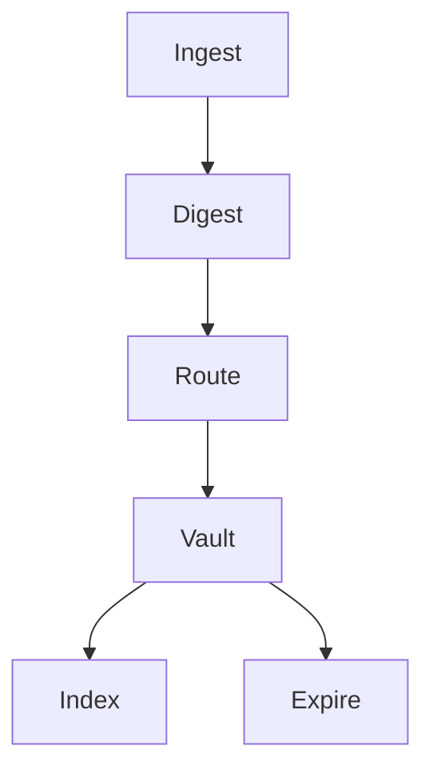

# General Concepts

GastroLog collects logs from various sources, stores them in time-ordered segments called **chunks**, and builds **indexes** on those chunks so you can search them quickly. This page covers the core data model — what gets stored and how it flows through the system.

## Records

Every log line that enters GastroLog becomes a **record** — the fundamental unit of storage. A record carries the original log text, key-value metadata, and timestamps tracking its journey from source to storage.

## Timestamps

Every record carries three timestamps, each capturing a different moment in the log's journey:

| Timestamp | Meaning |
|-----------|---------|
| **SourceTS** | When the log was generated at the source (may be unknown) |
| **IngestTS** | When the ingester received the message |
| **WriteTS** | When the record was written to a chunk (primary ordering key) |

Having all three lets you answer different questions: "when did this happen?" (SourceTS), "when did we learn about it?" (IngestTS), "when was it stored?" (WriteTS).

## Chunks

Records are stored in **chunks** — bounded, append-only segments that hold a batch of records.

- An **active chunk** accepts new records; a **sealed chunk** is immutable and never modified
- Sealing triggers **index builds** that accelerate queries and **compression** (zstd) to reduce storage
- Each chunk tracks its own time range and record count
- Deleting old data means removing entire chunks — no compaction or garbage collection needed

## Vaults

A **vault** groups chunks under a single namespace with shared configuration:

- **Type**: The storage engine (`file` or `memory`)
- **Rotation policy**: Rules for when to seal the active chunk and start a new one
- **Retention policy**: Rules for when to delete old sealed chunks
- **Params**: Engine-specific configuration (e.g., home directory path)

Which records land in a vault is decided by the cluster-wide
[route table](help:routing), not by the vault itself.

You can have multiple vaults for different purposes — production logs in one, debug logs in another, each with independent rotation and retention.

## Ingestion Flow

Every log message follows the same pipeline:

```mermaid
flowchart TD
    A[Ingest] --> B[Digest]
    B --> C[Route]
    C --> D[Vault]
    D --> E[Index]
    D --> F[Expire]
```

[**Ingest**](help:ingestion) — An ingester receives a log message from an external source (syslog, HTTP, Docker, file tail, etc.) and wraps it with metadata: the raw text, protocol-level attributes, and an arrival timestamp.

[**Digest**](help:digesters) — Digesters scan the message and add attributes the ingester couldn't — a normalized `level` from the log content, and a source timestamp parsed from embedded date patterns.

[**Route**](help:routing) — The cluster-wide route table is evaluated against the record's attributes in priority order; the first matching route wins and delivers the record to its destination vaults. A record matching no route is discarded as a counted, intentional drop — add a catch-all route (`*`) at the lowest priority so nothing goes unmatched.

[**Vault**](help:storage) — Destination vaults append the record to their active chunk. When a chunk hits its rotation policy limits, it is sealed and a new one begins.

[**Index**](help:indexers) — Sealed chunks are indexed in the background so the query engine can search without scanning every record.

**Expire** — [Retention policies](help:policy-retention) periodically delete sealed chunks that are too old, too numerous, or pushing the vault over its size bound. That same size bound also refuses new records outright while the vault is over it — see [Retention Policies](help:policy-retention).

## Routing

[Routes](help:routing) control which vaults receive which records. A route binds a match expression to one or more destination vaults; a single route can fan a record out to several vaults (fanout distribution). Adding a new vault doesn't require reconfiguring ingesters — routing is purely a configuration change.

Special match expressions:

- `*` (catch-all): Matches every record — place one at the lowest priority as a safety net
- Empty: Matches nothing — parks a route without deleting it
- An expression like `env=prod AND level=error`: Matches only those records

## Configuration

GastroLog stores its configuration (vaults, ingesters, routes, policies, users, certificates) in a replicated config store. Two backends are available:

- **Raft** (default): Persistent storage with WAL, snapshot recovery, and [multi-node replication](help:clustering)
- **Memory**: In-process only, useful for testing and ephemeral instances

All configuration is managed through the [Settings](help:settings) dialog or the API.

## Clustering

Every GastroLog node automatically starts as a single-node [Raft cluster](help:clustering). Additional nodes can join at any time — either at startup via CLI flags or at runtime from the [Nodes settings tab](settings:nodes) . Clustering replicates configuration across all nodes; log data is stored independently on each node, with queries automatically forwarded to the relevant peers.
