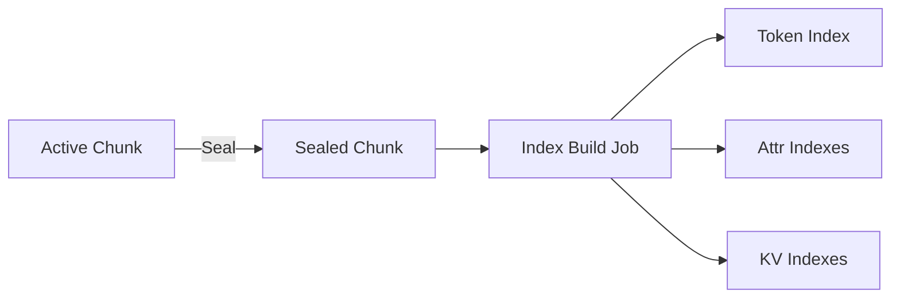
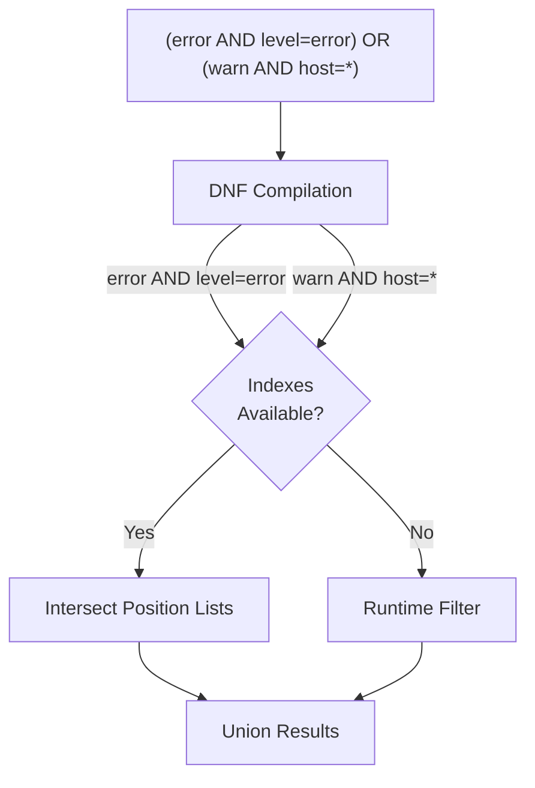

# Indexers

When a chunk is sealed, GastroLog builds **inverted indexes** that map search terms to record positions. These indexes allow the query engine to skip records that can't match, dramatically reducing scan time on large chunks.

## Index Types

### Token Index

Maps individual **tokens** (words) extracted from record payloads to the positions where they appear.

- Used for bare-word searches like `error` or `timeout`
- The same tokenizer runs at both index time and query time, ensuring consistent matches

**Tokenization rules:**

- **Characters**: ASCII letters (a-z, A-Z), digits (0-9), underscore (`_`), and hyphen (`-`). Everything else is a delimiter.
- **Length**: 2 to 16 characters. Shorter tokens are ignored; longer ones are truncated.
- **Case**: All tokens are lowercased. Searches are case-insensitive.
- **Exclusions**: Pure numeric tokens (decimal, hex, octal, binary) and UUIDs are excluded to keep index size manageable. A token like `deadbeef` is treated as hex and excluded; `error42` is kept because it contains non-hex letters.

If a search term fails the indexability check (e.g., it's numeric or too short), the engine knows it can't appear in the token index and falls back to runtime scanning.

### Attribute Indexes

Three indexes built from record **attributes** (the key-value pairs stored alongside each record):

| Index | Maps | Used for |
|-------|------|----------|
| **AttrKey** | Key to positions | `key=*` (key exists) |
| **AttrValue** | Value to positions | `*=value` (value exists) |
| **AttrKV** | Key+Value to positions | `key=value` (exact match) |

Attribute indexes are authoritative — they reflect exactly what is stored in each record's attributes.

### KV Indexes

Three indexes built by **extracting key=value pairs from message text** (the raw payload):

| Index | Maps | Used for |
|-------|------|----------|
| **KVKey** | Key to positions | `key=*` on message text |
| **KVValue** | Value to positions | `*=value` on message text |
| **KV** | Key+Value to positions | `key=value` on message text |

KV indexes are **non-authoritative** — they are built by heuristic extraction and may be incomplete.

**KV extraction rules:**

- **Key format**: One or more dot-separated segments, where each segment starts with a letter or underscore and contains letters, digits, and underscores. Maximum 64 bytes. Example: `http.status`, `request_id`, `env`.
- **Value format**: Unquoted values read until whitespace or a delimiter (`,`, `;`, `)`, `]`, `}`). Quoted values (`key="value"` or `key='value'`) can contain spaces. Maximum 64 bytes.
- **Rejected values**: Values containing structured data characters (`{`, `}`, `[`, `]`), nested equals signs, or URL parameter separators (`&`) are rejected to avoid indexing garbage.
- **Normalization**: Both keys and values are lowercased.

Multiple extraction strategies are applied: heuristic `key=value` patterns, logfmt, JSON objects, and HTTP access log fields. Results are deduplicated.

**Budget and capping:** A budget mechanism caps the number of distinct keys and values indexed per chunk. If the budget is exceeded, the index is marked as **capped** and the query engine falls back to runtime filtering for affected predicates. This prevents a chunk with highly variable log content from producing an oversized index.

## How Indexes Are Built

1. A chunk is **sealed** (rotation policy triggers or manual seal)
2. The orchestrator schedules an asynchronous **index build job**
3. Each indexer reads the sealed chunk's records via a cursor and writes its index artifacts
4. Build jobs are deduplicated — concurrent requests to index the same chunk collapse into one operation
5. Indexers are **idempotent**: re-running a build overwrites any existing artifacts

Indexes are only built for sealed chunks. The active (unsealed) chunk is always scanned at runtime. This is acceptable because the active chunk is bounded by the rotation policy and is typically small.

## Query Acceleration

When the query engine processes a sealed chunk:

1. The boolean expression is converted to **Disjunctive Normal Form** (DNF) — a union of conjunctions
2. For each conjunction branch, the engine checks which predicates have index coverage
3. **Index-driven scan**: If all predicates in a branch are indexed, the engine intersects their position lists and reads only those records
4. **Runtime fallback**: If any predicate lacks index coverage (e.g., capped KV index, unsealed chunk), matching records are filtered at scan time
5. Multiple DNF branches are unioned together

The query plan (accessible via the Explain button) shows which indexes were used and which predicates fell back to runtime filtering.
