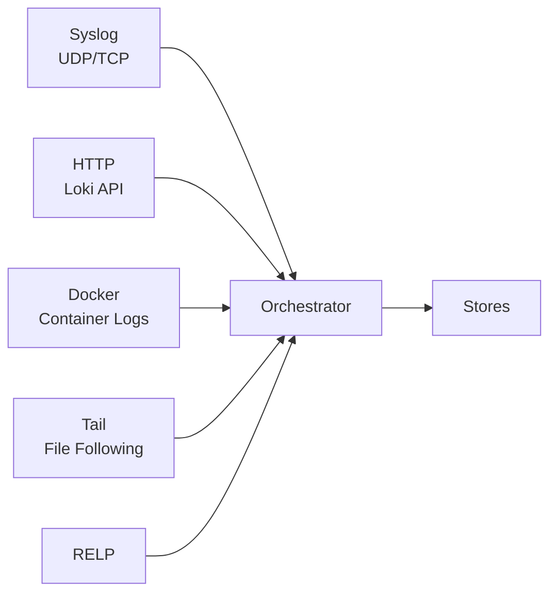

# Ingesters

Ingesters receive log messages from external sources and feed them into GastroLog's ingestion pipeline. Each ingester runs independently and emits records with attributes, timestamps, and the raw payload.

All ingesters automatically set `ingester_type` and `ingester_id` attributes on every message.

## Syslog

Type: `syslog`

Receives syslog messages over UDP and/or TCP. Supports both RFC 3164 (BSD) and RFC 5424 (structured) formats, auto-detected per message. TCP supports both newline-delimited and octet-counted framing.

| Param | Description | Default |
|-------|-------------|---------|
| `udp_addr` | UDP listen address | `:514` (if neither addr specified) |
| `tcp_addr` | TCP listen address | `:514` (if neither addr specified) |

**Attributes set:**

| Attribute | Source |
|-----------|--------|
| `remote_ip` | Sender's IP address |
| `facility` | Numeric facility code (0-23) from syslog priority |
| `facility_name` | Human-readable: kern, user, mail, daemon, auth, syslog, lpr, news, uucp, cron, authpriv, ftp, ntp, audit, alert, clock, local0-local7 |
| `severity` | Numeric severity (0-7) from syslog priority |
| `severity_name` | Human-readable: emerg, alert, crit, err, warning, notice, info, debug |
| `hostname` | From syslog header |
| `app_name` | Application/program name |
| `proc_id` | Process ID (from `[PID]` notation) |
| `msg_id` | Message ID (RFC 5424 only) |

## HTTP (Loki-Compatible)

Type: `http`

Accepts log pushes via the Loki HTTP API. Compatible with Promtail, Grafana Agent, and other Loki clients.

| Param | Description | Default |
|-------|-------------|---------|
| `addr` | Listen address | `:3100` |

**Endpoints**: `POST /loki/api/v1/push` and `POST /api/prom/push` (legacy)

Supports gzip-compressed request bodies.

**Attributes set:**

| Attribute | Source |
|-----------|--------|
| *(stream labels)* | All labels from the Loki push request's `stream` field become attributes (e.g., `job`, `env`, `host`) |
| *(structured metadata)* | Key-value pairs from the third element of value arrays, if present |

Labels are validated: max 32 attributes per message, keys up to 64 characters, values up to 256 characters.

By default, the HTTP ingester returns `204 No Content` immediately (fire-and-forget). Clients can send `X-Wait-Ack: true` to wait for the record to be persisted before receiving the response.

## RELP

Type: `relp`

Receives messages via the Reliable Event Logging Protocol. RELP provides transaction-based delivery with acknowledgements — the sender knows whether each message was received and stored. Commonly used with rsyslog.

| Param | Description | Default |
|-------|-------------|---------|
| `addr` | Listen address | `:2514` |

RELP messages are parsed as syslog. Acknowledgement is sent only after the record is written to the chunk store, providing an end-to-end delivery guarantee.

**Attributes set:**

| Attribute | Source |
|-----------|--------|
| `remote_ip` | Sender's IP address |
| `facility` | Numeric facility code (0-23) from syslog priority |
| `facility_name` | Human-readable facility name |
| `severity` | Numeric severity (0-7) from syslog priority |
| `severity_name` | Human-readable severity name |
| `hostname` | From syslog header |
| `app_name` | Application/program name |
| `proc_id` | Process ID |
| `msg_id` | Message ID (RFC 5424 only) |

## Tail

Type: `tail`

Follows local log files, similar to `tail -f`. Tracks file offsets across restarts so no lines are missed or duplicated. Handles file rotation (detects inode changes) and truncation.

| Param | Description | Default |
|-------|-------------|---------|
| `paths` | JSON array of glob patterns (required) | |
| `poll_interval` | How often to check for new data | `30s` |

**Example paths**: `["/var/log/*.log", "/opt/app/logs/**/*.log"]`

**Attributes set:**

| Attribute | Source |
|-----------|--------|
| `file` | Absolute path of the file being tailed |

Maximum line size is 1 MB. Uses filesystem notifications (fsnotify) for efficient change detection, with polling as a fallback.

## Docker

Type: `docker`

Streams container logs from a Docker daemon. Automatically discovers containers and attaches to their log streams.

| Param | Description | Default |
|-------|-------------|---------|
| `host` | Docker daemon address | `unix:///var/run/docker.sock` |
| `label_filter` | Docker label filter (`key=value`) | |
| `name_filter` | Container name regex | |
| `image_filter` | Image name regex | |
| `poll_interval` | Container discovery interval | `30s` |
| `stdout` | Capture stdout | `true` |
| `stderr` | Capture stderr | `true` |
| `tls` | Enable TLS for TCP connections | `true` |
| `tls_ca` | CA certificate name (from certificate store) | |
| `tls_cert` | Client certificate name | |
| `tls_verify` | Verify server TLS certificate | `true` |

**Attributes set:**

| Attribute | Source |
|-----------|--------|
| `container_id` | Full container ID |
| `container_name` | Container name |
| `image` | Image name/tag |
| `stream` | Log source: `stdout`, `stderr`, or `tty` |

Handles both TTY and multiplexed log streams. Docker timestamps are extracted automatically.

## Chatterbox

Type: `chatterbox`

Test ingester that generates random log messages in various formats. Useful for development and demo environments.

| Param | Description | Default |
|-------|-------------|---------|
| `minInterval` | Minimum delay between messages | `100ms` |
| `maxInterval` | Maximum delay between messages | `1s` |
| `formats` | Comma-separated format list | All formats |
| `formatWeights` | Format=weight pairs for selection | Equal weights |
| `hostCount` | Number of simulated hosts | `10` |
| `serviceCount` | Number of simulated services | `5` |

**Supported formats**: plain, kv, json, access, syslog, weird, multirecord

**Attributes set (vary by format):**

| Attribute | Formats | Source |
|-----------|---------|--------|
| `service` | All | Randomly selected service name |
| `host` | All | Randomly selected hostname |
| `env` | kv, json | Environment: prod, staging, dev, test |
| `facility` | syslog | Syslog facility name |
| `vhost` | access | Virtual host for access log entries |
| `format` | multirecord | Sub-format: stack, help |
| `language` | multirecord | go, java, python |
| `command` | multirecord | kubectl, docker, etc. |

The syslog, json, and access formats set SourceTS. The weird format generates intentionally malformed and binary data for stress testing parsers.

## Routing

Ingesters don't target specific stores directly. Instead, each store defines a **filter** expression that is evaluated against the attributes of every ingested message. A single message can be routed to multiple stores if their filters match. See the General Concepts topic for filter syntax details.
