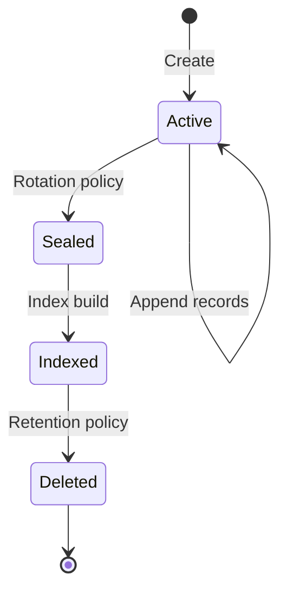

# Rotation & Retention

As records accumulate in a vault, two lifecycle mechanisms keep things manageable. **Rotation** determines when to seal the active chunk and start a new one. **Retention** determines when to delete old sealed chunks and reclaim space.

Each vault references a rotation policy and a retention policy by name. You can share policies across multiple vaults or create dedicated ones. Policies are configured in the Settings dialog under Rotation Policies and Retention Policies, and assigned to vaults in the Vaults settings.
