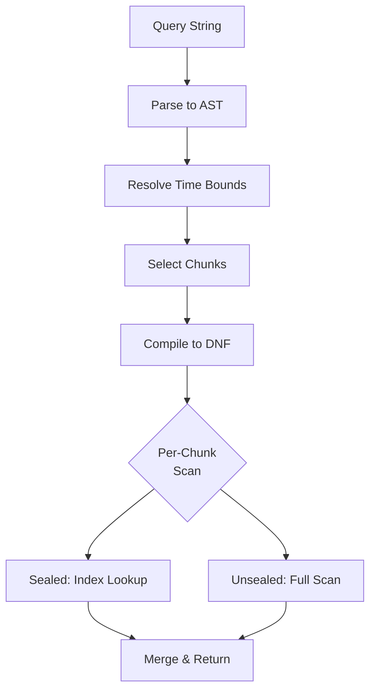

# Query Engine

The query engine evaluates search expressions against stored records, using indexes where available and falling back to runtime filtering otherwise.

## Expression Syntax

Queries are composed of **predicates** combined with boolean logic. Multiple bare predicates are implicitly joined with AND.

### Token Search

Bare words search record payloads by token.

- `error` — records containing the token "error"
- `error timeout` — records containing both (implicit AND)

### Key-Value Filters

- `level=error` — exact key=value match (in attributes or message text)
- `key="value with spaces"` — quoted values for special characters
- `level=*` — key exists with any value
- `*=error` — value exists under any key

### Boolean Operators

- `AND` — both sides must match (binds tighter than OR)
- `OR` — either side matches
- `NOT` — negation
- `(...)` — parentheses for grouping

Example: `(error OR warn) AND NOT debug`

### Time Bounds

| Filter | Bounds on | Description |
|--------|-----------|-------------|
| `start=TIME` | WriteTS | Inclusive lower bound |
| `end=TIME` | WriteTS | Exclusive upper bound |
| `source_start=TIME` | SourceTS | Lower bound on log origin time |
| `source_end=TIME` | SourceTS | Upper bound on log origin time |
| `ingest_start=TIME` | IngestTS | Lower bound on ingester receive time |
| `ingest_end=TIME` | IngestTS | Upper bound on ingester receive time |

TIME accepts RFC 3339 format (e.g., `2024-01-15T08:00:00Z`) or Unix timestamps.

### Scoping

- `store=NAME` — restrict search to a specific store
- `chunk=ID` — restrict search to a specific chunk
- `pos=N` — exact record position within a chunk

### Result Control

- `limit=N` — maximum number of results
- `reverse=true|false` — newest-first or oldest-first

## Query Evaluation

When a search is executed:

1. **Parse**: The query string is parsed into an AST of predicates and boolean operators
2. **Normalize**: Legacy token/KV lists are converted to a unified boolean expression
3. **Time bounds**: `start=` / `end=` determine which chunks overlap the query range
4. **Chunk selection**: Chunks outside the time range are skipped. Unsealed chunks are always included.
5. **DNF compilation**: The boolean expression is converted to Disjunctive Normal Form (OR of ANDs) for efficient evaluation
6. **Per-chunk scanning**: Each selected chunk is scanned using the best available strategy:
   - **Index-driven**: If all predicates in a DNF branch have index coverage, intersect position lists
   - **Sequential with runtime filter**: Scan records and evaluate predicates at read time
   - **Seek-based start**: Binary search on timestamps to skip to the relevant range

## Multi-Store Search

When no `store=` filter is specified, the engine queries all stores in parallel via the store registry. Results are merged by timestamp. Resume tokens track positions across multiple stores for pagination.

## Resume Tokens and Pagination

Search results are returned as an iterator with a **resume token**. The token encodes the last-read position in each store/chunk, allowing the next page to continue exactly where the previous one left off. Tokens remain valid as long as the referenced chunks exist.

## Execution Plan

The **Explain** view shows how the engine will process a query:

- **Direction**: Forward (oldest-first) or reverse (newest-first)
- **Total chunks**: How many chunks exist vs. how many overlap the time range
- **Per-chunk plan**:
  - **Scan mode**: `index-driven`, `sequential`, or `skipped`
  - **Pipeline steps**: Each filtering stage with input/output estimates
  - **Runtime filters**: Predicates evaluated at scan time (not index-accelerated)
  - **Skip reason**: Why a chunk was excluded (e.g., outside time range)
  - **Branch plans**: For multi-branch DNF queries, each branch's index strategy
