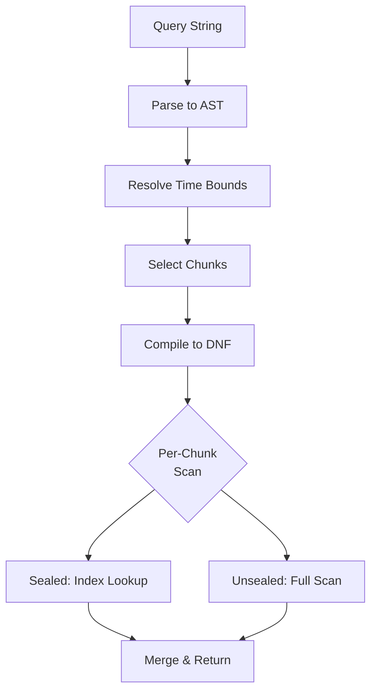

# Query Engine

The query engine evaluates search expressions against stored records, using indexes where available and falling back to runtime filtering otherwise.

## Expression Syntax

Queries are composed of **predicates** combined with boolean logic. Multiple bare predicates are implicitly joined with AND. See the Query Language topic for the full syntax reference.

### Quick Reference

| Syntax | Meaning |
|--------|---------|
| `error` | Token search |
| `error timeout` | Implicit AND |
| `error OR warn` | Either matches |
| `NOT debug` | Negation |
| `level=error` | Key=value (attributes + message text) |
| `host=*` | Key exists |
| `start=TIME end=TIME` | WriteTS time range |
| `store=NAME` | Scope to store |
| `limit=N reverse=true` | Result control |

## Query Evaluation

When a search is executed:

1. **Parse**: The query string is parsed into an AST of predicates and boolean operators
2. **Time bounds**: `start=` / `end=` determine which chunks overlap the query range
3. **Chunk selection**: Chunks outside the time range are skipped entirely. The active (unsealed) chunk is always included.
4. **DNF compilation**: The boolean expression is converted to Disjunctive Normal Form (OR of ANDs) for efficient evaluation
5. **Per-chunk scanning**: Each selected chunk is scanned using the best available strategy:
   - **Index-driven**: If all predicates in a DNF branch have index coverage, intersect position lists and read only matching records
   - **Sequential with runtime filter**: Scan records and evaluate predicates at read time
   - **Seek-based start**: Binary search on timestamps to skip to the relevant range within a chunk

## Multi-Store Search

When no `store=` filter is specified, the engine queries all stores in parallel. Results are merged by timestamp using a heap-based merge sort. Each store is searched independently and results are interleaved in time order.

## Resume Tokens and Pagination

Search results are returned as an iterator with a **resume token**. The token encodes the last-read position in each store and chunk, allowing the next page to continue exactly where the previous one left off.

Resume tokens track positions across multiple stores. Each position records a store ID, chunk ID, and the last-returned record index. Exhausted chunks (fully read) are marked so they don't need to be re-scanned.

Tokens remain valid as long as the referenced chunks exist. If a chunk is deleted by a retention policy between pages, the token becomes invalid and the search must restart.

## Follow (Live Tail)

The Follow feature streams new records as they arrive, similar to `tail -f`. It works by polling all selected stores for new records that appeared since the last check.

Follow only emits **new** records — it marks all existing chunks as "seen" on initialization and only yields records appended after that point. Records from multiple stores are merged by IngestTS.

Follow runs until cancelled. When combined with a query filter, only matching new records are emitted.

## Histogram

The Histogram feature returns record counts bucketed by time, used for the timeline visualization. It divides a time range into evenly-spaced buckets and counts how many records fall into each.

Two execution paths:

- **Unfiltered**: Uses binary search on idx.log entries to count records per bucket without reading any record data. This is very fast even on large chunks.
- **Filtered** (with a query expression): Runs a full search and buckets each matching record. Capped at 1 million scanned records to prevent runaway queries.

Each bucket includes per-severity level counts (error, warn, info, debug, trace) extracted from KV indexes and record attributes.

## Context View

The GetContext feature retrieves records surrounding a specific anchor record. Given a record reference, it returns:

- The **anchor** record itself
- A configurable number of records **before** the anchor (up to 50)
- A configurable number of records **after** the anchor (up to 50)

Context records are fetched across all stores by timestamp, so you see what was happening system-wide around the time of the anchor record.

## Execution Plan

The **Explain** view shows how the engine will process a query:

- **Direction**: Forward (oldest-first) or reverse (newest-first)
- **Total chunks**: How many chunks exist vs. how many overlap the time range
- **Per-chunk plan**:
  - **Scan mode**: `index-driven`, `sequential`, or `skipped`
  - **Pipeline steps**: Each filtering stage with input/output estimates
  - **Runtime filters**: Predicates evaluated at scan time (not index-accelerated)
  - **Skip reason**: Why a chunk was excluded (e.g., outside time range)
  - **Branch plans**: For multi-branch DNF queries, each branch's index strategy

## Query Timeout

An optional query timeout can be configured in Service settings. When set, individual search, follow, histogram, and context requests are cancelled if they exceed the configured duration. The timeout uses Go duration syntax (e.g., `30s`, `1m`). Setting it to empty or `0s` disables the timeout.
